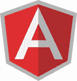

# 2020 年 20 种最佳前端 Web 开发工具

> 原文： [https://www.guru99.com/front-end-web-development-tools.html](https://www.guru99.com/front-end-web-development-tools.html)

有许多前端开发工具可以加速 Web 开发。 这是精选的顶级工具的清单，这些工具具有关键功能和下载链接。

### 1）[广告经理 Tim](https://bit.ly/2JMju8g)

[Creative Tim](https://bit.ly/2JMju8g) 提供了基于 Bootstrap 的设计元素，可帮助您加快开发工作。 您可以使用此工具创建 Web 和移动应用程序。

**功能**：

*   提供最简单的入门方法是使用我们的预制示例页面之一。
*   使用此工具可以帮助您节省时间，并且可以专注于业务模型。
*   提供易于使用的管理模板
*   管理仪表盘可帮助您节省大量时间
*   提供预制节&元素

* * *

### 2） [Envato HTML 模板](https://bit.ly/3gA2voD)

[Envato](https://bit.ly/3gA2voD) 包含 1000 多种现成的 HTML5 模板，可节省您的编码时间。 这些模板提供了电源自定义工具，并且已准备好进行 SEO。 他们提供优化的 CSS 和 JS，可提高 Page Speed 得分。

**功能**：

*   基于 Bootstrap，Vuejs，Laravel，Angular 和其他流行框架的模板。
*   具有多文件上传支持的响应式 SASS 模板
*   浅色和深色选项
*   图表库，聊天，电子邮件应用程序和小部件支持
*   免费终身更新
*   通过论坛提供详细的文档和快速支持
*   无限的颜色选择

* * *

### 3）Npm：

[Npm](https://www.npmjs.com/) 是 JavaScript 的节点程序包管理器。 它有助于发现可重用代码的程序包，并以强大的新方式组合它们。 该网络开发工具是一个命令行实用程序，用于与有助于软件包的所述存储库进行交互。

**功能**：

*   在注册表中发现并重用 470,000 多个免费代码包
*   鼓励团队内部的代码发现和重用
*   发布和控制对名称空间的访问
*   使用相同的工作流程管理公共和私人代码

**下载链接**： [https://www.npmjs.com/](https://www.npmjs.com/)

* * *

### 4）TypeScript：

[TypeScript](https://www.typescriptlang.org/index.html) 是一种开源前端脚本语言。 它是 JavaScript 的严格语法超集，它添加了可选的静态类型。 它是专门为开发大型应用程序而设计的，并可以编译为 JavaScript。

**Features:**

*   TypeScript 支持其他 JS 库
*   可以在运行 JavaScript 的任何环境中使用此 Typescript。
*   它支持可以包含现有 JavaScript 库的类型信息的定义文件，例如 C / C ++头文件。
*   它可跨浏览器，设备和操作系统移植
*   它可以在运行 JavaScript 的任何环境中运行

**下载链接**： [https://www.typescriptlang.org/index.html#download-links](https://www.typescriptlang.org/index.html)

* * *

### 5）CodeKit：

[Codekit](https://codekitapp.com/) 是一个前端 Web 开发工具。 该工具提供了支持，可以更快地建立网站。 它结合，最小化和语法检查 JavaScript。 它还可以优化图像。

**Features:**

*   注入 CSS 更改而无需重新加载整个页面
*   合并脚本以减少 HTTP 请求。
*   缩小代码以减小文件大小
*   自动处理大多数语言而不会遇到麻烦

**下载链接**： [https://codekitapp.com/](https://codekitapp.com/)

* * *

### 6）WebStorm：

[WebStorm](https://www.jetbrains.com/webstorm/) 为 JavaScript 提供了智能编码帮助。 它为 Angular，React.js，Vue.js 和 Meteo 提供高级编码帮助。 它还可以帮助开发人员在处理大型项目时更有效地编码

**Features:**

*   WebStorm 帮助开发人员在处理大型项目时更有效地编码
*   它提供了用于调试，测试和跟踪客户端和 Node.js 应用程序的内置工具。
*   它与流行的命令行工具集成以进行 Web 开发
*   Spy-js 内置工具允许跟踪 JavaScript 代码
*   它提供了一个统一的 UI，可用于许多流行的版本控制系统
*   可以高度自定义以完美适应各种编码样式
*   它为客户端代码和 Node.js 应用程序提供了内置调试器

**下载链接**： [https://www.jetbrains.com/webstorm/download/#section=windows](https://www.jetbrains.com/webstorm/download/)

* * *

### 7）HTML5 样板：

[HTML5 样板](https://html5boilerplate.com/)帮助构建快速，健壮和适应性强的 Web 应用程序或网站。 它是开发人员可以下载的一组文件，这些文件为任何网站奠定了基础。

**Features:**

*   它允许开发人员使用 HTML5 元素
*   设计时要牢记逐步增强
*   Normalize.css，用于 CSS 规范化和常见错误修复
*   Apache 服务器配置以提高性能和安全性
*   它提供了 Google Universal Analytics 代码段的优化版本
*   防止控制台语句在较旧的浏览器中导致 JavaScript 错误的保护
*   大量的内联和随附文档

**下载链接**： [https://html5boilerplate.com/](https://html5boilerplate.com/)

* * *

### 8）AngularJS：

[AngularJS](https://www.guru99.com/angularjs-tutorial.html) 是前端开发人员的另一个必备工具。 它是一个开放源代码的 Web 应用程序框架。 它有助于扩展 Web 应用程序的 HTML 语法。 通过开发可访问，可读和表达性的环境，它简化了前端开发过程。

**Features:**

*   它是一个开放源代码，完全免费，并且被全世界成千上万的开发人员使用。
*   它提供了创建 RICH Internet Application 的功能
*   它提供了使用 MVC 使用 JavaScript 编写客户端应用程序的选项
*   它会自动处理适合每个浏览器的 JavaScript 代码

**下载链接**： [https://angularjs.org/](https://angularjs.org/)

* * *

### 9）无礼

[Sass](http://sass-lang.com/) 是最可靠，最成熟，最强大的 CSS 扩展语言。 该工具有助于轻松扩展站点现有 CSS 的功能，例如变量，继承和嵌套。

**Features:**

*   使用前端工具编写任何代码都非常简单明了
*   支持语言扩展，例如变量，嵌套和混合
*   用于处理颜色和其他值的许多有用功能
*   高级功能，例如库的控制指令
*   它提供格式合理，可自定义的输出

**下载链接**： [http://sass-lang.com/](http://sass-lang.com/)

* * *

### 10）骨干网：

[Backbone.js](http://backbonejs.org/) 通过提供具有键值绑定和自定义事件的模型来为 Web 应用程序提供结构。

**Features:**

*   Backbone.js 允许开发人员开发一页应用程序
*   Backbone.js 有一个简单的库，用于分隔业务和用户界面逻辑
*   该工具使代码变得简单，系统和有组织。 它充当任何项目的骨干
*   它管理数据模型，该模型还包括用户数据并在服务器端显示该数据
*   它允许开发人员创建客户端 Web 应用程序或移动应用程序

**下载链接**： [http://backbonejs.org/](http://backbonejs.org/)

* * *

### 11）土地：

[Grunt](https://gruntjs.com/) 是 NodeJS 上流行的任务运行程序。 它是灵活的并且被广泛采用。 当涉及到任务自动化时，它是首选工具。 它提供了许多捆绑的插件来执行常见任务。

**Features:**

*   它使工作流程像编写设置文件一样简单
*   它允许以最小的工作量自动执行重复性任务
*   它有一个简单的方法。 它包括 JS 中的任务和 JSON 中的配置
*   Grunt 包含用于扩展插件和脚本功能的内置任务
*   它加快了开发过程并提高了项目的绩效
*   Grunt 的生态系统非常庞大； 因此可以轻松完成任何事情的自动化
*   该 Web 开发工具减少了执行重复任务时出错的机会

**下载链接**： [https://gruntjs.com/](https://gruntjs.com/)

* * *

### 12）茉莉花：

[Jasmine](https://jasmine.github.io/) 是一种行为驱动的 JS，用于测试 JavaScript 代码。 它不依赖于任何其他 JavaScript 框架。 此开源工具不需要 DOM。

**Features:**

*   低开销，无外部依赖
*   开箱即用，所有需要测试代码的东西
*   使用相同的框架运行浏览器测试和 Node.js 测试

**下载链接**： [https://jasmine.github.io/index.html](https://jasmine.github.io/index.html)

* * *

### 13）CodePen：

[CodePen](https://codepen.io/) 是面向前端设计人员和开发人员的 Web 开发环境。 一切都与更快，更顺畅的开发有关。 它允许构建，部署网站和构建测试用例。

**Features:**

*   它提供了构建组件供以后在其他地方使用的功能
*   它包括一些很棒的功能，可以更快地编写 CSS。
*   允许实时查看和实时同步
*   预填充 API 功能允许添加链接和演示页面，而无需编写任何代码

**下载链接**： [https://codepen.io/](https://codepen.io/)

* * *

### 14）基础：

[Foundation](https://get.foundation/) 是用于任何设备，介质和可访问性的前端框架。 该响应式前端框架使设计响应式网站，应用程序和电子邮件变得容易。

**功能**：

*   它提供最干净的标记，而不会牺牲 Foundation 的效用和速度
*   可以自定义构建以包括或删除某些元素。 由于它定义了列的大小，颜色，字体大小。
*   更快的开发和页面加载速度
*   Foundation 已针对移动设备进行了真正的优化
*   适用于所有级别开发人员的可定制性
*   它将响应式设计提升到了新的水平，并为平板电脑提供了急需的中型网格

**下载链接**： [https://get.foundation/](https://get.foundation/)

* * *

### 15）崇高文字：

[Sublime Text](https://www.sublimetext.com/) 是专有的跨平台源代码编辑器。 此应用程序开发工具本机支持许多编程语言和标记语言。

**Features:**

*   命令面板功能允许匹配的键盘调用任意命令
*   同时编辑允许对多个区域进行相同的交互式更改
*   提供基于 Python 的插件 API
*   允许开发人员提供项目特定的首选项
*   与 TextMate 的许多语言语法兼容

**下载链接**： [https://www.sublimetext.com/](https://www.sublimetext.com/)

* * *

### 16）网格指南：

[网格指南](https://guideguide.me/)是另一个重要的前端开发工具。 它允许在设计中创建像素完美的网格。 这是一个简单的工具，可以解锁非常有价值的工作流程。

**Features:**

*   添加基于画布，画板和选定图层的参考线
*   快速向边缘和中点添加辅助线
*   允许创建其他画板和文档的重复指南
*   帮助用户创建自定义网格

**下载链接**： [https://guideguide.me/](https://guideguide.me/)

* * *

### 17）Chrome 开发人员工具：

[Chrome 开发人员工具](https://developer.chrome.com/devtools)是 Chrome 内置的一组调试工具。 这些工具使开发人员可以进行各种测试，从而轻松节省大量时间。

**Features:**

*   它允许添加自定义 CSS 规则
*   用户可以查看边距，边框和填充
*   它有助于模拟移动设备
*   可以使用开发工具作为编辑器
*   打开开发工具后，用户可以轻松禁用浏览器的缓存

**下载链接**： [https://developer.chrome.com/devtools](https://developer.chrome.com/devtools)

* * *

### 18）模态：

[模态](http://humaan.com/modaal/)是前端开发插件，可提供高质量，灵活和可访问的模态。

**Features:**

*   针对辅助技术和屏幕阅读器进行了优化
*   完全响应，随浏览器宽度缩放
*   具有 SASS 选项的可定制 CSS
*   它提供全屏和视口模式
*   画廊打开和关闭模式的键盘控制
*   灵活的关闭选项和方法

**下载链接**： [https://github.com/humaan/Modaal](https://github.com/humaan/Modaal)

* * *

### 19）少

[少](http://lesscss.org/)是扩展 CSS 语言支持的预处理器。 它允许开发人员使用使 CSS 更易于维护和扩展的技术。

**Feature:**

*   它可以免费下载和使用
*   它提供了高级样式语法，可让 Web 设计人员/开发人员创建高级 CSS。
*   在网络浏览器开始呈现网页之前，它可以轻松地编译为标准 CSS
*   编译后的 CSS 文件可以上传到生产 Web 服务器

**下载链接**： [http://lesscss.org/](http://lesscss.org/)

* * *

### 20）流星：

[流星](https://www.meteor.com/)是完整的 JavaScript 框架。 它由库和软件包的集合组成。 它建立在其他框架和库的概念之上，以简化对应用程序进行原型制作的过程。

**Features:**

*   它使开发应用程序高效
*   它带有一些内置功能，这些功能包含前端库和基于 NODE js 的服务器
*   它可以大大加快任何项目的开发时间
*   流星提供 MongoDB 数据库和 Minimongo，它们完全用 JavaScript 编写
*   实时重新加载功能仅允许刷新所需的 DOM 元素

**下载链接**： [https://www.meteor.com/install](https://www.meteor.com/install)

* * *

### 21）jQuery：

[jQuery](https://jquery.com/) 是一种广泛使用的 JavaScript 库。 它使前端开发人员能够专注于不同方面的功能。 它使诸如 HTML 文档遍历，操纵和 Ajax 之类的事情变得容易。

**Features:**

*   QueryUI 有助于制作高度交互的 Web 应用程序
*   它是开源的，可以免费使用
*   它提供了强大的主题机制
*   它非常稳定且易于维护
*   它提供了广泛的浏览器支持
*   帮助创建出色的文档

**下载链接**： [http://jquery.com/download/](http://jquery.com/download/)

* * *

### 22）Github：

[GitHub](https://github.com/) 是一个受您的工作方式启发的 Web 开发平台。 该工具使开发人员可以查看代码，管理项目和构建软件。

**Features:**

*   轻松协调，保持一致并使用 Gi​​tHub 的项目管理工具完成工作
*   它为工作提供正确的工具
*   简单的文档和高质量的编码
*   允许所有代码在一个地方
*   开发人员可以直接从存储库托管其文档

**下载链接**： [https://github.com/](https://github.com/)