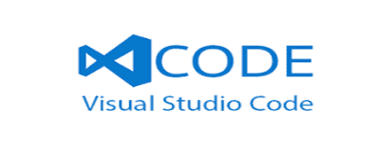

# 2020 年 10 种最佳 Sublime Text 替代品

> 原文： [https://www.guru99.com/sublime-text-alternative.html](https://www.guru99.com/sublime-text-alternative.html)

Sublime Text 是主要用于 MAC 平台的源代码编辑器。 它为几种编程和标记语言提供了本机支持。 但是，sublime 文本编辑器工具的一个主要缺点是大文件的加载速度可能很慢。

以下是可以替代 Sublime Text 的十大工具的精选列表。 此列表包括具有流行功能和最新下载链接的商业代码和开源代码编辑器（IDE）。

### 1）原子

[Atom](https://atom.io/) 是程序员首选的有用的代码编辑器工具，因为与其他编辑器相比，它的界面简单。 Atom 用户可以提交软件包，并为软件提交软件包。

**平台**：Windows，Mac，Linux

**价格**：免费

**功能：**

*   集成了软件包管理器以支持插件
*   智能自动补全功能
*   支持命令面板
*   多个窗格
*   允许跨平台编辑

**下载链接：** [https://atom.io/](https://atom.io/)

### 2）蓝色狮 riff

[BlueGriffon](http://bluegriffon.org) 是由 Gecko（Firefox 的渲染引擎）支持的开源 HTML 编辑器。 它具有简单的界面和创建符合 W3C Web 标准的网页所需的最常用功能。

**平台：** Mac，Windows，Linux

**Features:**

*   轻松更改字体颜色或调整边框样式
*   打开上次会话的标签
*   CSS 编辑的快捷方式
*   源视图的多个主题

**下载链接：** [http://bluegriffon.org](http://bluegriffon.org)

### 3）蓝鱼

 

[Bluefish](http://bluefish.openoffice.nl/index.html) a 是一个跨平台编辑器，它是一种快速的工具，可以同时处理数十个文件。 该工具允许开发人员进行远程编辑。 该代码编辑器工具为 s 程序员和 Web 开发人员提供了许多选择，以编写网站，脚本和编程代码。

**价格：免费**

**平台：** Mac Windows Linux

**Features:**

*   在几秒钟内加载数百个文件
*   在崩溃，终止或关闭后自动恢复修改后的文档中的更改。
*   项目支持功能可帮助您有效地处理多个项目。
*   无限的撤消/重做功能。

**下载链接： [http://bluefish.openoffice.nl/index.html](http://bluefish.openoffice.nl/index.html)**

### 4）支架

[括号](http://brackets.io/)是 Adobe 开发的轻量级工具。 它是一个开源文本编辑器，可以免费下载。 它允许您在源代码和浏览器视图之间切换。

**平台：** Mac，Windows，Linux

**价格：**免费

**Features:**

*   快速编辑 UIfeature 将特定于上下文的代码和工具内联
*   提供实时预览，预处理器支持和内联编辑器
*   令人愉悦的用户界面
*   专为 macOS 开发的工具
*   它带有内置的扩展管理器，用于快速有效的&扩展管理。

**下载链接：** [http://brackets.io/](http://brackets.io/)

### 5）灯桌

 

[Light Table](http://lighttable.com/) 是用于软件开发的 IDE 和文本编辑器工具。 该工具提供快速反馈，并允许即时执行，调试和访问文档。

**Price: Free**

**平台：** Mac，Windows，Linux

**Features:**

*   在线评估
*   轻便桌是一个轻巧，干净，光滑的界面。
*   强大的编辑和插件管理器
*   println 的功能可跟踪代码中的关键值

**下载链接： [http://lighttable.com/](http://lighttable.com/)**

### 6）盖尼

 

[Geany](https://www.geany.org) 是使用 GTK +工具箱的文本编辑器。 它还具有集成开发环境的某些基本功能。 该工具支持许多文件类型，并具有一些不错的功能。

**价格：**免费

**Platform:** Mac, Windows, Linux

**Features:**

*   允许您添加注释以在项目首选项中应用缩进设置
*   浏览源代码
*   允许在消息窗口笔记本和边栏上弹出菜单
*   在尝试执行空上下文操作时显示状态消息

**下载链接： [https://www.geany.org](https://www.geany.org)**

### 7）埃马克斯

 

[Emacs](https://www.gnu.org/software/emacs/) 是基于 Unix 的文本编辑器工具，程序员，工程师，学生和系统管理员均可使用。 它允许您添加，修改，删除，插入，单词，字母，行和其他文本单元。

**Price: Free**

**Platform:** Mac, Windows, Linux

**Features:**

*   完整的内置文档
*   对许多人工脚本的完全 Unicode 支持
*   高度可定制，使用 Emacs Lisp 代码。
*   用于安装和下载扩展的打包系统

**下载链接：** [https://www.gnu.org/software/emacs/](https://www.gnu.org/software/emacs/)

### 8）Visual Studio 代码

 

[Visual Studio Code](https://code.visualstudio.com/) 是由 Microsoft 开发的开源代码编辑器软件。 它提供对 TypeScript，JavaScript 和 Node.js 的内置支持。 它具有 IntelliSense 功能自动完成功能，可根据变量类型，基本模块和功能定义提供智能完成功能。

**Platform:** Mac, Windows, Linux

**Price:** Free

**Features:**

*   与 Git 和其他 SCM（软件配置管理）提供商轻松协作
*   代码重构&调试
*   易于扩展和定制

**下载链接：** [https://code.visualstudio.com/](https://code.visualstudio.com/)

### 9）TextMate

 

[TextMate](https://macromates.com/) 是适用于 mac 的多功能纯文本编辑器，具有独特的创新功能。 该工具支持多种编程语言，以结构化格式编写散文，例如博客，运行 SQL 查询，编写剧本等。

**Price:** Free

**平台：** MAC

**Features:**

*   自动缩进常见动作
*   类似于 CSS 的选择器，可找到操作和设置的范围
*   使用多个文件的动态大纲
*   功能弹出窗口，用于快速概览和导航
*   从文档中运行 Shell 命令
*   可视书签在文件中的位置之间跳转

**下载链接：** [https://macromates.com/](https://macromates.com/)

### 10）NetBeans

 

[NetBeans](https://netbeans.org) 是一个开放源代码编辑器工具，用于使用 Java，PHP，C ++和其他编程语言进行开发。 使用此编辑器，代码分析器和转换器。 它允许您升级应用程序以使用新的 Java 8 语言构造。

**Platforms:** Mac Windows Linux

**Price: Free**

**Features:**

*   简单&高效的项目管理
*   提供快速的&智能代码编辑
*   快速的用户界面开发
*   帮助您编写无错误的代码

**下载链接：** [https://netbeans.org](https://netbeans.org)