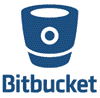

# 2020 年 13 种最佳 Github 替代方案

> 原文： [https://www.guru99.com/github-alternative.html](https://www.guru99.com/github-alternative.html)

GitHub 是广泛用于版本控制的代码托管工具。 该工具允许开发人员在多个项目上一起工作。 但是，它的 GUI 可能非常令人困惑。

因此，这里列出了可以替代 Github 的 13 种顶级工具。 此列表包括具有流行功能和最新下载链接的商业以及开源工具。

### 1）[好友](https://bit.ly/2Mb74cW)

[Buddy](https://bit.ly/2Mb74cW) 是面向 Web 开发人员的智能 CI / CD 工具，旨在降低 DevOps 的进入门槛。 它使用交付管道来构建，测试和部署软件。 创建的管道具有 100 多种随时可以使用的操作，这些操作可以以任何方式进行排列-就像您盖砖瓦房一样。

*   15 分钟的配置，清晰的&告诉 UI / UX
*   基于变更集的快速部署
*   构建在具有缓存依赖项的隔离容器中运行
*   支持所有流行的语言，框架&任务管理器
*   Docker / Kubernetes 行动专用名单
*   与 AWS，Google，DigitalOcean，Azure，Shopify 和 WordPress 集成&更多
*   支持并行& YAML 配置

### 2）Bitbucket

 

[Bitbucket](https://bitbucket.org/product) 是 Atlassian 开发的版本控制工具。 它不仅仅是 Git 代码管理。 Bitbucket 使团队能够计划项目，在代码上进行协作，测试和部署。

**功能：**

*   免费的无限私人存储库
*   一流的 Trello & Jira 集成
*   允许您通过代码审查来构建高质量的软件
*   帮助您保护工作流程
*   Bitbucket 使您可以使用集成的 CI / CD 进行构建，测试和部署

**下载链接：** [https://bitbucket.org/product](https://bitbucket.org/product)

### 3）源伪造

[Sourceforge](https://sourceforge.net/) 是一个开源开发和分发平台。 该工具托管在 Apache，Allura 上，并支持许多不同的项目。 用户可以选择 Git，Mercurial 作为其版本控制系统。

**Features:**

*   广泛的全球镜像网络
*   集成问题跟踪
*   允许基于浏览器的代码浏览
*   您可以按平台，时间和地区下载统计信息。
*   支持论坛，博客和邮件列表

**下载链接：** [https://sourceforge.net/](https://sourceforge.net/)

### 4）高格斯

 

[Gogs](https://gogs.io/) 是另一种 GitHub 替代方案，它提供了最简单，最快捷的方式来设置自托管 Git 服务。 借助此版本控制工具，您可以跨各种平台执行独立的二进制分发。

**Features:**

*   Gogs 可以在可以针对 Windows，Mac，Linux 等进行编译的任何位置运行。
*   出色的性能和效率
*   Gogs 具有最低要求，因此您可以在便宜的 Raspberry Pi 上运行

**下载链接：** [https://gogs.io/](https://gogs.io/)

### 5）马桶

 

[Gitbucket](https://github.com/gitbucket/gitbucket/releases) 是一个高度可扩展的开源工具，用于托管软件开发过程的源代码。 它提供了一组工具和功能，使开发人员可以轻松管理项目代码。

**Features:**

*   仓库查看器
*   拉取请求
*   问题追踪器
*   文档和维基
*   提供插件系统以扩展其核心功能

**下载链接：** [https://github.com/gitbucket/gitbucket/releases](https://github.com/gitbucket/gitbucket/releases)

### 6）AWS CodeCommit

亚马逊的基于 Git 的版本控制服务也是使用其他 AWS 服务的公司的理想选择。 具有可扩展的云存储，并且没有大小限制。

**Features:**

*   提供便捷的访问和集成
*   AWS CodeCommit 工具旨在用于协作软件开发
*   允许帮助您使用 HTTPS 或 SSH 与 AWS CodeCommit 传输文件或从 AWS CodeCommit 传输文件
*   它允许您创建尽可能多的存储库

**下载链接：** [https://console.aws.amazon.com/codecommit/home?region=us-east-1#/introduction](https://console.aws.amazon.com/codecommit/home?region=us-east-1)

### 7）豆茎

 

[Beanstalk](https://beanstalkapp.com/pricing) 是安全，强大和最可靠的 GitHub 替代工具。 它可以帮助您管理源代码存储库。 它旨在改善您的开发工作流程。

**Features:**

*   支持 Git 和 SVN 托管
*   帮助您快速准确地部署代码
*   自定义每个环境的部署配置
*   它允许两种类型的反馈：问题和讨论

**下载链接：** [https://beanstalkapp.com/pricing](https://beanstalkapp.com/pricing)

### 8）炸药

 

[Phabricator](https://www.phacility.com/) 是用于开发软件的一组工具。 它包括用于代码审查，资源库托管，错误跟踪，项目管理等的工具。

**Features:**

*   这是一个开源项目，因此您可以在硬件上免费下载并本地安装
*   如果您在硬件上托管了此工具，并且正在寻求帮助，则可以购买支持
*   允许托管以进行自动更新，维护和访问支持

**下载链接：** [https://www.phacility.com/](https://www.phacility.com/)

### 9）Gitea

 

[Gitea](https://dl.gitea.io/gitea/) 是无痛的自托管 git 服务。 这个用 Go 语言编写并在 MIT 许可下发布的代码托管解决方案社区。

**Features:**

*   它可以在可以针对 Windows，macOS，Linux 等进行编译的任何位置运行。
*   易于安装，因为您需要为平台运行二进制文件。 或者您也可以将 Gitea 与 Vagrant 或 Docker 一起运送
*   Gitea 只需要很少的内存需求，并且可以在便宜的 Raspberry Pi 上运行

**下载链接：** [https://dl.gitea.io/gitea/](https://dl.gitea.io/gitea/)

### 10）

 

Apache [Allura](https://allura.apache.org/) 是一个开源工具。 它是一个网站，允许您管理错误报告，源代码存储库，讨论等。

*   帮助您管理多个项目
*   源代码管理功能允许使用 Git，svn 以及合并请求，fork 等。
*   邮件列表或论坛或两者结合使用的开放式讨论
*   提供用于管理文档的 Wiki
*   最有效的错误跟踪系统

**下载链接：** [https://allura.apache.org/](https://allura.apache.org/)

### 11）罗德码

 

它是企业源代码管理，开源和安全工具。 它也是 Mercurial，Git 和 Subversion 的统一工具。 RhodeCode 的社区版是免费的。 但是，如果您为企业版付费，则可以与企业工具，高级支持等集成。

**Features:**

*   帮助您进行代码审查，迭代和提高代码质量
*   工作流程自动化，可加快交互速度
*   通过企业级权限控制帮助您管理软件资产
*   安全软件开发的权限管理

**下载链接：** [https://rhodecode.com/try-rhodecode](https://rhodecode.com/try-rhodecode)

### 12）CodeGiant

 

[CodeGiant](https://codegiant.io/pricing) 是市场上最直观，性能最高的问题跟踪工具。 用户可以选择两种项目样式：活动 sprint 或看板工作板。

**Features:**

*   Git 仓库，简单的方法
*   允许进行更胖的软件开发
*   在单个工作流程中进行持续集成
*   可发布的文件

**下载链接：** [https://codegiant.io/pricing](https://codegiant.io/pricing)

### 13）云源存储库

 

**Features:**

*   无限免费的私人 Git 存储库
*   内置 CI 尽早发现问题
*   设计，开发和安全地管理您的代码
*   获得强大的代码搜索功能

**下载链接：** [https://console.cloud.google.com/freetrial/signup/0?_ga=2.134219889.-1088062179.1542957490 & pli = 1](https://console.cloud.google.com/freetrial/signup/0?_ga=2.134219889.-1088062179.1542957490&pli=1)

### 14）Trac

 

[Trac](https://trac.edgewall.org/) 是轻量级的项目管理工具。 它提供了一种基于 Web 的软件项目管理的简约方法。 Trac 使您可以管理团队的建立和开发过程。

**Features:**

*   错误追踪
*   通过插件扩展标准功能
*   使用 Wiki 管理团队知识
*   任务管理和团队协作
*   时间跟踪，成本报告和预算编制

**下载链接：** [https://trac.edgewall.org/](https://trac.edgewall.org/)