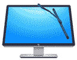
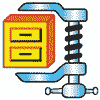

# 2020 年 21 种最佳 CCleaner 替代品

> 原文： [https://www.guru99.com/ccleaner-alternatives.html](https://www.guru99.com/ccleaner-alternatives.html)

CCleaner 是一款实用程序软件，可以清除您的在线曲目，释放空间并帮助您管理计算机，因此可以提高 PC 的速度，从而使其运行更快。 但是，Piriform CCleaner 有一些限制，例如由于 Windows 操作系统存储各种文件的方式，它无法擦除硬盘上每个已删除的文件。 此外，它还会在不经您确认的情况下进行自我更新，并在后台强制运行。

这里是精选的顶尖工具的清单，这些工具能够替代 CCleaner。 该列表同时包含开源（免费）和商业（付费）软件。

### 1）清洁大师

 

Clean Master Official 为您提供强大的隐私保护和垃圾清理功能。 它具有扫描 1000 多个程序的功能。 您只需单击一下就可以释放计算机垃圾。

**功能**：

*   它使您可以删除有风险的浏览记录。
*   您可以停止不必要的启动程序，增加启动时间，并优化系统。
*   它支持扫描和修复超过 5,000,000 个驱动程序和设计。
*   它检查垃圾文件并自动清除它们。
*   This tool securely destroys sensitive files.

**下载链接**： [https://www.cleanmasterofficial.com/zh-cn/](https://www.cleanmasterofficial.com/en-us/)

* * *

### 2）[先进的系统优化](https://bit.ly/2VpRkWu)

[Sys Tweak 的高级系统优化器](https://bit.ly/2VpRkWu)是功能强大的清理和优化软件，适用于 Windows 10、8.1、8、7，Vista 和 XP。 它可以清理硬盘并更快地运行 PC。

**功能**：

*   它提供了无干扰的游戏体验。
*   您可以轻松地在游戏计算机和家用计算机之间切换。
*   更新计算机中必要的驱动程序，以提高计算机的速度。
*   它可以帮助您减少系统崩溃。
*   该工具可保护您的系统免受恶意软件的侵害，并确保敏感数据的安全。
*   先进的系统优化程序可以更快地加载文件。

* * *

### 3） [Wisecleaner](https://bit.ly/2xD56NK)

Easy pc Optimizer 是一种系统维护工具，可安全清除不可用的文件，从而提高计算机的性能。 它还提供了许多自定义选择选项，使您可以清理它们不需要的文件。

**Features:**

*   清除计算机上可用的 Internet 历史记录和其他跟踪记录； 因此，它可以保护您的隐私。
*   通过整理和重新整理硬盘上的文件来提高计算机性能。
*   它计划自动清洁磁盘。
*   自动更新软件。

**下载链接**： [https://www.wisecleaner.com/wise-care-365.html](https://bit.ly/2xD56NK)

* * *

### 4）[先进的系统维护（ASC）](https://bit.ly/2ys2v9f)

[IObit Advanced](https://bit.ly/2ys2v9f) SystemCare 是一款简单易用的软件，可以清理，加速，优化，保护您的系统以及保护您的在线隐私。

**Features:**

*   此工具可帮助您通过清除垃圾文件来释放磁盘空间。
*   它管理启动项目以促进计算机启动。
*   IObit Advanced SystemCare 可提高系统安全性并刷新您的 Web 浏览。
*   使用此工具，您可以确保您的联系人，阻止不受信任的程序以及本地电子邮件信息的安全。

**下载链接**： [https://www.iobit.com/zh/advancedsystemcarefree.php](https://bit.ly/2ys2v9f)

* * *

### 5） [CleanMyPC](https://bit.ly/2XRgVKM)

[CleanMyPC](https://bit.ly/2XRgVKM) 软件产品可使您的 PC 保持清洁并像新计算机一样运行。 它扫描您的计算机系统以提高其速度，清理垃圾文件并提高其性能。

**Features:**

*   只需单击几下，您就可以找到无用的文件并将其安全地删除。
*   它允许用户清除计算机上的注册表。
*   以正确的方式以及剩余的 Windows 应用程序卸载它们。
*   此工具提供了一种加快计算机启动速度的简便方法。
*   它标识不需要的加载项并关闭它们。
*   CleanMyPC 维护您的在线隐私。
*   您可以轻松摆脱休眠文件。

**下载链接**： [https://macpaw.com/cleanmypc](https://bit.ly/2XRgVKM)

* * *

### 6） [Avast 清理](https://bit.ly/2xMun84)

[Avast 清理](https://bit.ly/2xMun84)加速并清理计算机。 此工具可帮助您更新软件，解决烦人的问题并删除过时的软件。

**Features:**

*   该工具将删除损坏的快捷方式。
*   它会删除您的注册表。
*   Avast 清理会自动更新您的应用程序。
*   提供计算机运行状况的快速概述。
*   它可以检测并删除不需要的第三方工具栏和广告。
*   该软件具有获得专利的调整方法，该方法可将所有耗费资源的应用程序置于睡眠模式以提高速度。

**下载链接**： [https://www.avast.com/zh-cn/cleanup](https://bit.ly/2xMun84)

* * *

### 7）适用于 PC，Mac 和 Android 的 AVG PC Tuneup

 

AVG PC TuneUp 工具可帮助您更快地运行旧 PC。 此工具具有睡眠模式技术，可提高您的 PC 性能，浏览速度和更快的磁盘清理过程。

**Features:**

*   该工具会自动修复错误，崩溃并维护您的计算机。
*   它查找并删除垃圾程序和 bloatware。
*   它允许您清理 200 多个应用程序。
*   使用 Disk Cleaner 深度清洁硬盘
*   借助浏览器清理程序，浏览更轻松，更快。
*   AVG PC TuneUp 会自动清除注册表。
*   一键式帮助您使程序保持最新。
*   一键更新所有程序。

**下载链接**： [https://www.avg.com/en-in/avg-pctuneup](https://www.avg.com/en-in/avg-pctuneup)

* * *

### 8） [Glary Utilities](https://bit.ly/2RVGZkh)

[Glary Utilities](https://bit.ly/2RVGZkh) 提供了多种系统工具来维护，修复和保护您的计算机系统。 它提供了注册表清理器，间谍软件检测，磁盘清理，内存优化器等。

**功能**：

*   提供权威的多合一实用程序来清洁您的 PC。
*   该工具修复了令人沮丧的崩溃和错误。
*   它具有自动和安全选项。
*   最大化您的 PC 性能。
*   Glary Utilities 具有易于使用和直观的界面。
*   它包括 20 多个系统实用程序，以提高计算机性能。
*   它扫描并分析 PC 问题。

**下载链接**： [https://www.glarysoft.com](https://bit.ly/2RVGZkh)

* * *

### 9）Jv16 PowerTools

Jv16 PowerTools 是一种软件，可以通过清除 Windows 注册表，不需要的文件和数据来工作。 该工具会自动修复系统错误，并将优化应用于您的 PC。

**Features:**

*   它加快了计算机的启动速度。
*   Jv16 PowerTools 使您能够卸载任何软件并删除其剩余物。
*   该软件与 Windows XP，Vista，7、8、10 和 11 兼容。
*   它可以使用多种语言，例如英语，荷兰语，德语，弗朗西斯语等。

**下载链接**： [https://www.macecraft.com](https://www.macecraft.com)

* * *

### 10）系统忍者

System Ninja 是为 Windows 设计的快速有效的 PC 优化解决方案。 它删除了不必要的文件，解决了问题，提高了系统速度。

**Features:**

*   它清除 Chrome，Opera，Mozilla Firefox，Internet Explorer 等的垃圾。
*   使用此软件，您可以控制启动时间，删除不需要的应用程序以及操纵运行过程。
*   它提供一键式优化。

**下载链接**： [https://singularlabs.com/software/system-ninja/](https://singularlabs.com/software/system-ninja/)

* * *

### 11）Ace 实用程序

Ace Utilities 是可用于优化和清洁计算机的工具的集合。 它使您可以顺利运行系统而不会出现任何错误。

**Features:**

*   它通过删除垃圾文件来增加磁盘空间。
*   该工具提供了驱动器内容的详细分析。
*   它可以帮助您复制文件和文件夹。
*   修复桌面，开始菜单和可移动媒体上无效的快捷方式。
*   它清除注册表。
*   此工具删除 Internet 浏览器的缓存和历史记录。

**下载链接**： [https://www.acelogix.com](https://www.acelogix.com)

* * *

### 12）Winutilities 专业版

 

WinUtilities Pro 是一个系统实用程序软件。 它易于使用，并且为提高计算机性能提供了有效的解决方案。

**Features:**

*   它会清除会降低系统性能的信息中的磁盘。
*   该工具将删除 PC 上所有活动的痕迹。
*   您可以使用密码保护可执行文件。
*   有效管理 windows 的内存。
*   它管理您的 Windows 设置。
*   使用此软件，您可以安排清洁任务。

**下载链接**： [https://www.pcclean.io/winutilities-pro/download/](https://www.pcclean.io/winutilities-pro/download/)

* * *

### 13） [Iolo 系统技师](https://bit.ly/2yJXOI3)

[Iolo 系统技术员](https://bit.ly/2yJXOI3)支持个性化报告，其中详细列出了问题以及建议的修复程序列表。 该工具可改善 PC 的启动时间，Internet 下载速度，CPU 性能，驱动程序和 RAM。

**Features:**

*   它会自动提高 CPU，硬盘驱动器和 RAM 的速度。
*   查找不需要的启动程序，该程序会降低计算机的速度。
*   它发现并修复了 30,000 多个各种问题。
*   优化隐藏的 Internet 设置，以更快地加载和下载页面。
*   安全清除浏览历史记录并修补 Windows 安全漏洞，这些漏洞可能会损害您的计算机。
*   删除 50 多个各种垃圾文件并释放磁盘空间。

* * *

### 14）树大小

TreeSize Professional 是适用于所有 Windows 和客户端/服务器的灵活的硬盘空间管理工具。 您可以可视化硬盘空间使用情况。

**Features:**

*   该工具提供了大量文件导出选项。
*   它使您能够复制，存档或移动文件。
*   该实用程序软件搜索重复文件。
*   扫描 SharePoint 服务器和 FTP。
*   它提供了文件和文件夹的详细分析
*   使用此软件，您可以管理移动设备和智能手机上的磁盘空间。

**下载链接**： [https://www.jam-software.com/treesize/](https://www.jam-software.com/treesize/)

* * *

### 15） [Winzip](https://bit.ly/3caSOeo)

[Winzip](https://bit.ly/3caSOeo) 是一个实用套件，可以清理，保护和优化您的系统。 该套件包括 PC 所需的 20 多种工具。

**Features:**

*   注册表增强器
*   Windows 优化器
*   安全&隐私工具
*   常见问题修复者
*   垃圾清洁剂

**下载链接**： [https://www.winzipsystemtools.com/system-utilities/](https://bit.ly/3caSOeo)

* * *

### 16） [Ashampoo WinOptimizer 2019](https://bit.ly/2XSf34o)

[Ashampoo WinOptimizer 2019](https://bit.ly/2XSf34o) 版本工具可帮助您清理和优化 Windows 系统的性能，远远超出了内置工具所能提供的范围。

**Features:**

*   它删除了互联网痕迹。
*   Ashampoo WinOptimizer 发现无效的软件快捷方式。
*   该工具提供了创新的硬盘基准测试，并提供了详细的结果。
*   您可以查看和管理系统中的运行过程。
*   它允许您自定义 Windows 上下文菜单。
*   使用此工具，您可以管理已安装的字体。

**下载链接**： [https://www.ashampoo.com/en/usd/pin/5706/system-software/Ashampoo-WinOptimizer-2019](https://bit.ly/2XSf34o)

* * *

### 17）伐木工

PrivaZer 是一个免费的实用程序软件，可以永久删除您 PC 上过去活动的不需要的痕迹。

**Features:**

*   一键即可安全清洁 PC。
*   它使您可以释放磁盘空间并保持 PC 合适。
*   您可以根据过去的活动查看可以进一步恢复的内容。
*   此工具可防止您的活动恢复。

**下载链接**： [https://privazer.com/en/](https://privazer.com/en/)

* * *

### 18）[隐私橡皮擦](https://bit.ly/3eRGTE4)

[隐私橡皮擦](https://bit.ly/3eRGTE4)是用于通过删除 PC 活动来保护您的隐私的工具。 它支持各种浏览器，例如 Google Chrome，Microsoft Edge，Firefox，Google Chrome 等。

**Features:**

*   此工具可获取 Internet 缓存，Cookie，下载历史记录，已保存的密码，键入的 URL 等。
*   它提供了 250 多种第三方替代方法来清除软件跟踪。
*   该工具将从您的计算机中删除文件夹和文件。
*   安全擦拭驱动器上的隐藏区域和备用区域。
*   它提供 Windows 系统的实时监控。
*   隐私橡皮擦消除了过时和无效的注册表项。

**下载链接**： [https://www.cybertronsoft.com/products/privacy-eraser/](https://bit.ly/3eRGTE4)

* * *

### 19）[文件清理器](https://bit.ly/2VL9x0N)

[FileCleaner](https://bit.ly/2VL9x0N) 是 Windows 清理软件，可让您的 PC 快速无错误且安全地运行。 它会自动修复 PC 问题，删除系统垃圾并保护您的隐私。

**Features:**

*   它提供自定义扫描计划。
*   该工具提供实时优化。
*   FileCleaner 删除浏览器工具栏。
*   在更少的时间内卸载任何程序。
*   它具有可永久擦除文件的文件粉碎机。
*   您可以有效地管理文件。

**下载链接**： [https://www.filecleaner.com](https://bit.ly/2VL9x0N)

* * *

### 20）双重清洁剂

Duplicate Cleaner 软件可帮助您管理硬盘驱动器中的内容。 它扫描计算机上的文件，并允许您删除或移动或删除重复的文件。

**Features:**

*   您可以整理图像。
*   扫描音乐和视频格式，并按名称，标题或艺术家查找重复项。
*   它允许您在 zip 文件中进行搜索。
*   导入或导出结果。
*   提供包含文件信息的详细列表。
*   它提供了智能文件选择助手。
*   它为系统和 Windows 文件提供了最终的保护。

**下载链接**： [https://www.duplicatecleaner.com](https://www.duplicatecleaner.com)

* * *

### 21）Bleachbit

BleachBit 软件允许您删除 Cookie，切碎临时文件，删除日志，清除 Internet 历史记录以及丢弃您不知道的垃圾。

**Features:**

*   完全删除您的私人文件。
*   它使您能够覆盖可用磁盘空间。
*   无需任何安装即可运行应用程序。
*   使用新功能更新软件。
*   您可以共享，学习和修改应用程序。
*   您可以切碎任何文件。

**下载链接**： [https://www.bleachbit.org](https://www.bleachbit.org)