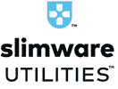

# 2020 年 20 种最佳免费注册表清洁工具

> 原文： [https://www.guru99.com/free-registry-cleaners.html](https://www.guru99.com/free-registry-cleaners.html)

注册表清理器软件会清理 Windows 注册表。 它删除了多余的注册表项，从而提高了 PC 的速度，从而使其运行得更快且没有任何错误。

以下是带有热门功能和网站链接的 Top Registry Cleaner 工具的精选列表。 该列表同时包含开源（免费）和商业（付费）软件。

### 1）CCleaner

CCleaner 清除了您的在线曲目，释放了空间，并帮助您管理计算机，因此运行速度更快。 这是清除注册表并维护 PC 的简单工具。

**功能：**

*   它提供了标准的隐私保护。
*   该软件产品可优化您的 Internet 速度和计算机。
*   该工具可加快启动速度并提供更好的性能。
*   根据您的业务需求定制清洁
*   增强安全性并保持合规性

**链接：** [https://www.ccleaner.com/registry-cleaner](https://www.ccleaner.com/registry-cleaner)

* * *

### 2）先进的 SystemCare

IObit Advanced SystemCare 是简单易用的软件。 它可以帮助您清理，加速，优化和保护系统。 它还可以保护您的在线隐私。 此工具还可以帮助您通过清除垃圾文件来释放磁盘空间。

**Features:**

*   它管理启动项以促进计算机启动。
*   IObit Advanced SystemCare 可提高系统安全性并刷新您的 Web 浏览。
*   驱动器错误解决程序&修复窗口
*   修复 Windows 问题
*   单击删除软件剩余。

**链接：** [https://www.iobit.com/en/index.php](https://www.iobit.com/en/index.php)

* * *

### 3）RegClean Pro

Sys Tweak 的高级系统优化程序是针对 Windows 10、8.1、8,7，Vista 和 XP 的强大清理和优化软件。 它可以清理硬盘并更快地运行 PC。

**Features:**

*   它提供了无干扰的游戏体验。
*   您可以轻松地在游戏计算机和家用计算机之间切换。
*   更新计算机上必要的驱动程序，以提高计算机的速度。
*   它可以帮助您减少系统崩溃。
*   该工具可保护您的系统免受恶意软件的侵害，并确保敏感数据的安全。
*   先进的系统优化程序可以更快地加载文件。

**链接：** [https://www.systweak.com/registry-cleaner](https://www.systweak.com/registry-cleaner)

* * *

### 4）Iolo 系统技师

Iolo System Mechanic 支持个性化报告，详细说明问题和建议的修复程序列表。 该工具可改善 PC 的启动时间，Internet 下载速度，CPU 性能，驱动程序和 RAM。

**Features:**

*   它会自动提高 CPU，硬盘驱动器和 RAM 的速度。
*   查找不需要的启动程序，该程序会降低计算机的速度。
*   它检测并修复了 30,000 多个各种问题。
*   优化隐藏的 Internet 设置以加快页面加载速度
*   安全清除浏览历史记录并修补 Windows 安全漏洞，这可能会损害您的计算机。
*   删除 50 多个各种垃圾文件并释放磁盘空间。

**链接：** [https://www.iolo.com/products/system-mechanic/](https://www.iolo.com/products/system-mechanic/)

* * *

### 5）AVG TuneUp

Avast cleanup 是一个免费的注册表清理软件，可以加速和清理计算机。 此工具可帮助您更新软件，解决烦人的问题并删除过时的软件。

**Features:**

*   该工具将删除损坏的快捷方式。
*   它会删除您的注册表。
*   Avast 清理会自动更新您的应用程序。
*   它提供了计算机运行状况的快速概述。
*   它可以检测并删除不需要的第三方工具栏和广告。
*   获得专利的调优方法使所有耗费资源的应用程序进入睡眠模式。

**链接：** [https://www.avg.com/en-in/avg-pctuneup](https://www.avg.com/en-in/avg-pctuneup)

* * *

### 6）WinUtilities

WinUtilities Pro 是一个系统实用程序软件。 它易于使用，并且为提高计算机性能提供了有效的解决方案。 它会清除会降低系统性能的信息中的磁盘。

**Features:**

*   该工具将删除 PC 上所有活动的痕迹。
*   您可以添加密码来保护可执行文件。
*   有效管理 windows 的内存。
*   它管理您的 Windows 设置。
*   提高 PC 速度并修复令人沮丧的错误，崩溃和死机
*   保护您的隐私并清除敏感的 Internet 和聊天记录。
*   使用此软件，您可以安排清洁任务。

**链接：** [https://www.pcclean.io/winutilities-free/](https://www.pcclean.io/winutilities-free/)

* * *

### 7）SlimCleaner 免费

SlimCleaner 是 PC 优化工具，使您的 PC 可以提高程序响应时间。 它可以帮助您管理更多的空间和更少的不需要的程序。 它具有性能模式和电源管理模式，可以优化您的计算机。

**Features:**

*   Slimware Cleaner 提供了用户的最新信息，评级和建议。
*   您可以删除不必要的垃圾软件和文件，这些文件和文件会占用空间并损害您的隐私。
*   一键式帮助您扫描 PC。
*   该工具具有电源管理模式，可以有效管理计算机占用的电源。
*   它具有性能提升模式，可以提高计算机的性能。
*   SlimCleaner 提供不需要的启动项警报。

**链接：** [https://slimware.com/slimcleaner](https://slimware.com/slimcleaner)

* * *

### 8）WiseCleaner

Easy pc Optimizer 是易于使用的系统维护工具，可安全清除不可用的文件，从而提高计算机的性能。 它还提供了许多自定义选择选项，使您可以清理不需要的文件。

 

**Features:**

*   清除计算机上可用的 Internet 历史记录和其他跟踪记录，从而保护您的隐私。
*   通过整理和重新整理硬盘上的文件来提高计算机性能。
*   它计划自动清洁磁盘。
*   自动更新软件。

**链接：** [http://www.wisecleaner.com/](http://www.wisecleaner.com/)

* * *

### 9）防御字节

Defencebyte Computer Optimizer 是一个注册表清理工具，它封装了全面的技术。 它可以帮助您检查计算机故障和注册表故障。 该工具还可以帮助您阻止所有不需要的 URL。

**Features:**

*   系统化扫描计划。
*   它显着清理了 PC 的注册表，以释放硬件空间。
*   删除无效的路径/程序。
*   删除无用的文件扩展名。
*   空注册表项。

**链接：** [https://www.defencebyte.com/computer-optimizer](https://www.defencebyte.com/computer-optimizer)

* * *

### 10）jv16 PowerTools

Jv16 PowerTools 是可以通过清除 Windows 注册表，不需要的文件和数据来工作的软件。 此工具可帮助您自动修复系统错误，并将优化应用于 PC。 该工具使您可以卸载任何软件并删除其剩余部分。

 

**Features:**

*   它加快了计算机的启动速度。
*   该工具会扫描 Windows 注册表和所有硬盘驱动器，以查找与当前安装的软件相关的数据。
*   它旨在扫描计算机中的临时文件，已卸载软件中的剩余文件。
*   它可以使用多种语言，例如英语，荷兰语，德语，弗朗西斯语等。

**链接：** [https://jv16powertools.com/jv16-powertools-1-4-1-a-monster-of-a-tool/](https://jv16powertools.com/jv16-powertools-1-4-1-a-monster-of-a-tool/)

* * *

### 11）JetClean

JetClean 是一个轻巧且易于使用的注册表清理工具。 该软件可帮助您删除系统垃圾文件并提高 PC 性能。 该工具可帮助您以快速可靠的方式清除不需要的损坏文件历史记录。

**Features:**

*   清除垃圾文件和不需要的注册表项
*   提高电脑性能
*   您的计算机只需要很小的空间
*   通过重新排列应用程序来帮助加速 PC 启动
*   减少系统错误和崩溃

**链接**： [http://www.bluesprig.com/jetclean.html](http://www.bluesprig.com/jetclean.html)

* * *

### 12）Argente 实用程序

Argente 注册表清理程序将监督您的计算机并不断搜索系统中的问题。 该工具还允许您删除 e 文件和应用程序。

**Features:**

*   安排任务而无需您干预。
*   删除恶意软件并清除痕迹。
*   它提供了更高的速度和稳定性。
*   它可以帮助您建立更好的配置。

**链接：** [https://argenteutilities.com/](https://argenteutilities.com/)

* * *

### 13） [Auslogics 注册表清理器](https://bit.ly/3gjxwNo)

[Auslogics 注册表清理程序](https://bit.ly/3gjxwNo)是一种工具，可用于检查您的整个系统并查找垃圾文件。 它还会降低速度并限制软件崩溃。 该工具允许您清除垃圾文件，临时文件，未使用的错误日志，Web 浏览器缓存。

**Features:**

*   您可以清理它来调整 Internet 连接设置，以实现流畅的浏览和更快的下载。
*   它消除了您的活动痕迹，并保护了您的敏感信息。
*   实时检测并消除问题，并保持系统高速运行。
*   自动内存和处理器管理

**链接：** [https://www.auslogics.com/en/](https://bit.ly/3gjxwNo)

* * *

### 14）注册表修复

Glarysoft 注册表清理器可以分析注册表中的十几个不同区域。 它可以识别各种系统和注册表错误。 每当您修复注册表时，该工具还会创建一个备份副本。

 

**Features:**

*   当发现无效的注册表项时，高度智能的引擎。
*   扫描速度快，结果详细。
*   创建任何注册表更改的备份。
*   提高系统性能和稳定性。

**链接**： [https://www.glarysoft.com/registry-repair/](https://www.glarysoft.com/registry-repair/)

* * *

### 15）雷斯托罗

Restoro 是有用的注册表清除工具，可将任何 PC 固定并安全地修复到最佳状态。 此工具可帮助您消除恶意软件威胁。 它还用新文件替换了 Windows 损坏文件。

**Features:**

*   检测危险网站
*   恢复最高性能
*   释放宝贵的磁盘空间
*   在威胁性应用损坏计算机之前检测出威胁应用

**链接：** [https://www.restoro.com/](https://www.restoro.com/)

* * *

### 16）EasyCleaner

EasyCleaner 是一种多功能的系统维护软件，可以清除 Windows 注册表中没有指向的条目。

**Features:**

*   多功能系统维护应用程序
*   它可以帮助您提高计算机的性能
*   保留所有已删除注册表的备份文件
*   易于使用和可定制

**链接：** [https://easycleaner.en.softonic.com/](https://easycleaner.en.softonic.com/)

* * *

### 17）TweakNow RegCleaner

TweakNow 可以免费使用 RegCleaner。 这是最快，最可靠的注册表清理程序。 建议定期清理 Windows 注册表。

**Features:**

*   RegCleaner 可帮助您扫描注册表以查找过时的条目。
*   该工具可准确识别过时的条目。
*   它可以帮助您在从注册表中删除过时的条目之前创建备份文件。
*   添加了对 Windows 10 的支持。

**链接：** [http://www.tweaknow.com/RegCleaner.php](http://www.tweaknow.com/RegCleaner.php)

* * *

### 18）注册生活

Registry Life 是 PC 清洁工具，可用于纠正注册表中的错误并对其进行优化。 它是一个紧凑，易于使用且免费的解决方案，用于为您的系统注册表提供服务。

**Features:**

*   免费和开源工具注册表清理工具
*   使用注册表生存期修复注册表错误
*   该工具还提供用于整理和压缩注册表的实用程序

**链接：** [https://www.chemtable.com/RegistryLife.htm](https://www.chemtable.com/RegistryLife.htm)

* * *

### 19）CleanMyPC

CleanMyPC 软件产品可使您的 PC 保持清洁并像新产品一样运行。 它扫描您的计算机系统以提高其速度，清理垃圾文件并提高其性能。

**Features:**

*   只需单击几下，您就可以找到无用的文件并将其安全地删除。
*   它允许用户清除计算机上的注册表。
*   以正确的方式以及剩余的 Windows 应用程序卸载它们。
*   此工具提供了一种加快计算机启动速度的简便方法。
*   它识别不需要的加载项并关闭它们。
*   CleanMyPC 维护您的在线隐私。
*   您可以轻松摆脱休眠文件。

**下载链接：** [https://macpaw.com/](https://macpaw.com/)

* * *

### 20）Vit 注册表修复

Vit Registry Fix 是一个免费使用的系统清理程序，用于清除注册表中的错误。 该工具可帮助您查找和删除磁盘上的垃圾文件并清除历史记录列表。

**Features:**

*   强大的错误自动搜索功能
*   手动清洁程序设置
*   帮助您创建完整备份，并在消除错误之前
*   优化注册表文件
*   管理 Windows 启动和卸载软件
*   在可移动驱动器和其他驱动器上以便携式模式工作

**链接：** [https://vitsoft.net/en/](https://vitsoft.net/en/)

### 常问问题

## ✔️什么是注册表清理工具？

注册表清理器工具是用于从 Windows 注册表中删除重复项的应用程序。

## ❓为什么使用注册表清理器？

Registry cleaner software cleans up your Windows registry. It removes redundant registry entries, which increase your PC's speed so that it runs faster and without any errors.

## ⚡注册表清理器的一般特征是什么？

注册表清理程序的一般功能是：

*   修复 Windows 问题
*   它可以帮助您减少系统崩溃。
*   删除 50 多个各种垃圾文件并释放磁盘空间。
*   一键式帮助您扫描 PC。

## ✔️ What are registry cleaner tools?

Registry cleaner tools are applications used to remove duplicate items from the Windows registry.

Registry cleaner tools are applications used to remove duplicate items from the Windows registry.

Registry cleaner tools are applications used to remove duplicate items from the Windows registry.

## ❓ Why use registry cleaner?

Registry cleaner software cleans up your Windows registry. It removes redundant registry entries, which increase your PC's speed so that it runs faster and without any errors.

Registry cleaner software cleans up your Windows registry. It removes redundant registry entries, which increase your PC's speed so that it runs faster and without any errors.

Registry cleaner software cleans up your Windows registry. It removes redundant registry entries, which increase your PC's speed so that it runs faster and without any errors.

## ⚡ What are the general features of registry cleaners?

The general features of registry cleaners are:

*   修复 Windows 问题
*   它可以帮助您减少系统崩溃。
*   删除 50 多个各种垃圾文件并释放磁盘空间。
*   一键式帮助您扫描 PC。

The general features of registry cleaners are:

*   修复 Windows 问题
*   它可以帮助您减少系统崩溃。
*   删除 50 多个各种垃圾文件并释放磁盘空间。
*   一键式帮助您扫描 PC。

The general features of registry cleaners are:

*   修复 Windows 问题
*   它可以帮助您减少系统崩溃。
*   删除 50 多个各种垃圾文件并释放磁盘空间。
*   一键式帮助您扫描 PC。