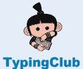
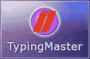
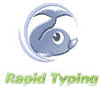
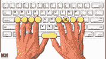
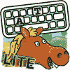
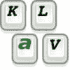
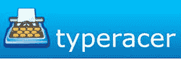

# 2020 年 21 种最佳打字导师软件

> 原文： [https://www.guru99.com/best-typing-software.html](https://www.guru99.com/best-typing-software.html)

打字导师是一款软件，可帮助您通过上课，玩游戏或进行打字测试来提高打字技能。

以下是热门键入家教计划的精选列表，包括其受欢迎的功能和网站链接。 该列表同时包含开源（免费）和商业（付费）软件。

### 1) Typing.com

Typing.com 是免费的打字软件，可以不时监控进度。 通过选择一分钟，三分钟和五分钟的打字测试，它可以帮助您提高打字的准确性和速度。

**功能：**

*   键盘，数字素养和编码
*   强大的学区和教室管理
*   向学生讲授有价值的技术基础知识。
*   它提供了更快，更准确的键入。
*   提供英语和西班牙语的说明和课程。
*   支持的平台：Web

**链接：** [https://www.typing.com/](https://www.typing.com/)

* * *

### 2）TypingClub

TypingClub 是基于 Web 的免费键入工具。 该工具可帮助教师使用 TypingClub 管理多个班级。 您可以使用此打字教程工具监视学生的进度并自定义课程。

**Features:**

*   它提供了移动应用程序，并具有可帮助教师设计课程的工具。
*   正确的手势指南可让您根据类型查看按键上正确的手势。
*   提供各种水平，以保持您的动力并建立肌肉记忆。
*   它使您可以查看过去的表演，甚至播放它们。
*   提供游戏，视频和各种打字挑战方面的广泛体验。
*   支持平台：网络

**链接：** [https://www.typingclub.com/](https://www.typingclub.com/)

* * *

### 3）打字猫

打字猫是一种键盘教学，可以帮助您提高打字速度。 它提供了各种类型的键盘布局，可以帮助您在线学习计算机键盘。

**Features:**

*   提高打字速度和准确性
*   它可以帮助您提高整体计算机技能。
*   用户可以将其键盘布局扩展到 Dvorak，Colemak 和 Workman。
*   支持的平台：Web

**链接：** [https://thetypingcat.com/](https://thetypingcat.com/)

* * *

### 4）打字大师

Type master 是一个网站，可以帮助您提高打字速度。 它使您可以测试 wpm（每分钟字数）的速度和准确性。

**功能：**

*   它可以帮助您分析和训练您的技能。
*   专业版提供了 wpm 测试工具，可用于您的所有业务招聘和培训。
*   打字游戏专区提供了大量有趣的打字游戏。
*   支持平台：Windows

**链接：** [https://www.typingmaster.com/](https://www.typingmaster.com/)

* * *

### 5）Ratatype

Ratatype 是一种在线打字教程工具，其重点是每个手指在键盘上的位置。 它是一个简单直观的界面，不会分散您对布局的注意力。

**Features:**

*   提供正确的坐姿以便打字。
*   课程输入字段下的彩色键盘可以帮助您了解应该用哪个手指按下每个键。
*   帮助您学习触摸打字
*   它允许您进行打字测试以找出您的打字速度。
*   支持的平台：Windows，Web

**链接：** [https://www.ratatype.com/learn/](https://www.ratatype.com/learn/)

* * *

### 6）快速打字

快速打字导师是免费打字。 该软件附带许多会话和游戏，可帮助您提高打字技能。 它提供了广泛的培训统计信息和定制课程。

**Features:**

*   虚拟键盘功能可帮助您学习如何将手指放在键盘上。
*   它在键盘上显示一两个移动的手。
*   该工具可帮助您跟踪学习进度，并允许您随时查看结果。
*   它提供了多语言界面。
*   支持平台：Windows

**链接：** [https://rapidtyping.com/downloads.html](https://rapidtyping.com/downloads.html)

* * *

### 7）TypeLift

TypeLift 是免费的触摸式课件，可直接在浏览器中运行。 它可以帮助您有效地练习键盘技能，并极大地提高您的打字速度。

**Features:**

*   键入测试以检查您的技能
*   创建您的打字课程
*   您可以查看总概览，该概览是根据以前的所有打字练习计算得出的。
*   即时显示您的写作进度。

**支持平台：** Windows

**链接：** [https://www.typing.academy/](https://www.typing.academy/)

* * *

### 8）关键英雄

Key Hero 是一款出色的打字辅导工具，可帮助您提高打字技能。 该软件游戏会跟踪您的所有性能（WPM 和准确性），并使您能够了解自己的错误。

**Features:**

*   触摸打字即无需看键盘即可进行打字。
*   网站结构和内容优化
*   识别查询类型
*   关键字和流量分析
*   支持平台：Windows

**链接：** [https://www.keyhero.com/](https://www.keyhero.com/)

* * *

### 9) Goodtyping.com

Goodtyping 是一种打字教程工具。 该工具提供 23 种不同的键盘布局。 该工具提供多种语言的打字练习，例如英语，法语，意大利语，西班牙语等。

**Features:**

*   了解如何在短短几个小时内用手指正确输入。
*   您将能够学习快速打字的技巧。
*   基于网络的课程，因此无需下载。
*   支持平台：Windows

**链接：** [https://www.goodtyping.com/](https://www.goodtyping.com/)

* * *

### 10）打字学习

触摸打字学习打字教程工具，可提供准确的打字损伤和练习，以更新您的打字技能。 它还具有速度测试以评估您的打字能力。

**Features:**

*   它提供 15 种不同语言的免费打字课程。
*   在此打字教程软件中，所有课程均分为主题，以查看接下来的内容。
*   提供不同的键盘布局供您选择，并提供各种游戏，让您与众不同。

**支持平台：** Windows

**链接：** [https://www.typingstudy.com/](https://www.typingstudy.com/)

* * *

### 11）在线快速打字

在线快速打字是一门打字教学，有 17 节永恒的课程。 这些课程使您可以在通过复习测试技能之前学习键盘上的所有字母。

**Features:**

*   提供两种不同的输入模式，使体验保持新鲜，并帮助发展不同的快速打字技能
*   自定义有趣的文字
*   帮助您个性化和保存报告
*   广泛的测试周期
*   支持平台：Windows

**链接：** [https://www.speedtypingonline.com/typing-test](https://www.speedtypingonline.com/typing-test)

* * *

### 12）动物打字–精简版

动物打字是所有年龄段的人学习触摸的一种简单，最直接，最有趣的方式。 根据您的打字速度，您将得到类似于蜗牛，兔子，马的阿尼拉。 该工具还可以提高您的准确性。

**Features:**

*   动画手指可以帮助您了解正确的打字技巧。
*   提供各种关键字布局：Qwerty（美国/英国），Dvorak，Colemak，Workman，Qwertz，Azerty 等。
*   帮助用户登录系统在多个用户之间切换。
*   支持平台：iOS

**链接：** [https://apps.apple.com/us/app/animal-typing-lite/id896411742](https://apps.apple.com/us/app/animal-typing-lite/id896411742)

* * *

### 13）车辆打字

车辆打字是一种喜欢在路上看车的孩子的打字工具。 您只需要输入气球中给出的字母即可保持汽车行驶。 该工具还为要按下的按键提供相应的提示。

**Features:**

*   它提供了三十多个课程。
*   汽车，火车，飞机和轮船等各种车辆的动画。
*   它允许用户最多切换 3 个人。
*   没有第三方广告。
*   支持平台：iOS

**链接：** [https://apps.apple.com/us/app/the-vehicles-typing/id1222383247](https://apps.apple.com/us/app/the-vehicles-typing/id1222383247)

* * *

### 14）打字螺栓

键入 Bolt 是您的网络打字辅导工具，可帮助您借助 Bolt AI 学习触摸打字。 该引擎打字螺栓可以根据用户的技能提供打字过程。

**Features:**

*   针对每个用户的优化词
*   智能初学者友好的用户界面
*   它提供有关性能的实时统计信息。
*   帮助您自动调整各个级别
*   支持 Windows：

**链接：** [https://www.typingbolt.com/](https://www.typingbolt.com/)

* * *

### 15）打字手指 LT

打字手指是 Mac 上的免费打字应用程序。 它可以帮助您使打字变得有趣，具有交互性并且可以与现代技术和新的教学方法结合使用。

**Features:**

*   它可以帮助您准确输入，而无需查看屏幕。
*   准备使用 US / EN QWERTY 键盘布局
*   家庭学习的理想选择。
*   它包含打字游戏。
*   支持平台：mac，iOS

**链接：** [https://apps.apple.com/us/app/typing-fingers-lt/id577351581](https://apps.apple.com/us/app/typing-fingers-lt/id577351581)

* * *

### 16) Keybr.com

键盘是一个网络应用程序，可以帮助您教授触摸打字。 该工具可帮助您显着提高任何人的打字速度和准确性。

**Features:**

*   帮助您根据自己的技能进行设计实践
*   您可以根据自己的选择选择布局。
*   允许用户添加其个人资料
*   支持平台：Windows

**链接：** [https://www.keybr.com/](https://www.keybr.com/)

* * *

### 17）KTouch 打字导师

KTouch 是仅适用于 Linux 的开源打字指导软件。 该工具显示键盘，并指示下一步要按下的键以及要使用的正确手指。

**Features:**

*   它使您可以逐步学习所有手指的打字方式，而无需查看键盘来查找按键。
*   轻便的打字软件，可帮助您学习打字。
*   帮助您收集全面的统计信息
*   提供多种语言的十二门课程
*   支持平台：Linux

**链接：** [https://kde.org/applications/education/org.kde.ktouch](https://kde.org/applications/education/org.kde.ktouch)

* * *

### 18）GNU 打字员

GNU 打字员是根据 GNU 通用公共许可证发布的免费打字程序。 通过使用此打字教程工具，您可以学习正确的打字并通过定期练习练习来提高技能。

 

**Features:**

*   它带有各种打字教程：捷克文，英文，俄文和西班牙文，法文等。
*   它可以帮助您解释一种简单直观的脚本语言。
*   它允许您根据需要修改现有教程或创建新教程。
*   支持平台：Windows

**链接：** [https://www.gnu.org/savannah-checkouts/gnu/gtypist/gtypist.html](https://www.gnu.org/savannah-checkouts/gnu/gtypist/gtypist.html)

* * *

### 19）键盘触控打字导师

Klavaro 触摸打字也易于使用且灵活。 它支持可自定义的键盘布局。 该打字教程软件可让您编辑和保存新的或未知的键盘布局，因为基本的打字课程是为所有人设计的。

**Features:**

*   提供多键盘
*   支持多国语言
*   提供四种不同类型的练习活动
*   接受外部文字
*   支持的平台：Windows，Linux

**链接：** [https://sourceforge.net/projects/klavaro/](https://sourceforge.net/projects/klavaro/)

* * *

### 20）打字教练

TypingTes 是一个免费的在线工具，提供打字测试以及令人兴奋的打字游戏和键盘练习。 该工具可让您以最有效的方式学习和练习触摸打字。

**Features:**

*   帮助用户学习各种打字技巧
*   让您提高打字速度
*   您可以发现 700 多种打字活动。
*   玩打字游戏
*   支持平台：Windows

**链接：** [https://www.typingtest.com/](https://www.typingtest.com/)

* * *

### 21）Typeracer

Typeracer 是一个在线打字比赛软件。 该工具允许人们通过输入书籍，电影和歌曲的引文来互相竞争。 它可能是网络上第一个多人打字游戏。

**Features:**

*   提供仅在网络上的私人学习环境
*   给您的学生，他们可以从中访问
*   家庭，学校或图书馆。
*   允许老师确定谁可以访问
*   要运行此工具，无需任何安装。
*   它可以在任何具有 Web 浏览器的计算机上使用。
*   帮助学生互相激励

**支持的平台：** Windows

**链接：** [https://play.typeracer.com/](https://play.typeracer.com/)

### 常问问题

## ⚡什么是打字导师？

打字导师是一款软件，可帮助您通过上课，玩游戏或进行打字测试来提高打字技能。

## 💻 What is WPM?

WPM 是每分钟 Word 的缩写。 它归因于您在一分钟内输入字词类型数量的时间。

## 🔐 What are the benefits of a typing tutor?

这是键入家教软件的好处：

*   获得专家知识和成熟技术的访问权限。
*   帮助您逐步学习
*   帮助您增强协调和运动技能
*   系统地建立肌肉记忆。
*   通过打字游戏，练习来激发动力和娱乐。
*   通过跟踪技术评估进度

## typing 为什么打字技能对成为计算机专业人员很重要？

键入是基本技能之一，可以帮助您改善重点和时间管理。 这是想要全面管理计算机的必备技能。

## ⚡ What is Typing Tutor?

Typing tutor is a software which helps you to improve your typing skills by taking lessons, playing the game, or conducting typing test.

Typing tutor is a software which helps you to improve your typing skills by taking lessons, playing the game, or conducting typing test.

Typing tutor is a software which helps you to improve your typing skills by taking lessons, playing the game, or conducting typing test.

## 💻 What is WPM?

WPM is a short form of Word Per Minute. It attributes the time that you take the type number of words in a single minute.

WPM is a short form of Word Per Minute. It attributes the time that you take the type number of words in a single minute.

WPM is a short form of Word Per Minute. It attributes the time that you take the type number of words in a single minute.

## 🔐 What are the benefits of a typing tutor?

Here, are benefits of typing tutor software:

*   获得专家知识和成熟技术的访问权限。
*   帮助您逐步学习
*   帮助您增强协调和运动技能
*   系统地建立肌肉记忆。
*   通过打字游戏，练习来激发动力和娱乐。
*   通过跟踪技术评估进度

Here, are benefits of typing tutor software:

*   获得专家知识和成熟技术的访问权限。
*   帮助您逐步学习
*   帮助您增强协调和运动技能
*   系统地建立肌肉记忆。
*   通过打字游戏，练习来激发动力和娱乐。
*   通过跟踪技术评估进度

Here, are benefits of typing tutor software:

*   获得专家知识和成熟技术的访问权限。
*   帮助您逐步学习
*   帮助您增强协调和运动技能
*   系统地建立肌肉记忆。
*   通过打字游戏，练习来激发动力和娱乐。
*   通过跟踪技术评估进度

## ❓ Why is typing skill important to become a computer professional?

Typing is one of the fundamental skills, which can help you improve focus and time management. This is a must-have skill who wants to manage computers in full capacity.

Typing is one of the fundamental skills, which can help you improve focus and time management. This is a must-have skill who wants to manage computers in full capacity.

Typing is one of the fundamental skills, which can help you improve focus and time management. This is a must-have skill who wants to manage computers in full capacity.