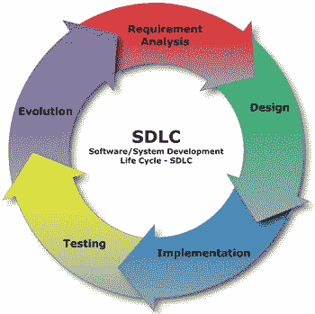

# SDLC 面试的前 27 个问题与解答

> 原文： [https://www.guru99.com/sdlc-interview-questions.html](https://www.guru99.com/sdlc-interview-questions.html)

[下载 PDF](https://www.guru99.com/pdf/sdlc-interview-questions.pdf)

**1）什么是 SDLC？**

SDLC 是软件开发生命周期的缩写。 SDLC 是一系列步骤，为应用程序的开发和生命周期管理提供了定义的模型。

**2）命名 SDLC** 中使用的五个模型

*   瀑布模型
*   快速应用开发（RAD）模型
*   敏捷模型
*   迭代模型
*   螺旋模型

**3）解释瀑布模型**的阶段

瀑布模型的五个主要阶段是：

*   需求收集
*   设计
*   发展历程
*   测试中
*   实施&维护

**4）陈述设计阶段的重要性？**

要求以文件的形式指定。 然后将其转换为需要以特定编程语言实现的逻辑结构。 设计阶段对于指定硬件&系统要求也很有帮助。 它还允许定义完整的系统架构。 输出旨在记录文档，以作为所有后续 SDLC 阶段的输入。

**5）在编码阶段执行哪些任务？**

在编码阶段，设计文档将转换为可执行的编程语言。 编码阶段的输出是源代码，可以充当测试和维护阶段的输入。

**6）什么是可行性研究？**

可行性可以评估任何组织对软件项目开发的可行性。 软件分析师会进行完整的研究，以了解任何项目的运营，经济和技术可行性。

**7）三坐标测量机的成熟度是多少？**

能力成熟度模型是用于分析组织软件开发过程的成熟度的基准。 这是一种用于完善公司的软件开发流程的技术。 它正在根据其关键流程领域按照五个不同级别的级别评估任何公司。 它根据公司正在处理的项目和客户来说明公司的成熟度。

初始，管理，定义，定量管理和优化是确定任何公司 CMM 级别的五个级别。

**8）使用 V 模型有一些好处吗？**

*   简单易用。
*   每个阶段都有特定的
*   由于测试计划的早期开发，V 模型更为成功。 这减少了错误修复的成本
*   对需求小的小型项目最有效

**9）什么是项目的“范围”？**

项目的范围不过是项目的目标，目的和期望。 软件范围是一个定义明确的边界，其中包括开发和交付软件产品所执行的所有过程。 软件范围包括要交付给软件系统的所有功能和工件。 软件范围还有助于识别系统将执行的操作和将不会执行的操作。

**10）据您介绍，什么时候应该培训用户使用新系统？**

在实施阶段

**11）命名监视新系统性能的阶段？**

在升级和维护阶段，系统会受到持续监控。

**12）什么是基于计算机的信息系统？**

它是计算机在其中执行某些过程的系统。

**13）说明有关 SDLC 的低级或详细设计**

在低级设计中，高级设计分为模块和程序。 逻辑设计是针对每个程序开发的，并将作为程序规范进行记录。

**14）JAD 会话的用途是什么？**

JAD（联合应用程序设计）会话用于获取有关系统的数据和信息

15）陈述 SDLC 和 Stlc 之间的区别

SDLC 涉及项目的完整验证。 SDLC 阶段需要业务需求分析，设计，开发过程，测试过程和维护。

而 STLC 仅涉及验证。

**16）参与瀑布模型**阶段的人员是谁

瀑布模型中涉及的人员取决于组织的结构。 这里是通常参与其中的专业人员

*   业务分析师
*   技术经理或高级开发人员
*   设计阶段的技术主管或系统架构师
*   开发人员处于编码阶段。
*   测试人员处于测试阶段。
*   维护阶段的项目经理和维护团队

**17）什么是 0 级 DFD？**

最高抽象级别称为 0 级 DFD（数据流程图）。 它也称为上下文级别 DFD。 它以一张图表的形式给出了整个信息系统的规范，其中包含有关该系统的所有详细信息。

**18）说明有关 SDLC** 的团队需求收集

需求收集是 SDLC 的重要阶段。 在此阶段，收集业务需求。 在此阶段，还将分析项目的进度和成本。

19）简要说明测试阶段

采取了不同的测试方法来检测软件错误，这些错误在前几个阶段就已诞生。 如今，有许多类型的测试工具和可用的方法。 很少有冷杉正在构建其测试工具，这些工具是根据需要或其组织定制的。

**20）瀑布模型面临哪些问题？**

瀑布模型面临的一些常见问题是

*   瀑布模型不适用于要求不明确的复杂项目
*   完成每个阶段都需要很多时间
*   有些错误在此模型中从未纠正

**21）现有系统的细节研究称为什么？**

现有系统的详细研究称为系统分析

**22）原型设计的主要目的是什么？**

原型提供拟议系统的微型模型

**23）SDLC 项目的哪一步可以提前终止？**

在 SDLC 流程中，可以在可行性研究阶段中止项目的终止。

**24）据您介绍，系统生命周期中哪个阶段是最具创造力和挑战性的阶段？**

设计是 SDLC 生命周期中最具挑战性的阶段之一。

**25）列出节省成本和额外利润将超过所需投资的可行性类型。**

这被称为经济可行性

**26）错误修复程序还可以包括软件维护吗？**

是的，错误修复阶段还包括软件维护

**27）在 SDCL 生命周期的哪个阶段中，纠错的成本最少？**

在需求分析的早期阶段，纠错的成本要少得多。