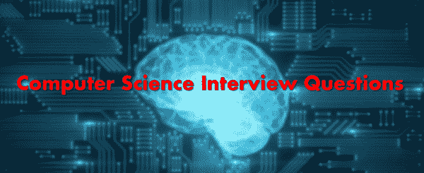

# 前 40 名计算机科学面试问答

> 原文： [https://www.guru99.com/computer-science-interview-questions.html](https://www.guru99.com/computer-science-interview-questions.html)

这是计算机科学的面试问题，适合新手和有经验的应聘者，以帮助您获得理想的工作。

**1）什么是计算机系统？**

计算机系统是内存，CPU，与其连接的外围设备和 OS（操作系统）的组合。

**2）列出计算机系统的组件**

计算机系统的组件为：

*   包括控制单元和算术逻辑单元的 CPU（中央处理单元）
*   像主内存和次内存
*   输入和输出设备，如键盘鼠标，打印机扫描仪等

**3）什么是微处理器？**

微处理器是一种集成电路，具有 PC 中央处理单元的所有功能。

**4）列出一些计算机处理器**

计算机处理器为：1）Intel Core i9、2）Intel Core i5、3）Intel Core i7、4）AMD Ryzen 7 和 5）AMD Ryzen 5。

**5）列出一些流行的操作系统**

一些流行的操作系统是 Microsoft Windows，OSX 和 Linux。

**6）什么是超一流？**

超级类是所有类的基础。 其余类的对象具有与超类有关的所有特征。

**7）解释类变量**

变量代表类的内存，它与每个实例共享。

**8）什么是 SDLC？**

SDLC 代表软件开发生命周期，该过程可以在更短的时间内生产出高质量的软件产品。 SDLC 涉及的阶段包括：1）规划，2）设计，4）施工，5）测试和 6）部署。

**9）解释文件的含义。**

文件是一个永久存储信息或数据的命名位置。 它始终使用具有主名和副名的文件名存储在存储设备中，该文件名以“。”（DOT）分隔。

**10）什么是编程语言？**

编程语言是语法规则的集合，用于向计算机或计算设备提供指令以执行实现任务。

**11）什么是集成开发环境？**

IDE 是基于 GUI 的软件程序。 它旨在帮助程序员使用所有需要的程序和库来构建应用程序。

**12）解释框架**

该框架是用于制作软件应用程序的平台。 它提供了开发人员可以为特定平台构建程序的基础。 例如，框架可以包括预定的类以及功能。 它可用于处理输入，管理硬件以及与系统软件进行交互。

**13）什么是接口？**

接口类似于 Java 中的类，但是它是抽象方法的集合。 一个类可以具有多个接口。

**14）什么是课程？**

类是用于创建对象的蓝图。 一个类包含作为类实例的方法和变量。

**15）区分构造函数和方法抽象类和接口**

类和接口之间的区别是：

| **抽象类** | **接口** |
| 抽象类不支持继承。 | 该接口支持多种继承。 |
| 抽象类将包含构造函数。 | 接口不包含构造函数。 |
| 抽象类使用“ Abstract”关键字声明。 | 该接口使用“ interface”关键字声明。 |
| 它可以与所有访问修饰符一起使用。 | 它只能与公共访问修饰符一起使用。 |

**16）什么是抽象类？**

具有抽象关键字的类称为抽象类。

**17）什么是数组？**

数组是保存特定数量的相似数据类型的容器。

**18）什么是构造函数？**

构造函数是一种用于创建类对象的方法。

**19）定义 Cin 和 Cout**

Cin 和 Cout 分别是用于输入和输出文件的对象。

**20）C 和 C ++有什么区别？**

C 和 C ++之间的区别是：

| **C** | **C ++** |
| 这是一种面向过程的语言。 | 它是一种面向对象的编程语言。 |
| C 语言遵循自顶向下编程方法 | C ++遵循自下而上的编程方法。 |
| C 程序的文件扩展名为.c | c ++程序语言的文件扩展名是.cpp |
| 在 C 编程语言中，大型程序代码被分成小段，这称为函数。 | 在 C ++编程语言中，大型程序代码分为对象和类。 |
| C 语言中的结构不提供函数声明的功能。 | C ++中的结构提供了将函数声明为结构的成员函数的功能。 |

**21）列出构造函数的类型**

构造函数有两种类型：1）参数化构造函数和 2）默认构造函数。

**22）什么是人工智能？**

人工智能或机器智能是一个通用术语，用于构建能够执行任务的智能机器。 AI 的主要目的是以更好，更快的方式解决问题。

**23）什么是机器学习？**

机器学习是一种可以通过自我完善从优秀示例中学习而无需程序员明确编写代码的系统。

**24）什么是深度学习？**

深度学习是模仿大脑神经元网络的计算机软件。 它是机器学习的子集，被称为深度学习，因为它利用了深度神经网络。

**25）列出不同的 OOPS 原则？**

OOPS 的基本原理是：1）封装，2）抽象，3）继承和 4）多态。

**26）解释各种类型的访问修饰符**

访问修饰符有四种类型：

*   **私有：**对特定班级可见
*   **公开：**全世界可见
*   **受保护的**：对特定的包装和子类可见

**27）编译器和解释器有什么区别？**

编译器和解释器之间的区别是**：**

| **编译器** | **译员** |
| 编译后的代码运行速度更快。 | 解释的代码运行速度较慢。 |
| 生成输出程序（以 exe 形式），可以独立于原始程序运行。 | 不生成输出程序。 因此，程序员在执行过程中每次都会评估源程序。 |
| 目标程序独立执行，并且不需要内存中的编译器。 | 在解释过程中，解释器存在于内存中。 |
| 由于编译器无法预测转换时发生的情况，因此难以实施。 | 它最适合于程序和开发环境。 |
| 它需要整个程序作为输入。 | 它以单行编码作为输入。 |
| 编译后同时显示所有错误。 | 逐行显示每一行的所有错误。 |

**28）什么是编程语言？**

编程语言是语法规则的集合，用于指示计算机或计算设备执行任务。

**29）什么是继承？**

继承是一种面向对象的编程概念，其中一个类派生了其余类的属性。

**30）区分构造函数和方法**

构造函数和方法之间的区别是：

| **构造函数** | **方法** |
| 构造函数用于初始化任何类的实例。 | 方法用于执行某些操作或功能。 |
| 没有任何返回类型 | 它具有返回类型。 |
| 构造函数名称必须与类名称相同。 | 方法的名称可以根据需要相同或不同。 |
| 创建类对象时，它将自动调用。 | 您需要显式调用该方法。 |
| 编译器提供了一个默认的构造函数。 | 编译器没有提供任何方法。 |

**31）什么是再见流？**

字节流最通常用于执行具有 8 位 Unicode 的输入和输出。

**32）析构函数是什么意思？**

析构函数是删除或破坏对象的类成员函数。

**33）列出 OSI 模型**的层

OSI 模型的层为：1）物理，2）应用，3）表示，4）会话，5）传输，6）网络和 6）数据链路层。

**34）进程和线程之间的主要区别是什么？**

进程被称为正在执行的程序。 线程是进程的一部分，因此； 一个进程可以有多个线程。

**35）解释主存储器**

主内存 RAM 是计算机的主内存，可以由中央处理器（CPU）直接访问。 它存储临时信息，直到该过程完成执行。

**36）什么是互联网？**

互联网是计算机的全球网络，可提供广泛的信息和通信功能。 它涉及使用通信协议的互连网络。

**37）什么是万维网（WWW）？**

WWW 或万维网是一种使用 Internet 媒体访问信息的方法。

**38）什么是算法？**

算法是解决特定问题所必须遵循的规则或分步过程。

**39）什么是操作系统？**

操作系统（OS）是一种软件，可以充当最终用户和计算机硬件之间的接口。 每台计算机必须至少具有一个 OS 才能运行其他程序。

**40）什么是密码学？**

密码学是对隐藏信息真正含义的技术的研究。 它将信息转换为人类无法读取的格式，反之亦然。