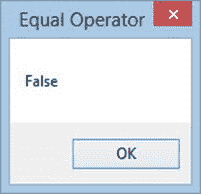

# VBA 比较运算符：不等于，小于或等于，大于

> 原文： [https://www.guru99.com/vba-comparison-operators.html](https://www.guru99.com/vba-comparison-operators.html)

## VBA 比较运算符

These are operators that are used to compare values. Comparison operators include equal to, less than, greater than and not equal to

下表显示了 VBA 比较运算符。

比较运算符用于比较值以进行验证。 假设您正在开发一个简单的销售点应用程序。 在此应用程序中，您要在发布之前验证输入的值。 在这种情况下，可以使用比较运算符。 该操作员将核对负数，或确保所支付的金额不超过账单金额。 在这种情况下，比较运算符会派上用场。

| **S / N** | **运算符** | **说明** | **范例** | **输出** |
| 1 | = | 相等：检查两个值是否相等。 它也用作赋值运算符 | 如果 x = z | 如果它们相等则返回 true，否则返回 false |
| 2 | < | 小于：此运算符用于减去数字 | 如果 x < z 则 | 如果 x 小于 z，则返回 true，否则返回 false |
| 3 | > | 大于：此运算符用于将数字相乘 | 如果 x > z 则 | 如果 x 大于 z，则返回 true，否则返回 false |
| 4 | < > | 不等于：此运算符用于除数 | 如果 x < > z | 如果它们不相等，则返回 true，否则返回 false |
| 5 | < = | 小于或等于： | 如果 x < = z | 如果 x 小于或等于 z，则返回 true，否则返回 false |
| 6 | > = | 大于或等于： | 如果 x > =则 | Returns true if x is greater than z, else it returns false |

### 示例源代码

平等比较算子

```
    If 2 = 1 Then
            MsgBox "True", vbOKOnly, "Equal Operator"
        Else
            MsgBox "False", vbOKOnly, "Equal Operator"
    End If

```

**此处，**

*   **“如果 2 = 1 则…否则…结束 If”** 使用 if 语句评估条件“ 2 = 1”
*   **“ MsgBox…”** 是显示消息框的内置功能。
    *   第一个参数“ True”或“ False”将显示在消息框中。 在我们的示例中，2 不等于 1，因此，它将在 msg 框中显示“ false”。
    *   第二个参数“ vbOKOnly”是消息框中显示的按钮
    *   第三个参数“等于运算符”是消息框的标题。

执行以上代码可获得以下结果



[下载上面的 Excel 代码](https://drive.google.com/uc?export=download&id=0BwL5un1OyjsdUF9sOGtqbVItZVU)