# Microsoft Excel 101 简介

> 原文： [https://www.guru99.com/introduction-to-microsoft-excel.html](https://www.guru99.com/introduction-to-microsoft-excel.html)

## 什么是 Microsoft Excel？

Microsoft Excel 是一个电子表格程序，用于记录和分析数值数据。 将电子表格想像成构成表格的列和行的集合。 字母通常分配给列，数字通常分配给行。 列和行相交的点称为像元。 单元格的地址由代表列的字母和代表行的数字给出。 让我们使用下图说明这一点。

**为什么要学习 Microsoft Excel？**

我们都以一种或另一种方式处理数字。 我们每个人都有日常支出，我们需要从所赚取的每月收入中支付费用。 为了使人明智地消费，他们将需要知道他们的收入与支出。 当我们想要记录，分析和存储此类数字数据时，Microsoft Excel 会派上用场。

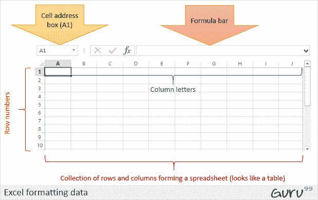

**在哪里可以获取 Microsoft Excel？**

您可以通过多种方式获得 Microsoft Excel。 您可以从也出售软件的硬件计算机商店购买它。 Microsoft Excel 是 Microsoft Office 程序套件的一部分。 或者，您可以从 Microsoft 网站下载它，但是您必须购买许可证密钥。

在本教程中，我们将涵盖以下主题。

*   [如何打开 Microsoft Excel？](#1)
*   [了解功能区](#2)
*   [了解工作表](#3)
*   [自定义 Microsoft Excel 环境](#4)
*   [重要的 Excel 快捷键](#5)

## 如何打开 Microsoft Excel？

运行 Excel 与运行任何其他 Windows 程序没有什么不同。 如果您正在使用 GUI（例如 Windows XP，Vista 和 7）运行 Windows，请执行以下步骤。

*   点击开始菜单
*   指向所有程序
*   指向 Microsoft Excel
*   点击 Microsoft Excel

或者，您也可以从开始菜单中打开它（如果已在其中添加）。 如果已创建，也可以从桌面快捷方式打开它。

对于本教程，我们将使用 Windows 8.1 和 Microsoft Excel2013。请按照以下步骤在 Windows 8.1 上运行 Excel

*   点击开始菜单
*   搜索 Excel N.B. 甚至在您输入之前，所有以您输入的内容开始的程序都会被列出。
*   点击 Microsoft Excel

下图显示了如何执行此操作

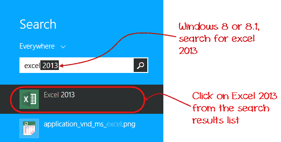

## 了解功能区

功能区提供了 Excel 中命令的快捷方式。 命令是用户执行的动作。 命令的示例是创建新文档，打印文档等。下图显示了 Excel 2013 中使用的功能区。

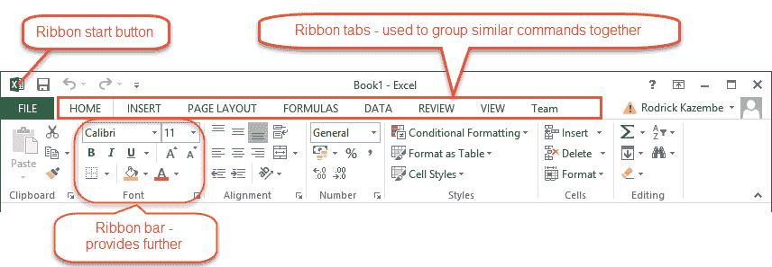

### 碳带组件说明

**功能区启动按钮**-用于访问命令，即创建新文档，保存现有工作，打印，访问用于自定义 Excel 的选项等。

**功能区选项卡** –这些选项卡用于将相似的命令组合在一起。 主页选项卡用于基本命令，例如格式化数据以使其更易于显示，在电子表格中排序和查找特定数据。

**功能区栏** –这些条用于将相似的命令组合在一起。 例如，对齐功能区栏用于将所有用于对齐数据的命令分组。

## 了解工作表（行和列，工作表，工作簿）

**工作表是行和列**的集合。 当行和列相遇时，它们形成一个单元。 单元用于记录数据。 使用单元地址唯一标识每个单元。 列通常用字母标记，而行通常是数字。

**工作簿是工作表**的集合。 默认情况下，工作簿在 Excel 中具有三个单元格。 您可以删除或添加更多表格以适合您的要求。 默认情况下，工作表命名为 Sheet1，Sheet2，依此类推。 您可以将工作表名称重命名为更有意义的名称，例如每日费用，每月预算等。

## 自定义 Microsoft Excel 环境

我个人喜欢黑色，所以我的 excel 主题看起来有点黑。 您最喜欢的颜色可能是蓝色，您也可以使主题颜色看起来像蓝色。 如果您不是程序员，则可能不想包含功能区标签，即开发人员。 所有这些都可以通过定制实现。 在本小节中，我们将研究；

*   定制功能区
*   设置颜色主题
*   公式设置
*   打样设定
*   保存设置

### 色带的定制

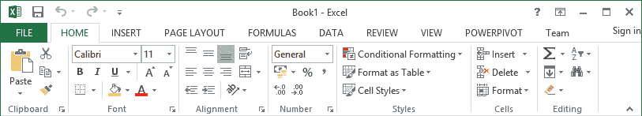

上图显示了 Excel 2013 中的默认功能区。让我们从自定义功能区开始，假设您不希望看到功能区上的某些选项卡，或者想添加一些缺少的选项卡（例如开发人员选项卡）。 您可以使用选项窗口来实现。

*   单击功能区开始按钮
*   从下拉菜单中选择选项。 您应该能够看到“ Excel 选项”对话框窗口
*   从左侧面板中选择“自定义功能区”选项，如下所示

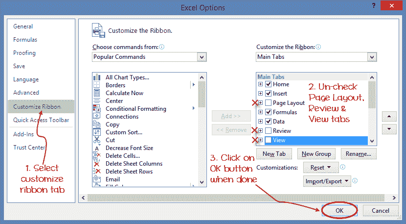

*   在右侧，从不想在功能区上看到的选项卡中删除复选标记。 在此示例中，我们删除了“页面布局”，“审阅”和“查看”选项卡。
*   完成后，单击“确定”按钮。

您的功能区将如下所示

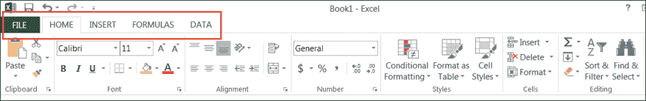

### 将自定义选项卡添加到功能区

您还可以添加自己的选项卡，为其指定一个自定义名称并为其分配命令。 让我们在功能区中添加带有文本 Guru99 的选项卡

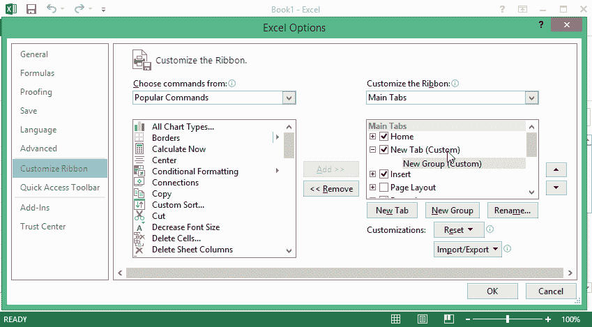

1.  右键单击功能区，然后选择“自定义功能区”。 出现上面显示的对话窗口
2.  单击新选项卡按钮，如下面的动画图像所示。
3.  选择新创建的标签
4.  单击重命名按钮
5.  给它起一个名字 Guru99
6.  选择 Guru99 标签下的 New Group（Custom），如下图所示。
7.  单击重命名按钮，并为其命名我的命令
8.  现在将命令添加到功能区栏中
9.  命令在中间面板上列出
10.  选择所有图表类型命令，然后单击添加按钮
11.  点击确定

Your ribbon will look as follows

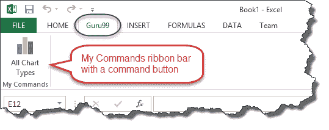

### 设置颜色主题

要为 Excel 工作表设置颜色主题，您必须转到 Excel 功能区，然后单击àFileàOption 命令。 它将打开一个窗口，您必须在其中执行以下步骤。

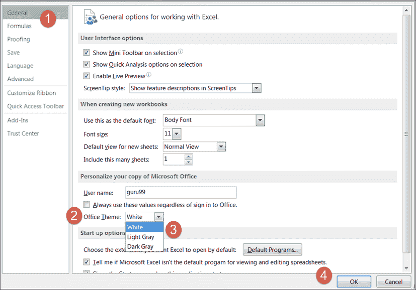

1.  默认情况下，将选择左侧面板上的常规选项卡。
2.  在常规选项下查找用于 Excel 的配色方案
3.  单击配色方案下拉列表，然后选择所需的颜色
4.  点击确定按钮

### 公式设置

**此选项允许您定义使用公式**时 Excel 的行为。 您可以使用它来设置选项，即在输入公式时自动完成，更改单元格引用样式以及为列和行以及其他选项使用数字。

如果要激活选项，请单击其复选框。 如果要停用选项，请从复选框中删除标记。 您可以从左侧面板“公式”标签下的“选项”对话框窗口中选择此选项

### 打样设定

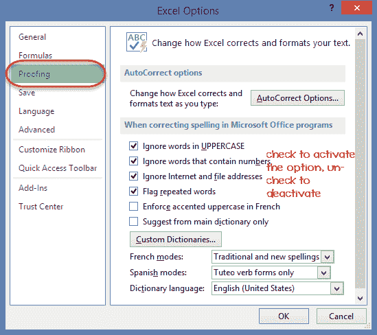

**此选项操作输入到 excel** 中的输入文本。 它允许设置选项，例如检查拼写错误时应使用的字典语言，字典中的建议等。您可以从左侧面板校对选项卡下的选项对话框窗口中选择此选项。

### 保存设置

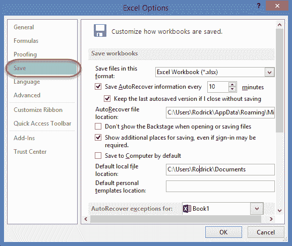

**此选项允许您在保存文件时定义默认文件格式，启用自动恢复以防万一您的计算机在保存工作之前关闭，等等**。 您可以在左侧面板“保存”标签下的“选项”对话框窗口中使用此选项

## 重要的 Excel 快捷方式

<colgroup><col style="width: 102px;"><col style="width: 522px;"></colgroup>
| **Ctrl + P** | 用于打开打印对话窗口 |
| **Ctrl + N** | 创建一个新的工作簿 |
| **Ctrl + S** | 保存当前工作簿 |
| **Ctrl + C** | 复制当前选择的内容 |
| **Ctrl + V** | 从剪贴板粘贴数据 |
| **SHIFT + F3** | 显示功能插入对话框窗口 |
| **SHIFT + F11** | 创建一个新的工作表 |
| **F2** | 检查公式和覆盖的单元格范围 |

## 使用 Microsoft Excel 的最佳做法

1.  保存工作簿时要考虑向后兼容性。 如果您未在更高版本的 Excel 中使用最新功能，则应以 2003 * .xls 格式保存文件，以便向后兼容
2.  **在工作簿**中为列和工作表使用描述名称
3.  **避免使用包含多个变量**的复杂公式。 尝试将它们分解为小的托管结果，您可以使用这些结果作为基础
4.  **尽可能使用内置函数代替编写自己的公式**

## 摘要

*   Microsoft Excel 是一个功能强大的电子表格程序，用于记录，操作，存储数字数据，并且可以对其进行自定义以匹配您的首选项
*   功能区用于访问 Excel 中的各种命令
*   选项对话框窗口允许您自定义许多项目，即功能区，公式，校对，保存等。