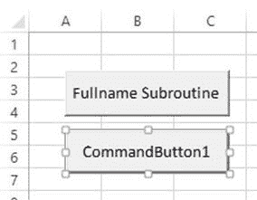
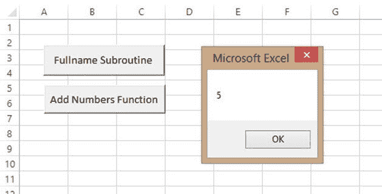

# Excel VBA 函数教程：返回，调用，示例

> 原文： [https://www.guru99.com/vba-function.html](https://www.guru99.com/vba-function.html)

## 什么是功能？

函数是一段执行特定任务并返回结果的代码。 函数主要用于执行重复性任务，例如格式化输出数据，执行计算等。

假设您正在开发一个计算贷款利息的程序。 您可以创建一个接受贷款金额和投资回收期的函数。 然后，该函数可以使用贷款金额和投资回收期来计算利息并返回值。

**为什么使用功能**

使用函数的优点与上一节中为何使用子例程的优点相同。

**命名功能规则**

命名规则的功能与上述子程序命名规则中的规则相同。

#### 宣告功能的 VBA 语法

```
Private Function myFunction (ByVal arg1 As Integer, ByVal arg2 As Integer)
    myFunction = arg1 + arg2
End Function

```

**此处为语法**

| **代码** | **动作** |
| 

*   “私有函数 myFunction（…）”

 | 

*   此处，关键字“ Function”用于声明名为“ myFunction”的函数并启动该函数的主体。
*   关键字“ Private”用于指定功能范围

 |
| 

*   “ ByVal arg1 作为整数，ByVal arg2 作为整数”

 | 

*   声明了两个整数数据类型的参数，分别为“ arg1”和“ arg2”。

 |
| 

*   myFunction = arg1 + arg2

 | 

*   计算表达式 arg1 + arg2 并将结果分配给函数名称。

 |
| 

*   “结束功能”

 | 

*   “ End Sub”用于结束函数

的主体 |

**函数通过示例演示**：

函数与子例程非常相似。 子例程和函数之间的主要区别在于，函数在调用时会返回一个值。 虽然子例程不返回值，但是在调用它时。 假设您想将两个数字相加。 您可以创建一个接受两个数字并返回数字总和的函数。

1.  创建用户界面
2.  添加功能
3.  为命令按钮编写代码
4.  测试代码

**步骤 1）**用户界面

将命令按钮添加到工作表，如下所示



将 CommanButton1 的以下属性设置为以下属性。

| **S / N** | **控件** | **属性** | **值** |
| 1 | CommandButton1 | Name | btnAddNumbers |
| 2 |  | 标题 | 加号功能 |

您的界面现在应如下所示


**步骤 2）**功能代码。

1.  按 Alt + F11 打开代码窗口
2.  添加以下代码

```
Private Function addNumbers(ByVal firstNumber As Integer, ByVal secondNumber As Integer)
    addNumbers = firstNumber + secondNumber
End Function

```

代码中的

| **代码** | **动作** |
| 

*   “私有函数 addNumbers（…）”

 | 

*   它声明一个接受两个整数参数的私有函数“ addNumbers”。

 |
| 

*   “将 ByVal firstNumber 作为整数，将 ByVal secondNumber 作为整数”

 | 

*   声明两个参数变量 firstNumber 和 secondNumber

 |
| 

*   “ addNumbers = firstNumber + secondNumber”

 | 

*   它将 firstNumber 和 secondNumber 值相加，并将和分配给 addNumbers。

 |

**步骤 3）编写调用函数**的代码

1.  右键单击 btnAddNumbers_Click 命令按钮
2.  选择查看代码
3.  添加以下代码

```
Private Sub btnAddNumbersFunction_Click()
    MsgBox addNumbers(2, 3)
End Sub
```

**HERE in the code,**

| **Code** | **Action** |
| **“ MsgBox addNumbers（2,3）”** | 

*   它调用函数 addNumbers 并传入 2 和 3 作为参数。 该函数返回两个数字之和五（5）

 |

**步骤 4）**运行程序，您将获得以下结果



下载包含以上代码的 Excel

[下载上面的 Excel 代码](https://drive.google.com/uc?export=download&id=0BwL5un1OyjsdTVowTXJTYXJ6Vkk)

**摘要**：

*   函数是执行特定任务的一段代码。 函数在执行后返回一个值。
*   子例程和函数均提供代码可重用性
*   子例程和函数都有助于将大块代码分解为可管理的小代码。