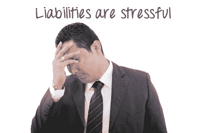

# 会计中的资产&负债是什么？ 定义&示例

> 原文： [https://www.guru99.com/assets-and-liabilities.html](https://www.guru99.com/assets-and-liabilities.html)

“资产”和“负债”这两个词在会计/簿记中是两个很常见的词。

有人只是说资产是您拥有的东西，负债是您欠的东西。 换句话说，资产是好的，负债是坏的。 没错，但是还不止如此。 让我们看一个完整的定义。

## 什么是会计资产？

资产被定义为有助于在您的业务中产生利润的资源。 您对此有一些控制权。

要制作著名的奶油蛋糕，您需要烤箱。 这两件事是**资产的示例。**

要成为资产，它必须满足三个要求：

*   这是您可以控制的
*   由于过去的事件，您可以控制
*   有未来的经济利益

现在，假设您获得 10,000 美元的贷款后，出去买了一个新烤箱。 但不仅仅是任何烤箱。 您购买了最新最好的型号。 您购买了 Bakemaster X Series 3000。

让我们看看您的新 Bakemaster 是否符合资产要求。

**您有控制权吗？**

您为此付费了吗？ 您可以保留它，可以出售它，甚至可以在其中烘烤鞋子！ 是的，它在*中。*

**由于过去的事件？**

在这种情况下，去商店交出现金将构成过去的*事件。*

**有未来的经济利益吗？**

使用新的 Bakemaster，您将要烘焙一些严重的奶油蛋糕，客户将为此付出高昂的代价。 这绝对是*的未来经济利益。*

**因为您的新烤箱满足三个要求，所以这是一项资产。**

现在让我们看一个示例，其中某些内容可能不符合资产的定义。

### 例

一位顾客打电话给您的商店，说他对您的蛋糕有个梦想。 他说，他明天要来您的面包店，花 1000 美元在他能找到的每种柠檬水奶油口味的零食上。

**您认为$ 1,000 应该作为资产记录在您的记录中。**

让我们看看它是否适合资产的定义。

**您有控制权吗？**

抱歉，您还没有那 1000 美元。 您不能花钱。 您甚至无法触摸它！ *不在您的控制范围内。*

**由于过去的事件？**

您需要控制这些现金的事件将是他进场并交给您时。 还没有发生！ 因此，在这种情况下，*没有事件发生。*

**Has a future economic benefit?**

1,000 美元可以买很多东西。 当然，它具有未来的经济利益。

**对不起，这次您只有 3 分之一。** $ 1,000 拥有未来的利益，但是您无法控制这笔钱，过去尚未发生过要获得控制的事件。

因此，$ 1,000 的**不是资产。**

### 另一个例子：

您的朋友让您借用他的汽车作为送货车。 但是，有一天晚上，路很滑，司机撞到了树上。 汽车已完全损坏，无法再行驶。 让我们看看汽车是否是一种资产：

**Something you have control over?**

汽车不属于你。 它是由朋友借给您的，并且您没有签订租约或合同来授予您使用该车的任何权利。 因此，*不受您控制。*

**As a result of a past event?**

获得汽车控制权所需的事件是您签署协议并支付购买或租赁汽车的费用。 抱歉，*尚未发生这样的事件。*

**Has a future economic benefit?**

汽车完全损坏，无法驾驶。 *不会为任何人带来未来的经济利益。*

抱歉，这次您的赔率为 3。汽车不是资产。

希望这能使您对资产以及何时识别资产有所了解。 但是负债呢？

让我们来看看。

## 什么是会计责任？

责任定义为您的企业需要履行的义务。 简而言之，责任就是信用。

负债需要三件事：

*   向企业提出义务
*   义务是过去事件的结果
*   履行义务将需要宝贵的资源外流

还记得安妮决定给你那笔贷款吗？ 好吧，在您走出银行之前，她对您说：“您需要每月支付$ 1,000，直到全部$ 10,000 都还清为止！”

让我们看看安妮的贷款是否符合负债的定义。

**向企业提出义务？**

你拿了钱 现在您需要偿还！ 提出*义务*。

**由于过去的事件？**

您签署了贷款协议。 该义务来自此*过去的事件。*

**是否需要流出宝贵的资源？**

偿还贷款需要资金流出。 金钱是宝贵的！ 当然，这是*宝贵资源的流出。*

**宾果游戏！ 该笔贷款符合所有要求，因此我们会将其记录为负债。**

### 例

您商店的水槽漏水了。 您的一位工作人员看了一眼，告诉您，您肯定需要一名水管工来修理它，这将花费您 200 美元左右。 您想在记录中列出这 200 美元作为负债。

让我们看看$ 200 美元是否符合负债的定义。

**向企业提出义务？**

在此阶段，您没有义务向任何人付款。 漏水槽只是一个不便，您可以选择修复或不修复。 因此，该业务没有义务...。

**As a result of past events?**

您需要给水管工打电话并收到 200 美元的发票，然后才能确认任何责任。 此事件尚未发生！

**Requires an outflow of valuable resources?**

由于目前尚无偿付任何人的义务，因此不应期望资源外流。

幸运的是，这 200 美元不符合赔偿责任的要求。 您可以将其保留在记录之外！

## 活动：

想一想你一生中拥有的东西。 也许您驾驶法拉利，或者只是骑自行车。 也许您拥有豪宅，或者您住在潜水艇的海底。 无论哪种方式，您都可能需要抵押。 在这种情况下，您的法拉利将是**资产**的示例，而您的抵押则是**负债。** 使用下面的工作表，并列出您在企业或个人生活中拥有的至少 3 种资产和 3 种负债。 使用清单来确保它们符合资产的定义。

**资产互动**

Enter name of asset: <input class="Assets" name="Assets" size="25" type="text">
Is under your control?<input class="eb" name="eb" type="checkbox" value="1">Yes <input class="ebno" name="ebno" type="checkbox" value="11">NoDo you own as a result of past event ?<input class="ebdiv" name="ebdiv" type="checkbox" value="2">Yes<input class="ebdivno" name="ebdivno" type="checkbox" value="22">NoWill provide a future economic benifits?<input class="ebdivnext" name="ebdivnext" type="checkbox" value="3">Yes<input class="ebdivnextno" name="ebdivnextno" type="checkbox" value="33">NoSorry! is not an Asset.Congratulation! is an Asset

**责任交互**

Enter name of LIABILITY: <input class="Assets" name="Assets" size="25" type="text">
Does impose a present obligation?<input class="eb" name="eb" type="checkbox" value="1">Yes <input class="ebno" name="ebno" type="checkbox" value="11">NoDo you owe as a result of past event ?<input class="ebdiv" name="ebdiv" type="checkbox" value="2">Yes<input class="ebdivno" name="ebdivno" type="checkbox" value="22">NoWill result in outflows of resources that have economic value?<input class="ebdivnext" name="ebdivnext" type="checkbox" value="3">Yes<input class="ebdivnextno" name="ebdivnextno" type="checkbox" value="33">NoHi,Sorry! is not an LIABILITY.Congratulation! is an LIABILITY

**。以下是您遇到的日常事物的列表。 将它们分类为资产，负债或可能都不分类为**

|  | 资产 | 责任 | 都没有 | 状态 |
| 

1.  银行

 | 

1.  [ ] 

 | 

1.  [ ] 

 | 

1.  [ ] 

 | 正确。对不起，不正确。 |
| 

1.  贷款

 | 

1.  [ ] 

 | 

1.  [ ] 

 | 

1.  [ ] 

 | 正确。对不起，不正确。 |
| 

1.  建筑

 | 

1.  [ ] 

 | 

1.  [ ] 

 | 

1.  [ ] 

 | 正确。对不起，不正确。 |
| 

1.  租用家具

 | 

1.  [ ] 

 | 

1.  [ ] 

 | 

1.  [ ] 

 | 正确。对不起，不正确。 |
| 

1.  出租物业

 | 

1.  [ ] 

 | 

1.  [ ] 

 | 

1.  [ ] 

 | 正确。对不起，不正确。 |
| 

1.  抵押

 | 

1.  [ ] 

 | 

1.  [ ] 

 | 

1.  [ ] 

 | 正确。对不起，不正确。 |
| 

1.  汽车

 | 

1.  [ ] 

 | 

1.  [ ] 

 | 

1.  [ ] 

 | 正确。对不起，不正确。 |
| 

1.  律师费

 | 

1.  [ ] 

 | 

1.  [ ] 

 | 

1.  [ ] 

 | 正确。对不起，不正确。 |
| 

1.  银行帐户

 | 

1.  [ ] 

 | 

1.  [ ] 

 | 

1.  [ ] 

 | 正确。对不起，不正确。 |
| 

1.  信用卡借记卡

 | 

1.  [ ] 

 | 

1.  [ ] 

 | 

1.  [ ] 

 | 正确。对不起，不正确。 |
| 

1.  投资

 | 

1.  [ ] 

 | 

1.  [ ] 

 | 

1.  [ ] 

 | 正确。对不起，不正确。 |
| 

1.  键

 | 

1.  [ ] 

 | 

1.  [ ] 

 | 

1.  [ ] 

 | 正确。对不起，不正确。 |
| 

1.  工作

 | 

1.  [ ] 

 | 

1.  [ ] 

 | 

1.  [ ] 

 | 正确。对不起，不正确。 |
| 

1.  未付帐单

 | 

1.  [ ] 

 | 

1.  [ ] 

 | 

1.  [ ] 

 | 正确。对不起，不正确。 |
| 

1.  房子

 | 

1.  [ ] 

 | 

1.  [ ] 

 | 

1.  [ ] 

 | 正确。对不起，不正确。 |
| 

1.  雇用购买合同

 | 

1.  [ ] 

 | 

1.  [ ] 

 | 

1.  [ ] 

 | 正确。对不起，不正确。 |
| 

1.  未来法案

 | 

1.  [ ] 

 | 

1.  [ ] 

 | 

1.  [ ] 

 | 正确。对不起，不正确。 |
| 

1.  计算机

 | 

1.  [ ] 

 | 

1.  [ ] 

 | 

1.  [ ] 

 | 正确。对不起，不正确。 |
| 

1.  手机

 | 

1.  [ ] 

 | 

1.  [ ] 

 | 

1.  [ ] 

 | 正确。对不起，不正确。 |
| 

1.  过去的帐单

 | 

1.  [ ] 

 | 

1.  [ ] 

 | 

1.  [ ] 

 | 正确。对不起，不正确。 |
| 

1.  电视

 | 

1.  [ ] 

 | 

1.  [ ] 

 | 

1.  [ ] 

 | 正确。对不起，不正确。 |
| 

1.  家具

 | 

1.  [ ] 

 | 

1.  [ ] 

 | 

1.  [ ] 

 | 正确。对不起，不正确。 |