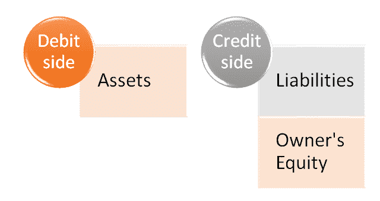
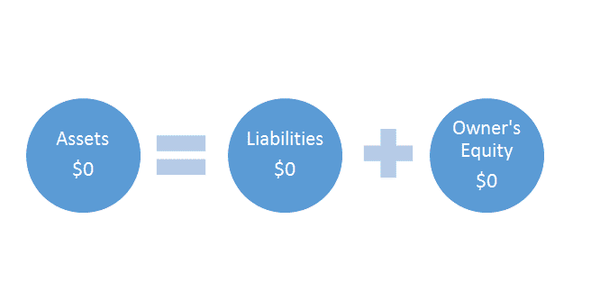
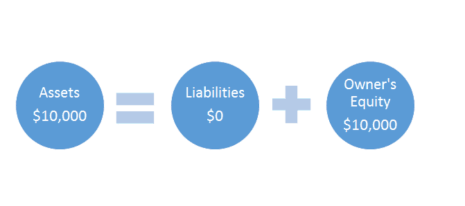
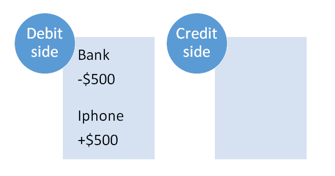

# 什么是会计等式？ 示例问题

> 原文： [https://www.guru99.com/the-accounting-equation.html](https://www.guru99.com/the-accounting-equation.html)

### 什么是会计等式？

会计等式基于双重记帐法，即每笔交易都具有借方和贷方两个方面，每笔借方都有相等和相反的贷方。 它有助于准备资产负债表，因此也称为资产负债表方程式。

会计等式为：

```
Assets = Liabilities + Owners Equity

Or

A = L + OE
```

在本教程中，您将学习-

*   [什么是所有者权益？](#1)
*   [会计等式如何工作？](#2)
*   [基本会计方程](#3)
*   [互动式问题和解决方案](#4)

在上一课中，我们已经知道“资产”和“责任”这两个词的含义。 让我们快速定义这个新术语“所有者权益”。

## 什么是所有者权益？

我们可以将**所有者权益**定义为**“您（所有者）投资于该业务的金额”。**

每当您向公司贡献任何个人资产时，所有者权益就会增加。 这些捐款可以是任何资产，例如现金，车辆或设备。 例如，如果您将价值 5,000 美元的汽车投入业务，则所有者的权益将增加 5,000 美元。 如果您将 1 万美元的积蓄投资到公司中，所有者权益将增加 10,000 美元。

同样，如果您倒闭而赚钱，所有者权益也会减少。 例如，您走进商店，从收银员那里拿出 100 美元买了一件衬衫。 由于您要倒闭$ 100，因此所有者权益会减少$ 100。

让我们看看您是否可以确定以下哪项交易会导致所有者权益发生变化：

**问题和解决方案：**对于这些事务中的每一个，我们都可以简单地使用“是”和“否”按钮。 我将在下面写下正确的答案供您编码。

**Transaction 1:**
**You invest $1,000 of your personal savings into the business.**
Change in owner’s equity? <input class="ob" type="checkbox" value="2">Yes<input class="ob" type="checkbox" value="1">No

<label id="message1">错误的</label> <label id="message2">正确的</label>

In this scenario you are investing your own personal funds into the business. Any personal investment will increase your owner’s equity.
**Transaction 2:**
**Your new oven breaks. You hire a repairman $50 to fix it.** Change in owner’s equity? <input class="obadd" type="checkbox" value="1">Yes<input class="obadd" type="checkbox" value="2">No

<label id="message4">正确</label> <label id="message5">错误</label>

Again, you are introducing a personal asset into your business and using it as a business asset. Any investment of personal assets will increase your owner’s equity.
**Transaction 3:**
**You purchase a computer for the business using the business bank account.**
Change in owner’s equity? <input class="obadd1" type="checkbox" value="1">Yes<input class="obadd1" type="checkbox" value="2">No

<label id="message7">错误的</label> <label id="message8">正确的</label>

You are not making any personal investment here. You are using business funds to purchase a business asset. Therefore there was no new investment by you. Your owner’s equity will remain unchanged.

## 会计等式如何工作？

您面包店中发生的每笔交易都将使用会计公式进行记录。

在进行下一步之前，需要记住三个非常重要的事情：

1.  左侧称为“借方”
2.  右侧称为“信用方”
3.  等式必须始终处于平衡状态。


### 等式的两侧：

**借方：**等式的左侧称为借方。 如您所见，等式的左侧由资产组成。

**信用方：**等式的右侧称为信用方。 如您所见，等式的右侧由负债和所有者权益组成。



请记住，方程式必须始终保持平衡。

注意：在本课程中，您还将注意到我们指的是不同的“帐户”。 可以将一个帐户视为相关条目的集合。 例如，与我们的贷款相关的每个条目都将记录在“贷款帐户”中。 与烤箱有关的每笔交易都将记录在“烤箱帐户”中。 可能是该主题被称为“会计”的部分原因！

## 基本核算公式

让我们看一些示例，以了解实际的会计/簿记公式。

### 交易 1

**一辈子都在奶奶厨房里做蛋糕后，您决定开一家面包店。 您用$ 10,000 的积蓄开始创业。**

现在，让我们看一下它如何适合会计等式。

**个受影响的帐户：**

您刚刚将$ 10,000 存入银行，这是一笔资产。 这在借方方面。 现在借方增加了，我们需要在贷方平衡$ 10,000。

我们知道，我们的 10,000 美元投资代表了所有者权益的增加，所有者权益将归功于信贷方面。

通过这两个条目，现在方程式已平衡。

让我们将其适合会计等式。



我们从$ 0 = $ 0 + $ 0 开始。 没有比这容易的多了！

现在有所改变。



如您所见，我们在左侧（借方）有+10,000 美元，在右侧（贷方）有+10,000 美元。 因为双方都增加了 10,000 美元，所以我们仍然处于余额中。 ！

还是不明白吗？ 不用担心，它会尽快单击。 让我们看另一个例子。

| 借方 | 信用方 |
| 银行+ $ 10,000 | 所有者权益+ $ 10,000 |

### 交易 2

**您需要一部 iPhone 才能接听所有疯狂客户的来电。 您以 500 美元的价格在 eBay 上购买了一个。**

**Accounts affected:**

还记得在第一个示例中我们将钱存入银行吗？ 好吧，这次我们将再次使用银行，只是现在我们要花钱。 这意味着我们的银行帐户（资产）将**减少**。

现在我们知道借方减少了，我们需要记录交易的第二部分，这将使方程保持平衡。

我们将创建一个名为 iPhone 的新资产帐户，因为我们需要将新手机记录为资产。 请记住，它的成本为 500 美元，所以交易的两个方面是：

银行-$ 500（借方减少）
iPhone + $ 500（借方增加）

我们的银行导致借方减少，但后来我们的新电话导致借方增加。 这意味着我们的借方最终没有任何变化，我们的方程式仍然平衡。



您可能想知道，为什么本例中的信用方没有像上一个例中那样发生变化？

请记住，信用方仅参与与负债和所有者权益相关的交易。 在此特定交易中，仅涉及资产：我们使用资产（银行）购买了另一资产（iPhone）。

我们在上面看到，所有者权益仅与所有者亲自进行的投资有关。 在此示例中，我们使用商业银行帐户购买了商业资产。 因此，所有者不参与。 如果我们使用**所有者的个人银行帐户**来购买 iPhone，那么我们所有者在信贷方面的权益就会增加。

还是不明白吗？ 让我们再举几个例子。

## 交互式问题和解决方案

认真研究每笔交易的两个方面。 记住，它需要平衡！

### 交易 3：

**问题：**是时候去购物了，但是首先，您需要一些现金。 您拜访了贷款员安妮，她给了您 10,000 美元的贷款。

**拖动&将块拖放到表中的正确位置**

| 

### 借方

 | 

### 信用方

 |
| 

### 帐户

1.  [

 | 

### 数量

1.  

 | 

### 帐户

1.  [

 | 

### 数量

1.  

 |

<input id="text1" name="text1" type="text">

### 交易 4：

**问题：**这是您的幸运日。 您刚刚赢得了$ 5,000 的彩票奖。 您决定将 5,000 美元投入该业务。

**拖动&将块拖放到表**中的正确位置

| 

### 借方

 | 

### 信用方

 |
| 

### 帐户

1.  [

 | 

### 数量

1.  

 | 

### 帐户

1.  [

 | 

### 数量

1.  

 |

<input id="text1" name="text1" type="text">

### 交易 5：

**问题：**我们不希望安妮生气。 您最好还清一些贷款。 您决定偿还$ 1,000。

| 

### Debit Side

 | 

### Credit Side

 |
| 

### 帐户

1.  [

 | 

### 数量

1.  

 | 

### 帐户

1.  [

 | 

### 数量

1.  

 |

<input id="text1" name="text1" type="text">

### 交易 6：

**问题：**您需要计算机才能开始接受互联网订单，还需要在下班后观看有趣的 Youtube 视频。 您以 1,500 美元的价格购买了一台计算机。

| 

### 借方

&#124; 

### 帐户

1.  [

 &#124; 

### 数量

1.  

 &#124;
&#124;  &#124;  &#124;

 | 

### 贷方

&#124; 

### 帐户

1.  [

 &#124; 

### 数量

1.  

 &#124;
&#124;  &#124;  &#124;

 |

<input id="text1" name="text1" type="text">

### 交易 7：

**问题：**您的烤箱被盗了！ 是时候购买新的 Bakemaster X 系列了！ 花了你$ 2,000

| 

### 借方

&#124; 

### 帐户

1.  [

 &#124; 

### 数量

1.  

 &#124;
&#124;  &#124;  &#124;

 | 

### 信用方

&#124; 

### 帐户

 &#124; 

### 金额

 &#124;
&#124;  &#124; 

1.  ，

 &#124;

 |

<input id="text1" name="text1" type="text">

记录了这七笔交易后，我们的帐户现在看起来像这样。 我们将所有资产列在借方列，并将所有负债和所有者权益列在贷方中。

快速回顾一下，看看是否可以了解数字的变化方式。

| **借方** | **贷方** |
| 银行$ 20,000 | 贷款$ 9,000 |
| 电脑$ 1,500 |  |
| 烤箱$ 2,000 | 所有者权益$ 15,000 |
| iPhone $ 500 |  |
| **余额** $ 24,000 | **Balance** $24,000 |

仍处于平衡状态。 完善！

如果您还没有弄清楚如何计算这些数字，请在下面为您逐步进行分解。

让我们以我们的银行帐户为例。

我们的银行帐户起价为$ 0。 然后发生以下情况：

| **交易** | **流动银行结余** |
| 我们投入了 10,000 美元。 | $10,000 |
| 我们在 iPhone 上花费了 500 美元。 | $9,500 |
| 我们从银行借了 10,000 美元。 | $19,500 |
| 我们又投资了 5,000 美元。 | $24,500 |
| 我们偿还了 1,000 美元的贷款。 | $23,500 |
| 我们花了 1500 美元买了一台新电脑 | $22,000 |
| 我们花了 2,000 美元买了一个新烤箱 | **$ 20,000** |

如您所见，我们添加了与银行相关的所有交易，以期末余额为$ 20,000。 这与我们为所有帐户采用的方法相同。