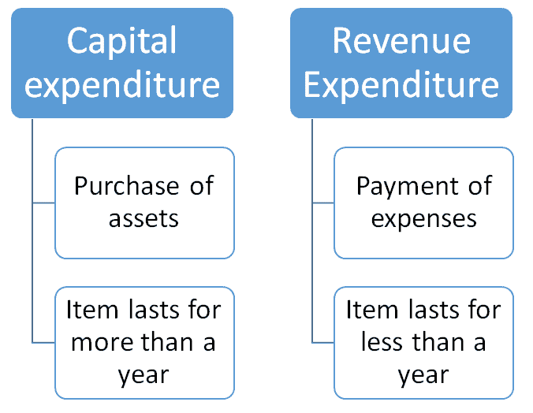

# 什么是会计中的收入，费用&提款？ [例子]

> 原文： [https://www.guru99.com/revenue-expenses-and-drawings.html](https://www.guru99.com/revenue-expenses-and-drawings.html)

在教程 2 中，我们定义了资产和负债一词。 在本教程中，我们将通过定义术语收入，支出和工程图来完成最后的定义。

在本教程中，您将学习-

*   [什么是会计收入？](#1)
*   [什么是会计费用？](#2)
*   [什么是会计图形？](#3)

## 什么是会计收入？

收入是您的企业从其正常业务活动中获得的金钱。 当那个戴着大礼帽的老人每天早上来，递给他的一块奶油蛋糕 5 美元时，这 5 美元被认为是收入。 有时，收入称为营业额。

请记住，并非您收到的所有钱都是收入。 收入是指从商品或服务的销售中获得的金钱。

考虑以下：

您的朋友简在健身房遇到一个英俊的男孩。 第二天，男孩打电话给简，并要求她约会。 但是，简没有钱买一件衣服！

简从银行借了 100 美元，这样她就可以为自己的约会买一件衣服，这笔钱要向她收取 10％的利息。

一周后，Jane 向银行偿还了$ 100 以及额外的$ 10 利息。 因此，银行收到$ 110。

110 美元中有多少是收入？

请记住，收入只是从业务活动中获得的钱。 因此，简的 100 美元付款不是来自商品或服务的销售。 首先，这只是银行贷给她的 100 美元的还款。

但是，这 10 美元的利息是作为*作为提供贷款*的服务的付款而产生的。 因此，在向银行支付的$ 110 中，*仅将$ 10 的利息视为收入。*

## 什么是会计费用？

费用的基本定义是您经营业务所花费的金钱。

例如，经营一家面包店，您需要支付的不仅仅是蛋糕粉。 您需要每月向房东阿诺德支付租金。 每次在停车场碰碰保险时，您都需要为送货车修理。 而且您需要支付互联网费用，以便可以在面包店的 Facebook 页面上查看喜欢的人数。 您要支付的所有这些费用都是业务费用的示例。

费用的一个重要特征是它是*而不导致资产收购的费用。*

例如，购买汽车不是费用。 它是*资产*的购买，我们将其称为*资本支出*。 但是，购买汽车保险和汽油是支出的示例，被称为*收入支出。* 我们可以粗略地将*资本支出*定义为购买期限超过一年的东西，而*收入支出*则是购买期限少于一年的东西。

完成以下交易，看看是否可以区分资本支出和收入支出。

## 什么是会计图纸？

作为所有者，您将不时将钱投入业务。 例如，在公司开业的那一天，您将自己的部分资金存入公司。 这意味着您也可以从业务中赚钱*。*

例如，假设您有一天要和妈妈一起晚吃晚饭。 当您沿着街道奔向餐厅时，您会惊慌地意识到自己忘记了钱包！

您无法回家。 一个小时的路程！ 然后，您意识到面包店就在附近。 您迅速弹出并从收银员那里拿走 100 美元。

这 100 美元将作为*图纸记录。* 图纸是所有者为*个人使用而撤出业务的任何金额。*

图纸只是较小的，所有者经营的（所有人）业务中的一个因素。 大型公司和公司不会经常处理图纸问题，这仅仅是因为业主在日常业务中可能会非常疏远。 虽然在面包店等小型企业中很容易计算图纸，但是 Microsoft 股东不可能仅进入 Microsoft 商店并拿一大笔现金作为图纸！ 在这种情况下，所有者通过*股利*或*股东的薪水从企业中获得收益。*

**示例 1：**
您以$ 1,000 的价格为面包店购买了一个新烤箱。

<input class="ob" type="checkbox" value="1">Revenue Expenditure <input class="ob" type="checkbox" value="2">Capital Expenditure

<label id="message1">错误的</label> <label id="message2">正确的</label>

Capital Expenditure – the oven is an asset and can be expected to last for several years.
**Example 2:**
Your new oven breaks. You hire a repairman $50 to fix it.
<input class="obadd" type="checkbox" value="1">Revenue Expenditure <input class="obadd" type="checkbox" value="2">Capital Expenditure

<label id="message4">正确</label> <label id="message5">错误</label>

Revenue Expenditure – The repairs are an expense. The service of the repairman will probably only take 1 hour!
**Example 3:**
You decide to furnish your store. You purchase 5 sets of tables and chairs at a total cost of $2,000.
<input class="obadd1" type="checkbox" value="1">Revenue Expenditure<input class="obadd1" type="checkbox" value="2">Capital Expenditure

<label id="message7">错误的</label> <label id="message8">正确的</label>

Capital Expenditure – Furnishings are assets and you could expect the tables and chairs to last for more than a year!
**Example 4:**
The delivery car is out of petrol! You take it to the gas station and fill up the tank for $100.
<input class="obadd2" type="checkbox" value="1">Revenue Expenditure <input class="obadd2" type="checkbox" value="2">Capital Expenditure
<label id="message10">Correct</label> <label id="message11">Incorrect</label>Revenue Expenditure – Gas is an expense. You wouldn’t expect a tank of gas to last more than a year!
**Example 5:**
We need more cream for the cakes! One of your staff heads to the supermarket and picks up a couple of litres for $25.
<input class="obadd3" type="checkbox" value="1">Revenue Expenditure<input class="obadd3" type="checkbox" value="2">Capital Expenditure
<label id="message13">Correct</label> <label id="message14">Incorrect</label>Revenue Expenditure – Ingredients are an expense. We won’t be expecting the cream to be sitting in our fridge for a year either!

这全部与会计/簿记中的收入，支出和提款有关。