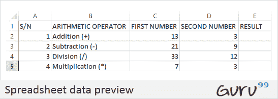
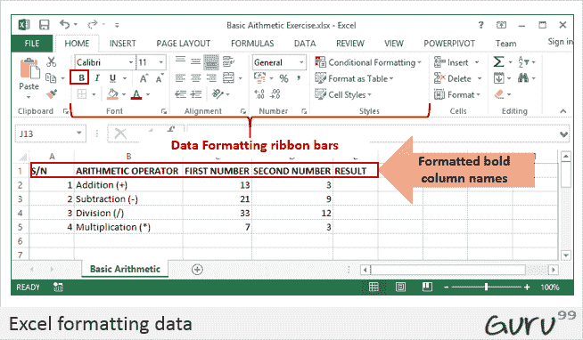
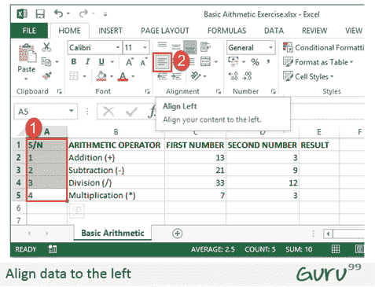
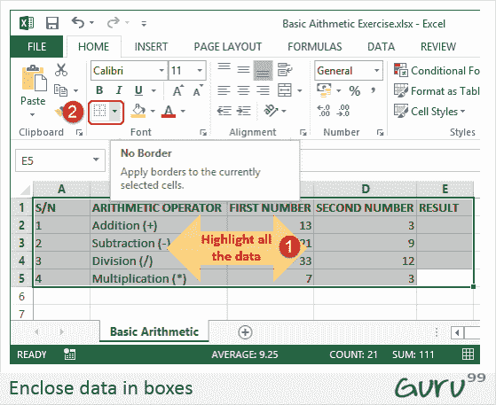
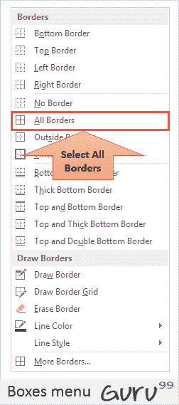
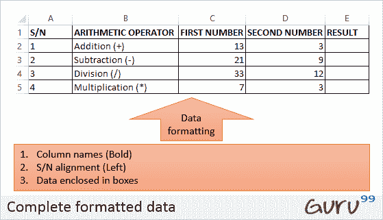
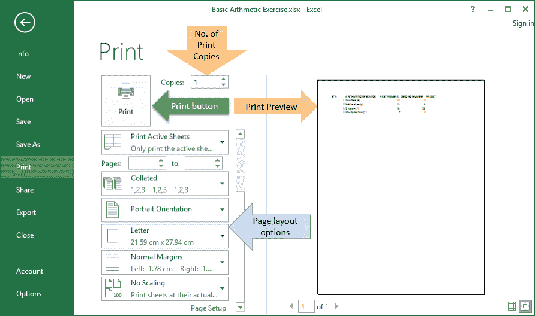

# 如何在 Excel 中进行加，减，乘，除

> 原文： [https://www.guru99.com/getting-started-with-microsoft-excel.html](https://www.guru99.com/getting-started-with-microsoft-excel.html)

在本教程中，我们将执行基本的算术运算，即加法，减法，除法和乘法。 下表显示了我们将使用的数据以及预期的结果。

<colgroup><col style="width: 47px;"><col style="width: 170px;"><col style="width: 123px;"><col style="width: 141px;"><col style="width: 120px;"></colgroup>
| **S / N** | **算术运算符** | **第一个号码** | **第二个号码** | **结果** |
| 1 | 加法（+） | 13 | 3 | 16 |
| 2 | 减法（-） | 21 | 9 | 12 |
| 3 | 部门（/） | 33 | 12 | 2.75 |
| 4 | 乘法（*） | 7 | 3 | 21 |

现在让我们使用 Microsoft Excel 来达到上述效果

在我的文档文件夹中的计算机上创建一个文件夹，并将其命名为 **Guru99** Excel 教程

对于本教程，我们将使用 Microsoft Excel2013。好消息是，即使您具有 Microsoft Excel 2007 或 2010，您仍然可以按照本教程进行操作，并获得相同的结果。

打开 Excel。 您将看到一个类似于以下所示的窗口。 Excel 的外观将取决于您的版本。

*   如上图所示，在工作表中输入数据。
*   现在，我们将使用相应的算术运算符执行计算。 在 Excel 中执行计算时，应始终以等号（=）开头。
*   让我们从一个加法开始。 在 E2 Excel（“结果”列）中编写以下公式
*   = C2 + D2

**此处，**

*   **“ =”** 告诉 Excel 对等号后的内容进行评估
*   **“ C2”** 是由 C 表示列字母，2 表示行号的第一个数字的单元地址
*   **“ D2”** 是第二个数字的单元地址，第二个数字由 D 表示列字母，2 表示行号

完成后，按键盘上的 Enter 键。 结果应该是 16。

### 教程练习 1

使用在以上示例中获得的知识，尝试编写用于减法，除法和乘法的公式。

[下载上面的 Excel 代码](https://drive.google.com/uc?export=download&id=0BwL5un1OyjsdMDB2czBWbnJ5ZE0)

## 在 Microsoft Excel 中格式化数据

我们都喜欢美丽的事物，不是吗？ 在 Excel 中进行格式化可以帮助我们实现这一目标。 我们可以使电子表格更具表现力。 我们将使用算术运算表中的数据。 我们将列名称；

*   胆大
*   将序列号向左对齐
*   将数据括在框中。

### 使列名称为粗体

*   通过拖动突出显示具有列名称的单元格。
*   单击 **B** 命令代表的粗体按钮。
*   您的工作簿现在应显示如下

### 将数据向左对齐

*   我们将序列号左对齐
*   突出显示“ S / N”列中的所有数据
*   单击左对齐，如下所示

### 将数据封装在框中

用数据突出显示所有列和行

在字体功能区栏上，单击“ borders”命令，如下所示。

您将获得以下下拉菜单

选择选项“所有边界”。

您的数据现在应如下所示

### 教程练习 2

使用上面获得的知识，尝试更改字体颜色，并尝试使用“主页”选项卡上的其他选项。

## 设置打印区域并打印（打印视图）&页面布局

打印区域是您要在纸上打印的工作表的一部分。 快速简便的方法是使用以下快捷方式命令

Ctrl + P

您将获得以下打印预览。

按 Esc 键退出打印预览模式

### 教程练习 3

页面设置功能区栏具有许多选项，即方向，大小等。请尝试应用不同的设置，并使用 Ctrl + P 快捷键预览工作表上的效果。

## 摘要

在本文中，我们学习了如何使用 Excel 执行基本算术运算，设置数据格式，如何设置打印区域和打印（打印视图）。