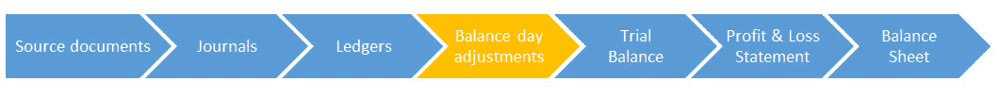

# 如何计算折旧：直线，递减值示例

> 原文： [https://www.guru99.com/fixed-assets-and-depreciation.html](https://www.guru99.com/fixed-assets-and-depreciation.html)

### 什么是资本支出？

资本支出是您购买资产时的支出。 它可能是汽车，房屋，女儿的旋转木马，甚至可能是潜水艇用作您的秘密实验室。 无论是什么，我们都将其标记为资本支出而非支出。

一种简单的想法是，支出是指您购买不到一年的用完的东西，而资产是可以使用一年以上的东西。

### 什么是折旧？

资产不会永远持续下去。 如果您以 5,000 美元的价格购买汽车，则价值 5,000 美元。 但是明年呢？ 因为您每天都要开车，所以将比萨饼留在后座上并在窗户上画笑脸，这样价格会下降。 也许一年后您只能以 4,000 美元的价格出售它。 三年后，它可能只值 1,500 美元！ 值的逐渐降低称为**折旧。** 通常，我们在会计年度的最后一天平衡日计算折旧。 因此，折旧称为**余额日调整。**

## 折旧类型

1.  直线法
2.  递减法

在此簿记教程中，您将学习-

*   [直线法](#1)
*   [折旧计算器](#2)
*   [递减值方法](#3)

## 直线法

让我们看一个例子：

假设您决定购买一家秘密的水下潜艇实验室。 您以 100,000 美元的价格购买了有史以来最漂亮的潜水艇。 但是，您知道在 5 年的时间里，该潜艇的价值将仅为 20,000 美元。

直线法假设资产**每年都会折旧相同的金额，直到达到其残值**为止。 剩余价值是指其使用寿命结束时的价值。 在这种情况下，我们知道金额为$ 20,000。 这意味着潜艇将在五年内贬值 80,000 美元。

让我们使用从小学中学到的一些简单数学来解决这个问题。

$ 80,000 / 5 年=每年$ 16,000

现在我们有了答案。 潜艇每年将贬值 16,000 美元，为期五年。 五年后，它的折旧价值为 80,000 美元，剩余价值为 20,000 美元。

完善。 让我们来看看面包店的例子之一。

还记得我们从约翰汽车店买的车吗？ 如果我没记错的话，那是一朵绿色的莲花，花了 3,000 美元。

现在约翰告诉我们，在 5 年内，我们将能够以 1,000 美元的价格出售该车。

现在，我们掌握了汽车折旧所需的所有信息。

购买时价值：3,000 美元

5 年的价值：$ 1,000

折旧金额（提示：初始值减去剩余值）：$ 2,000

每年折旧：$ 400

## 折旧计算器

| 购买时输入值： | <input id="Pvalue1" name="Pvalue1" type="text"> |
| 在 5 年内输入值： | <input id="Pvalue2" name="Pvalue2" type="text"> |
| 折旧金额： | <input id="Pvalue3" name="Pvalue3" style="display:none" type="text">  |
| 每年折旧： | <input id="Pvalue4" name="Pvalue4" style="display:none" type="text">  |

| 购买时的价值： |
| 5 年内的价值： |
| 折旧金额： |
| 每年折旧额： |

太好了，所以我们现在知道我们将以每年$ 400 的价格折旧我们的汽车。 现在，尽管不涉及现金，但这些仍是交易。 这意味着他们有日记帐分录，需要输入到分类帐中！

折旧是一项支出。 因此，我们将创建一个折旧费用科目，即借方科目。

**累计折旧**是我们尚未遇到的术语。 顾名思义，累计折旧是多年来累积的折旧总额。 例如，如果我们的资产在最近 3 年中每年折旧$ 100，则我们的累计折旧将为$ 300。

累积折旧是一种责任。

因此，我们将创建一个累计折旧帐户，该帐户位于会计等式的贷方。

要记录当年的折旧，我们需要准备日记帐分录。 日记条目如下所示：

| 博士 | 折旧费用 | $400 |
| 铬 | 累计折旧 | $400 |

现在轮到你了。 将此日记帐输入以下分类帐并计算余额。

### 折旧费用

| 

### 详细信息

1.  ，

 | 

### 借记

1.  ［

 | 

### 信用

1.  ，

 |
| 

1.  。

 | 

1.  。

 | 

1.  。

 |
| 

1.  余额

 | 

1.  400

 |  |

### 累计折旧

| 

### 详细信息

1.  ，

 | 

### 借记

1.  ［

 | 

### 信用

1.  ，

 |
| 

1.  。

 | 

1.  。

 | 

1.  。

 |
| 

1.  平衡

 | 

1.  。

 | 

1.  400

 |

## 递减值法

折旧的另一种常见方法是减值法。

使用此方法时，资产的折旧额每年不会相等。 而是每年根据资产的折旧价值或“账面价值”重新计算折旧。 最好在一个示例中说明：

还记得约翰汽车店的汽车吗？ 它的价格为 3,000 美元，我们被告知它将持续 5 年。

使用这种方法，我们需要估计我们期望的折旧额。 就本例而言，假设每年 20％。

**第 1 年：**

我们的汽车价值为$ 3,000，并且会贬值 20％。

$ 3,000 的 20％为 **$ 600。**

现在，我们已经计算出第一年的折旧！ 日记条目如下所示：

| 博士 | 折旧费用 | $600 |
| 铬 | 累计折旧 | $600 |

可以将此日记帐分录输入以下分类帐：

折旧费用

| 细节 | 借方 | 信用 |
| 期初余额 | $0 |   |
| 累计折旧 | $600 |   |
|   |   |   |
| **余额** | **$ 600** |   |

| Details | DEBIT | CREDIT |
| Opening balance |   | $0 |
| 折旧 |   | $600 |
|   |   |   |
| **BALANCE** |   | **$600** |

**第 2 年：**

我们现在正在考虑第二年折旧我们的汽车。 我们的汽车原先价值 3,000 美元。

但是，使用此方法时，我们根据汽车的**当前**值而非原始值来计算折旧。

我们已经在第一年（以上）将汽车折旧了 600 美元。 这意味着我们汽车的当前价值为 **$ 2,400** （$ 3,000-$ 600 = $ 2,400）。

这是我们用来计算今年 20％折旧的价值：

$ 2,400 的 20％变为 **$ 480** 。 这将是我们今年汽车的折旧额。

日记条目如下所示：

| 博士 | Depreciation expense | $480 |
| Cr | Accumulated depreciation | $480 |

Have a go at entering this journal entry into the ledger below:

DEPRECIATION EXPENSE

| 细节 | 借方 | 信用 |
| 期初余额 | $0 |   |
| 累计折旧 | $480 |   |
|   |   |   |
| **余额** | **$ 480** |   |

累计折旧。

| Details | DEBIT | CREDIT |
| Opening balance |   | $600 |
| 折旧 |   | $480 |
|   |   |   |
| **BALANCE** |   | **$ 1080** |

请注意，在第二年我们的折旧费用分类帐的期初余额为 0 美元，而我们的累计折旧分类帐的期初余额为 600 美元。

这是因为每年都会重新计算折旧费用。 这是一个费用科目，费用的性质是它们仅与计算的年份有关。 到年底，它们从零重新开始。

另一方面，累计折旧代表与以前所有年度相加的折旧； 因此名称为“累计”折旧。 它是一种负债，负债的性质是其价值逐年结转。

在现实世界中，我们将折旧所有资产。 也就是说，我们还需要计算烤箱，计算机和 iPhone 的折旧。 为了使事情尽可能简单，我们现在就让这一面。 本练习的目的是简单解释折旧的概念以及我们如何记录折旧。

好吧，继续前进！

**注意**：通常是政府规定不同资产类别的折旧率。