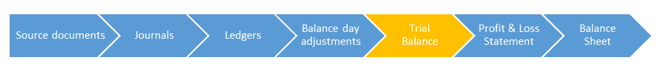

# 如何通过示例准备试算表

> 原文： [https://www.guru99.com/the-trial-balance.html](https://www.guru99.com/the-trial-balance.html)

### 什么是试用余额？

顾名思义，“试用余额”是一个表格，我们在其中布置了所有借方帐户和所有贷方帐户，以查看它们是否平衡。

试用余额非常重要，因为它是我们所有帐户的摘要。 通过查看我们的试用余额，我们可以立即看到我们的银行余额，我们的贷款余额，我们的所有者权益余额。 实际上，我们可以立即看到我们业务中每个帐户的余额。

### 为什么试算平衡很重要？

嗯，正如您所知道的，会计/簿记是关于平衡的。 会计等式需要平衡，每笔交易都需要平衡，我们的借方和贷方需要平衡等等。

试算平衡表是我们业务详细列出的会计等式。 它的左边是我们的资产，费用和图纸（借方），右边是我们的负债，收入和所有者权益（贷方）。 我们可以清楚地看到所有内容，并确保所有内容保持平衡。

达到平衡的试算表告诉我们，我们已正确处理了所有日记帐和分类帐。 意思是，“您输入了当年的所有交易记录，一切看起来都不错！”

您可能已经猜到了，在现实世界中，试算表并不总是在第一次就达到平衡。 像其他任何事情一样，会发生人为错误，并且在某处可能有人输入了错误的日记帐或错误地处理了分类帐。 因此，在试算平衡阶段，会计和簿记员经常被迫回头检查凭证，日记帐和分类帐，以找出错误并使账目恢复平衡。 这首先显示了产生试算表余额的重要性-它告诉用户计费公式不平衡，需要进行修正才能继续。

产生试算表余额是数据处理的最后一步–之后，我们就可以开始生成财务报表了！

### 如何取得平衡

首先，我们从分类帐中提取所有余额并将其输入到我们的试验余额表中。 记住会计等式：

| **借方** | **贷方** |
| **资产+费用+图纸** | **负债+收入+所有者权益** |

以下是分类帐中所有余额的清单。 您已经在教程 8 中计算了这些余额。现在，您需要将它们放在试用余额上，以查看它们是否适合会计等式！

## 试用资产负债表

| 

### 借方

 | 

### 信用方

 |
| <h7 class="ui-widget-content">资产</h7>

1.  银行$ 21,650

1.  计算机$ 1,500

1.  汽车$ 3,000

1.  iPhone $ 500

1.  烤箱$ 2000

 | <h7 class="ui-widget-content">负债</h7>

1.  贷款 9,000 美元

1.  John's Car Shop 3,000 美元

1.  累计折旧$ 400

1.  在这里添加您的项目

1.  在这里添加您的项目

 |
| <h7 class="ui-widget-content">支出</h7>

1.  蛋糕粉$ 3,000

1.  利息支出$ 1,000

1.  电话费$ 300

1.  维修费用$ 50

1.  折旧$ 400

 | <h7 class="ui-widget-content">收入</h7>

1.  销售$ 7,000

1.  这里的项目

1.  在这里添加您的项目

1.  在此处添加项目

1.  在此处添加您的商品

 |
| <h7 class="ui-widget-content">图纸</h7>

1.  图纸$ 1,000

 | <h7 class="ui-widget-content">所有者权益</h7>

1.  所有者权益$ 15,000

 |

| 
<input class="btn btn-info" id="totala" type="button" value="Calculate Total Assets"> | 我的 | 
<input class="btn btn-info" id="totall" type="button" value="Calculate Total Liabilities"> | 我的 |
| 
<input class="btn btn-info" id="totale" type="button" value="Calculate Total Expenses"> | 我的 | 
<input class="btn btn-info" id="totalr" type="button" value="Calculate Total Revenue"> | 我的 |
| 
<input class="btn btn-info" id="totald" type="button" value="Calculate Total Drawings"> | 我的 | 
<input class="btn btn-info" id="totalo" type="button" value="Calculate Total Owners’ Equity"> | 我的 |
| 总余额
 |  | Total Balance
 |  |

哇。 您刚刚平衡了第一次试用余额。 现在我们知道我们所有的数字都是正确的，并且可以开始编制财务报表了！ 休息一下，用一碗薯条和巧克力奶昔庆祝。 你应得的！

