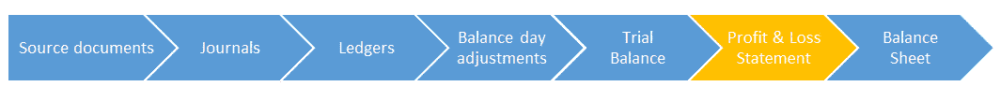

# 如何用示例制作损益表

> 原文： [https://www.guru99.com/how-to-produce-a-profit-and-loss-statement.html](https://www.guru99.com/how-to-produce-a-profit-and-loss-statement.html)

### 什么是损益表？

损益表说明您在任何给定时期内赚了多少钱。 通常是一年。

损益表很重要，因为它说明了我们是否已获利–这是开展业务的最重要目标之一。 这对其他各方也很重要-银行希望知道我们已经获利，以便他们可以确定我们可以继续偿还贷款，而政府希望知道我们的获利额来计算税金。 它还总结了我们当年的收入和支出，这对于分析资金如何进出我们的业务非常重要。



在我们的试用余额中，我们有六个部分–资产，负债，费用，收入，工程图和所有者权益。 再看一下：

| **（NAME）的面包店（今天的日期）的试算表** |   |
| **借方** | **贷方** |
|   |   |
| 资产 | 负债 |
| 银行$ 21,650 | 贷款$ 9,000 |
| 电脑$ 1,500 | 约翰的汽车城$ 3,000 |
| 车$ 3,000 | 累计折旧$ 400 |
| iPhone $ 500 |   |
| 烤箱$ 500 |   |
|   |   |
| 花费 | 收入 |
| 蛋糕粉$ 3,000 | 销售额$ 7,000 |
| 利息支出$ 1,000 |   |
| 电话费$ 300 |   |
| 维修费用$ 50 |   |
| 折旧$ 400 |   |
|   |   |
| 图纸 | 所有者权益 |
| 图纸$ 1,000 | 所有者权益$ 15,000 |
|   |   |
|   |   |
| 余额$ 34,400 | Balance $34,400 |
|   |   |

为了检查我们的损益，我们将获得其中两个部分的数据– **收入和支出。**

让我们看一下这些数字：

收入：

销售额$ 7,000

花费：

*   蛋糕粉$ 3,000
*   电话$ 300
*   修理$ 50
*   利息$ 1,000
*   折旧$ 400

这就是我们需要为损益表生成的所有信息。 让我们开始吧。

损益表的基本格式很简单：

```
Revenue - Expenses = Profit
```

使用我们的试用余额中的数字，只需在下面的损益表中填写这些数字即可计算出您的利润！

| （NAME）面包店的损益表（截至今天（DATE）） |   |   |
| Revenue |   |   |
| 营业额 | $7,000 |   |
|   |   |   |
| **总收入** |   | $ 7,000（A） |
|   |   |   |
| 减：费用 |   |   |
|   |   |   |
| 蛋糕混合费用 | $3,000 |   |
| 电话费用 | $300 |   |
| 维修费用 | $50 |   |
| 利息花费 | $1,000 |   |
| 折旧费用 | $400 |   |
|   |   |   |
| **总费用** |   | $ 4,750（早餐） |
|   |   |   |
| 净利 |   | $ 2,250（C） |

恭喜你 你赚了！ 我们在损益表中看到，您的面包店获利$ 2250

现在，在您太兴奋之前，您需要记住，自己并没有保留所有的利润！ 有一个非常重要的人，称为税务员，每年都会减薪：

## 如何计算税款

现在我们已经计算出利润，我们可以计算出需要缴纳的税额。

您的利润是$ 2,250。 假设税率为 30％，您需要支付 675 美元的税

请记住，这只是一个例子-每个国家都有其税率！

让我们继续进行最后一个日记条目以记录我们的税收费用：

| 博士 | 税收费用 | $675 |
| 铬 | 应付账款 | $675 |

税收支出是一项支出，因此这会导致我们的借方增加。 等式的另一面是应付账款，这是一种负债。

这是一种责任，因为它仍在欠款； 有点像要付款的账单。 该负债将在我们的资产负债表上结转，直到我们在下一年缴纳税款为止。 在我们最终付款时，我们会将 675 美元存入我们的银行帐户，并从 675 美元中扣除应付帐款。 到现在为止，您应该能够看到这将使我们的应付账款减少到零，并且负债将从我们的账目中消除。

税收之所以有趣，是因为这是我们准备损益后要进行的日记帐分录。 可以这么说，这意味着我们必须在会计流程中“落后”。

之后，我们将照常准备税收分类帐，并将余额添加到试算表中。

税收支出指示灯

| 细节 | 借方 | 信用 |
| 期初余额 | $0 |   |
| 应付税款 | $675 |   |
| **余额** | **$ 675** |   |

税款计价器

| 细节 | 借方 | 信用 |
| 期初余额 |   | $0 |
| 税金支出 |   | $675 |
| **余额** |   | **$ 675** |

### 损益表示例

| PROFIT AND LOSS STATEMENT FOR (NAME)’S BAKERY FOR THE PERIOD ENDED (TODAYS DATE) |   |   |
| Revenue |   |   |
| Sales | $7,000 |   |
|   |   |   |
| **Total Revenue** |   | $7,000 (A) |
|   |   |   |
| Less: Expenses |   |   |
|   |   |   |
| Cake mix expense | $3,000 |   |
| Telephone expense | $300 |   |
| Repairs expense | $50 |   |
| Interest expense | $1,000 |   |
| Depreciation expense | $400 |   |
|   |   |   |
| **Total Expenses** |   | $4,750 (B) |
|   |   |   |
| Net Profit |   | $2,250 (C) |
| 减税（30％） |   | $675 |
| 税后净利润 |   | $1,575 |

| <h7 class="ui-widget-content">收入</h7>[ |   |   |
| 

1.  **销售**

 | 

1.  7000

 |   |
| 

1.  **<font color="#5ca934">计算收入</font>**
    <input class="readon" id="totalr" type="button" value="click here">

 |  |  |

| <h7 class="ui-widget-content">减：费用</h7>， |   |   |
| 

1.  **蛋糕混合费用**

 | 

1.  $ 3,000

 |   |
| 

1.  **电话费用**

 | 

1.  $ 300

 |  |
| 

1.  **维修费用**

 | 

1.  $ 50

 |  |
| 

1.  **利息支出**

 | 

1.  $ 1,000

 |   |
| 

1.  **折旧费用**

 | 

1.  $ 400

 |   |
| 

1.  **<font color="#5ca934">计算费用</font>**
    <input class="readon" id="totale" type="button" value="click here">

 |  |  |
| 

1.  **<font color="#5ca934">计算净利润</font>**
    <input class="readon" id="totalp" type="button" value="click here">

 |  |  |

## 为什么 P & L 语句很重要？

损益表是非常重要的报告。 这是您下次申请贷款时要提交给银行的报告。 他们将使用它来查看您的企业是否赚了足够的钱来偿还。

这是您将提交给想要在面包店投资的投资者的报告。 他们将使用它来确定您的业务是否盈利，并将为他们带来丰厚的投资回报。

这是您要提交给政府的报告。 他们将用它来计算您赚了多少钱以及需要支付多少税。


任何需要有关您企业盈利能力的信息的人都将使用此报告。 做得好！ 现在，让我们来谈谈损益表的老大哥-资产负债表。