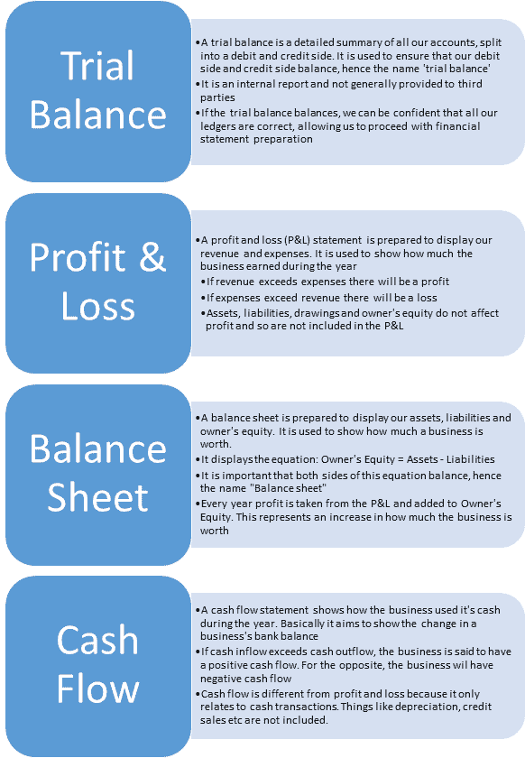

# 现金流量表的重要性及示例

> 原文： [https://www.guru99.com/cash-flow-report.html](https://www.guru99.com/cash-flow-report.html)

### 什么是现金流量表？

现金流量表描述了公司如何使用现金。 它通常与其他两个主要报告（损益表和资产负债表）一起使用。 它是公司财务报表的第三部分。

### 为什么现金流量表很重要？

现金流量报告很重要，因为它可以将业务现金状况告知读者。 为了使企业成功，它必须始终有足够的现金。 它需要现金来支付费用，偿还银行贷款，缴税和购买新资产。 现金流量报告确定企业是否有足够的现金来做到这一点。

拥有现金是企业保持**溶剂**的关键条件。 当企业没有足够的现金来支付其会费时，通常会宣布其为**破产。**

对于本会计入门，我们将不进行实际现金流量报告的实际准备。 实际上，在商业世界中，小型企业很少生成现金流量报告，因为损益表足以满足他们的需求。 诸如面包店之类的小企业不太可能涉及能够保证此类信息的复杂非现金交易。 因此，让会计师准备一份对任何人都没有用的报告被认为是浪费时间和金钱！

另一方面，对于耐克和微软这样的大型实体，必须有现金流量报告。 这样的公司通常会有大量的非现金交易，有时甚至是数十亿美元的收入，这些收入仅仅是欠他们的，但还没有收到现金。 在这种情况下，损益表并不总是足够的，现金流量报告对许多用户（例如银行和股东）而言很有价值。

### 现金流量表示例

假设您以$ 1,000 美元开始创业。

用您的$ 1,000，您可以购买一盒配料并烤制蛋糕。

您将所有蛋糕以 5,000 美元的价格卖给客户。

客户询问他是否可以以信贷方式购买蛋糕，这意味着他将在月底支付蛋糕费用。 你同意。

让我们确定您在这种情况下的现金头寸。

**收入：$ 5,000**

根据会计准则，收入在获得时确认，在收到**而不是**时确认。 因此，由于您已将销售出售给客户，因此必须将销售确认为已收收入。

**利润：$ 4,000**

您在蛋糕上花费了 1,000 美元，然后以 5,000 美元的价格出售了。 这使您获利 4,000 美元。

**现金：零！**

即使您已获得$ 5,000 的收入和$ 4,000 的利润，您仍然拥有零现金！ 这种情况经常在商业环境中出现，特别是对于大型公司，这表明产生现金流量报告的重要性。

本课的目的是描述现金流量报告的优点以及何时需要。 但是，您可能会发现大多数小型企业都认为此报告不是必需的–损益表通常是满足其税收和计划需求所需要的。

### 试用平衡 vs. 损益 vs. 资产负债表与 现金流量表

|   | **试用余额** | **损益** | **资产负债表** | **现金流量表** |
| **个帐户** | 所有帐户 | 收入&费用 | 资产，负债，工程图和所有者权益 | 银行 |
| **类型** | 对于内部用户 | 对于外部用户 | For external users | For external users |
| **显示的关键信息** | 确认我们的借方帐户与贷方帐户平衡 | 本年度利润/亏损 | 公司净资产的价值 | 银行结余增加/减少 |
| **结构** | 所有借方帐户在左侧，所有贷方帐户在右侧 | 收入减去费用等于利润 | 资产减去负债等于所有者权益 | 从年初的银行余额开始

添加收到的现金

减去已用现金

等于期末银行余额 |