# Excel 数据验证，过滤器，分组

> 原文： [https://www.guru99.com/excel-validation-filters-grouping.html](https://www.guru99.com/excel-validation-filters-grouping.html)

在本教程中，我们将涵盖以下主题。

*   [数据验证](#5)
*   [数据过滤器](#6)
*   [分组和取消分组](#7)
*   [将图像添加到电子表格](#4)

## 数据验证

从帮助我们避免可以避免的错误的意义上讲，数据验证非常重要。 假设您正在记录学生考试成绩，并且知道最小值为 0，最大值为 100。您可以利用验证功能来确保仅输入 0 到 100 之间的值。

通过单击工作表底部的加号按钮，在工作簿中添加一个新表。

为 S / N，名称和分数添加一列。 您的工作表应如下所示

<colgroup><col style="width: 66px;"><col style="width: 104px;"><col style="width: 94px;"></colgroup>
| **S / N** | **名称** | **得分** |
| 1 | 简 |  |
| 2 | 詹姆士 |  |
| 3 | 琼斯 |  |
| 4 | 乔纳森 |  |
| 5 | 约翰 |  |

*   单击数据选项卡
*   选择单元格 C2 到 C6（将用于记录分数的单元格）

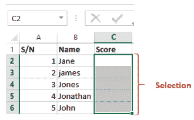

*   单击数据验证下拉列表。
*   单击数据验证。

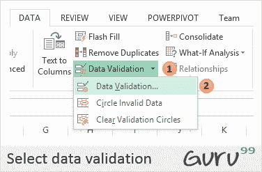

*   您将获得以下对话窗口

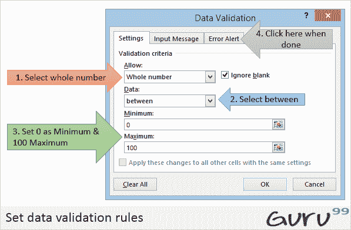

*   单击错误警报选项卡
*   输入警报标题和消息，如下图所示。

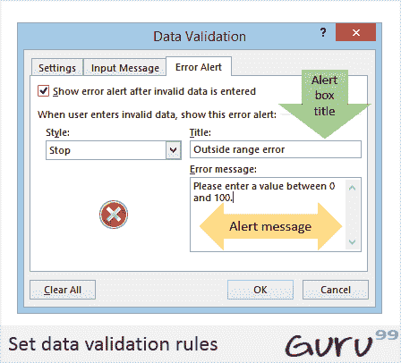

*   点击确定按钮
*   尝试输入大于 200 的分数。您将收到以下错误消息

## 数据过滤器

数据过滤器使我们能够获取符合所需标准的数据。 假设我们要显示所有以“ ja”开头或分数小于，大于或等于某个值的学生的成绩，我们可以使用过滤器来获取此类数据。

选择名称和分数列，如下所示

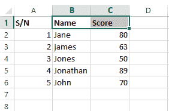

*   单击功能区上的“数据”选项卡
*   单击排序&过滤器下拉列表，如下图所示

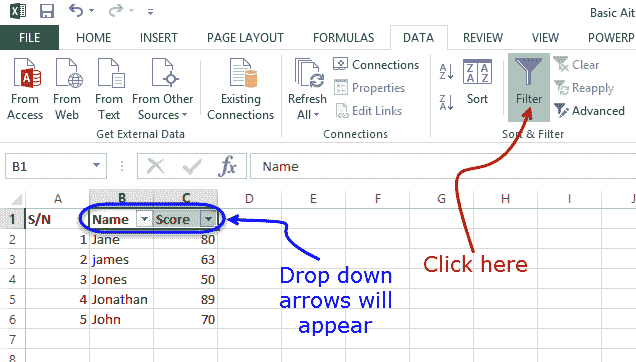

*   单击名称过滤器
*   选择文字过滤器
*   选择开始于
*   您将获得以下窗口。

*   输入“ ja”，然后单击“确定”按钮
*   您应该只能看到 Jane 和 James 的结果。

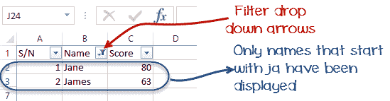

## 分组和取消分组

通过组，我们可以轻松查看并从列或行中隐藏不必要的细节。 除此之外，我们还可以使用组来分析属于同一类别的数据。 让我们用一个例子来说明。 我们将使用上面的学生分数示例。

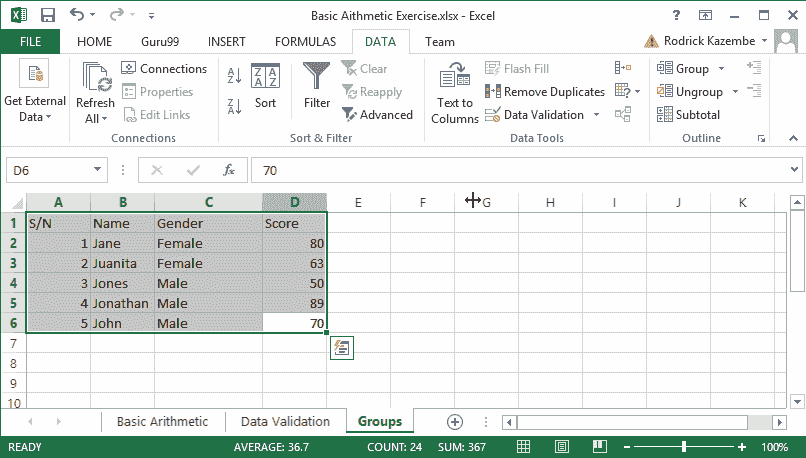

*   右键单击分数，然后选择“插入列”。 将名称列命名为性别。
*   将 James 换成 Juanita。 珍妮特（Janet）和胡安妮塔（Juanita）的女性。 将男生留给其余的学生。 您的工作表应如下所示。

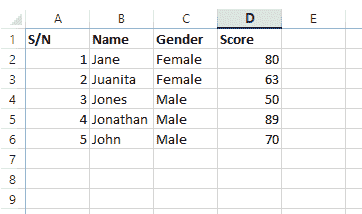

现在，我们将女性分组在一起，显示其平均得分，对男性也是如此。

*   单击功能区上的“数据”选项卡
*   选择所有具有数据的列和行
*   单击组下拉按钮，如下图所示

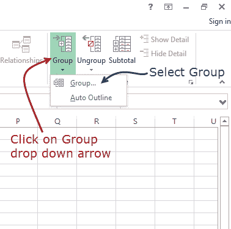

您将获得以下窗口

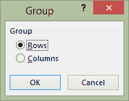

*   确保选择行选项
*   点击确定按钮
*   您将获得以下预览

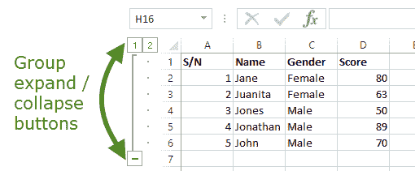

*   现在，我们将计算男性和女性的平均分数
*   选择整个数据，如下所示

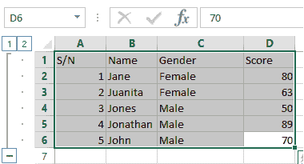

单击“数据”选项卡下的“小计”下拉按钮

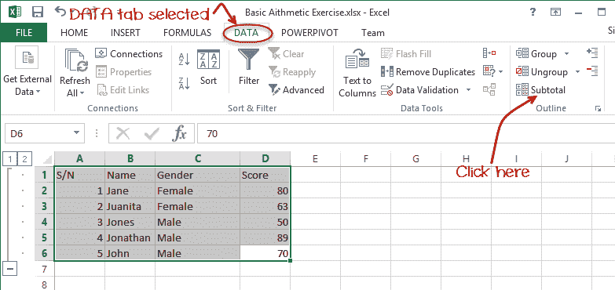

You will get the following window

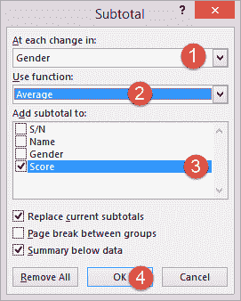

*   将“每次更改”设置为性别
*   将“使用功能”设置为平均
*   选择“添加小计”以得分
*   点击“确定”按钮

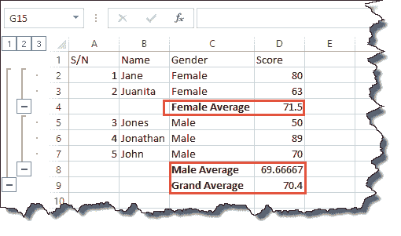

[下载上面的 Excel 代码](https://drive.google.com/uc?export=download&id=0BwL5un1OyjsdZEszc3hKUlpaMDg)

## 将图像添加到电子表格

有时，您希望在 excel 中打印的文件带有信头信息，并带有公司徽标等进行打印。Excel 具有允许您将图像导入 Excel 的功能。 在功能区上的“插入”选项卡下可以找到添加图像的命令。

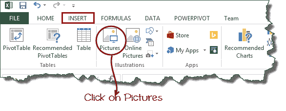

您将获得以下对话窗口

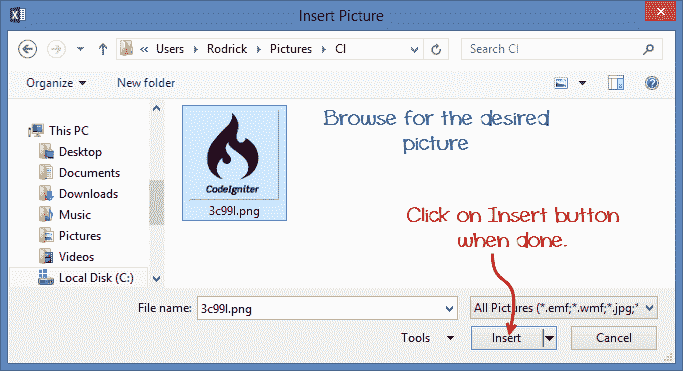

*   您可以浏览到计算机上包含图片的任何文件夹，也可以选择任意图片。
*   您将获得类似于以下所示的结果

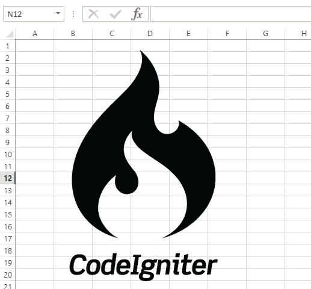

### 教程练习 4

使用 INSERT 选项卡图片命令将您选择的图片添加到工作表中。

## 摘要

在本文中，我们学习了如何使用 Excel 执行基本的算术运算，设置数据格式，应用验证规则，过滤数据以及如何利用组进一步分析数据和改进表示形式。