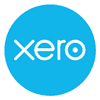
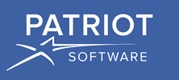
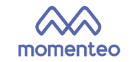

# 2020 年 22 种最佳 QuickBooks 替代品[免费/付费]

> 原文： [https://www.guru99.com/free-quickbooks-alternatives.html](https://www.guru99.com/free-quickbooks-alternatives.html)

Quickbooks 是自动会计软件，可让您处理簿记营业税，发票等。您可以使用此软件跟踪账单和费用。此会计软件可帮助您随时随地管理业务。 它还提供可自定义的报告和仪表板。

但是，此软件具有一些缺点，例如在会计之外缺少关键报告，不提供任何直接的专业支持，系统崩溃等问题。

以下是精选的 Top Quick 图书替代品，其中包含受欢迎的功能和网站链接。 该列表同时包含开源（免费）和商业（付费）软件。

### 1）新鲜书

FreshBooks 是 2ndsite Inc 公司开发的一种会计工具。 它可以帮助您快速，轻松，安全地运营小型企业。

**功能**：

*   只需单击几下即可为客户生成发票。
*   它使您可以轻松组织费用。
*   您可以轻松使用日志小时数，并自动将其放入发票。
*   该工具可帮助您在项目上进行协作。
*   它提供了易于理解的财务报告。
*   Freshbook 移动应用程序可帮助您与客户保持联系。
*   它会自动检查和平衡以确保合规性和准确性。

**链接**： [https://www.freshbooks.com/](https://www.freshbooks.com/)

* * *

### 2）Xero

Xero 是面向小型企业的在线会计应用程序。 它使您可以与顾问协作并与您的员工共享。 该应用程序的主要优势在于，它可以自动跟踪多种货币之间的损益。

**Features**:

*   您可以跟踪银行现金流量。
*   它允许您发送带有在线付款选项的在线发票。
*   您可以将 Xero 连接到您的银行。
*   记录和管理收支。
*   您可以关注员工的工资信息。
*   Xero 提供财务报告以监控金额。
*   它保存关系历史记录和联系人的快照。
*   该工具具有一个仪表板来检查业务绩效。

**链接**： [https://www.xero.com/](https://www.xero.com/)

* * *

### 3）身体

kiwili 是面向企业和自由职业者的在线会计软件，可帮助您更好地管理费用和收入。

**Features**:

*   您可以分析您的现金流量。
*   它提供了会计自动化。
*   您可以将收入和支出分成两部分。
*   Kiwili 使您可以查看所征收和已支付的税额。
*   您可以准备报告并将报告发送给您的会计师。
*   它可以帮助您生成资产负债表和损益表。
*   该工具包括日记帐，分类帐，工资单，试算表等的一系列模块。

**链接**： [https://www.kiwili.com/kiwili-erp-free-accounting-project-management-software/](https://www.kiwili.com/kiwili-erp-free-accounting-project-management-software/)

* * *

### 4）Kashflow

KashFlow 是面向小型企业和会计师事务所的在线薪资和簿记解决方案。 它会自动更新 VAT（增值税），并可以直接提交给 HMRC（HM 税收和海关）。

**Features**:

*   您可以查看财务状况的完整视图。
*   它使您能够将报价转换为发票。
*   您可以设置多种付款方式。
*   Kashflow 提供有关损益和库存控制的准确报告。
*   您可以将您的银行帐户链接到 KashFlow 商业帐户。

**链接**： [https://www.kashflow.com/](https://www.kashflow.com/)

* * *

### 5）自由剂

FreeAgent 是一个在线会计和资金管理工具。 您可以使用它来发送和跟踪专业设计的发票。 它提供了收入，支出和利润表现的鸟瞰图。

**Features**:

*   您可以填写自我评估纳税申报表并将其提交给 HMRC。
*   您可以预测公司的税单。
*   它使您能够分析现金流量并查看应缴税款的到期时间。
*   您可以单击查看增值税申报单并进行归档。
*   Freeagent 提供了收入，支出和利润表现的鸟瞰图。
*   它提供了一个内置秒表来记录您的时间。

**链接**： [https://www.freeagent.com/](https://www.freeagent.com/)

* * *

### 6）清除书本

Clear Books 是基于云（SaaS）的会计应用程序。 您可以将您的银行帐户与 Clearbooks 关联，它将自动导入您的银行交易。

**Features**:

*   您可以创建发票和付款提醒。
*   它可以帮助您轻松管理项目财务。
*   创建有关损益和现金流量的报告。
*   您可以使用 170 多种货币创建发票。
*   清除书籍可让您使用报告跟踪库存水平。
*   它使您可以记录在任务，客户和项目上花费的时间，并直接从时间表中创建时间。

**链接**： [https://www.clearbooks.co.uk/](https://www.clearbooks.co.uk/)

* * *

### 7）爱国者软件

Patriot 软件是面向小型企业的在线会计和薪资管理软件。 它使您能够从连接到互联网的任何设备安全地运行工资单。

**Features**:

*   它通过电话，聊天或电子邮件提供支持。
*   您可以跟踪需要支付的所有客户付款。
*   它利用加密技术来确保您的银行信息安全。
*   您可以将部门分配给供应商付款和客户发票。

**链接**： [https://www.patriotsoftware.com/](https://www.patriotsoftware.com/)

* * *

### 8）Easy Accountax

Easy Accountax 是快速书籍的强大竞争对手。 此工具可帮助您轻松管理会计交易。 它使您可以随时随地管理帐户。

**Features**:

*   它可以帮助您创建具有专业外观的发票。
*   您可以记录账单并从移动设备附加扫描的收据。
*   它提供法定和工资报告。
*   您可以轻松管理资产。

**链接**： [http://www.easyaccountax.com/](http://www.easyaccountax.com/)

* * *

### 9）理货

Tally 是一款 ERP 会计软件，可帮助您从桌面记录日常业务数据。 它使您的业务运作自动化，例如财务，销售，制造，库存和采购。

**Features**:

*   您可以在理货中管理 GST（商品及服务税）帐单。
*   它使您能够处理所有类型的交易，包括付款，购买，日记帐等。
*   您可以生成试算表，资产负债表和许多其他会计报告。
*   该软件可帮助您管理银行交易和支票簿。
*   您可以轻松组织出色的组织。

**链接**： [https://tallysolutions.com/erp-software/accounting-software-india/](https://tallysolutions.com/erp-software/accounting-software-india/)

* * *

### 10）Waveapps

Waveapps 记帐工具是 QuickBooks 的替代品，它可以帮助您处理发票，跟踪费用，交易和投资。 它使您可以连接无限的银行连接。

**Features**:

*   它使您能够轻松跟踪收入和支出。
*   Waveapps 使您可以创建和发送无限的专业发票。
*   它具有一个智能仪表板，可提供有关您的业务进展的完整信息。

**链接**： [https://www.waveapps.com/accounting](https://www.waveapps.com/accounting)

* * *

### 11）[贤者](https://bit.ly/2TgviEk)

Sage 是一款小型企业和会计软件，可帮助您管理付款和费用。 它提供广泛的薪资和会计产品。

**Features**:

*   您可以从 M.S.访问客户详细信息，交易历史记录和帐户余额。 外表。
*   它可以与 Office 365 集成。
*   您可以将费用收据的照片上传到 Microsoft OneDrive，它将自动与 Sage 同步。
*   它使您可以计划以 1 TB 备份到 MS OneDrive。 可用存储空间。

**链接**： [http://sage.qumg.net/c/1359419/738904/9554](https://bit.ly/2TgviEk)

* * *

### 12）Versaccounts

Versaccounts 是一种商务会计软件，可为公司提供 ERP 解决方案。 您可以利用此软件来管理 ERP 模块，例如总账，应付账款，应收账款和固定资产。

**Features**:

*   它使您能够在整个制造过程中创建和跟踪生产订单。
*   该工具通过管道计划支持联系和服务管理。
*   您可以在多个位置和系统中组织库存。

**链接**： [http://www.versaccounts.com/features/](http://www.versaccounts.com/features/)

* * *

### 13）AccountsIQ

AccountsIQ 是一个云会计系统，可以帮助您提高生产力。 该工具可用于管理预算，审计，现金流量和纳税申报。

**Features**:

*   您可以处理多地点客户帐户，对帐单和批量电子邮件发票。
*   它使您可以将贷方通知单和购买后的发票分批到云中。
*   您可以实时捕获，编码和授权交易。
*   AccountsIQ 使您能够与众多旧式电子银行系统集成。
*   它使您可以选择许多预配置的报告或创建仪表板。

**链接**： [https://accountsiq.com/core-financials/](https://accountsiq.com/core-financials/)

* * *

### 14）Myob Greentree

Myob Greentree 是一种会计软件，可让您跟踪客户何时收到未结发票。 它每周支持 7 天的客户支持。

**Features**:

*   无论您身在何处，都可以在软件中与簿记员或会计一起工作。
*   它使客户可以使用信用卡直接从您的发票付款。
*   Myob Greentree 提供单点薪资（STP）报告。

**链接**： [https://www.myob.com/au/enterprise/software-systems/greentree-erp](https://www.myob.com/au/enterprise/software-systems/greentree-erp)

* * *

### 15）计算

Reckon 可帮助您从一个地方一起管理工资，财务和库存。 它提供了“一键式薪资”报告功能。

**Features**:

*   它具有从任何地方组织客户，销售，员工和库存的能力。
*   您可以轻松安排和管理财务。
*   它使您能够连接银行帐户以查看交易流程。
*   您可以跟踪和管理已支付的发票以增加现金流量。
*   员工可以开账单并管理他们的费用索偿。
*   Reckon 可以与 1000 多个应用程序集成。

**链接**： [https://www.reckon.com/au/](https://www.reckon.com/au/)

* * *

### 16）OneUp

OneUp 是面向小型公司的会计软件设计。 您可以使用此产品检索每日银行交易。 它还可以使用它来管理库存，CRM（客户关系管理）和发票。

**Features**:

*   第二次访问该应用程序时，它会自动将银行交易与现有的过期发票进行匹配。
*   您将收到有关现金流量和利润信息的每日信息。
*   会计可以登录到此工具并导出所有财务记录，以偏爱该应用程序。
*   与银行建立联系后，它将自动记住您的选择。

**链接**： [https://www.oneup.com/accounting-software](https://www.oneup.com/accounting-software)

* * *

### 17）Momenteo 免费版

Momenteo 提供了一种会计解决方案。 它可以帮助您跟踪日历中已完成的工作，费用和差旅并生成会计。

**Features**:

*   您创建发票并将其发送给客户。
*   它使您可以在客户批准时将估算转换为发票。
*   Momento 可帮助您跟踪，分类和存档费用。
*   您可以存档上一年的活动。
*   此应用程序使您可以在发票中添加个人品牌。
*   您可以关联您的 Paypal 或 Stripe 帐户，以便客户可以在线存钱。
*   它使您可以搜索最重要的费用并找出减少费用的方法。

**链接**： [https://www.momenteo.com](https://www.momenteo.com/)

* * *

### 18）网络套件

NetSuite 是由 Oracle 开发的集成云业务产品套件。 它提供您的企业财务绩效的实时可见性。

**Features**:

*   它具有计费管理功能，可以集成您的财务和销售。
*   该工具提供了收入确认管理解决方案。
*   Netsuite 可帮助您简化财务计划流程。
*   您可以使用仪表板根据用户角色管理用户。

**链接**： [https://www.netsuite.com/portal/products/erp/financial-management.shtml](https://www.netsuite.com/portal/products/erp/financial-management.shtml)

* * *

### 19）NewViews

NewViews 是由 Q.W.开发的会计软件。 Page Associates Inc.。您可以调整此应用程序以使其与所有簿记相关需求保持同步。

**Features**:

*   它使您可以创建自定义报告布局。
*   您可以将成本分配给多个活动或项目。
*   它提供了您帐户的完整历史记录。
*   您可以将 NewViews 与薪资和电子资金转帐（EFT）集成。

**链接**： [https://newviews.com/newviews/](https://newviews.com/newviews/)

* * *

### 20）快速档案

Quickfile 是一种会计软件，可帮助您在云中组织收据。 您可以利用它从移动设备中获取收据。

**Features**:

*   它可以帮助您跟踪和提交增值税申报表。
*   您可以将活动与您拥有的各个项目进行分组。
*   它支持完整的多币种。
*   该软件使您可以将发票连接到付款解决方案，例如 PayPal，Stripe，Bitcoin 等。
*   您可以处理采购订单，估算和交货单。
*   您可以设置帐户的预定备份。

**链接**： [https://www.quickfile.co.uk/](https://bit.ly/2yfsC38)

* * *

### 21）Zoho 书籍

Zoho Books 是符合税法的会计软件，使您可以管理应付账款，应收账款。 它使您可以与公司员工进行协作。

**Features**:

*   它会自动计算 GST 并生成报告。
*   您可以使用自动提醒进行后续付款。
*   它使您能够与众多在线支付集成。
*   Zoho Books 使您可以跟踪费用并记录账单。
*   您可以从 Zoho Books 提供的清单中选择价格。
*   它会自动从银行提取银行对帐单到您的帐户中。
*   您可以管理多个项目，添加任务并将其分配给员工。
*   您可以根据任务时间或任何项目的固定成本生成发票客户。

**链接**： [https://www.zoho.in/books/small-business-accounting-software/](https://www.zoho.in/books/small-business-accounting-software/)