# 11 本最佳会计书籍（2020 年更新）

> 原文： [https://www.guru99.com/best-accounting-books-beginners.html](https://www.guru99.com/best-accounting-books-beginners.html)

会计可以定义为财务信息的产生。 这意味着会计可以使我们看到诸如收入多少，价值多少，花费多少以及可以在何处改善以赚更多钱的事情。

这是一本精选的《会计学前 11 本书》的精选清单，这些书籍应该成为高级《会计学习者》图书馆的任何初学者的一部分。

### 1）[记帐变得简单：会计解释不超过 100 页](https://geni.us/0I1J)

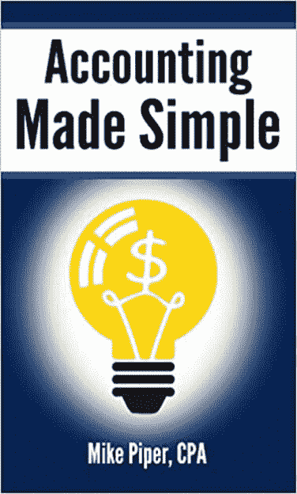

迈克·派珀（Mike Piper）所写的一本书使会计学变得简单，该书有点燃版和平装版。

这本书包括会计等式，以及为何如此重要，如何阅读和准备财务报表，如何计算和解释几种不同的财务比率等。

本书包括诸如会计，账户等式，资产负债表，损益表，现金流量表，财务比率等主题。

[Check Latest Price and User Reviews on Amazon](https://geni.us/0I1J)

* * *

### 2）[会计游戏：柠檬水摊位上的基础会计](https://geni.us/CEI0pam)

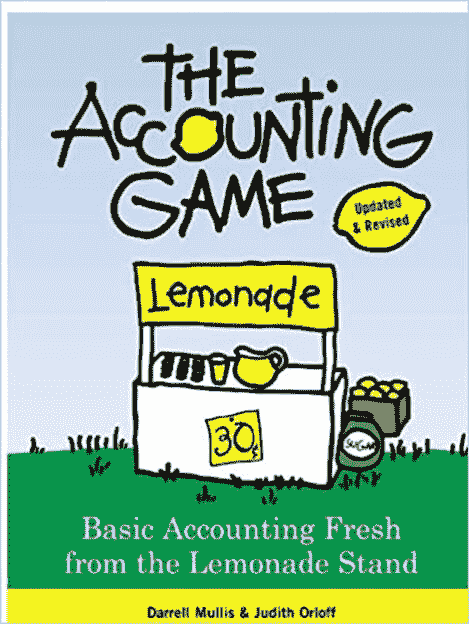

会计游戏是 Darrell Mullis 和 Judith Orloff 所写的书。 本书采用加速学习的方法。 您将使用自己的感官，情感和批判性思维技能快速学习新任务。

在本书中，您将容易掌握基本术语，测验和工作表的解释。 它还可以帮助您跟踪进度和管理小型企业。

[Check Latest Price and User Reviews on Amazon](https://geni.us/CEI0pam)

* * *

### 3）[假人处理](https://geni.us/yZhAbZ1)

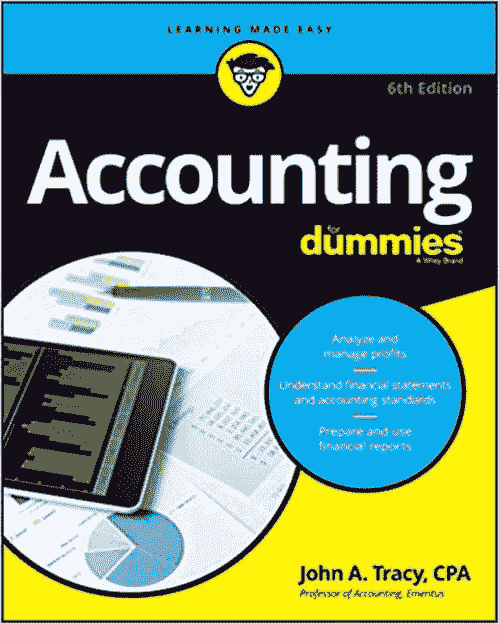

傻瓜会计是一本会计书。 它可以帮助您最大程度地减少对该主题的困惑，从而最大程度地提高利润。

这本书是由约翰·特雷西（John Tracy）用易于理解的语言编写的。 您还将学习如何管理私有或上市公司的库存，报告收入和费用。 该书还教您如何评估利润率，分析业务优势和劣势，管理预算。

[Check Latest Price and User Reviews on Amazon](https://geni.us/yZhAbZ1)

* * *

### 4） [1 天学习簿记](https://geni.us/zo1vOR)

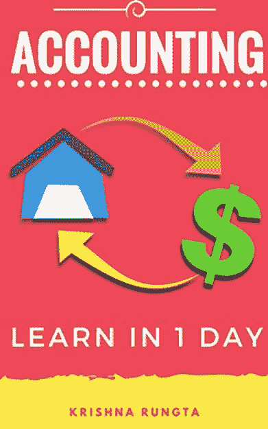

1 天学习簿记是一本书。 克里希纳（Krishna Rungta）。 这是会计入门的入门指南，不需要任何簿记知识。

这本电子书的最佳部分简化了会计的所有技术术语，并逐步解释了这些术语，以说明会计原理在实际情况下如何工作以及如何将其应用于您的业务。

您还将学习所有会计师常用的会计技巧和窍门。 这本书使会计变得有趣，值得其付出代价。

[Check Latest Price and User Reviews on Amazon](https://geni.us/zo1vOR)

* * *

### 5）[排解恐惧症：小企业主生存指南](https://geni.us/9CtxUR)

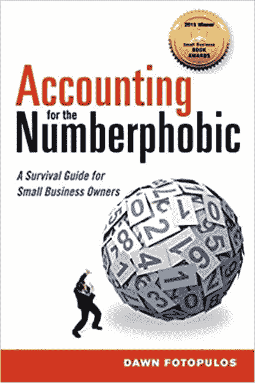

关于数字恐惧症的解释是一本由黎明·福特普洛斯（Dawn Fotopulos）撰写的书。 在本书中，您将学习财务报表，分类账，损益报告。

本书是有关净利润表，现金流量表和资产负债表的易于理解的指南。 这本书解释了如何衡量企业的整体健康状况。

这本会计参考书用通俗易懂的英文解释了每种衡量标准如何反映您的企业整体健康状况，并影响您的决策

[Check Latest Price and User Reviews on Amazon](https://geni.us/9CtxUR)

* * *

### 6）[小企业主会计](https://geni.us/HqNS)

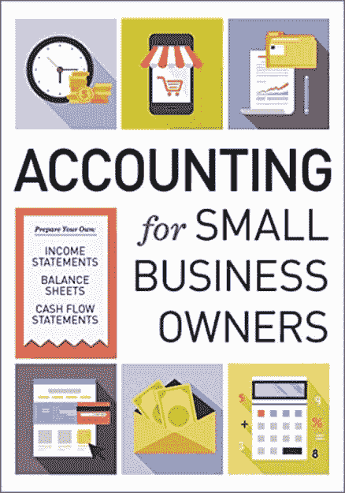

《小企业主会计》是第谷出版社出版的一本书。 这本会计书涵盖了如何为您的业务和常见财务场景建立可靠的会计。

本书涵盖了基本会计术语的人定义，示例会计报表。 它还包括许多提示和技巧，可帮助您简化会计流程。

管理和销售您的产品或服务，并执行月末帐户平衡。 本书包含基本会计术语的会计定义，示例会计报表以及许多简化会计流程的技巧。

[Check Latest Price and User Reviews on Amazon](https://geni.us/HqNS)

* * *

### 7）[叙事与数字：商业故事的价值](https://geni.us/rFMWB)

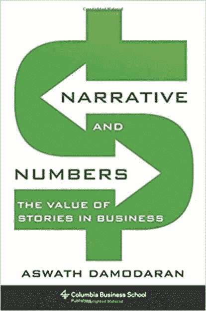

叙事与数字是阿斯瓦斯·达莫达兰（Aswath Damodaran）写的书。 在本书中，作者使用 Uber 的案例研究来解释叙事如何成为理解不同估值的关键。 该书还介绍了一些已建立的业务模型，例如 Apple 和 Amazon。

该书还涵盖了围绕数字编织叙事的好处，挑战和陷阱，以及如何最好地检验故事的真实性。

[Check Latest Price and User Reviews on Amazon](https://geni.us/rFMWB)

* * *

### 8）[基本会计准则](https://geni.us/4citFaI)

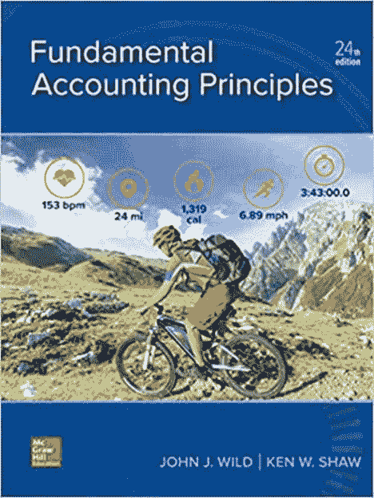

基本会计原理是 Ken Shaw 撰写的会计书籍。 这本书帮助会计入门的学生取得了成功。 通过逐步的方法，FAP 可以教您所有类型的会计流程。 该书还通过掌握关键的概念和程序来帮助学生建立信心。

本书以一章开头，阐述了如何利用充满活力的企业家对所有学生的吸引力。 它讨论了会计的相关性。 该书还提供作业，以向讲师提供在多个级别上教授，评估和挑战学生的材料。

[Check Latest Price and User Reviews on Amazon](https://geni.us/4citFaI)

* * *

### 9）[会计手册（巴伦会计手册）](https://geni.us/qeZeX)

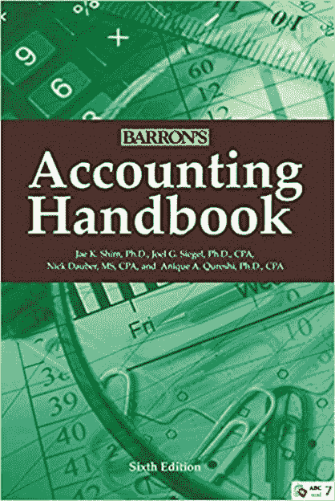

会计手册是由 Jae K. Shim，Joel G. Siegel，Nick Dauber 注册会计师，Anique Qureshi 撰写的书。 本书是财务会计的概述，描述了财务报表并提供了有关财务报告要求和合规性的详细信息。 像美国 GAAP（公认会计原则）和 IFRS（国际财务报告准则）一样。

它还涵盖成本管理，税单及其准备。 本书还包括会计术语的 A 到 Z 词典。

[Check Latest Price and User Reviews on Amazon](https://geni.us/qeZeX)

* * *

### 10）[税收和法律手册：改变您小企业问题的解决方案](https://geni.us/a29Vp0N)

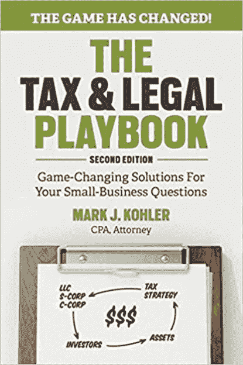

税收&法律手册由 Mark J. Kohler 撰写。 作者 Kohler 对新的税收和法律结构进行了全面的分析。 这可以帮助您使新税法为您服务。

在这本书中，作者讨论了有关税收和法律计划的真相并提供了实用的工具。 它可以帮助您节省税收并保护您的资产。 本书涵盖了许多精通税收的技巧，游戏计划和讨论要点。 它还涵盖了小企业所有者税收博弈的复杂性。

[Check Latest Price and User Reviews on Amazon](https://geni.us/a29Vp0N)

* * *

### 11）[财务会计：业务决策工具](https://geni.us/qhunq)

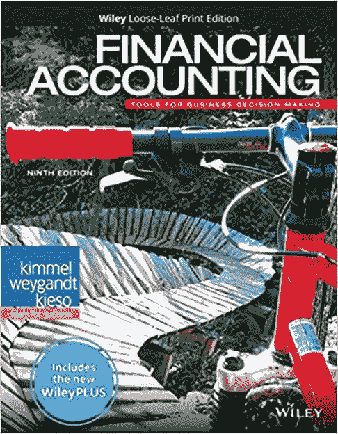

《财务会计：商业决策工具》是 Paul D. Kimmel Jerry J. Weygandt，Donald E. Kieso（作者）撰写的书。 这本书为财务会计提供了简单实用的介绍。 它解释了会计专业学生需要知道的概念。 它还强调了决策的重要性。

在这本书中，所有内容都经过了仔细的审查和修订，以确保学生最大程度地理解。 该书还介绍了一些功能，可帮助学生学习更多有关会计的知识。 它具有学生友好的写作风格，视觉教学法，并保留了相关且易于理解的示例。

[Check Latest Price and User Reviews on Amazon](https://geni.us/qhunq)