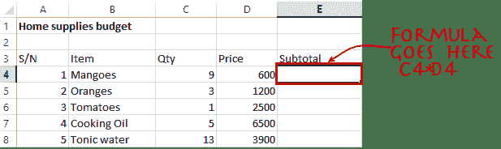
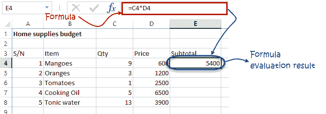
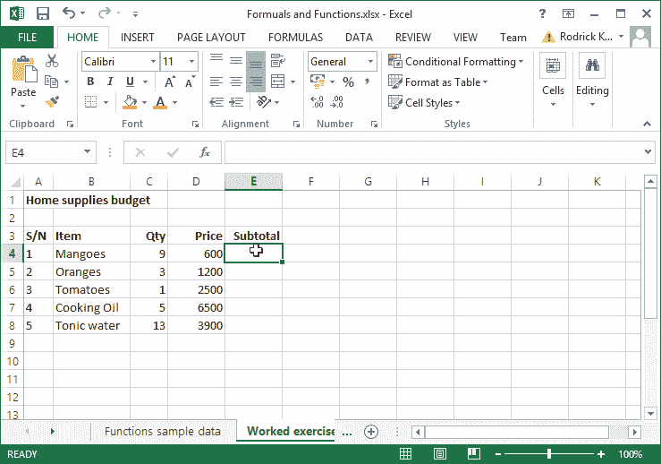
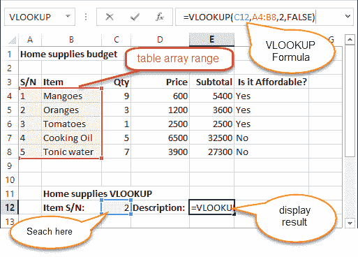
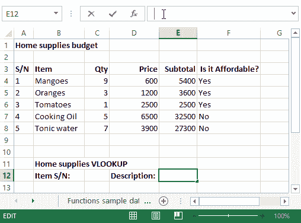

# Excel 公式&函数：学习基本示例

> 原文： [https://www.guru99.com/introduction-to-formulas-and-functions-in-excel.html](https://www.guru99.com/introduction-to-formulas-and-functions-in-excel.html)

公式和函数是在 Excel 中处理数字数据的基础。 本文向您介绍公式和函数。

在本文中，我们将介绍以下主题。

*   [Excel 中的公式是什么？](#1)
*   [在 Excel 中使用公式时应避免的错误](#2)
*   [Excel 中的功能是什么？](#3)
*   [功能的重要性](#4)
*   [常用功能](#5)
*   [数值函数](#6)
*   [字符串函数](#7)
*   [日期时间功能](#8)
*   [V 查找功能](#9)

## 教程数据

对于本教程，我们将使用以下数据集。

**家居用品预算**

| **S / N** | **项目** | **数量** | **价格** | **小计** | **价格适中吗？** |
| --- | --- | --- | --- | --- | --- |
| 1 | 芒果 | 9 | 600 |   |   |
| 2 | 橘子 | 3 | 1200 |   |   |
| 3 | 番茄 | 1 | 2500 |   |   |
| 4 | 食用油 | 5 | 6500 |   |   |
| 5 | 汤力水 | 13 | 3900 |   |   |

**房屋建筑项目时间表**

| **S/N** | **ITEM** | **开始日期** | **结束日期** | **持续时间（天）** |
| --- | --- | --- | --- | --- |
| 1 | 调查土地 | 04/02/2015 | 07/02/2015 |   |
| 2 | 莱基金会 | 10/02/2015 | 15/02/2015 |   |
| 3 | 屋面 | 27/02/2015 | 03/03/2015 |   |
| 4 | 绘画 | 09/03/2015 | 21/03/2015 |   |

## Excel 中的公式是什么？

**EXCEL 中的公式**是对单元格地址和运算符范围内的值进行运算的表达式。 例如，= A1 + A2 + A3，它将找到从单元格 A1 到单元格 A3 的值范围的总和。 由离散值（例如= 6 * 3）组成的公式示例。

```
=A2 * D2 / 2
```

**此处，**

*   `"="`告诉 Excel 这是一个公式，应该对其进行评估。
*   `"A2" * D2"`引用单元格地址 A2 和 D2，然后将在这些单元格地址中找到的值相乘。
*   `"/"`是除法算术运算符
*   `"2"`是离散值

### 公式练习

我们将使用房屋预算的样本数据来计算小计。

*   在 Excel 中创建一个新的工作簿
*   输入上面的家庭用品预算中显示的数据。
*   您的工作表应如下所示。



现在，我们将写出计算小计的公式

将焦点设置到单元格 E4

输入以下公式。

```
=C4*D4
```

**HERE,**

*   `"C4*D4"`使用算术运算符乘法（*）将单元地址 C4 和 D4 的值相乘。

按回车键

您将获得以下结果



下图显示了如何自动选择单元格地址并将相同的公式应用于其他行。



## 在 Excel 中使用公式时应避免的错误

1.  记住除法，乘法，加法，&减法**（BODMAS）的括号规则。** 这意味着表达式首先放在括号中。 对于算术运算符，首先求除法，然后相乘，然后加法和减法是最后要求值的算术运算。 使用此规则，我们可以将上面的公式重写为=（A2 * D2）/2。这将确保先对 A2 和 D2 求值，然后除以 2。
2.  Excel 电子表格公式通常适用于数字数据。 您可以利用数据验证来指定单元格应接受的数据类型，即仅数字。
3.  为确保您使用的是公式中引用的正确单元格地址，可以按键盘上的 F2。 这将突出显示公式中使用的单元格地址，您可以交叉检查以确保它们是所需的单元格地址。
4.  当您处理许多行时，可以对所有行使用序列号，并在工作表的底部有一个记录数。 您应该将序列号计数与记录总数进行比较，以确保您的公式包括所有行。

签出[前 10 个 Excel 电子表格公式](https://career.guru99.com/top-10-excel-formulas-asked-in-an-interview/)

## Excel 中的功能是什么？

**EXCEL 中的功能**是预定义的公式，用于按特定顺序显示特定值。 函数用于快速任务，例如查找某个单元格范围的总和，计数，平均值，最大值和最小值。 例如，下面的单元格 A3 包含 SUM 函数，该函数计算范围 A1：A2 的总和。

*   **SUM** 用于求和一个数字范围
*   **AVERAGE** 用于计算给定数字范围的平均值
*   **COUNT** 用于计数给定范围内的项目数

## 功能的重要性

**函数可在使用 excel** 时提高用户的工作效率。 假设您希望获得上述家庭用品预算的总计。 为了使其更简单，您可以使用公式来获取总计。 使用公式，您将必须一一引用单元格 E4 到 E8。 您将必须使用以下公式。

```
= E4 + E5 + E6 + E7 + E8
```

使用一个函数，您可以将上面的公式写为

```
=SUM (E4:E8)
```

从上面用于获取某个单元格范围总和的函数可以看出，使用函数获取总和比使用必须引用大量单元格的公式更有效。

## 常用功能

让我们看一下 ms excel 公式中一些最常用的函数。 我们将从统计功能开始。

| **S/N** | **功能** | **类别** | **说明** | **用法** |
| --- | --- | --- | --- | --- |
| 01 | 和 | 数学&触发 | 将所有值加到单元格范围内 | =总和（E4：E8） |
| 02 | 最低 | 统计 | 在一系列单元格中找到最小值 | = MIN（E4：E8） |
| 03 | 最大值 | Statistical | 在一系列单元格中找到最大值 | =最大（E4：E8） |
| 04 | 平均 | Statistical | 计算单元格范围内的平均值 | =平均（E4：E8） |
| 05 | 计数 | Statistical | 计算一个单元格范围内的单元格数量 | = COUNT（E4：E8） |
| 06 | 只要 | 文本 | 返回字符串文本中的字符数 | = LEN（B7） |
| 07 | 求和 | Math & Trig | 将满足指定条件的一系列单元格中的所有值相加。 = SUMIF（range，criteria，[sum_range]） | = SUMIF（D4：D8，“ > = 1000”，C4：C8） |
| 08 | 平均值 | Statistical | 计算满足指定条件的一系列单元格中的平均值。 = AVERAGEIF（范围，条件，[平均范围]） | = AVERAGEIF（F4：F8，“是”，E4：E8） |
| 09 | 天 | 日期&时间 | 返回两个日期之间的天数 | =天（D4，C4） |
| 10 | 现在 | Date & Time | 返回当前系统日期和时间 | =现在（） |

## 数值函数

顾名思义，这些函数对数字数据起作用。 下表显示了一些常见的数字函数。

| **S/N** | **FUNCTION** | **CATEGORY** | **DESCRIPTION** | **USAGE** |
| --- | --- | --- | --- | --- |
| 1 | ISNUMBER | 信息 | 如果提供的值是数字，则返回 True；否则，则返回 False。 | = ISNUMBER（A3） |
| 2 | 行 | Math & Trig | 生成介于 0 和 1 之间的随机数 | =兰德（） |
| 3 | 回合 | Math & Trig | 将十进制值四舍五入为指定的小数点位数 | =圆（3.14455,2） |
| 4 | 中位数 | Statistical | 返回给定数字集中的数字 | = MEDIAN（3,4,5,2,5） |
| 5 | PI | Math & Trig | 返回数学函数 PI（π）的值 | =PI() |
| 6 | 功率 | Math & Trig | 返回数字加幂的结果。 **POWER（数字，功率）** | =电源（2,4） |
| 7 | 反对 | Math & Trig | 除以两个数字时，返回余数 | = V（10.3） |
| 8 | 罗马人 | Math & Trig | 将数字转换为罗马数字 | =罗马（1984） |

## 字符串函数

这些基本的 Excel 功能用于处理文本数据。 下表显示了一些常见的字符串函数。

| **S/N** | **FUNCTION** | **CATEGORY** | **DESCRIPTION** | **USAGE** | **评论** |
| --- | --- | --- | --- | --- | --- |
| 1 | 剩下 | Text | 从字符串的开头（左侧）返回多个指定字符 | = LEFT（“ GURU99”，4） | “ GURU99”的左 4 个字符 |
| 2 | 对 | Text | 从字符串的结尾（右侧）返回多个指定字符 | = RIGHT（“ GURU99”，2） | “ GURU99”的右 2 个字符 |
| 3 | 中 | Text | 从指定起始位置和长度的字符串中间检索多个字符。 **= MID（文本，s​​tart_num，num_chars）** | = MID（“ GURU99”，2,3） | 检索字符 2 到 5 |
| 4 | ISTEXT | Information | 如果提供的参数为 Text，则返回 True | = ISTEXT（值） | value-要检查的值。 |
| 5 | 找 | Text | 返回一个文本字符串在另一个文本字符串中的起始位置。 此功能区分大小写。 **= FIND（find_text，inside_text，[start_num]）** | = FIND（“ oo”，“屋顶”，1） | 在“屋顶”中找到 oo，结果为 2 |
| 6 | 更换 | Text | 用另一个指定的字符串替换字符串的一部分。 **= REPLACE（旧文本，start_num，num_chars，new_text）** | = REPLACE（“屋顶”，2,2，“ xx”） | 将“ oo”替换为“ xx” |

## 日期时间功能

这些功能用于操纵日期值。 下表显示了一些常见的日期函数

| **S/N** | **FUNCTION** | **CATEGORY** | **DESCRIPTION** | **USAGE** |
| --- | --- | --- | --- | --- |
| 1 | 日期 | Date & Time | 返回代表 Excel 代码中日期的数字 | =日期（2015,2,4） |
| 2 | DAYS | Date & Time | 查找两个日期之间的天数 | =天（D6，C6） |
| 3 | 月 | Date & Time | 从日期值返回月份 | = MONTH（“ 4/2/2015”） |
| 4 | 分钟 | Date & Time | 从时间值返回分钟 | = MINUTE（“ 12:31”） |
| 5 | 年 | Date & Time | 从日期值返回年份 | = YEAR（“ 2015 年 4 月 2 日”） |

## VLOOKUP 功能

VLOOKUP 函数用于在最左边的列中执行垂直查找，并从您指定的列的同一行中返回一个值。 让我们用外行的语言解释一下。 家居用品预算有一个序列号列，可唯一标识预算中的每个项目。 假设您具有商品序列号，并且想要了解商品说明，则可以使用 VLOOKUP 函数。 这是 VLOOKUP 函数的工作方式。



```
=VLOOKUP (C12, A4:B8, 2, FALSE)
```

**HERE,**

*   `"=VLOOKUP"`调用垂直查找功能
*   `"C12"`在最左侧的列中指定要查找的值
*   `"A4:B8"`指定包含数据的表数组
*   `"2"`指定列号和要由 VLOOKUP 函数返回的行值
*   `"FALSE,"`告诉 VLOOKUP 函数，我们正在寻找提供的查找值的精确匹配

下面的动画图像显示了这一点



[下载上面的 Excel 代码](https://drive.google.com/uc?export=download&id=0BwL5un1OyjsdeVZ0NzVadm93S1E)

## 摘要

Excel 允许您使用公式和/或函数来处理数据。 与编写公式相比，函数通常更高效。 与公式相比，函数也更准确，因为犯错误的可能性非常小。

## 这是重要的 Excel 公式和函数的列表

*   SUM 函数= `=SUM(E4:E8)`

*   MIN 功能= `=MIN(E4:E8)`

*   MAX 功能= `=MAX(E4:E8)`

*   平均功能= `=AVERAGE(E4:E8)`

*   COUNT 个功能= `=COUNT(E4:E8)`

*   DAYS 函数= `=DAYS(D4,C4)`

*   VLOOKUP 函数= `=VLOOKUP (C12, A4:B8, 2, FALSE)`

*   DATE 功能= `=DATE(2020,2,4)`