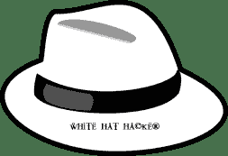
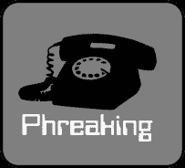

# 什么是骇客？ 简介&类型

> 原文： [https://www.guru99.com/what-is-hacking-an-introduction.html](https://www.guru99.com/what-is-hacking-an-introduction.html)

## 什么是骇客？

**黑客正在识别计算机系统或网络中的弱点，以利用其弱点来获得访问权限**。 黑客示例：使用密码破解算法来访问系统

计算机已成为经营成功企业的必备条件。 拥有孤立的计算机系统是不够的。 他们需要联网以促进与外部企业的沟通。 这使他们暴露于外界和黑客攻击。 黑客攻击是指使用计算机实施欺诈行为，例如欺诈，侵犯隐私，窃取公司/个人数据等。网络犯罪每年使许多组织损失数百万美元。 企业需要保护自己免受此类攻击。

在本教程中，我们将学习-

*   [常见的黑客术语](#2)
*   [什么是网络犯罪？](#3)
*   [网络犯罪的类型](#4)
*   [什么是道德黑客？](#5)
*   [为什么要进行道德黑客攻击？](#6)
*   [道德黑客的合法性](#7)
*   [摘要](#8)

在进一步介绍之前，让我们看一下黑客世界中一些最常用的术语。

## 谁是黑客？ 黑客类型

**黑客**是发现并利用计算机系统和/或网络中的弱点来获取访问权限的人。 黑客通常是具有计算机安全知识的熟练计算机程序员。

黑客根据其行为意图进行分类。 以下列表根据黑客的意图将其分类。

| **符号** | **说明** |
|  | **道德黑客（白帽子）**：黑客可以使用系统来修复已发现的弱点。 他们还可能执行渗透[测试](/software-testing.html)和漏洞评估。 |
|  | **破解者（黑帽）**：黑客未经授权访问计算机系统以谋取私利。 目的通常是窃取公司数据，侵犯隐私权，从银行帐户转移资金等。 |
|  | **灰帽子**：介于道德和黑帽黑客之间的黑客。 他/她未经授权擅自闯入计算机系统，以找出薄弱环节并将其揭示给系统所有者。 |
|  | **脚本小子**：一个非熟练人员，可以使用已经制作的工具访问计算机系统。 |
|  | **Hacktivist**：使用黑客发送社交，宗教和政治等消息的黑客。 这通常是通过劫持网站并将邮件保留在被劫持的网站上来完成的。 |
|  | **Phreaker**：黑客，他识别并利用电话而非计算机中的弱点。 |

## 什么是网络犯罪？

网络犯罪是指使用计算机和网络来进行非法活动，例如传播计算机病毒，在线欺凌，进行未经授权的电子资金转移等。大多数网络犯罪都是通过互联网实施的。 还可以通过短信和在线聊天应用程序使用[移动](/mobile-testing.html)手机来进行某些网络犯罪。

## 网络犯罪的类型

*   以下列表介绍了网络犯罪的常见类型：
*   **计算机欺诈**：通过使用计算机系统故意欺骗个人收益。
*   **侵犯隐私**：在社交媒体，网站等上公开诸如电子邮件地址，电话号码，帐户详细信息等个人信息。
*   **身份盗用**：窃取某人的个人信息并冒充该人。
*   **共享受版权保护的文件/信息**：这涉及到分发受版权保护的文件，例如电子书和计算机程序等。
*   **电子资金转帐**：这涉及获得未经授权的银行计算机网络访问权限和非法资金转帐。
*   **电子洗钱**：这涉及使用计算机洗钱。
*   **ATM 欺诈**：这涉及到拦截 ATM 卡详细信息，例如帐号和 PIN 码。 这些详细信息然后用于从被拦截的帐户中提取资金。
*   **拒绝服务攻击**：这涉及在多个位置使用计算机来攻击服务器，以将其关闭。
*   **Spam:** Sending unauthorized emails. These emails usually contain advertisements.

## 什么是道德黑客？

道德黑客正在发现计算机系统和/或计算机网络中的弱点，并提出保护弱点的对策。 道德黑客必须遵守以下规则。

*   遭到黑客入侵之前，请先从计算机系统和/或计算机网络的所有者那里获得**书面许可**。
*   **保护被黑客入侵的组织**的隐私。
*   **向组织透明地报告**计算机系统中所有已发现的弱点。
*   **向**硬件和软件供应商通知**发现了弱点**。

## 为什么要进行道德黑客攻击？

*   信息是组织最有价值的资产之一。 保持信息安全可以保护组织的形象，并为组织节省大量金钱。
*   黑客攻击可能导致从事金融交易的组织（例如 PayPal）失去业务。 符合道德规范的黑客行为使他们领先于网络犯罪分子，否则他们将导致业务损失。

## 道德黑客的合法性

**如果黑客遵守上一节中关于道德黑客**定义的规则，则道德黑客是合法的。 [国际电子商务顾问理事会（EC-Council）](http://www.eccouncil.org/)提供了一项认证计划，用于测试个人的技能。 通过考试者将被授予证书。 证书应该在一段时间后更新。

## 摘要

*   黑客行为是识别和利用计算机系统和/或计算机网络中的弱点。
*   网络犯罪正在计算机和信息技术基础设施的帮助下犯罪。
*   道德黑客行为是关于提高计算机系统和/或计算机网络的安全性。
*   道德黑客行为是合法的。