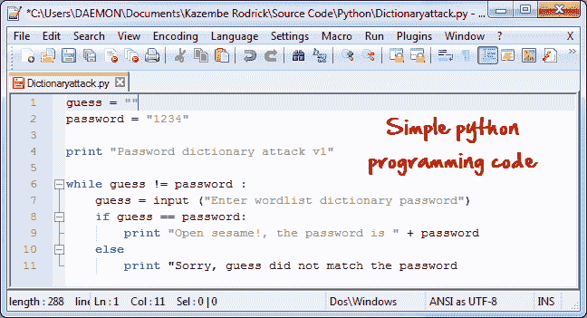

# 成为道德黑客所需的技能

> 原文： [https://www.guru99.com/skills-required-become-ethical-hacker.html](https://www.guru99.com/skills-required-become-ethical-hacker.html)

**技能使您可以在可用的时间和资源范围内实现期望的目标。 作为一名黑客，您将需要发展技能来帮助您完成工作**。 这些技能包括学习如何编程，使用 Internet，善于解决问题以及利用现有的安全工具。

在本文中，我们将向您介绍作为黑客您必须了解的常见编程语言和技能。

## 本教程涵盖的主题

*   [什么是编程语言？](#1)
*   [为什么要学习编程？](#2)
*   [您应该学习什么语言？](#3)
*   [其他技能](#4)
*   [摘要](#7)

## 什么是编程语言？

编程语言是用于开发计算机程序的语言。 开发的程序可以从操作系统到操作系统。 基于数据的应用程序到网络解决方案。

## 为什么要学习编程？

*   黑客是问题的解决者和工具的构建者，学习如何编程将帮助您实现问题的解决方案。 它还使您与脚本小子区分开。
*   以黑客身份编写程序将帮助您自动执行许多任务，这些任务通常需要大量时间才能完成。
*   编写程序还可以帮助您识别和利用将要定位的应用程序中的编程错误。
*   您不必总是重新发明轮子，并且有许多易于使用的开源程序。 您可以定制已经存在的应用程序，并添加适合您需要的方法。

## 我应该学习什么语言？

该问题**的答案取决于您的目标计算机系统和平台**。 一些编程语言仅用于特定平台的开发。 例如，Visual Basic Classic（3、4、5 和 6.0）用于编写在 Windows 操作系统上运行的应用程序。 因此，当您的目标是入侵 [Linux](/unix-linux-tutorial.html) 系统时，学习如何在 Visual Basic 6.0 中编程将是不合逻辑的。

## **对黑客有用的编程语言**

| **SR 号** | **计算机**
**语言** | **说明** | **平台** | **目的** |
| --- | --- | --- | --- | --- |
| 1 | **HTML**

 | 用于编写网页的语言。 | *跨平台 | **Web 黑客**

Web 上的登录表单和其他数据输入方法使用 HTML 表单获取数据。 能够编写和解释 HTML，使您可以轻松地识别和利用代码中的弱点。 |
| 2 | **[JavaScript](/interactive-javascript-tutorials.html)**

 | 客户端脚本语言 | *Cross platform | **Web 黑客**

在客户端浏览器上执行 JavaScript 代码。 您可以使用它来读取保存的 cookie 并执行跨站点脚本编写等。 |
| 3 | **[PHP](/php-tutorials.html)**

 | 服务器端脚本语言 | *Cross platform | **Web 黑客**

PHP 是最常用的 Web 编程语言之一。 它用于处理 HTML 表单并执行其他自定义任务。 您可以使用 PHP 编写自定义应用程序，以修改 Web 服务器上的设置并使服务器容易受到攻击。 |
| 4 | **[SQL](/sql.html)**

 | 用于与数据库通信的语言 | *Cross platform | **Web 黑客**

使用 SQL 注入，绕过弱的 Web 应用程序登录算法，从数据库中删除数据，等等。 |
| 5 | **[Python](/python-tutorials.html)**

**Ruby**

**Bash**

**[Perl](/perl-tutorials.html)**

 | 高级编程语言 | *Cross platform | **构建工具&脚本**

当您需要开发自动化工具和脚本时，它们会派上用场。 获得的知识也可以用于理解和定制现有工具。 |
| 6 | **C & C ++**

 | 高级编程 | *Cross platform | **编写漏洞利用程序，shell 代码等。**

当您需要编写自己的 shell 代码，漏洞利用程序，root 工具包或了解和扩展现有的外壳代码时，它们会派上用场。 |
| 7 | **[Java](/java-tutorial.html)**

**[CSharp](/c-sharp-tutorial.html)**

**Visual Basic**
[
**[VBScript](/vbscript-tutorials-for-beginners.html)**

 | 其他语言

 | Java & CSharp 是跨平台的。 Visual Basic 特定于 Windows | **其他用途**

这些语言的用处取决于您的情况。 |

*跨平台意味着使用特定语言开发的程序可以部署在不同的操作系统上，例如 Windows，基于 Linux，MAC 等。

## 其他技能

除了编程技能，一个好的黑客还应该具备以下技能：

*   **知道如何有效地使用互联网和搜索引擎**来收集信息。
*   获得一个基于 Linux 的**操作系统**，并了解每个 Linux 用户都应该知道的基本命令。
*   **实践**完美无缺，一个好的黑客应该努力工作，并为黑客社区做出积极的贡献。 他/她可以通过开发开源程序，在黑客论坛中回答问题等来做出贡献。

## 摘要

*   编程技能对于成为一名有效的黑客至关重要。
*   网络技能对于成为有效的黑客至关重要
*   SQL 技能对于成为有效的黑客至关重要。
*   黑客工具是可以简化识别和利用计算机系统中漏洞的程序。