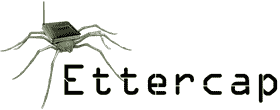
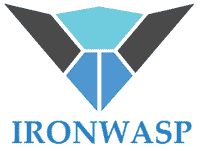
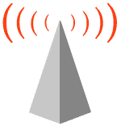
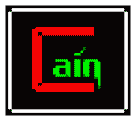
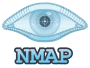

# 2020 年排名前 20 位的道德黑客工具

> 原文： [https://www.guru99.com/learn-everything-about-ethical-hacking-tools-and-skills.html](https://www.guru99.com/learn-everything-about-ethical-hacking-tools-and-skills.html)

## 什么是黑客工具？

黑客工具是计算机程序和脚本，可帮助您发现和利用计算机系统，Web 应用程序，服务器和网络中的弱点。 市场上有各种各样的此类黑客工具。 其中一些是开源的，而另一些是商业解决方案。

以下是精选的 20 种最佳道德黑客工具，以及它们的流行功能和网站链接。 该列表同时包含开源（免费）和商业（付费）软件。

### 1） [Netsparker](https://bit.ly/2Mvakgc)

[Netsparker](https://bit.ly/2Mvakgc) 是易于使用的 Web 应用程序安全扫描程序，可以自动在 Web 应用程序和 Web 服务中查找 SQL 注入，XSS 和其他漏洞。 它可以作为本地和 SAAS 解决方案使用。

**功能**

*   借助独特的基于证明的扫描技术，可以彻底准确地检测漏洞。
*   所需的配置最少。 扫描程序会自动检测 URL 重写规则，自定义 404 错误页面。
*   REST API，用于与 SDLC，错误跟踪系统等进行无缝集成。
*   完全可扩展的解决方案。 只需 24 小时即可扫描 1,000 个 Web 应用程序。

* * *

### 2） [Acunetix](https://bit.ly/2Msq7AB)

[Acunetix](https://bit.ly/2Msq7AB) 是一种全自动的道德黑客解决方案，它模仿黑客，使其领先于恶意入侵者。 Web 应用程序安全扫描程序可准确扫描 HTML5，JavaScript 和单页应用程序。 它可以审核复杂的，经过身份验证的 Web 应用程序，并发布有关各种 Web 和网络漏洞的合规性和管理报告。

**功能：**

*   扫描 SQL 注入，XSS 和 4500 多个其他漏洞的所有变体
*   检测 1200 多个 WordPress 核心，主题和插件漏洞
*   快速&可扩展–无需中断即可抓取数十万个页面
*   与流行的 WAF 和问题跟踪器集成以帮助 SDLC
*   在本地和作为云解决方案可用。

* * *

### 3） [SaferVPN](https://bit.ly/2YWmhSv)

[SaferVPN](https://bit.ly/2YWmhSv) 是道德黑客武器库中必不可少的工具。 您可能需要它来检查不同地理位置的目标，模拟非个性化的浏览行为，匿名文件传输等。

**Features:**

*   没有高安全性和匿名性的 Log VPN
*   跨大洲的 2000 多个服务器的极快速度
*   它位于香港，不存储任何数据。
*   拆分隧道和 5 个同时登录
*   24/7 支持
*   支持 Windows，Mac，Android，Linux，iPhone 等
*   300,000+个 IP
*   端口转发，专用 IO 和 P2P 保护
*   31 天退款保证

* * *

### 4）打 p 套房：

[Burp Suite](https://portswigger.net/burp/freedownload) 是用于执行 Web 应用程序的[安全性测试](/what-is-security-testing.html)的有用平台。 它的各种黑客工具可以无缝地协同工作，以支持整个笔测试过程。 它涵盖从初始映射到应用程序攻击面的分析。

**Features:**

它可以检测 3000 多个 Web 应用程序漏洞。

*   扫描开源软件和定制应用程序
*   易于使用的登录序列记录器允许自动扫描
*   使用内置的漏洞管理功能查看漏洞数据。
*   轻松提供各种技术和合规性报告
*   以 100％的准确度检测关键漏洞
*   自动抓取和扫描
*   手动测试仪的高级扫描功能
*   尖端的扫描逻辑

**下载链接：** [https://portswigger.net/burp/freedownload](https://portswigger.net/burp/freedownload)

* * *

### 5） [Luminati](https://bit.ly/2Z3YoLM)

[Luminati](https://bit.ly/2Z3YoLM) 是一个代理服务提供商，在全球范围内提供超过 4000 万个住宅和其他 IP。 该网站允许您通过其自己的 API 集成代理 IP，这些 API 以所有常见的编码语言提供。

**Features:**

*   灵活的计费方式以及功能强大且可配置的工具
*   使用代理浏览网络，而无需编码或复杂的集成
*   无需任何编码即可管理代理。

* * *

### 6）Ettercap：

[Ettercap](https://ettercap.github.io/ettercap/downloads.html) 是一种道德的黑客工具。 它支持主动和被动解剖，包括用于网络和主机分析的功能。

**Features:**

*   它支持许多协议的主动和被动解剖
*   ARP 中毒功能，可嗅探两台主机之间的交换局域网
*   可以在保持实时连接的同时将角色注入服务器或客户端
*   Ettercap 能够嗅探全双工的 SSH 连接
*   即使使用代理建立连接，也允许嗅探 HTTP SSL 安全数据
*   允许使用 Ettercap 的 API 创建自定义插件

**下载链接：** [https://ettercap.github.io/ettercap/downloads.html](https://ettercap.github.io/ettercap/downloads.html)

* * *

### 7）空袭：

[Aircrack](https://www.aircrack-ng.org/downloads.html) 是市场上最可信赖的道德黑客工具之一。 它会破解易受攻击的无线连接。 它由 WEP WPA 和 WPA 2 加密密钥提供支持。

**Features:**

*   支持更多卡/驱动程序
*   支持所有类型的操作系统和平台
*   新的 WEP 攻击：PTW
*   支持 WEP 词典攻击
*   支持碎片攻击
*   改善追踪速度

**下载链接：** [https://www.aircrack-ng.org/downloads.html](https://www.aircrack-ng.org/downloads.html)

* * *

### 8）愤怒的 IP 扫描器：

[Angry IP Scanner](http://angryip.org/download/) 是开源和跨平台的道德黑客工具。 它扫描 IP 地址和端口。

**Features:**

*   扫描本地网络和 Internet
*   免费和开源的黑客工具
*   随机或任何格式的文件
*   将结果导出为多种格式
*   可通过许多数据获取器进行扩展
*   提供命令行界面
*   在 Windows，Mac 和 Linux 上均可使用
*   无需安装

**下载链接：** [http://angryip.org/download/#windows](http://angryip.org/download/)

* * *

### 9） [GFI LanGuard：](https://bit.ly/2YhXCdH)

[GFI LanGuard](https://bit.ly/2YhXCdH) 是一种道德工具，可扫描网络是否存在漏洞。 它可以按需充当您的“虚拟安全顾问”。 它允许创建每个设备的资产清单。

**Features:**

*   随着时间的推移，它有助于维护安全的网络，以了解哪些更改正在影响您的网络，
*   补丁程序管理：修复攻击前的漏洞
*   集中分析网络
*   尽早发现安全威胁
*   通过集中进行漏洞扫描来降低拥有成本
*   帮助维护安全且合规的网络

**下载链接：** [https://www.gfi.com/products-and-solutions/network-security-solutions/gfi-languard/download](https://bit.ly/2YhXCdH)

* * *

### 10）Savvius：

这是一个道德的黑客工具。 它具有性能问题，并通过 Omnipeek 提供的深入可见性降低了安全风险。 利用 Savvius 数据包智能，它可以更快，更好地诊断网络问题。

**Features:**

*   功能强大，易于使用的网络取证软件
*   Savvius 自动捕获快速调查安全警报所需的网络数据捕获
*   软件和集成设备解决方案
*   数据包智能结合了深度分析
*   快速解决网络和安全问题
*   易于使用的直观工作流程
*   专家和响应迅速的技术支持
*   设备的现场部署
*   对我们的客户和我们的产品的承诺

**下载链接：** [https://www.savvius.com/distributed_network_analysis_suite_trial](https://www.savvius.com/distributed_network_analysis_suite_trial)

* * *

### 11）QualysGuard：

[Qualys Guard](https://www.qualys.com/forms/freescan/) 可帮助企业简化其安全性和合规性解决方案。 它还将安全性纳入其数字化转型计划中。 该工具还可以检查在线云系统的性能漏洞。

**Features:**

*   受到全球信赖
*   无需购买或管理的硬件
*   它是可扩展的，端到端的解决方案，适用于 IT 安全的所有方面
*   在负载均衡服务器的 n 层架构上安全存储和处理漏洞数据
*   它的传感器提供连续的可见性
*   实时分析数据
*   它可以实时响应威胁

**下载链接：** [https://www.qualys.com/forms/freescan/](https://www.qualys.com/forms/freescan/)

* * *

### 12）WebInspect：

[WebInspect](https://saas.hpe.com/en-us/software/webinspect) 是自动化的动态应用程序安全性测试，允许执行道德黑客技术。 它提供了对复杂 Web 应用程序和服务的全面动态分析。

**Features:**

*   允许测试正在运行的 Web 应用程序的动态行为，以识别安全漏洞
*   一目了然地掌握相关信息和统计信息，从而控制您的扫描
*   集中计划管理
*   先进技术，例如对新手安全测试人员的同时爬网专业级测试
*   轻松地向管理人员通报漏洞趋势，合规性管理和风险监督

**下载链接：** [https://saas.hpe.com/en-us/software/webinspect](https://saas.hpe.com/en-us/software/webinspect)

* * *

### 13）哈希猫：

[Hashcat](https://hashcat.net/hashcat/) 是一个强大的密码破解和道德黑客工具。 它可以帮助用户恢复丢失的密码，审核密码安全性，或仅找出哈希中存储了哪些数据。

**Features:**

*   开源平台
*   多平台支持
*   允许在同一系统中使用多个设备
*   在同一系统中使用混合设备类型
*   它支持分布式破解网络
*   支持交互式暂停/恢复
*   支持会话和还原
*   内置基准系统
*   集成热看门狗
*   支持自动性能调整

**下载链接：** [https://hashcat.net/hashcat/](https://hashcat.net/hashcat/)

* * *

### 14）L0phtCrack：

[L0phtCrack](http://www.l0phtcrack.com/) 6 是有用的密码审核和恢复工具。 它可以识别和评估本地计算机和网络上的密码漏洞。

**Features:**

*   多核&多 GPU 支持有助于优化硬件
*   易于定制
*   简单的密码加载
*   安排复杂的任务以获取企业范围的自动密码
*   通过强制重置密码或锁定帐户来解决弱密码问题
*   它允许多个审计操作系统

**下载链接：** [http://www.l0phtcrack.com/#download-form](http://www.l0phtcrack.com/)

* * *

### 15）彩虹裂缝

[RainbowCrack](http://project-rainbowcrack.com/index.htm) RainbowCrack 是一种广泛用于黑客攻击设备的密码破解和道德黑客工具。 它用彩虹桌子破解散列。 为此，它使用了时间内存折衷算法。

**Features:**

*   全时间记忆权衡工具套件，包括彩虹表生成
*   它支持任何哈希算法的彩虹表
*   支持任何字符集的彩虹表
*   支持原始文件格式（.rt）和紧凑文件格式的 Rainbow 表
*   计算对多核处理器的支持
*   多个 GPU 的 GPU 加速
*   在 Windows OS 和 Linux 上运行
*   每个受支持的操作系统上的统一 Rainbow 表文件格式
*   命令行用户界面
*   图形用户界面

**下载链接：** [http://project-rainbowcrack.com/index.htm](http://project-rainbowcrack.com/index.htm)

* * *

### 16）IKECrack：

[IKECrack](http://ikecrack.sourceforge.net/) 是一个开源身份验证破解工具。 此道德黑客工具旨在暴力破解或字典攻击。 该工具还允许执行加密任务。

**Features:**

*   IKECrack 是一种可以执行加密任务的工具
*   启动客户端将加密选项建议，DH 公共密钥，随机数和未加密数据包中的 ID 发送给网关/响应者。
*   它可免费用于个人和商业用途。 因此，对于希望选择密码程序的用户来说，这是一个完美的选择

**下载链接：** [http://ikecrack.sourceforge.net/](http://ikecrack.sourceforge.net/)

* * *

### 17）IronWASP：

[IronWASP](http://ironwasp.org/download.html) 是用于道德黑客的开源黑客软件。 这是 Web 应用程序漏洞测试。 它被设计为可自定义的，以便用户可以使用它创建其自定义安全扫描程序。

**Features:**

*   基于 GUI 且非常易于使用
*   它具有强大而有效的扫描引擎
*   支持记录登录顺序
*   以 HTML 和 RTF 格式报告
*   检查 25 种以上的网络漏洞
*   错误肯定和否定检测支持
*   它支持 Python 和 Ruby
*   可使用 Python，Ruby，C＃或 VB.NET 中的插件或模块进行扩展

**下载链接：** [http://ironwasp.org/download.html](http://ironwasp.org/download.html)

* * *

### 18）美杜莎

[美杜莎](http://foofus.net/goons/jmk/medusa/medusa.html)是最好的在线暴力破解，快速，并行密码破解者道德黑客工具之一。 该黑客工具包也广泛用于道德黑客。

**Features:**

*   它以快速，大规模并行，模块化，登录暴力的方式进行设计
*   该工具的主要目的是支持尽可能多的允许远程身份验证的服务
*   允许执行基于线程的并行测试和蛮力测试
*   灵活的用户输入。 可以通过多种方式指定
*   所有服务模块都作为独立的.mod 文件存在。
*   无需修改核心应用程序即可扩展支持的服务列表以进行暴力破解

**下载链接：** [http://foofus.net/goons/jmk/medusa/medusa.html](http://foofus.net/goons/jmk/medusa/medusa.html)

* * *

### 19）NetStumbler

[NetStumbler](http://www.stumbler.net/) 用于检测 Windows 平台上的无线网络。

**Features:**

*   验证网络配置
*   查找 WLAN 中覆盖范围较差的位置
*   检测无线干扰的原因
*   检测未经授权的（“恶意”）访问点
*   瞄准定向天线以实现长距离 WLAN 链路

**下载链接：** [http://www.stumbler.net/](http://www.stumbler.net/)

* * *

### 20）SQLMap

[SQLMap](http://sqlmap.org/) 使检测和利用 SQL 注入漏洞的过程自动化。 它是开源和跨平台的。 它支持以下数据库引擎。

*   的 MySQL
*   甲骨文
*   PostgreSQL SQL
*   MS SQL 服务器
*   MS Access
*   IBM DB2
*   SQLite 的
*   火鸟
*   Sybase 和 SAP MaxDB

它支持以下 SQL 注入技术；

*   基于布尔的盲注
*   基于时间的盲人
*   基于错误
*   UNION 查询
*   堆叠查询和带外。

**下载链接：** [http://sqlmap.org/](http://sqlmap.org/)

* * *

### 21）该隐&亚伯

[该隐& Abel](http://www.softpedia.com/get/Security/Decrypting-Decoding/Cain-and-Abel.shtml) 是 Microsoft 操作系统密码恢复工具。 它用于-

*   恢复 MS Access 密码
*   找回密码字段
*   嗅探网络
*   使用字典攻击，暴力破解和密码分析攻击来破解加密密码。

**下载链接：** [http://www.softpedia.com/get/Security/Decrypting-Decoding/Cain-and-Abel.shtml](http://www.softpedia.com/get/Security/Decrypting-Decoding/Cain-and-Abel.shtml)

* * *

### 22）雀巢

[Nessus](https://www.tenable.com/products/nessus/nessus-professional) 可用于执行；

*   远程漏洞扫描器
*   密码字典攻击
*   拒绝服务攻击。

它是封闭源代码，跨平台的，可供个人免费使用。

**下载链接：** [https://www.tenable.com/products/nessus/nessus-professional](https://www.tenable.com/products/nessus/nessus-professional)

* * *

### 23）Zenmap

[Zenmap](https://nmap.org/download.html) 是官方的 Nmap Security Scanner 软件。 它是一个多平台的免费开放源代码应用程序。 它对于初学者来说易于使用，但也为经验丰富的用户提供高级功能。

**Features:**

*   交互式和图形结果查看
*   它在方便的显示中总结了有关单个主机或完整扫描的详细信息。
*   它甚至可以绘制发现的网络的拓扑图。
*   它可以显示两次扫描之间的差异。
*   它允许管理员跟踪出现在其网络上的新主机或服务。 或跟踪出现故障的现有服务

**下载链接：** [https://nmap.org/download.html](https://nmap.org/download.html)

## 常问问题

## are 什么是黑客工具？

黑客工具是计算机程序和脚本，可帮助您发现和利用计算机系统，Web 应用程序，服务器和网络中的弱点。 市场上有各种这样的工具。 其中一些是开源的，而另一些是商业解决方案。

## 💻 Is it Legal to use Hacking Tools?

出于白帽黑客目的使用黑客工具是合法的。 在发起渗透攻击之前，必须获得目标网站的书面许可，这一点很重要。 未经许可，任何有意的黑客企图都会使您陷入法律麻烦。

## ❓ What are Hacking Tools?

Hacking Tools are computer programs and scripts that help you find and exploit weaknesses in computer systems, web applications, servers and networks. There is a variety of such tools available on the market. Some of them are open source while others are commercial solution.

Hacking Tools are computer programs and scripts that help you find and exploit weaknesses in computer systems, web applications, servers and networks. There is a variety of such tools available on the market. Some of them are open source while others are commercial solution.

Hacking Tools are computer programs and scripts that help you find and exploit weaknesses in computer systems, web applications, servers and networks. There is a variety of such tools available on the market. Some of them are open source while others are commercial solution.

## 💻 Is it Legal to use Hacking Tools?

It is legal to use Hacking tools for whitehat hacking purposes. It’s important that you take written permission from the target site before you launch a penetration attack. Without a permission any good intented hacking attempt will land you in legal trouble.

It is legal to use Hacking tools for whitehat hacking purposes. It’s important that you take written permission from the target site before you launch a penetration attack. Without a permission any good intented hacking attempt will land you in legal trouble.

It is legal to use Hacking tools for whitehat hacking purposes. It’s important that you take written permission from the target site before you launch a penetration attack. Without a permission any good intented hacking attempt will land you in legal trouble.