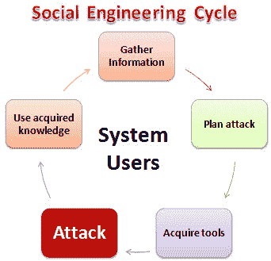

# 什么是社会工程学？ 攻击，技巧&预防

> 原文： [https://www.guru99.com/how-to-hack-using-social-enginering.html](https://www.guru99.com/how-to-hack-using-social-enginering.html)

## 什么是社会工程学？

社会工程学是一种操纵计算系统的用户以揭示可用于获得对计算机系统的未授权访问的机密信息的技术。 该术语还可以包括诸如利用人类的仁慈，贪婪和好奇心来访问受限访问建筑物或使用户安装后门软件之类的活动。

了解黑客用来诱骗用户释放重要登录信息的欺骗手段是保护计算机系统的基础

在本教程中，我们将向您介绍常见的社会工程技术，以及如何提出安全措施来应对这些技术。

## 本教程涵盖的主题

*   [社会工程学如何运作？](#1)
*   [常见的社会工程技术](#2)
*   [社会工程对策](#3)

## 社会工程学如何运作？

**此处，**

*   **收集信息**：这是第一阶段，他会尽可能多地了解目标受害者。 该信息是从公司网站，其他出版物中收集的，有时是通过与目标系统的用户交谈来收集的。
*   **计划攻击**：攻击者概述了他/她打算如何执行攻击
*   **获取工具**：这些包括攻击者在发起攻击时将使用的计算机程序。
*   **攻击**：利用目标系统中的弱点。
*   **使用获得的知识**：在社交工程策略中收集的信息，例如宠物名称，组织创建者的生日等，将用于密码猜测之类的攻击中。

## 常见的社会工程技术：

**社会工程技术可以采用多种形式**。 以下是常用技术的列表。

*   **熟悉漏洞**：用户对自己熟悉的人不太怀疑。 攻击者可以在进行社会工程攻击之前使自己熟悉目标系统的用户。 攻击者可能在进餐期间，用户吸烟时加入他，可能参加社交活动等时与用户进行交互。这使攻击者为用户所熟悉。 假设用户在建筑物内工作，该建筑物需要访问密码或卡才能访问； 攻击者可能会在用户进入此类场所时跟踪他们。 用户最喜欢为攻击者打开门，因为他们熟悉它们。 攻击者还可以要求您回答问题的答案，例如您在哪里认识了您的配偶，您的高中数学老师的姓名等。用户相信自己熟悉的面孔，很可能会透露答案。 如果忘记了密码，此信息可用于黑客入侵电子邮件帐户和其他询问类似问题的帐户。
*   **令人生畏的情况**：人们倾向于避开对周围其他人构成威胁的人。 使用此技术，攻击者可能假装在电话上或计划中的帮凶有激烈的争论。 然后，攻击者可能会要求用户提供可能会危及用户系统安全性的信息。 用户很可能给出正确答案，只是为了避免与攻击者发生冲突。 该技术还可用于避免在安全检查点进行检查。
*   **网络钓鱼**：此技术使用欺骗和欺骗手段从用户那里获取私人数据。 社会工程师可能会尝试假冒 Yahoo 之类的真实网站，然后要求毫无戒心的用户确认其帐户名和密码。 该技术还可用于获取信用卡信息或任何其他有价值的个人数据。
*   **尾语**：这项技术包括在用户进入禁区时跟踪后面的用户。 出于礼貌，用户最有可能将社交工程师放到禁区内。
*   **利用人类的好奇心**：使用此技术，社交工程师可以将受病毒感染的闪存盘故意放置在用户容易取下的区域。 用户很可能会将闪存磁盘插入计算机。 闪存盘可能会自动运行该病毒，或者可能会诱使用户打开一个文件，例如“雇员重估报告 2013.docx”，该文件实际上可能是被感染的文件。
*   **利用人的贪婪**：使用此技术，社会工程师可以通过填写表格来诱使用户在线赚很多钱，并使用信用卡详细信息等确认其详细信息。

## 社会工程对策

**** 

**社会工程师采用的大多数技术都涉及操纵人为偏见**。 为了应对这种技术，组织可以；

*   **为了对抗熟悉漏洞**，必须对用户进行培训，以使其不能用安全措施代替熟悉程度。 即使是熟悉的人也必须证明他们有权访问某些区域和信息。
*   **为了应对令人生畏的情况攻击，必须培训**用户，以识别出会窃取敏感信息的社会工程技术，并礼貌地拒绝。
*   **为了抵御网络钓鱼技术**，大多数网站（例如 Yahoo）都使用安全连接来加密数据并证明自己就是他们所声称的身份。 **检查 URL 可能有助于您发现虚假网站**。 **避免回复要求您提供个人信息的电子邮件**。
*   **为应对拖尾攻击，必须培训**用户，以防止其他人使用其安全权限进入禁区。 每个用户必须使用自己的访问权限。
*   **为了应对人类的好奇心**，最好将拾取的闪存磁盘提交给**系统管理员，该管理员最好在单独的计算机上对其进行病毒或其他感染**扫描。
*   **为了对付利用人类贪婪**的技术，员工必须接受**培训**关于此类欺诈的危险。

## 摘要

*   社会工程学是一种利用人为因素来获取未经授权的资源的艺术。
*   社会工程师使用多种技术来欺骗用户以泄露敏感信息。
*   组织必须拥有具有社会工程对策的安全策略。