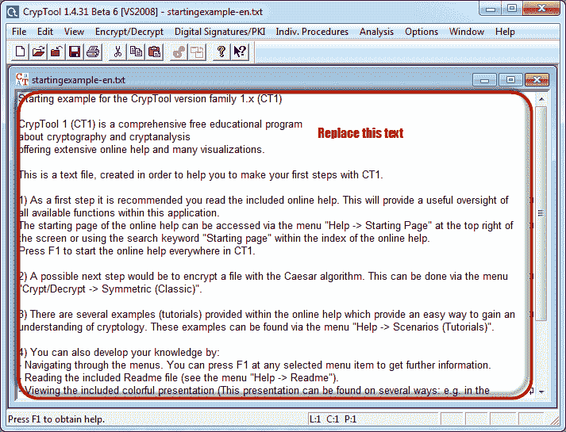
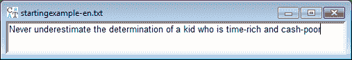
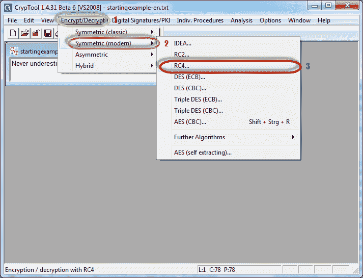
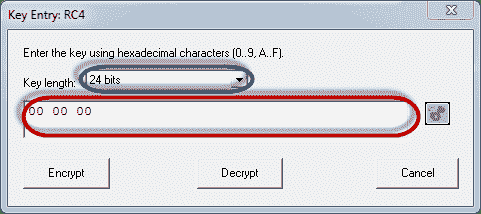
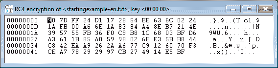
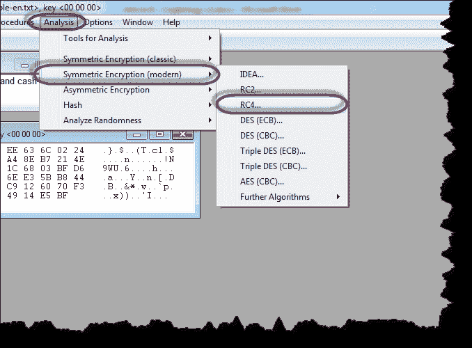
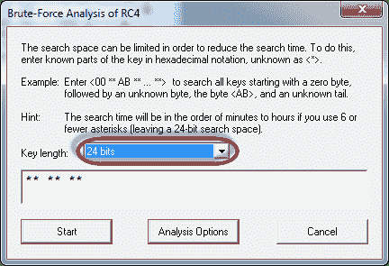
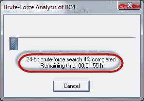
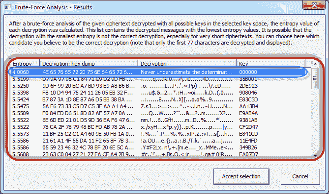

# 密码学教程：密码分析，RC4，CrypTool

> 原文： [https://www.guru99.com/how-to-make-your-data-safe-using-cryptography.html](https://www.guru99.com/how-to-make-your-data-safe-using-cryptography.html)

信息在企业，组织，军事行动等的运营中起着至关重要的作用。**信息不当使用会导致企业损失或灾难性后果。 为了保护通信，企业可以使用密码技术来加密信息**。 密码学涉及将信息转换为非人类可读的格式，反之亦然。

在本文中，我们将向您介绍密码学领域，以及如何确保信息不会落入他人之手。

## 本教程涵盖的主题

*   [什么是密码学？](#1)
*   [什么是密码分析？](#2)
*   [什么是密码学？](#3)
*   [加密算法](#4)
*   [黑客活动：立即入侵！](#5)

## 什么是密码术？

密码术是对技术的研究和应用，这些技术通过将信息转换为非人类可读的格式来隐藏信息的真正含义，反之亦然。

让我们借助一个例子来说明这一点。 假设您要发送消息“我爱苹果”，则可以将短语中的每个字母替换为字母表中的第三个连续字母。 加密的消息将为“ K NQXG CRRNGV”。 要解密我们的消息，我们必须使用要解密的字母返回字母表中的三个字母。 下图显示了转换的完成方式。

将信息转换为非人类可读形式的过程称为加密。

反向加密的过程称为**解密**。

解密是使用**秘密密钥**完成的，只有信息的合法接收者才能知道。 该密钥用于解密隐藏的消息。 这使通信很安全，因为即使攻击者设法获取了信息，对他们也没有意义。

加密的信息称为**密码**。

## 什么是密码分析？

**密码分析是一种尝试在不使用用于加密消息的密钥的情况下解密加密消息的技术。** 密码分析使用数学分析&算法来解密密码。 密码分析攻击的成功取决于

*   可用时间
*   可用的计算能力
*   可用存储容量

以下是常用的密码分析攻击的列表；

*   **蛮力攻击** –这种类型的攻击使用的算法试图猜测所有可能的明文逻辑组合，然后将其加密并与原始密码进行比较。
*   **字典攻击** –这种攻击使用单词表来查找明文或密钥的匹配项。 它通常在尝试破解加密密码时使用。
*   **彩虹表攻击** –这种类型的攻击将密文与预先计算的哈希值进行比较以找到匹配项。

## 什么是密码学？

密码学结合了密码学和密码分析技术。

## 加密算法

**MD5** –这是 Message-Digest 5 的首字母缩写。它用于创建 128 位哈希值。 从理论上讲，哈希不能转换成原始的纯文本。 MD5 用于加密密码以及检查数据完整性。 MD5 不是抗碰撞的。 抗冲突性是查找两个产生相同哈希值的值的困难。

*   **SHA** –这是安全哈希算法的缩写。 SHA 算法用于生成消息（消息摘要）的压缩表示。 它具有各种版本，例如；

*   **SHA-0** ：产生 120 位哈希值。 由于存在重大缺陷而将其撤回使用，并由 SHA-1 取代。
*   **SHA-1** ：产生 160 位哈希值。 它与 MD5 的早期版本相似。 它具有加密漏洞，自 2010 年以来不建议使用。
*   **SHA-2** ：它具有两个哈希函数，分别是 SHA-256 和 SHA-512。 SHA-256 使用 32 位字，而 SHA-512 使用 64 位字。
*   **SHA-3** ：此算法的正式名称为 Keccak。

*   **RC4** –此算法用于创建流密码。 它主要用于协议中，例如**安全套接字层（SSL）**来加密 Internet 通信，以及**有线等效保密性（WEP）**来保护无线网络。
*   **BLOWFISH** –此算法用于创建密钥化的对称分组密码。 它可以用来加密密码和其他数据。

## 黑客活动：使用 CrypTool

在这种实际情况下，我们将使用 RC4 算法创建一个简单的密码。 然后，我们将尝试使用蛮力攻击将其解密。 对于本练习，让我们假设我们知道加密密钥为 24 位。 我们将使用此信息来破解密码。

我们将使用 CrypTool 1 作为我们的加密工具。 CrypTool 1 是一个用于密码学研究的开源教育工具。 您可以从 [https://www.cryptool.org/en/ct1-downloads](https://www.cryptool.org/en/ct1-downloads) 下载它

## 创建 RC4 流密码

我们将加密以下短语

*<u>永远不要低估一个时间充裕，现金匮乏的孩子的决心</u>*

我们将使用 00 00 00 作为加密密钥。

*   打开 CrypTool 1

*   将文本替换为从不低估了一个时间充裕且现金匮乏的孩子的决心

*   单击加密/解密菜单

*   指向对称（现代），然后选择 RC4，如上所示
*   将出现以下窗口

*   选择 24 位作为加密密钥
*   将值设置为 00 00 00
*   单击加密按钮
*   您将获得以下流密码

## 攻击流密码

*   单击分析菜单

*   指向对称加密（现代），然后选择 RC4，如上所示
*   您将获得以下窗口

*   请记住，所做的假设是密钥为 24 位。 因此，请确保选择 24 位作为密钥长度。
*   单击开始按钮。 您将获得以下窗口

*   注意：完成蛮力分析攻击所需的时间取决于所用机器的处理能力和密钥长度。 密钥长度越长，完成攻击所需的时间就越长。

*   分析完成后，您将获得以下结果。

*   注意：较低的熵值表示它最有可能是正确的结果。 高于最低找到的熵值的可能是正确的结果。
*   选择最有意义的行，然后在完成后单击“接受选择”按钮

## 摘要

*   密码学是对消息进行加密和解密的科学。
*   密码是一种已被转换为非人类可读格式的消息。
*   解密将密码转换为原始文本。
*   密码分析是在不知道用于加密密码的密钥的情况下解密密码的艺术。
*   密码学结合了密码学和密码分析技术。