# 如何破解密码

> 原文： [https://www.guru99.com/how-to-crack-password-of-an-application.html](https://www.guru99.com/how-to-crack-password-of-an-application.html)

## 什么是密码破解？

密码破解是尝试使用普通密码或猜测密码的算法获得对受限系统的未经授权访问的过程。 换句话说，这是获得正确密码的一种技巧，该密码可以访问受身份验证方法保护的系统。

密码破解采用多种技术来实现其目标。 破解过程可能涉及将存储的密码与单词列表进行比较，或者使用算法生成匹配的密码

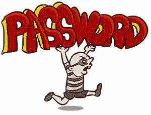

在本教程中，我们将向您介绍常见的密码破解技术以及为保护系统免受此类攻击而可以实施的对策。

## 本教程涵盖的主题

*   [什么是密码强度？](#2)
*   [密码破解技术](#3)
*   [密码破解工具](#4)
*   [密码破解对策](#5)
*   [黑客分配：立即入侵！](#6)

## 什么是密码强度？

**密码强度是衡量密码抵御密码破解攻击**的效率。 密码的强度取决于：

*   **长度**：密码包含的字符数。
*   **复杂度**：是否使用字母，数字和符号的组合？
*   **不可预测性**：攻击者可以轻易猜到它吗？

现在来看一个实际的例子。 我们将使用三个密码

*1\.* *密码*

*2\.* *密码 1*

*3.。* *＃password1 $*

在此示例中，我们将在创建密码时使用 Cpanel 的密码强度指示器。 下图显示了上面列出的每个密码的密码强度。

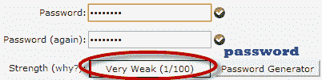

**注意**：使用的密码是强度为 1 的密码，非常弱。

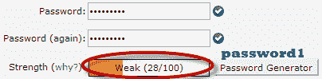

**注意**：使用的密码为 password1，强度为 28，仍然很弱。

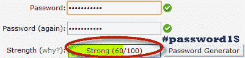

**注意**：所使用的密码为＃password1 $，强度为 60，并且强度很高。

强度数字越高，密码越好。

假设我们必须使用 md5 加密存储上述密码。 我们将使用在线 [md5 哈希生成器](https://www.md5hashgenerator.com/)将我们的密码转换为 md5 哈希。

下表显示了密码哈希

| **密码** | **MD5 哈希** | **面板强度指示器** |
| 密码 | 5f4dcc3b5aa765d61d8327deb882cf99 | 1 |
| 密码 1 | 7c6a180b36896a0a8c02787eeafb0e4c | 28 |
| ＃password1 $ | 29e08fb7103c327d68327f23d8d9256c | 60 |

现在，我们将使用 [http://www.md5this.com/](http://www.md5this.com/) 破解上述哈希。 下图显示了以上密码的密码破解结果。


从以上结果可以看出，我们成功破解了强度数字较低的第一和第二个密码。 我们没有设法破解第三个更长，更复杂且不可预测的密码。 它具有更高的强度值。

## 密码破解技术

有许多**技术可用于破解密码**。 我们将在下面描述最常用的方法。

*   **字典攻击** –此方法涉及使用单词表与用户密码进行比较。
*   **蛮力攻击** –此方法类似于字典攻击。 蛮力攻击使用结合了字母数字字符和符号的算法来提供攻击密码。 例如，还可以使用蛮力攻击将值“ password”的密码尝试为 p @ $$ word。
*   **彩虹表攻击**-此方法使用预先计算的哈希。 假设我们有一个数据库，该数据库将密码存储为 md5 散列。 我们可以创建另一个具有 md5 哈希值的常用密码的数据库。 然后，我们可以将我们拥有的密码哈希与数据库中存储的哈希进行比较。 如果找到匹配项，则我们具有密码。
*   **猜测** –顾名思义，此方法涉及猜测。 诸如 qwerty，密码，admin 等的密码是常用的或设置为默认密码。 如果未更改密码，或者用户在选择密码时不小心，则很容易遭到破坏。
*   **爬网** –大多数组织使用包含公司信息的密码。 可以在公司网站，社交媒体（例如 facebook，twitter 等）上找到此信息。Spidering 会从这些来源收集信息以提供单词列表。 单词列表然后用于执行字典和蛮力攻击。

***Spidering 示例字典攻击词表***

```
1976 <founder birth year>

smith jones <founder name>

acme <company name/initials>

built|to|last <words in company vision/mission>

golfing|chess|soccer <founders hobbies

```

## 密码破解工具

**这些是用于破解用户密码**的软件程序。 在上面的示例中，我们已经在密码强度方面研究了类似的工具。 网站 [www.md5this.com](http://www.md5this.com/) 使用 Rainbow 表来破解密码。 现在，我们将介绍一些常用工具

**开膛手约翰**

开膛手约翰使用命令提示符来破解密码。 这使得它适合于熟悉使用命令的高级用户。 它用于单词列表来破解密码。 该程序是免费的，但必须购买单词列表。 它具有免费的替代单词列表，您可以使用。 访问产品网站 [https://www.openwall.com/john/](https://www.openwall.com/john/) ，以获取更多信息以及如何使用它。

**该隐&亚伯**

该隐& Abel 在 Windows 上运行。 它用于恢复用户帐户的密码，Microsoft Access 密码的恢复； 不像开膛手约翰，该隐& Abel 使用图形用户界面。 由于使用简单，在新手和脚本小子中非常常见。 访问产品网站 [http://www.softpedia.com/get/Security/Decrypting-Decoding/Cain-and-Abel.shtml](http://www.softpedia.com/get/Security/Decrypting-Decoding/Cain-and-Abel.shtml) 了解更多信息以及如何使用它。

**鹰嘴**

Ophcrack 是一个跨平台的 Windows 密码破解程序，它使用 Rainbow 表来破解密码。 它可以在 Windows， [Linux](/unix-linux-tutorial.html) 和 Mac OS 上运行。 它还具有用于蛮力攻击的模块以及其他功能。 访问产品网站 [http://ophcrack.sourceforge.net/](http://ophcrack.sourceforge.net/) 以获得更多信息以及如何使用它。

## 密码破解对策

*   组织可以使用以下方法来减少密码被破解的机会
*   避免使用简短易懂的密码
*   避免使用具有可预测模式的密码，例如 11552266。
*   存储在数据库中的密码必须始终加密。 对于 md5 加密，最好先存储密码散列，然后再存储它们。 盐析涉及在创建哈希之前在提供的密码中添加一些单词。
*   大多数注册系统都有密码强度指示器，组织必须采用支持高密码强度数字的策略。

## 黑客活动：立即入侵！

在这种实际情况下，我们将使用简单的密码来**破解 Windows 帐户。 **Windows 使用 NTLM 哈希来加密密码**。 我们将使用 Cain 和 Abel 中的 NTLM 破解工具来做到这一点。**

该隐和亚伯饼干可以用来破解密码。

*   字典攻击
*   蛮力
*   密码分析

在此示例中，我们将使用字典攻击。 您需要在此处下载字典攻击词表 [10k-Most-Common.zip](https://goo.gl/W46b80)

在此演示中，我们在 Windows 7 上创建了一个名为 Accounts 的帐户，其密码为 qwerty。

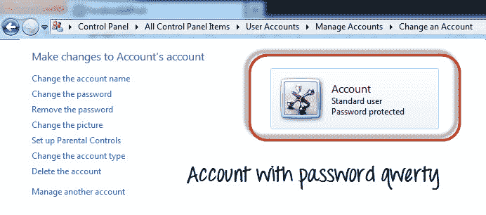

## 密码破解步骤

*   打开 **Cain and Abel** ，您将获得以下主屏幕

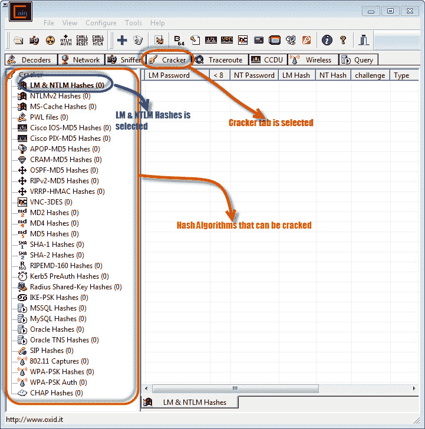

*   确保选择了“饼干”选项卡，如上图所示
*   单击工具栏上的添加按钮。

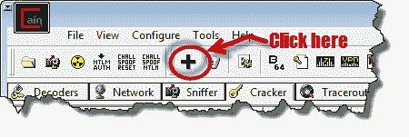

*   将出现以下对话框

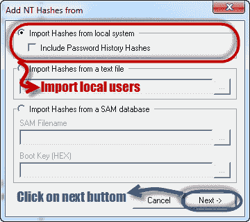

*   本地用户帐户将显示如下。 请注意，显示的结果将是本地计算机上的用户帐户的结果。

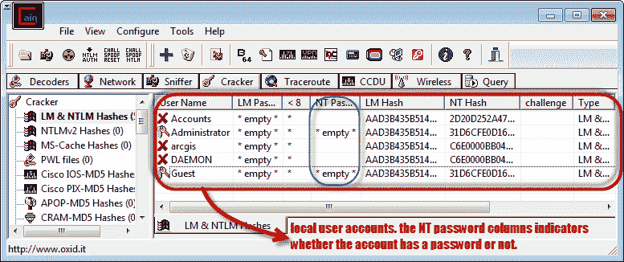

*   右键单击要破解的帐户。 在本教程中，我们将使用 Accounts 作为用户帐户。

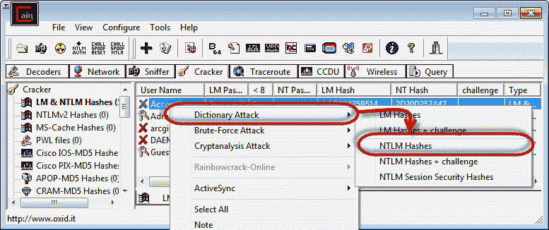

*   出现以下屏幕

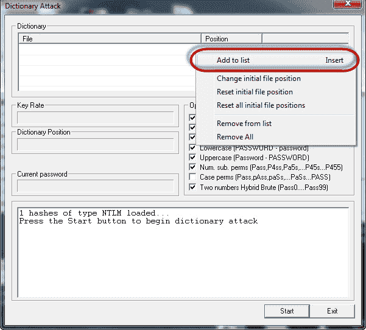

*   右键单击字典部分，然后选择添加到列表菜单，如上所示。
*   浏览到您刚刚下载的 10k 最常见的.txt 文件

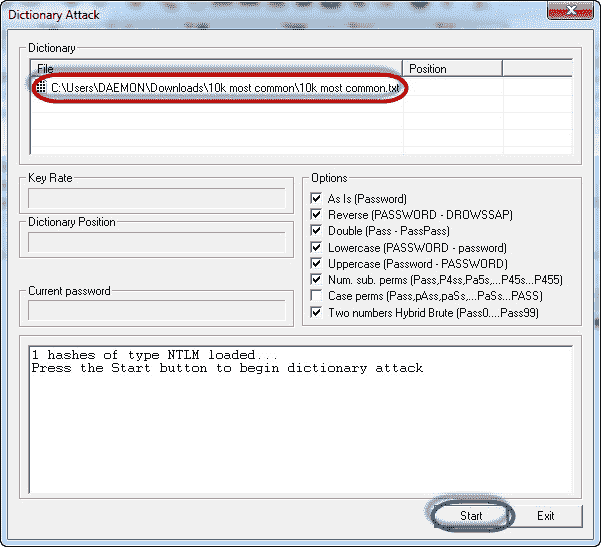

*   点击开始按钮
*   如果用户使用 qwerty 这样的简单密码，那么您应该能够得到以下结果。

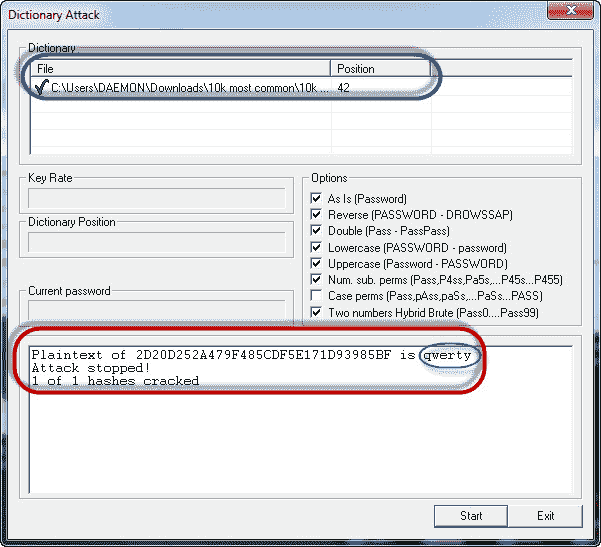

*   ***注意*** ：破解密码所需的时间取决于密码强度，复杂度和计算机的处理能力。
*   如果使用字典攻击未破解密码，则可以尝试使用蛮力攻击或密码分析攻击。

## 摘要

*   密码破解是一种恢复存储或传输的密码的技术。
*   密码强度取决于密码值的长度，复杂性和不可预测性。
*   常见的密码技术包括字典攻击，暴力破解，彩虹表，爬虫和破解。
*   密码破解工具简化了密码破解过程。