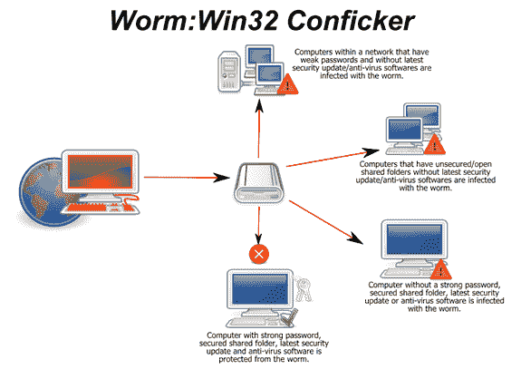
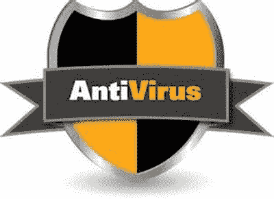

# 蠕虫病毒&特洛伊木马：道德黑客教程

> 原文： [https://www.guru99.com/learn-everything-about-trojans-viruses-and-worms.html](https://www.guru99.com/learn-everything-about-trojans-viruses-and-worms.html)

黑客拥有的一些技能是编程和计算机网络技能。 他们经常使用这些技能来访问系统。 针对组织的目标是窃取敏感数据，破坏业务运营或物理损坏计算机控制的设备。 **木马，病毒和蠕虫可用于实现上述目标**。

在本文中，我们将向您介绍黑客利用特洛伊木马，病毒和蠕虫来破坏计算机系统的一些方法。 我们还将研究可用于防止此类活动的对策。

## 本教程涵盖的主题

*   [什么是木马？](#1)
*   [什么是蠕虫？](#2)
*   [什么是病毒？](#3)
*   [木马，病毒和蠕虫对策](#4)

## 什么是特洛伊木马？

**特洛伊木马程序是一种程序，允许攻击从远程位置控制用户的计算机**。 该程序通常伪装成对用户有用的东西。 一旦用户安装了该程序，它就可以安装恶意有效载荷，创建后门，安装其他可用于破坏用户计算机的有害应用程序等。

下面的列表显示了攻击者可以使用特洛伊木马执行的一些活动。

*   执行分布式拒绝服务攻击时，请将用户的计算机用作僵尸网络的一部分。
*   损坏用户的计算机（崩溃，蓝屏死机等）
*   **窃取敏感数据**，例如存储的密码，信用卡信息等。
*   **修改用户计算机上的文件**
*   **通过执行未经授权的汇款交易来进行电子货币盗窃**
*   **记录用户在键盘上按下的所有键**，并将数据发送给攻击者。 此方法用于收集用户 ID，密码和其他敏感数据。
*   查看用户的**屏幕截图**
*   下载**浏览历史数据**

## 什么是蠕虫？

**蠕虫是一种恶意计算机程序，通常在计算机网络**上自我复制。 攻击者可能使用蠕虫来完成以下任务；

*   **在受害者的计算机**上安装后门。 创建的后门程序可用于创建用于发送垃圾邮件，执行分布式拒绝服务攻击等的僵尸计算机。后门程序也可被其他恶意软件利用。
*   蠕虫还会在复制时消耗带宽，从而降低网络速度。
*   安装蠕虫内携带的**有害有效载荷代码**。

## 什么是病毒？

*   病毒是**计算机程序，未经用户同意**便会将其自身附加到合法程序和文件 **中。 病毒会消耗计算机资源，例如内存和 CPU 时间。 被攻击的程序和文件被称为“被感染”。 可能会使用计算机病毒；**
*   访问私有数据，例如用户标识和密码
*   向用户显示烦人的消息
*   计算机中的数据损坏
*   记录用户的击键

已知计算机病毒会采用**社会工程技术**。 这些技术涉及欺骗用户打开看起来像是普通文件的文件，例如 Word 或 Excel 文档。 打开文件后，病毒代码便会执行并执行其预期的工作。

## 木马，病毒和蠕虫对策

*   为了防止此类攻击，组织可以使用以下方法。
*   一种政策，禁止用户从 Internet 下载不必要的文件，例如垃圾邮件附件，游戏，声称可以加快下载速度的程序等。
*   必须在所有用户计算机上安装防病毒软件。 防病毒软件应经常更新，并且必须在指定的时间间隔执行扫描。
*   扫描隔离机器上的外部存储设备，尤其是来自组织外部的外部存储设备。
*   必须对关键数据进行定期备份，并将其存储在最好是只读的介质（例如 CD 和 DVD）上。
*   蠕虫利用操作系统中的漏洞。 下载操作系统更新可以帮助减少蠕虫的感染和复制。
*   蠕虫也可以通过在下载前扫描所有电子邮件附件来避免。

## 木马，病毒和蠕虫差异表

|  | **木马** | **病毒** | **蠕虫** |
| --- | --- | --- | --- |
| **定义** | 恶意程序，用于从远程位置控制受害者的计算机。 | 将自身附加到其他程序和文件的自我复制程序 | 通常在网络上复制自身的非法程序 |
| **目的** | 窃取敏感数据，监视受害者的计算机等。 | 破坏计算机的正常使用，破坏用户数据等。 | 在受害者的计算机上安装后门程序，降低用户的网络速度，等等。 |
| **对策** | 使用防病毒软件，更新操作系统补丁，使用 Internet 和外部存储媒体的安全策略等。 |