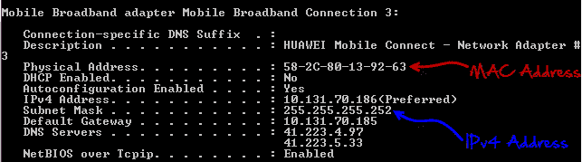
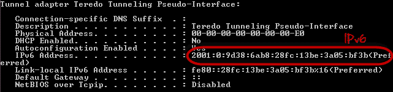
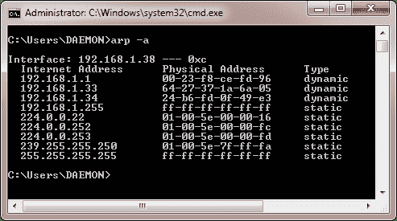
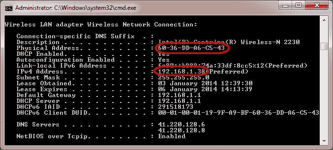
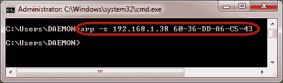
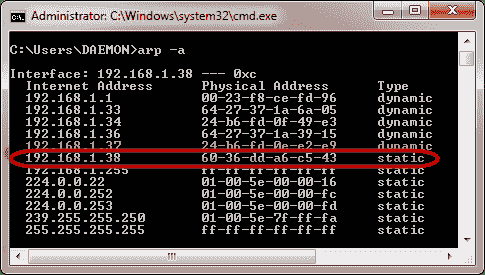
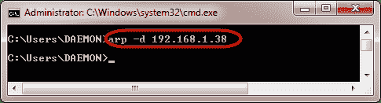

# 通过示例了解 ARP 中毒

> 原文： [https://www.guru99.com/ultimate-guide-to-network-sniffers.html](https://www.guru99.com/ultimate-guide-to-network-sniffers.html)

In this tutorial we will Learn -

*   [什么是 IP & Mac 地址](#1)
*   [什么是地址解析协议（ARP）中毒？](#4)
*   [黑客活动：在 Windows](#5) 中配置静态 ARP

## 什么是 IP 和 MAC 地址

IP 地址是 Internet 协议地址的缩写。 Internet 协议地址用于唯一标识计算机或设备，例如打印机，计算机网络上的存储磁盘。 当前有两个版本的 IP 地址。 IPv4 使用 32 位数字。 由于 Internet 的迅猛发展，已经开发了 IPv6，它使用 128 位数字。

IPv4 地址的格式为四组数字，中间用点分隔。 最小数字为 0，最大数字为 255。IPv4 地址的示例如下所示；

127.0.0.1

IPv6 地址以六个数字组成的组格式，并用全冒号分隔。 组号写为 4 个十六进制数字。 一个 IPv6 地址的示例如下所示：

2001：0db8：85a3：0000：0000：8a2e：0370：7334

为了简化 IP 地址以文本格式的表示，省略了前导零，并且省略了完整的零组。 以上地址以简化格式显示为：

2001：db8：85a3 ::: 8a2e：370：7334

MAC 地址是媒体访问控制地址的首字母缩写。 MAC 地址用于唯一标识网络接口，以便在网络的物理层进行通信。 MAC 地址通常嵌入到网卡中。

MAC 地址就像电话的序列号，而 IP 地址就像电话号。

## 行使

我们假设您正在使用 Windows 进行此练习。 打开命令提示符。

输入命令

```
ipconfig /all
```

您将获得有关计算机上所有可用网络连接的详细信息。 下面显示的结果是宽带调制解调器显示 MAC 地址和 IPv4 格式，无线网络显示 IPv6 格式。



###  

## 什么是 ARP 中毒？

**ARP 是地址解析协议**的首字母缩写。 它用于将 IP 地址转换为交换机上的物理地址[MAC 地址]。 主机在网络上发送 ARP 广播，​​并且收件人计算机以其物理地址[MAC 地址]进行响应。 解析的 IP / MAC 地址然后用于通信。 **ARP 中毒正在向交换机发送伪造的 MAC 地址，以便它可以将伪造的 MAC 地址与网络上正版计算机的 IP 地址相关联，并劫持流量**。

**ARP 中毒对策**

**静态 ARP 条目**：可以在本地 ARP 缓存中定义这些条目，并且将交换机配置为忽略所有自动 ARP 应答数据包。 这种方法的缺点是难以在大型网络上进行维护。 IP / MAC 地址映射必须分发到网络上的所有计算机。

**ARP 中毒检测软件**：这些系统可用于交叉检查 IP / MAC 地址解析并通过身份验证。 然后可以阻止未经认证的 IP / MAC 地址解析。

**操作系统安全性**：此措施取决于所使用的操作系统。 以下是各种操作系统使用的基本技术。

*   **基于 Linux 的**：它们通过忽略未经请求的 ARP 应答数据包来工作。
*   **Microsoft Windows** ：可以通过注册表配置 ARP 缓存行为。 以下列表包括一些可用于保护网络免遭嗅探的软件。

*   **AntiARP** –提供针对被动和主动嗅探的保护
*   **Agnitum Outpost 防火墙** –提供针对被动嗅探的保护
*   **XArp** –提供针对被动和主动嗅探的保护
*   **Mac OS** ：ArpGuard 可用于提供保护。 它可以防止主动和被动嗅探。

## 黑客活动：在 Windows 中配置 ARP 条目

我们在此练习中使用 Windows 7，但是这些命令也应该能够在其他版本的 Windows 上运行。

打开命令提示符并输入以下命令

```
arp –a
```

**此处，**

*   **apr** 调用位于 Windows / System32 目录中的 ARP 配置程序
*   **-a** 是要显示到 ARP 缓存内容的参数

您将获得与以下类似的结果



***注意*** *：在远程计算机上使用 TCP / IP 会话时，会自动添加和删除<u>动态条目</u>。*

*<u>静态条目</u>会手动添加，并在计算机重新启动，网络接口卡重新启动或影响它的其他活动时删除。*

### 添加静态条目

打开命令提示符，然后使用 ipconfig / all 命令获取 IP 和 MAC 地址



MAC 地址使用物理地址表示，IP 地址为 IPv4Address

输入以下命令

```
arp –s  192.168.1.38 60-36-DD-A6-C5-43
```



注意：IP 和 MAC 地址将与此处使用的 IP 地址和 MAC 地址不同。 这是因为它们是唯一的。

使用以下命令查看 ARP 缓存

```
arp –a
```

您将获得以下结果



请注意，该 IP 地址已解析为我们提供的 MAC 地址，并且属于静态类型。

### 删除 ARP 缓存项

使用以下命令删除条目

```
arp –d 192.168.1.38
```



**附言** ARP 中毒通过向交换机发送伪造的 MAC 地址来起作用