# Wireshark 教程：网络&密码嗅探器

> 原文： [https://www.guru99.com/wireshark-passwords-sniffer.html](https://www.guru99.com/wireshark-passwords-sniffer.html)

计算机使用网络进行通信。 这些网络可以位于局域网 LAN 上，也可以暴露于 Internet。 **网络嗅探器是捕获通过网络传输的低级包数据的程序。** 攻击者可以分析此信息，以发现有价值的信息，例如用户 ID 和密码。

在本文中，我们将向您介绍用于嗅探网络的常见网络嗅探技术和工具。 我们还将研究可以采取的对策，以保护通过网络传输的敏感信息。

## 本教程涵盖的主题

*   [什么是网络嗅探？](#2)
*   [主动和被动嗅探](#3)
*   [黑客活动：嗅探网络](#7)
*   [什么是媒体访问控制（MAC）泛洪](#6)

## 什么是网络嗅探？

计算机通过使用 IP 地址在网络上广播消息进行通信。 在网络上发送消息后，具有匹配 IP 地址的收件人计算机将以其 MAC 地址作为响应。

**网络嗅探是拦截通过网络发送的数据包的过程。** 这可以通过专用软件程序或硬件设备来完成。 嗅探可以用来；

*   捕获敏感数据，例如登录凭据
*   窃听聊天消息
*   捕获文件已通过网络传输

以下是容易被嗅探的协议

*   远程登录
*   Rlogin
*   HTTP
*   SMTP
*   NNTP
*   流行音乐
*   的 FTP
*   IMAP

如果以明文形式发送登录详细信息，则上述协议容易受到攻击

### 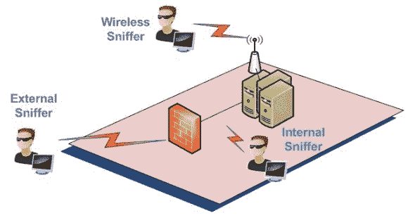 

## 被动和主动嗅探

在讨论被动嗅探和主动嗅探之前，让我们看一下用于网络计算机的两种主要设备。 集线器和交换机。

**集线器通过将广播消息发送到其上的所有输出端口（发送广播**的端口除外）来工作。 如果 IP 地址匹配，则收件人计算机对广播消息作出响应。 这意味着使用集线器时，网络上的所有计算机都可以看到广播消息。 它在 OSI 模型的物理层（第 1 层）上运行。

下图说明了集线器的工作方式。

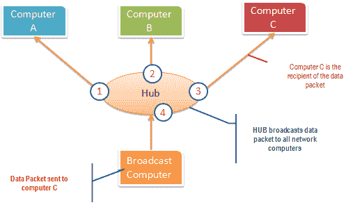

**开关的工作方式不同； 它将 IP / MAC 地址映射到其上的物理端口**。 将广播消息发送到与收件人计算机的 IP / MAC 地址配置匹配的物理端口。 这意味着广播消息仅由收件人计算机看到。 交换机在数据链路层（第 2 层）和网络层（第 3 层）运行。

下图说明了开关的工作方式。

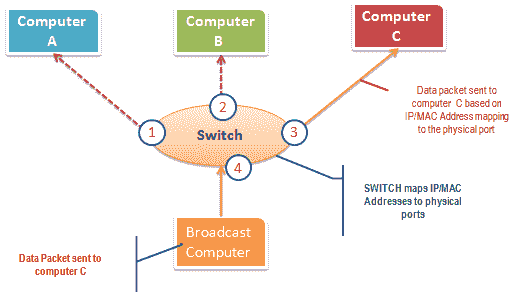

**被动嗅探正在拦截通过使用集线器**的网络传输的数据包。 之所以称为被动嗅探，是因为它很难检测到。 由于集线器向网络上的所有计算机发送广播消息，因此执行起来也很容易。

**主动嗅探正在拦截通过使用交换机**的网络传输的数据包。 嗅探交换链接的网络有两种主要方法，即 ARP 中毒和 MAC 泛洪。

## 黑客活动：嗅探网络流量

在这种实际情况下，我们将使用**使用 Wireshark 嗅探通过 HTTP 协议**传输的数据包。 对于此示例，我们将使用 Wireshark 嗅探网络，然后登录到不使用安全通信的 Web 应用程序。 我们将登录 [http://www.techpanda.org/](http://www.techpanda.org/) 上的网络应用程序

登录地址为 **此电子邮件地址已受到防止垃圾邮件机器人的保护。 您需要启用 JavaScript 才能查看它。** ，密码为 **Password2010** 。

***注意**：* *我们将登录 Web 应用程序仅用于演示目的。 该技术还可以嗅探与用于嗅探的计算机位于同一网络上的其他计算机发出的数据包。 嗅探不仅限于 techpanda.org，而且还嗅探所有 HTTP 和其他协议数据包。*

## 使用 Wireshark 嗅探网络

下图向您显示了完成本练习所要执行的步骤，而不会引起混淆

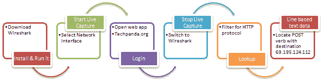

从此链接下载 Wireshark [http://www.wireshark.org/download.html](http://www.wireshark.org/download.html)

*   打开 Wireshark
*   您将获得以下屏幕

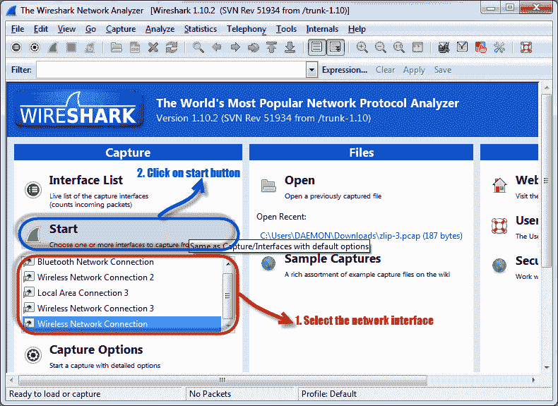

*   选择您要嗅探的网络接口。 请注意本演示，我们正在使用无线网络连接。 如果您在局域网上，则应选择局域网接口。
*   单击开始按钮，如上图所示

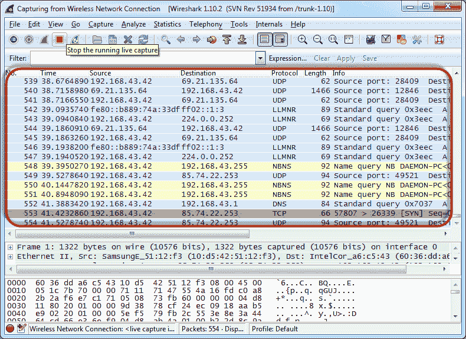

*   打开网络浏览器，然后输入 [http://www.techpanda.org/](http://www.techpanda.org/)

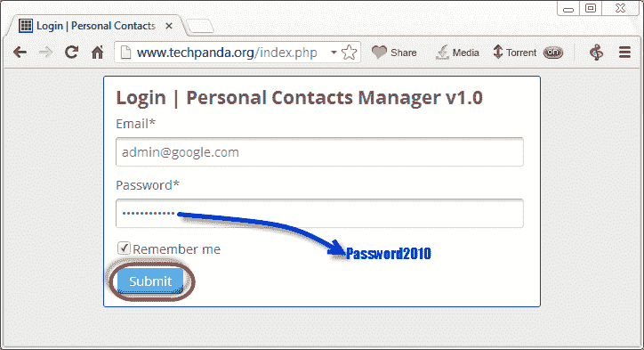

*   登录电子邮件为 **此电子邮件地址已受到防止垃圾邮件机器人的保护。 您需要启用 JavaScript 才能查看它。** ，密码为 **Password2010**
*   点击提交按钮
*   成功的登录应该为您提供以下信息中心

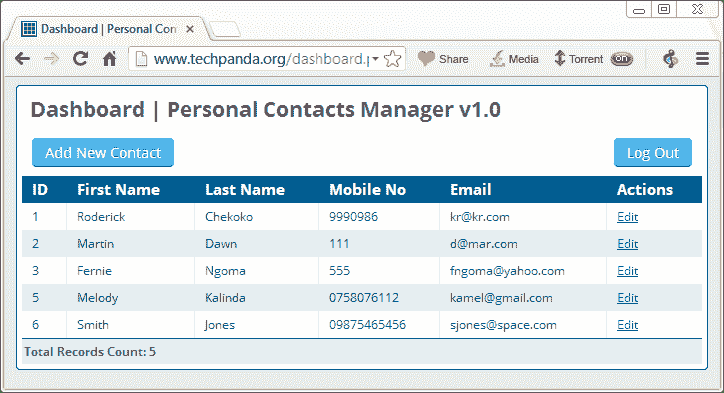

*   返回 Wireshark 并停止实时捕获

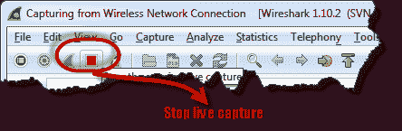

*   仅使用过滤器文本框过滤 HTTP 协议结果

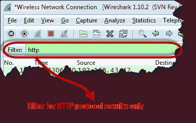

*   在“信息”列中找到带有 HTTP 动词 POST 的条目，然后单击它

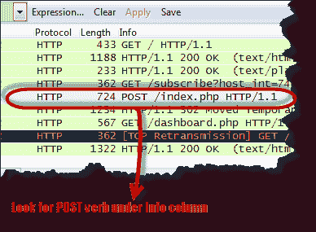

*   在日志条目下方，有一个面板，其中包含捕获数据的摘要。 查找说基于行的文本数据的摘要：application / x-www-form-urlencoded

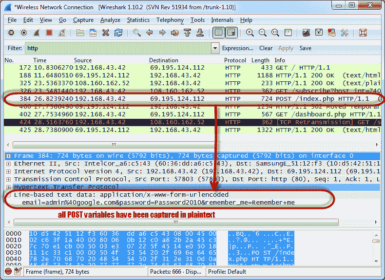

*   您应该能够查看通过 HTTP 协议提交给服务器的所有 POST 变量的纯文本值。

## 什么是 MAC 泛洪？

**MAC 泛洪是一种网络嗅探技术，它用伪造的 MAC 地址**泛洪交换机 MAC 表。 这导致交换存储器超负荷，并使其充当集线器。 一旦交换机受到威胁，它将把广播消息发送到网络上的所有计算机。 这样就可以嗅探网络上发送的数据包。

## 防止 MAC 泛滥的对策

*   **某些交换机具有端口安全性功能**。 此功能可用于限制端口上的 MAC 地址数量。 除交换机提供的地址表外，它还可用于维护安全的 MAC 地址表。
*   **身份验证，授权和计费服务器**可用于过滤发现的 MAC 地址。

## 嗅探对策

*   **对网络物理媒体的限制**大大减少了安装网络嗅探器的机会
*   **通过网络传输时对消息**进行加密会大大降低其值，因为它们难以解密。
*   **将网络更改为安全 Shell（SSH）** **网络**也可以减少嗅探网络的机会。

## 摘要

*   网络嗅探正在拦截程序包，因为它们是通过网络传输的
*   被动嗅探是在使用集线器的网络上完成的。 很难检测到。
*   主动嗅探是在使用交换机的网络上完成的。 很容易检测到。
*   MAC 泛洪通过使用伪造的 MAC 地址泛洪 MAC 表地址列表来实现。 这使开关像集线器一样工作
*   上面概述的安全措施可以帮助保护网络免受嗅探。