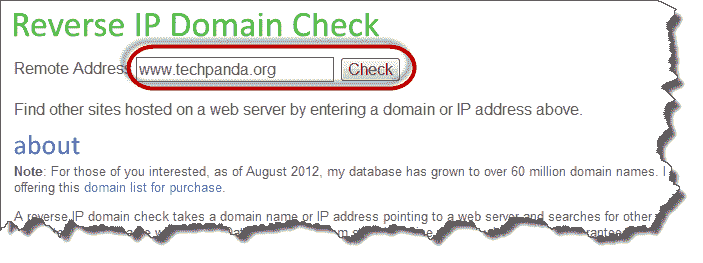
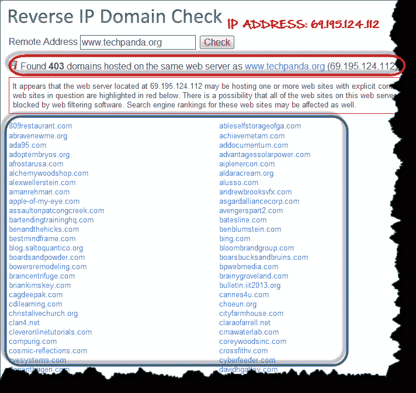
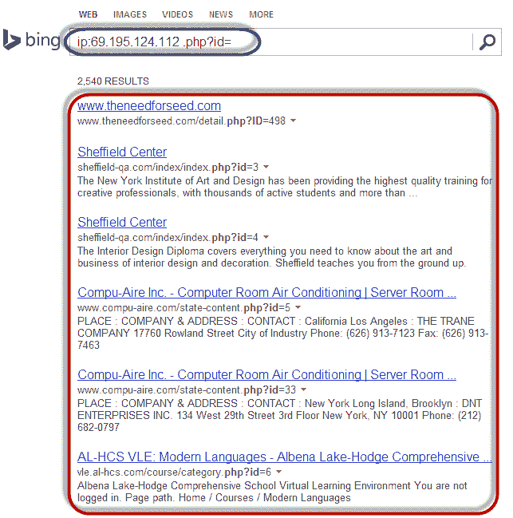

# 如何破解 Web 服务器

> 原文： [https://www.guru99.com/how-to-hack-web-server.html](https://www.guru99.com/how-to-hack-web-server.html)

客户通常会通过互联网获取信息并购买产品和服务。 为此，大多数组织都有网站。 **大多数网站都存储有价值的信息，例如信用卡号，电子邮件地址和密码等**。 这使他们成为攻击者的目标。 污损的网站还可以用于传达宗教或政治思想等。

在本教程中，我们将向您介绍 Web 服务器黑客技术，以及如何保护服务器免受此类攻击。

在本教程中，您将学习：

*   [Web 服务器漏洞](#1)
*   [Web 服务器的类型](#2)
*   [针对 Web 服务器的攻击类型](#3)
*   [成功攻击的效果](#4)
*   [Web 服务器攻击工具](#5)
*   [如何避免对 Web 服务器](#6)的攻击
*   [黑客行为：入侵 WebServer](#7)

## Web 服务器漏洞

**Web 服务器是一种程序，用于存储文件（通常是网页），并使它们可以通过网络或 Internet 进行访问**。 Web 服务器需要硬件和软件。 攻击者通常以软件中的漏洞为目标，以获取授权进入服务器的权限。 让我们看看攻击者可以利用的一些常见漏洞。

*   **默认设置** –攻击者很容易猜出这些设置，例如默认用户 ID 和密码。 默认设置还可能允许执行某些任务，例如在服务器上运行可被利用的命令。
*   **操作系统和网络的错误配置** –如果用户输入的密码不正确，某些配置（例如允许用户在服务器上执行命令）可能会很危险。
*   **操作系统和 Web 服务器中的错误** –操作系统或 Web 服务器软件中发现的错误也可以被利用来获得对系统的未授权访问。

除了上述 Web 服务器漏洞之外，以下情况还可能导致未经授权的访问

*   **缺乏安全策略和过程** –缺乏安全策略和过程，例如更新防病毒软件，修补操作系统和 Web 服务器软件会为攻击者造成安全漏洞。

## Web 服务器的类型

以下是常见的 Web 服务器列表

*   **Apache** –这是互联网上常用的 Web 服务器。 它是跨平台的，但通常安装在 Linux 上。 大多数 [PHP](/php-tutorials.html) 网站托管在 [Apache](/apache.html) 服务器上。
*   **Internet 信息服务（IIS）** –由 Microsoft 开发。 它运行在 Windows 上，是 Internet 上第二大最常用的 Web 服务器。 大多数 asp 和 aspx 网站都托管在 IIS 服务器上。
*   **Apache Tomcat** -大多数 Java 服务器页面（JSP）网站都托管在此类 Web 服务器上。
*   **其他 Web 服务器** –这些服务器包括 Novell 的 Web 服务器和 IBM 的 Lotus Domino 服务器。

## 对 Web 服务器的攻击类型

**目录遍历攻击** –这种类型的攻击利用 Web 服务器中的错误来获得对不在公共域中的文件和文件夹的未授权访问。 一旦攻击者获得访问权限，他们就可以下载敏感信息，在服务器上执行命令或安装恶意软件。

*   **拒绝服务攻击** –使用这种类型的攻击，Web 服务器可能崩溃或对合法用户不可用。
*   **域名系统劫持–** 对于这种类型的攻击者，DNS 设置已更改为指向攻击者的 Web 服务器。 本应发送到 Web 服务器的所有流量都重定向到错误的流量。
*   **嗅探** –通过网络发送的未加密数据可能会被拦截并用于未经授权访问 Web 服务器。
*   **网络钓鱼** –使用这种类型的攻击，攻击会冒充网站并将流量定向到虚假网站。 毫无戒心的用户可能会被诱使提交敏感数据，例如登录详细信息，信用卡号等。
*   **危害** –使用这种类型的攻击，攻击者会破坏域名系统（DNS）服务器或用户计算机上的内容，从而将流量定向到恶意站点。
*   **污损** –使用这种类型的攻击，攻击者将组织的网站替换为另一个页面，其中包含黑客的名称，图像，并可能包含背景音乐和消息。

## 成功攻击的影响

*   **如果攻击者编辑网站内容并包含恶意信息或指向色情网站的链接，则可能会破坏组织的声誉**
*   **Web 服务器可用于在访问受感染网站**的用户上安装恶意软件。 下载到访客计算机上的恶意软件可以是病毒，特洛伊木马或僵尸网络软件等。
*   **受损的用户数据可能会用于欺诈活动**，这可能会导致业务损失或将组织详细信息委托给用户的用户提起诉讼

## Web 服务器攻击工具

一些常见的 Web 服务器攻击工具包括：

*   **Metasploit** –这是一个用于开发，测试和使用漏洞利用代码的开源工具。 它可用于发现 Web 服务器中的漏洞并编写可用于危害服务器的漏洞利用程序。
*   **MPack** –这是一个 Web 开发工具。 它是用 PHP 编写的，并由 MySQL 作为数据库引擎支持。 使用 MPack 破坏 Web 服务器后，到该服务器的所有流量都将重定向到恶意下载网站。
*   **Zeus** –该工具可用于将受感染的计算机转变为僵尸程序或僵尸程序。 僵尸程序是一台受感染的计算机，用于执行基于 Internet 的攻击。 僵尸网络是受感染计算机的集合。 然后，僵尸网络可以用于拒绝服务攻击或发送垃圾邮件。
*   **Neosplit** –该工具可用于安装程序，删除程序，复制它等。

## 如何避免对 Web 服务器的攻击

组织可以采用以下策略来保护自己免受 Web 服务器攻击。

*   **补丁程序管理** –这涉及安装补丁程序以帮助保护服务器。 补丁程序是修复软件错误的更新。 补丁程序可以应用于操作系统和 Web 服务器系统。
*   **安全安装和配置操作系统**
*   **安全安装和配置 Web 服务器软件**
*   **漏洞扫描系统** –这些工具包括 Snort，NMap，Scanner Access Now Easy（SANE）等工具
*   **防火墙**可通过阻止来自攻击者标识源 IP 地址的所有流量来阻止简单的 DoS 攻击。
*   **防病毒**软件可用于删除服务器上的恶意软件
*   **禁用远程管理**
*   **必须从系统中删除默认帐户和未使用的帐户**
*   **默认端口&设置（例如端口 21 的 FTP）应更改为自定义端口&设置（5069 的 FTP 端口）**

## 黑客活动：入侵 WebServer

在这种实际情况下，我们将研究 Web 服务器攻击的剖析。 我们假设我们的目标是 [www.techpanda.org](http://www.techpanda.org/) 。 我们实际上不会入侵它，因为这是非法的。 我们仅将域用于教育目的。

### 我们将需要什么

*   目标 [www.techpanda.org](http://www.techpanda.org/)
*   必应搜索引擎
*   SQL 注入工具
*   PHP Shell，我们将使用 dk shell [http://sourceforge.net/projects/icfdkshell/](http://sourceforge.net/projects/icfdkshell/)

### 信息收集

我们将需要获取目标的 IP 地址，并找到共享相同 IP 地址的其他网站。

我们将使用在线工具查找目标的 IP 地址以及共享该 IP 地址的其他网站

*   在网络浏览器中输入 URL [https://www.yougetsignal.com/tools/web-sites-on-web-server/](https://www.yougetsignal.com/tools/web-sites-on-web-server/)
*   输入 [www.techpanda.org](http://www.techpanda.org/) 作为目标

*   点击检查按钮
*   您将获得以下结果

**根据上述结果，目标的 IP 地址为 69.195.124.112**

我们还发现，同一 Web 服务器上有 403 个域。

我们的下一步是扫描其他网站，以查找 [SQL](/sql.html) 注入漏洞。 注意：如果我们发现目标上存在 SQL 漏洞，那么我们将直接利用它而不考虑其他网站。

*   在 Web 浏览器中输入 URL [www.bing.com](http://www.bing.com/) 。 这仅适用于 Bing，因此请勿使用其他搜索引擎，例如 google 或 yahoo
*   输入以下搜索查询

ip：69.195.124.112 .php？id =

**此处，**

*   “ ip：69.195.124.112”将搜索限制到 IP 地址为 69.195.124.112 的 Web 服务器上托管的所有网站
*   “ .php？id =”搜索 URL GET 变量使用了 SQL 语句的参数。

您将获得以下结果

从以上结果可以看出，所有使用 GET 变量作为 SQL 注入参数的网站都已列出。

下一个逻辑步骤是扫描列出的网站是否存在 SQL Injection 漏洞。 您可以使用手动 SQL 注入或使用本文中有关 SQL 注入的工具进行此操作。

### 上载 PHP Shell

我们不会扫描列出的任何网站，因为这是非法的。 假设我们已经成功登录其中之一。 您将必须上传从 [http://sourceforge.net/projects/icfdkshell/](http://sourceforge.net/projects/icfdkshell/) 下载的 PHP Shell。

*   打开您上载 dk.php 文件的 URL。
*   您将获得以下窗口

*   单击符号链接 URL，将使您可以访问目标域中的文件。

一旦访问了文件，就可以获取数据库的登录凭据，并进行所需的操作，例如污损，下载数据（例如电子邮件）等。

## 摘要

*   Web 服务器存储了有价值的信息，并且可以被公共域访问。 这使它们成为攻击者的目标。
*   常用的 Web 服务器包括 Apache 和 Internet Information Service IIS
*   针对 Web 服务器的攻击利用了操作系统，Web 服务器和网络中的错误和配置错误
*   流行的 Web 服务器黑客工具包括 Neosploit，MPack 和 ZeuS。
*   一个好的安全策略可以减少被攻击的机会