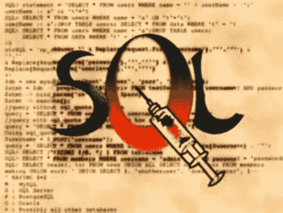
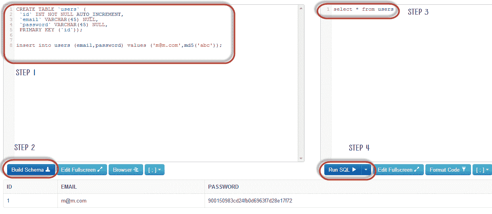
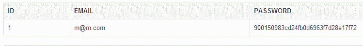
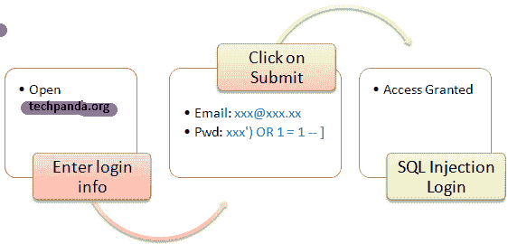
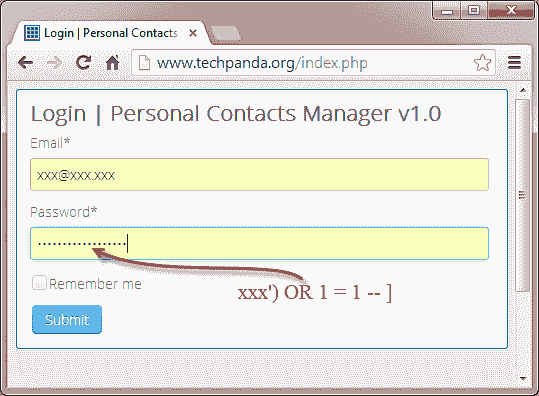
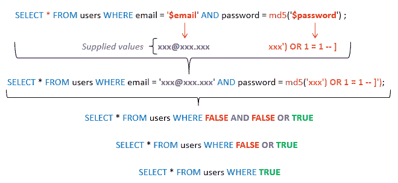
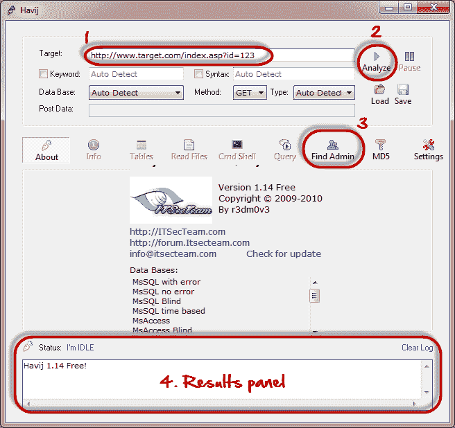

# SQL 注入教程：学习示例

> 原文： [https://www.guru99.com/learn-sql-injection-with-practical-example.html](https://www.guru99.com/learn-sql-injection-with-practical-example.html)

数据是信息系统最重要的组成部分之一。 组织使用数据库驱动的 Web 应用程序从客户那里获取数据。 [SQL](/sql.html) 是结构化查询语言的缩写。 它用于检索和操作数据库中的数据。

## 什么是 SQL 注入？

SQL 注入是一种攻击，使动态 SQL 语句中毒以注释掉该语句的某些部分或附加始终为真的条件。 它利用设计不良的 Web 应用程序中的设计缺陷来利用 SQL 语句执行恶意 SQL 代码。



在本教程中，您将学习 SQL 注入技术以及如何保护 Web 应用程序免受此类攻击。

*   [SQL 注入的工作方式](#2)
*   [黑客活动：SQL 注入 Web 应用程序](#3)
*   [其他 SQL 注入攻击类型](#4)
*   [用于 SQL 注入的自动化工具](#5)
*   [如何防止 SQL 注入攻击](#6)
*   [黑客活动：使用 Havji 进行 SQL 注入](#7)

## SQL 注入的工作方式

使用 SQL 注入可以执行的攻击类型取决于数据库引擎的类型。 **该攻击适用于动态 SQL 语句**。 动态语句是在运行时使用来自 Web 表单或 URI 查询字符串的参数 password 生成的语句。

让我们考虑一个带有登录表单的简单 Web 应用程序。 HTML 表单的代码如下所示。

```
<form action=‘index.php’ method="post">

<input type="email" name="email" required="required"/>

<input type="password" name="password"/>

<input type="checkbox" name="remember_me" value="Remember me"/>

<input type="submit" value="Submit"/>

</form>
```

**此处，**

*   上面的表格接受电子邮件地址，然后将密码提交给名为 index.php 的 [PHP](/php-tutorials.html) 文件。
*   它具有将登录会话存储在 cookie 中的选项。 我们从“ remember_me”复选框中推断出了这一点。 它使用 post 方法提交数据。 这意味着这些值不会显示在 URL 中。

假设后端检查用户 ID 的语句如下

从用户那里选择*电子邮件= $ _POST ['email']和密码= md5（$ _ POST ['password']）;

**HERE,**

*   上面的语句直接使用$ _POST []数组的值，而无需对其进行清理。
*   使用 MD5 算法对密码进行加密。

我们将使用 sqlfiddle 说明 SQL 注入攻击。 在 Web 浏览器中打开 URL [http://sqlfiddle.com/](http://sqlfiddle.com/) 。 您将获得以下窗口。

注意：您将必须编写 SQL 语句



**步骤 1）**在左窗格中输入此代码

```
CREATE TABLE `users` (
  `id` INT NOT NULL AUTO_INCREMENT,
  `email` VARCHAR(45) NULL,
  `password` VARCHAR(45) NULL,
  PRIMARY KEY (`id`));

insert into users (email,password) values ('This email address is being protected from spambots. You need JavaScript enabled to view it.
	',md5('abc'));
```

**步骤 2）**单击构建模式

**步骤 3）**在右窗格中输入此代码

从用户中选择*；

**步骤 4）**单击“运行 SQL”。 您将看到以下结果



假设用户提供了 **此电子邮件地址已受到防止垃圾邮件机器人的保护。 您需要启用 JavaScript 才能查看它。 将** 和 **1234** 作为密码。 将针对数据库执行的语句为

SELECT * FROM users where WHERE email ='此电子邮件地址已受到防止垃圾邮件机器人的保护。 您需要启用 JavaScript 才能查看它。 'AND 密码= md5（'1234'）;

可以通过注释掉密码部分并附加一个始终为真的条件来利用上述代码。 假设攻击者在电子邮件地址字段中提供了以下输入。

此电子邮件地址已受到防止垃圾邮件机器人的保护。 您需要启用 JavaScript 才能查看它。 'OR 1 = 1 LIMIT 1-']

xxx 为密码。

生成的动态语句如下。

SELECT * FROM users where WHERE email ='此电子邮件地址已受到防止垃圾邮件机器人的保护。 您需要启用 JavaScript 才能查看它。 'OR 1 = 1 LIMIT 1-'] AND password = md5（'1234'）;

**HERE,**

*   **此电子邮件地址已受到防止垃圾邮件机器人的保护。 您需要启用 JavaScript 才能查看它。** 以单引号结尾，以完成字符串引号
*   OR 1 = 1 LIMIT 1 是始终为 true 的条件，并将返回结果限制为仅一条记录。
*   -'AND…是删除密码部分的 SQL 注释。

复制上面的 SQL 语句并将其粘贴到 SQL FiddleRun SQL 文本框中，如下所示

## 

## 黑客活动：SQL 注入 Web 应用程序

我们在 [http://www.techpanda.org/](http://www.techpanda.org/) **有一个简单的 Web 应用程序，该应用程序容易受到 SQL 注入攻击的攻击，仅用于演示目的。** 上面的 HTML 表单代码来自登录页面。 该应用程序提供基本的安全性，例如清理电子邮件字段。 这意味着我们上面的代码不能用于绕过登录。

为了解决这个问题，我们可以改用密码字段。 下图显示了必须遵循的步骤



假设攻击者提供了以下输入

*   步骤 1：输入此电子邮件地址已受到防止垃圾邮件机器人的保护。 您需要启用 JavaScript 才能查看它。 作为电子邮件地址
*   步骤 2：输入 xxx'）OR 1 = 1-]



*   点击提交按钮
*   您将被定向到仪表板

生成的 SQL 语句如下

SELECT * FROM users where WHERE email ='此电子邮件地址已受到防止垃圾邮件机器人的保护。 您需要启用 JavaScript 才能查看它。 'AND password = md5（'xxx'）OR 1 = 1-]'）;

下图说明了已生成的语句。



**HERE,**

*   该语句智能地假定使用了 md5 加密
*   完成单引号和右括号
*   将条件附加到永远为真的语句

通常，成功的 SQL 注入攻击会尝试多种不同的技术（例如上面演示的技术）来进行成功的攻击。

## 其他 SQL 注入攻击类型

SQL 注入所带来的危害不仅仅是通过传递登录算法。 一些攻击包括

*   删除资料
*   更新数据
*   插入资料
*   在服务器上执行可以下载和安装木马等恶意程序的命令
*   将有价值的数据（例如信用卡详细信息，电子邮件和密码）导出到攻击者的远程服务器
*   获取用户登录详细信息等

上面的列表并不详尽； 它只是让您了解什么是 SQL 注入

## 用于 SQL 注入的自动化工具

在上面的示例中，我们基于对 SQL 的广泛了解使用了手动攻击技术。 有自动工具可以帮助您在尽可能短的时间内更有效地执行攻击。 这些工具包括

*   SQLSmack- [http://www.securiteam.com/tools/5GP081P75C.html](http://www.securiteam.com/tools/5GP081P75C.html)
*   SQLPing 2- [http://www.sqlsecurity.com/downloads/sqlping2.zip?attredirects=0 & d = 1](http://www.sqlsecurity.com/downloads/sqlping2.zip?attredirects=0&d=1)
*   SQLMap- [http://sqlmap.org/](http://sqlmap.org/)

## 如何防止 SQL 注入攻击

组织可以采用以下策略来保护自己免受 SQL 注入攻击。

*   **永远不要信任用户输入-**在动态 SQL 语句中使用它之前，必须始终对其进行清理。
*   **存储过程–** 这些可以封装 SQL 语句并将所有输入视为参数。
*   **预准备语句–** 预准备语句通过首先创建 SQL 语句然后将所有提交的用户数据作为参数来工作。 这对 SQL 语句的语法没有影响。
*   **正则表达式–** 这些可用于检测潜在的有害代码并在执行 SQL 语句之前将其删除。
*   **数据库连接用户访问权限–** 仅应将必需的访问权限赋予用于连接数据库的帐户。 这可以帮助减少 SQL 语句可以在服务器上执行的操作。
*   **错误消息–** 这些消息不应显示敏感信息以及确切发生错误的位置。 简单的自定义错误消息，例如“抱歉，我们遇到技术错误。 已联系技术团队。 可以使用“请稍后再试”代替显示导致错误的 SQL 语句。

## 黑客活动：使用 Havij 进行 SQL 注入

在这种实际情况下，我们将使用 Havij Advanced SQL Injection 程序来扫描网站中的漏洞。

注意：由于其性质，您的防病毒程序可能会对其进行标记。 您应将其添加到排除列表中或暂停防病毒软件。

下图显示了 Havij 的主窗口



以上工具可用于评估网站/应用程序的漏洞。

## 摘要

*   SQL 注入是一种利用不良 SQL 语句的攻击类型
*   SQL 注入可用于绕过登录算法，检索，插入以及更新和删除数据。
*   SQL 注入工具包括 SQLMap，SQLPing 和 SQLSmack 等。
*   编写 SQL 语句时好的安全策略可以帮助减少 SQL 注入攻击。