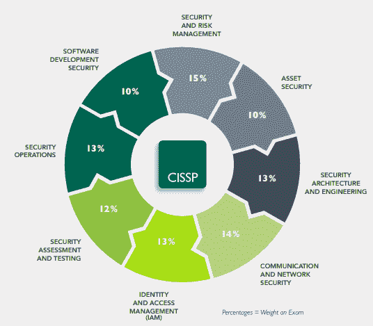
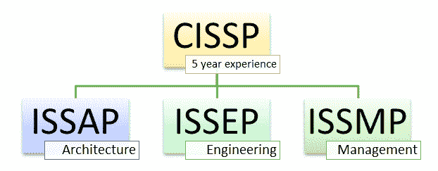
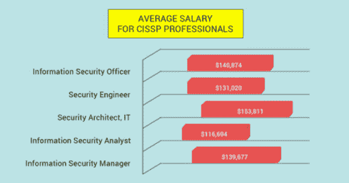

# CISSP 认证指南：什么是必备条件，成本，CISSP 薪水

> 原文： [https://www.guru99.com/cissp-certification.html](https://www.guru99.com/cissp-certification.html)

## 什么是 CISSP？

CISSP 完整格式的信息系统安全认证专家被认为是信息安全领域的质量标准。

此网络认证由[（ISC） 2](https://www.isc2.org) 提供，这是一个国际非营利组织，拥有超过 20 万名认证会员。 该认证于 1994 年推出，是 Linkedin 上最需要的安全认证。 该考试提供 114 种国家/地区的 882 种语言的 8 种语言版本。 该认证符合 ISO / IEC 标准 17024。

如今，许多 IT 安全专业人员都喜欢 CISSP 认证培训。 它为信息安全专业人员提供了衡量能力和全球公认的成就标准的目标。

在本培训教程中，您将学习

*   [什么是 CISSP？](#1)
*   [CISSP 证书的重要域](#2)
*   [CISSP 认证后开发的技能](#3)
*   [谁应该进行 CISSP 认证？](#4)
*   [如何获得 CISSP 认证？](#5)
*   [为什么要获得 CISSP 认证？](#6)
*   [CISSP 认证的课程目标](#7)
*   [ace CISSP 认证指南](#8)
*   [CISSP 认证专业人员的工资。](#9)

## CISSP 证书的重要领域

域是您需要掌握以应对 CISSP 认证考试的广泛主题。 以下是重要的 CISSP 域：

*   域 1。安全和风险管理
*   域 2。资产安全
*   域 3。安全体系结构和工程
*   域 4。通信和网络安全
*   域 5.身份和访问管理（IAM）
*   域 6。安全评估和测试
*   域 7.安全操作
*   域 8.软件开发安全性

## CISSP 认证后开发的技能

CISSP 认证课程结束时，您将：

*   您应该能够定义组织的安全性的体系结构，设计和管理。
*   您将获得相关的知识和技能，成为合格的 CISSP 认证专家。
*   在 CISSP 通用知识体系（CBK）推荐的 8 个领域中发展工作知识
*   了解有关访问控制系统，安全性和软件方法的信息
*   能够优化安全操作

## 谁应该进行 CISSP 认证？

CISSP 认证培训对以下专业人员非常重要：

*   首席信息安全官
*   安全总监
*   网络架构师
*   安全顾问
*   安全经理
*   安全审核员
*   安全分析师
*   IT 总监/经理
*   管理云安全
*   安全系统工程师

## 如何获得 CISSP 认证？

在这里，您需要遵循一些步骤才能成为 CISSP 认证的专业人员。

### 第 1 步：了解考试格式：

CISSP 英语是具有 100 到 150 个问题的 CAT（计算机自适应测试）。 您有 3 个小时的时间参加考试。 您需要在 1000 分中获得 700 分才能获得认证。

### 步骤 2）符合资格标准：关键先决条件

*   您至少需要有至少 5 年的 CISSP 普通知识领域至少有两个领域的有薪全职工作经验。
*   从（ISC） 2 批准的列表中获得 4 年的大学教育学位或区域等效的 cissp 证书。 这可以帮助您满足 1 年的所需经验。
*   如果您没有成为 CISSP 专业人士所需的经验，则可以通过 CISSP 基本级别的考试，成为（ISC） 2 的助理。
*   然后，（ISC） 2 的助理将获得 6 年的经验，以获得 5 年所需的经验。
*   获得认证后，应每 3 年重新认证一次。 重新认证是通过获得继续专业教育（CPE）学分并支付年度会员费来完成的。

### 步骤 3）参加培训：

接下来，您需要注册 CISSP 培训计划，以全面了解课程模块。 它可以帮助您成功通过考试，并可以减轻准备考试的压力。

此外，由认证讲师指导您进行认证考试。 您也可以利用 CISSP 培训材料来获得考试的成功。

### 步骤 4）生成您自己的 Pearson VUE 帐户：

为准备 CISSP 考试，您需要 [Pearson VUE](https://wsr.pearsonvue.com/testtaker/profile/create/SignUp/ISC2) 帐户才能对您所获得的知识进行真实评估。 在 Pearson VUE 网站上，您将找到有关测试地点，政策，住宿等的详细信息。

### 第 5 步）注册以计划考试：

现在已完成注册，您将必须完成检查协议。

您需要验证有关您的专业经验的主张的真实性。 您还需要合法地遵守（ISC） 2 道德规范。 在这里，您还需要为 CISSP 考试支付所需的费用。

### 第 6 步：参加考试：

清除 CISSP 认证考试即可判断您的技能和能力。 专注并清除您的 CISSP 认证考试。

### 步骤 7）订阅（ISC）²道德守则：

成功通过考试后，您必须订阅（ISC） 2 道德守则，才能获得 CISSP 认证。

### 第 8 步：获得自己的认可：

最后，您需要在考试日期后的 9 个月内批准您的申请。 为了验证您的专业经验，需要由（ISC） 2 认证的 CISSP 云安全专业人员填写并签署认可表格。 他或她应该是社区的积极成员。

## 为什么要获得 CISSP 认证？

这是为什么要报名 CISSP 认证课程的重要原因：

*   CISSP 是一门国际证书课程，并不特定于任何国家。 这使您获得了全球认可。
*   参加完此培训后，您将具备制定整体安全计划的技术知识，能力和技能。
*   您可以在其他 CISSP 认证候选人中脱颖而出，为信息安全市场提供合适的职位空缺。
*   您将可以访问宝贵的职业资源，其中包括建立网络并与同行交流思想。
*   它还使您有机会验证您在网络安全领域多年的经验中获得的技能和能力。
*   CISSP 认证使您提高信誉，可以为您提供安全的工作。
*   您将通过注册 CISSP 证书来扩展网络安全知识。
*   CISSP 认证确认您具有足够的能力来开发信息安全策略，标准和过程。
*   允许您加入专业组织并与志趣相投的人联系起来。
*   享受诸如免费订阅《 InfoSecurity Professional》杂志，50％（ISC） 2 教科书，参加网络研讨会以及展示专业知识的数字徽章等福利。

## CISSP 认证的课程目标

这是获得此证书课程的一些目标：

*   熟悉（ISC） 2 通用知识体系（CBK），其中包括一些通用术语，原理，列表，类别等。
*   熟悉 CISSP 考试过程。
*   您应该能够制定出学习计划，以通过和通过考试经验。
*   帮助您扩展对软件安全性概念和实践的了解。
*   在竞争激烈的劳动力中变得更具市场价值
*   显示您对安全纪律的奉献精神。
*   （ISC） 2 安全认证获得国际认可，因此提高了员工的信誉和价值。
*   与供应商和承包商合作时，提高组织的信誉和商誉。
*   使用行业公认的术语和惯例为您提供通用的安全语言。

## ace CISSP 认证指南

这里是获得 CISSP 认证的一些有用技巧。

*   确定当地考试组准备考试所需的时间，并与他们讨论一个困难的主题或问题。
*   您应该专注于您不了解或薄弱的领域。
*   每个域至少包含 50 个问题，以完善自己。
*   分数达到稳定的 80％
*   您通常需要两到三个月的学习时间才能完成 CISSP 课程材料。
*   使用多种学习资源，例如参考书，学习资料，在线电子学习和免费测试资源。
*   准备认可程序。
*   仔细阅读考试题，并首先尝试了解答案的问题。
*   定期观看时钟，因为您需要尝试 250 个问题和最多 6 个小时的考试。 或在 3 小时内获得 CAT 100 个问题。
*   请记住，CISSP 认证可能仍然包含您认为在现实世界中已经过时的问题。

## CISSP 认证专业人员的薪水。

根据对全球信息安全的一项研究，获得 CISSP 认证的专业人员的薪水比未经认证的专业人员高 25％。 在技​​术共和国工作趋势调查中，它是收入最高的工作之一。

 

因此，与未认证的其他人员相比，CISSP 安全专业人员的薪水高得多。 但是，薪资规模可能因地区和国家而异。

**摘要**

CISSP- full form Certified Information Systems Security Professional is considered as a quality standard in the field of information security.

*   获得 CISSP 认证的步骤包括：符合资格标准，参加培训，生成您自己的 Pearson VUE 帐户，通过考试，参加（ISC）²道德守则订阅，获得认可。
*   CISSP 是一门国际证书课程，并不特定于任何国家。 这使您获得了全球认可。
*   安全和风险管理，安全工程，通信和网络安全，身份和访问管理是 CISSP 的重要领域
*   成功通过 CISSP 培训后，您将获得相关的知识和技能，成为合格的 CISSP 认证专业人员。
*   CISSP 认证培训与首席信息安全官，安全总监，网络架构师，安全顾问，安全经理，安全审核员，安全分析师等相关。
*   确定当地考试组准备考试所需的时间，并与他们讨论一个困难的主题或问题。
*   根据一项全球信息安全研究，CISSP 认证的专业人员的薪水比非认证的专业人员高 25％。
*   CISSP 认证费用为 699 美元