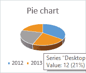
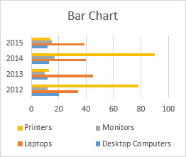
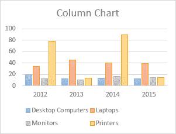
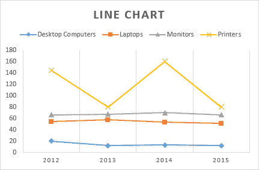
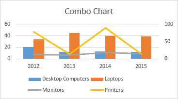
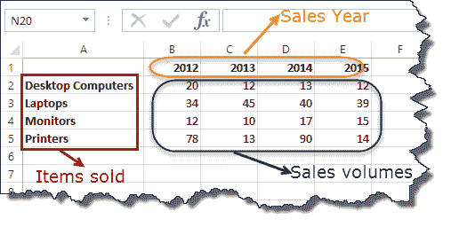
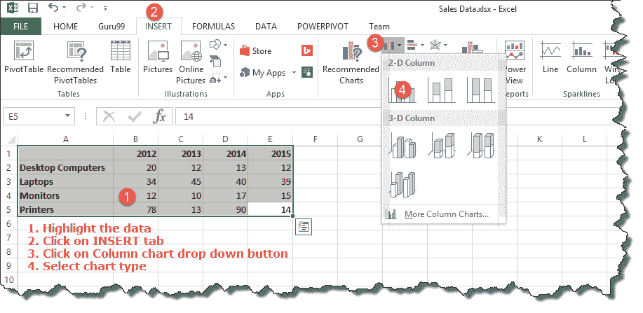
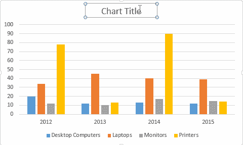
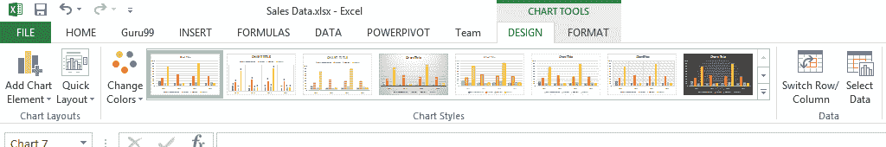

# 如何在 Excel 中创建图表：类型&示例

> 原文： [https://www.guru99.com/visualizing-data-using-charts-in-excel.html](https://www.guru99.com/visualizing-data-using-charts-in-excel.html)

一幅图画价值一千个字； 图表价值一千套数据。 在本教程中，我们将学习如何在 Excel 中使用图形来可视化数据。

## 什么是图表？

**图表是列和行**中数据的直观表示。 图表通常用于分析数据集中的趋势和模式。 假设您过去三年一直在 Excel 中记录销售数据。 使用图表，您可以轻松分辨出哪一年的销售额最高，哪一年的销售额最低。 您还可以绘制图表以将设定的目标与实际成就进行比较。

在本教程中，我们将使用以下数据。

**注意**：我们将使用 Excel2013。如果您使用较低的版本，则可能无法使用某些更高级的功能。

<colgroup><col style="width: 160px;"><col style="width: 104px;"><col style="width: 123px;"><col style="width: 104px;"><col style="width: 110px;"></colgroup>
| **项目** | **2012** | **2013** | **2014** | **2015** |
| 台式电脑 | 20 | 12 | 13 | 12 |
| 手提电脑 | 34 | 45 | 40 | 39 |
| 监控器 | 12 | 10 | 17 | 15 |
| 印表机 | 78 | 13 | 90 | 14 |

## 图表类型

不同的场景需要不同类型的图表。 为此，Excel 提供了许多可以使用的图表类型。 **您选择的图表类型取决于您要可视化的数据类型**。 为了帮助用户简化操作，Excel 2013 及更高版本提供了一个选项，用于分析数据并建议您应使用的图表类型。

下表显示了一些最常用的图表以及何时应考虑使用它们。

<colgroup><col style="width: 37px;"><col style="width: 59px;"><col style="width: 97px;"><col style="width: 445px;"></colgroup>
| **S / N** | **图表类型** | **我应该何时使用它？** | 

示例

 |
| 1 | 饼形图 | 当您要量化项目并将其显示为百分比时。 |  |
| 2 | 条形图 | 当您要比较几个类别中的值时。 值水平运行 |  |
| 3 | 柱形图 | 当您要比较几个类别中的值时。 值垂直运行 |  |
| 4 | 折线图 | 当您要可视化一段时间内的趋势时，即几个月，几天，几年等。 |  |
| 5 | 组合图 | 当您要突出显示不同类型的信息时 |  |

## 图表的重要性

*   允许您以图形方式可视化数据
*   在图表中分析趋势和样式更容易
*   与单元格中的数据相比，易于解释

## 在 Excel 中创建图表的分步示例

在本教程中，我们将绘制一个简单的柱形图，该柱形图将显示销售数量与销售年份的关系。

*   开启 Excel
*   输入上方样本数据表中的数据
*   您的工作簿现在应如下所示

要获得所需的图表，您必须遵循以下步骤

*   选择要在图形中表示的数据
*   单击功能区中的“插入”选项卡
*   单击柱形图下拉按钮
*   选择所需的图表类型

您应该可以看到以下图表

### 辅导练习

选择图表时，功能区将激活以下选项卡

尝试应用不同的图表样式以及图表中显示的其他选项。

[下载上面的 Excel 模板](https://drive.google.com/uc?export=download&id=1jEzHiGMkPP-JeQFBbxRWe0OlBRzwNi6X)

## 摘要

图表是一种以图形方式可视化数据的强大方法。 Excel 有多种类型的图表，您可以根据需要使用。

条件格式也是 Excel 的另一个强大的格式功能，可帮助我们轻松查看满足指定条件的数据