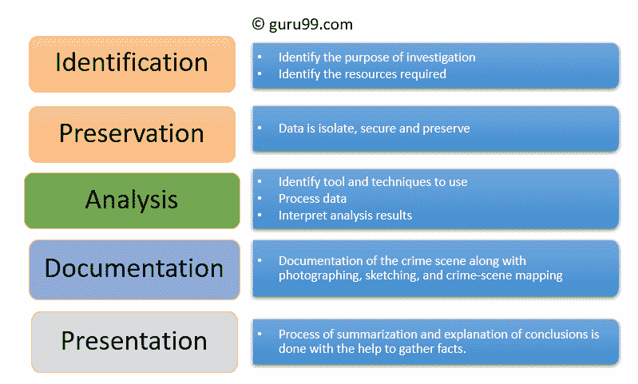

# 什么是数字取证？ 历史，过程，类型，挑战

> 原文： [https://www.guru99.com/digital-forensics.html](https://www.guru99.com/digital-forensics.html)

## 什么是数字取证？

数字取证被定义为可以由法院使用的计算机证据的保存，识别，提取和记录的过程。 它是从计算机，手机，服务器或网络等数字媒体中寻找证据的科学。 它为法医团队提供了解决复杂的数字相关案件的最佳技术和工具。

Digital Forensics 帮助法医团队分析，检查，识别和保存驻留在各种类型电子设备上的数字证据。

在此数字取证教程中，您将学习：

*   [什么是数字取证？](#1)
*   [数字取证的历史](#2)
*   [计算机取证的目标](#3)
*   [数字取证过程](#4)
*   [数字取证的类型](#5)
*   [数字取证技术面临的挑战](#6)
*   [数字取证的用法示例](#7)
*   [数字取证的优势](#8)
*   [数字取证的缺点](#9)

## 数字取证的历史

这里是数字取证历史的重要里程碑：

*   汉斯·格罗斯（Hans Gross，1847 年-1915 年）：第一次使用科学研究来领导刑事调查
*   联邦调查局（FBI）（1932 年）：建立了一个实验室，为全美所有现场代理人和其他法律机构提供取证服务。
*   1978 年，第一部计算机犯罪被《佛罗里达计算机犯罪法》所认可。
*   弗朗西斯·高尔顿（Francis Galton）（1982-1911）：进行了指纹的首次记录研究
*   1992 年，术语“计算机取证”在学术文献中被使用。
*   1995 年成立了国际计算机证据组织（IOCE）。
*   2000 年，第一个 FBI 区域计算机法证实验室成立。
*   2002 年，数字证据科学工作组（SWGDE）出版了第一本有关数字取证的书，名为“计算机取证的最佳实践”。
*   2010 年，Simson Garfinkel 确定了数字调查面临的问题。

## 计算机取证的目的

以下是使用计算机取证的基本目标：

*   它有助于以某种方式恢复，分析和保存计算机及相关材料，以帮助调查机构将其作为证据提交法院。
*   它有助于推测犯罪动机和主要罪魁祸首的身份。
*   在可疑犯罪现场设计程序，可帮助您确保所获取的数字证据没有损坏。
*   数据获取和复制：从数字媒体中恢复已删除的文件和已删除的分区，以提取证据并进行验证。
*   帮助您快速识别证据，还可以估计恶意活动对受害者的潜在影响
*   生成计算机取证报告，该报告提供有关调查过程的完整报告。
*   通过遵循监管链来保存证据。

## 数字取证流程

数字取证需要以下步骤：

*   身份证明
*   保存
*   分析
*   文献资料
*   介绍

Process of Digital Forensics

让我们详细研究一下

### 身份证明

这是取证过程中的第一步。 识别过程主要包括诸如提供何种证据，将证据存储在何处以及最后如何存储（以哪种格式）之类的内容。

电子存储介质可以是个人计算机，移动电话，PDA 等。

### 保存

在此阶段，将隔离，保护和保留数据。 它包括防止人们使用数字设备，以免篡改数字证据。

### 分析

在这一步骤中，调查人员将重建数据片段并根据发现的证据得出结论。 但是，要支持特定的犯罪理论，可能需要进行大量的反复检查。

### 文献资料

在此过程中，必须创建所有可见数据的记录。 它有助于重建犯罪现场并进行审查。 它涉及犯罪现场的适当文档以及摄影，草图绘制和犯罪现场制图。

### 介绍

在最后一步中，完成了总结和结论解释的过程。

但是，应使用抽象术语以通俗易懂的方式编写。 所有抽象的术语应参考特定的细节。

## 数字取证的类型

三种类型的数字取证：

### 磁盘取证：

它通过搜索活动，已修改或已删除的文件来处理从存储介质中提取数据。

### 网络取证：

它是数字取证的一个分支。 它与监视和分析计算机网络流量有关，以收集重要信息和法律证据。

### 无线取证：

它是网络取证的一个部门。 无线取证的主要目的是提供收集和分析来自无线网络流量的数据所需的工具。

### 数据库取证：

它是数字取证的一个分支，与数据库及其相关元数据的研究和检查有关。

### 恶意软件取证：

该分支负责识别恶意代码，以研究其有效负载，病毒，蠕虫等。

### 电子邮件取证

处理电子邮件的恢复和分析，包括已删除的电子邮件，日历和联系人。

### 内存取证：

它处理以原始形式从系统内存（系统寄存器，缓存，RAM）收集数据，然后从原始转储中雕刻数据。

### 手机取证：

它主要处理移动设备的检查和分析。 它有助于检索电话和 SIM 卡联系人，呼叫日志，传入和传出的 SMS / MMS，音频，视频等。

## 数字取证面临的挑战

这里是数字取证面临的主要挑战：

*   个人电脑的增加和互联网访问的广泛使用
*   轻松使用黑客工具
*   缺乏实物证据使起诉变得困难。
*   太字节级的大量存储空间使这项调查工作变得困难。
*   任何技术更改都需要升级或更改解决方案。

## 数字取证的示例用法

最近，商业组织在以下类型的案件中使用了数字取证：

*   知识产权盗窃
*   工业间谍
*   雇佣纠纷
*   欺诈调查
*   在工作场所滥用互联网和电子邮件
*   伪造相关事宜
*   破产调查
*   有关合规性的问题

## 数字取证的优势

这是数字取证的优点/好处

*   以确保计算机系统的完整性。
*   在法庭上出示证据，可能会导致肇事者受到惩罚。
*   如果计算机系统或网络受到威胁，它可以帮助公司捕获重要信息。
*   从世界任何地方有效地追踪网络犯罪分子。
*   帮助保护组织的金钱和宝贵的时间。
*   允许提取，处理和解释事实证据，因此可以在法庭上证明网络犯罪行为。

## 数字取证的缺点

这是使用数字取证的主要缺点/缺点

*   数字证据已被法院接受。 但是，必须证明没有篡改
*   制作电子记录并将其存储是一件非常昂贵的事情
*   法律从业者必须具有广泛的计算机知识
*   需要出示真实且令人信服的证据
*   如果用于数字取证的工具不符合指定的标准，那么在法院，证据可能会被司法拒绝。
*   调查人员缺乏技术知识可能无法提供预期的结果

#### 摘要：

*   数字取证是计算机证据的保存，识别，提取和记录，可在法院使用
*   数字取证的过程包括 1）识别，2）保存，3）分析，4）文档和 5）演示
*   各种类型的数字取证包括磁盘取证，网络取证，无线取证，数据库取证，恶意软件取证，电子邮件取证，内存取证等。
*   数字取证科学可用于以下情况：1）知识产权盗窃，2）工业间谍活动 3）雇佣纠纷，4）欺诈调查。