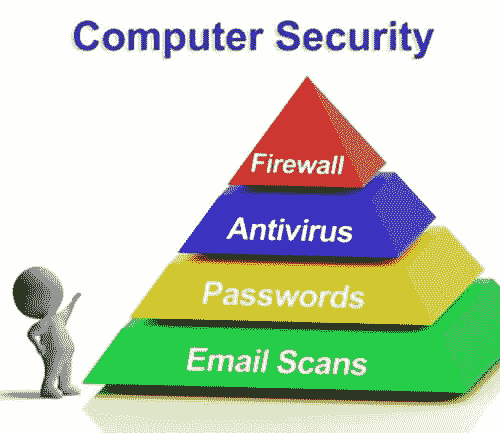

# 10 个最常见的 Web 安全漏洞

> 原文： [https://www.guru99.com/web-security-vulnerabilities.html](https://www.guru99.com/web-security-vulnerabilities.html)

OWASP 或 Open Web Security Project 是一个非营利性慈善组织，致力于改善软件和 Web 应用程序的安全性。

该组织根据来自各种安全组织的数据发布最重要的 Web 安全漏洞列表。

根据可利用性，可检测性和对软件的影响，对 Web 安全漏洞进行优先级排序。

*   **Exploitability –**

    利用此安全漏洞需要什么？ 攻击仅需要 Web 浏览器时可利用性最高，而高级编程和工具则可利用性最低。

*   **Detectability –**

    检测威胁有多容易？ 最高的是显示在 URL，表单或错误消息上的信息，最低的是源代码。

*   **Impact or Damage –**

    如果安全漏洞暴露或受到攻击，将会造成多少损失？ 最高的是完整的系统崩溃，最低的则什么都没有。

OWASP Top 10 的主要目的是教育开发人员，设计人员，经理，架构师和组织有关最重要的安全漏洞。

**根据 OWASP Top 10 排名前 10 位的安全漏洞是**：

*   [SQL 注入](#1)
*   [跨站点脚本](#2)
*   [身份验证和会话管理中断](#3)
*   [不安全的直接对象引用](#4)
*   [跨站请求伪造](#5)
*   [安全配置错误](#6)
*   [不安全的密码存储](#7)
*   [无法限制 URL 访问](#8)
*   [传输层保护不足](#9)
*   [无效的重定向和转发](#10)

## SQL 注入

**说明**

注入是一个安全漏洞，攻击者可以通过操作用户提供的数据来更改后端 [SQL](/sql.html) 语句。

当用户输入作为命令或查询的一部分发送到解释器并诱使解释器执行意外命令并提供对未授权数据的访问时，就会发生注入。

当由 Web 应用程序执行时，SQL 命令还可以公开后端数据库。

**含义**

*   攻击者可以将恶意内容注入易受攻击的字段。
*   可以从数据库中读取诸如用户名，密码等敏感数据。
*   可以修改数据库数据（插入/更新/删除）。
*   可以在数据库上执行管理操作

**易受攻击的对象**

*   输入栏位
*   与数据库交互的 URL。

**示例**：

*   登录页面上的 SQL 注入

没有有效的凭据登录到应用程序。

有效的用户名可用，而密码不可用。

测试网址： **http://demo.testfire.net/default.aspx**

用户名：sjones

密码：1 = 1'或 pass123

创建 SQL 查询，并将其发送到以下解释器

SELECT * FROM Users where User_Name = sjones AND Password = 1 = 1'或 pass123;

**建议**

1.  白色列出输入字段
2.  避免显示对攻击者有用的详细错误消息。

## 跨站点脚本

**Description**

跨站点脚本编制也简称为 XSS。

XSS 漏洞的目标是嵌入页面的脚本，这些脚本在客户端即用户浏览器而非服务器端执行。 当应用程序获取不受信任的数据并将其发送到 Web 浏览器而没有适当的验证时，可能会出现这些缺陷。

攻击者可以使用 XSS 在用户（在这种情况下为受害者浏览器）上执行恶意脚本。 由于浏览器无法知道脚本是否可信，因此脚本将被执行，攻击者可以劫持会话 cookie，破坏网站或将用户重定向到不需要的恶意网站。

XSS 是一种攻击，它使攻击者可以在受害者的浏览器上执行脚本。

**含义**：

*   利用此安全漏洞，攻击者可以将脚本注入到应用程序中，可以窃取会话 Cookie，破坏网站并可以在受害者的计算机上运行恶意软件。

**Vulnerable Objects**

*   输入栏位
*   网址

**范例**

1\. **http://www.vulnerablesite.com/home？“ <脚本> alert（” xss“）< / script** >

在浏览器上运行上述脚本时，如果该站点容易受到 XSS 攻击，则会显示一个消息框。

如果攻击者想要显示或存储会话 cookie，则可以进行更严重的攻击。

2\. **http://demo.testfire.net/search.aspx?txt 搜索< iframe** > < src = **http://google.com** 宽度= 500 高度 500 > < / iframe >

上面的脚本运行时，浏览器将加载一个指向 **http://google.com** 的不可见框架。

通过在浏览器上运行恶意脚本，可以使攻击更加严重。

**Recommendations**

1.  白名单输入字段
2.  输入输出编码

## 身份验证和会话管理中断

**Description**

网站通常会为每个有效会话创建一个会话 cookie 和会话 ID，并且这些 cookie 包含敏感数据，例如用户名，密码等。当会话因注销或浏览器突然关闭而结束时，这些 cookie 应该无效，即对于每个会话 应该有一个新的 cookie。

如果 cookie 没有失效，则敏感数据将存在于系统中。 例如，使用公共计算机（Cyber​​ Cafe）的用户，易受攻击站点的 cookie 位于系统上并暴露给攻击者。 一段时间后，攻击者使用同一台公共计算机，敏感数据被破坏。

以相同的方式，用户使用公用计算机而不是注销，而是突然关闭浏览器。 攻击者使用相同的系统，当浏览相同的漏洞站点时，将打开受害者的上一个会话。 攻击者可以通过窃取个人资料信息，信用卡信息等来做他想做的一切。

应该进行检查以发现认证和会话管理的强度。 密钥，会话令牌，Cookie 应该正确实现，而不会损害密码。

**Vulnerable Objects**

*   URL 上显示的会话 ID 可能导致会话固定攻击。
*   注销和登录前后的会话 ID 相同。
*   会话超时未正确实现。
*   应用程序为每个新会话分配相同的会话 ID。
*   应用程序的已验证部分使用 SSL 保护，密码以哈希或加密格式存储。
*   特权低的用户可以重用该会话。

**Implication**

*   利用此漏洞，攻击者可以劫持会话，获得对系统的未经授权的访问，从而允许泄露和修改未经授权的信息。
*   使用被盗的 Cookie 或使用 XSS 的会话可以使会话陷入困境。

**Examples**

1.  Airline reservation application supports URL rewriting, putting session IDs in the URL:

    **http://Examples.com/sale/saleitems;jsessionid=2P0OC2oJM0DPXSNQPLME34SERTBG/dest=马尔代夫**（马尔代夫门票销售）

    该网站的经过身份验证的用户希望让他的朋友知道这笔交易，并向其发送电子邮件。 朋友会收到会话 ID，并可用于未经授权的修改或滥用已保存的信用卡详细信息。

2.  应用程序容易受到 XSS 的攻击，攻击者可以通过 XSS 来访问会话 ID，并且可以使用该劫持会话。
3.  应用程序超时设置不正确。 用户使用公共计算机并关闭浏览器，而不是注销然后走开。 攻击者稍后会使用相同的浏览器，并且会话已通过身份验证。

**Recommendations**

1.  所有身份验证和会话管理要求都应按照 OWASP 应用程序安全验证标准进行定义。
2.  切勿在 URL 或日志中公开任何凭据。
3.  还应尽力避免 XSS 漏洞，这些漏洞可用于窃取会话 ID。

## 不安全的直接对象引用

**Description**

当开发人员以 URL 或 FORM 参数的形式公开引用内部实现对象（例如文件，目录或数据库键）时，就会发生这种情况。 攻击者可以使用此信息来访问其他对象，并且可以创建将来的攻击来访问未经授权的数据。

**Implication**

*   使用此漏洞，攻击者可以访问未经授权的内部对象，修改数据或破坏应用程序。

**易受攻击的对象**

*   在 URL 中。

**Examples:**

在以下 URL 中更改“用户 ID”可以使攻击者查看其他用户的信息。

**http://www.vulnerablesite.com/userid=123** 修改为 **http://www.vulnerablesite.com/userid=124**

攻击者可以通过更改用户 ID 值来查看其他信息。

**建议**：

1.  实施访问控制检查。
2.  避免在 URL 中公开对象引用。
3.  验证对所有参考对象的授权。

## 跨站请求伪造

**Description**

跨站点请求伪造是来自跨站点的伪造请求。

CSRF 攻击是一种恶意网站，电子邮件或程序导致用户的浏览器在当前已对其进行身份验证的受信任站点上执行有害操作时发生的攻击。

CSRF 攻击迫使登录的受害者的浏览器向易受攻击的 Web 应用程序发送伪造的 HTTP 请求（包括受害者的会话 cookie 和其他任何自动包含的身份验证信息）。

当用户在登录原始网站时单击 URL 时，攻击者将向受害者发送链接，该数据将从网站中窃取。

**Implication**

*   使用此漏洞作为攻击者可以更改用户配置文件信息，更改状态，代表管理员创建新用户等。

**Vulnerable Objects**

*   用户个人资料页面
*   用户帐号表格
*   商业交易页面

**Examples**

使用有效凭据将受害者登录到银行网站。 他收到攻击者的邮件，信中说：“请点击此处捐赠 1 美元来造成损失。”

当受害者单击它时，将创建一个有效的请求以向特定帐户捐赠 1 美元。

**http://www.vulnerablebank.com/transfer.do?account=原因&金额= 1**

攻击者捕获此请求并创建以下请求，并将其嵌入按钮“我支持原因”中。

**http://www.vulnerablebank.com/transfer.do?account=攻击者&金额= 1000**

由于会话已通过身份验证，并且请求通过银行网站发出，因此服务器将向攻击者转移 1000 美元。

**建议**

1.  在执行敏感操作时授权用户的状态。
2.  实现诸如 CAPTCHA，重新认证和唯一请求令牌之类的机制。

## 安全配置错误

**Description**

必须为应用程序，框架，应用程序服务器，Web 服务器，数据库服务器和平台定义和部署安全配置。 如果配置正确，攻击者可能会未经授权访问敏感数据或功能。

有时，此类缺陷会导致完整的系统危害。 使软件保持最新也是很好的安全性。

**Implication**

*   利用此漏洞，攻击者可以枚举底层技术和应用程序服务器版本信息，数据库信息，以及获取有关应用程序的信息，以发起更多的攻击。

**易受攻击的对象**

*   网址
*   表格栏位
*   输入栏位

**Examples**

1.  应用程序服务器管理控制台将自动安装并且不会删除。 默认帐户不会更改。 攻击者可以使用默认密码登录并获得未经授权的访问。
2.  服务器上未禁用目录列表。 攻击者可以发现并且可以简单地列出目录以查找任何文件。

**Recommendations**

1.  一个强大的应用程序体系结构，可在组件之间提供良好的隔离和安全性。
2.  更改默认的用户名和密码。
3.  禁用目录列表并实施访问控制检查。

## 不安全的密码存储

**Description**

不安全的密码存储是一个常见的漏洞，当敏感数据没有安全存储时就会存在。

用户凭据，个人资料信息，健康详细信息，信用卡信息等位于网站上的敏感数据信息之下。

该数据将存储在应用程序数据库中。 如果不使用加密或哈希*不正确地存储此数据，则攻击者很容易受到攻击。

（*散列是将字符串字符转换为固定长度的较短字符串或密钥。要解密该字符串，应使用用于形成密钥的算法）

**Implication**

*   通过使用此漏洞，攻击者可以窃取，修改受保护程度不强的数据，以进行身份​​盗用，信用卡欺诈或其他犯罪。

**Vulnerable objects**

*   应用程序数据库。

**Examples**

在银行业务应用程序之一中，密码数据库使用无盐哈希*存储每个人的密码。 SQL 注入漏洞使攻击者可以检索密码文件。 所有未加盐的哈希值都可以立即被强行使用，而加盐的密码将花费数千年。

（*未加盐的哈希-Salt 是随机数据附加在原始数据上。Salt 在散列之前附加在密码上）

**Recommendations**

1.  确保适当的强大标准算法。 不要创建自己的密码算法。 仅使用认可的公共算法，例如 AES，RSA 公共密钥加密和 SHA-256 等。
2.  确保对场外备份进行加密，但是对密钥进行单独管理和备份。

## 无法限制 URL 访问

**Description**

Web 应用程序在呈现受保护的链接和按钮之前会检查 URL 访问权限。 每次访问这些页面时，应用程序都需要执行类似的访问控制检查。

在大多数应用程序中，特权页面，位置和资源不会显示给特权用户。

通过明智的猜测，攻击者可以访问特权页面。 攻击者可以访问敏感页面，调用功能并查看机密信息。

**Implication**

*   利用此漏洞，攻击者可以访问未经授权的 URL，而无需登录应用程序并利用此漏洞。 攻击者可以访问敏感页面，调用功能并查看机密信息。

**易受攻击的对象**：

*   网址

**Examples**

1.  攻击者注意到 URL 将该角色指示为“ / user / getaccounts”。 他修改为“ / admin / getaccounts”。
2.  攻击者可以将角色附加到 URL。

**http://www.vulnerablsite.com** 可以修改为 **http://www.vulnerablesite.com/admin**

**Recommendations**

1.  实施严格的访问控制检查。
2.  身份验证和授权策略应基于角色。
3.  限制访问不需要的 URL。

## 传输层保护不足

**Description**

处理用户（客户端）和服务器（应用程序）之间的信息交换。 应用程序经常通过网络传输敏感信息，例如身份验证详细信息，信用卡信息和会话令牌。

通过使用弱算法或使用过期或无效的证书，或者不使用 SSL，可以使通信暴露给不受信任的用户，这可能危及 Web 应用程序和/或窃取敏感信息。

**Implication**

*   利用此 Web 安全漏洞，攻击者可以嗅探合法用户的凭据并获得对应用程序的访问权限。
*   可以窃取信用卡信息。

**Vulnerable objects**

*   通过网络发送的数据。

**Recommendations**

1.  启用安全 HTTP 并仅通过 HTTPS 强制执行凭证传输。
2.  确保您的证书有效且未过期。

**Examples:**

1.一个不使用 SSL 的应用程序，攻击者将仅监视网络流量并观察经过身份验证的受害者会话 cookie。 攻击者可以窃取该 Cookie 并进行中间人攻击。

## 未经验证的重定向和转发

**Description**

该 Web 应用程序使用几种方法将用户重定向并转发到其他页面以达到预期目的。

如果在重定向到其他页面时没有适当的验证，则攻击者可以利用此方法，并将受害者重定向到网络钓鱼或恶意软件站点，或使用转发来访问未经授权的页面。

**Implication**

*   攻击者可以向用户发送包含真实 URL 的 URL，该 URL 附加了经过编码的恶意 URL。 用户只要看到攻击者发送的 URL 的真实部分就可以对其进行浏览，并有可能成为受害者。

**Examples**

1\. **http://www.vulnerablesite.com/login.aspx?redirectURL=ownsite.com**

修改为

**http://www.vulnerablesite.com/login.aspx?redirectURL=evilsite.com**

**Recommendations**

1.  只需避免在应用程序中使用重定向和转发。 如果使用，则在计算目标时不要涉及使用用户参数。
2.  如果无法避免目标参数，请确保提供的值有效，并且已授权给用户。

***本文由 Prasanthi Eati 提供***