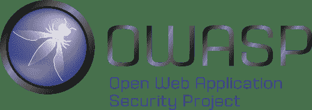
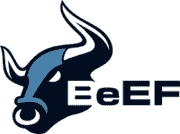
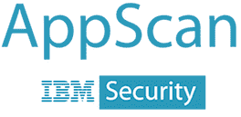
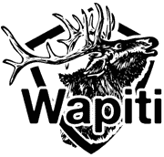
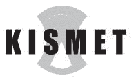

# 2020 年 40 种最佳渗透测试（笔测试）Vapt 工具

> 原文： [https://www.guru99.com/top-5-penetration-testing-tools.html](https://www.guru99.com/top-5-penetration-testing-tools.html)

Penetration [Testing](/software-testing.html) tools help in identifying security weaknesses ing a network, server or web application. These tools are very useful since they allow you to identify the "unknown vulnerabilities" in the software and networking applications that can cause a security breach. Vulnerability Assessment and Penetration Testing (VAPT) Tools attack your system within the network and outside the network as if an hacker would attack it. If the unauthorized access is possible, the system has to be corrected.

**Here is a list of top 40 Penetration Testing Tools**

### 1） [Netsparker](https://bit.ly/2Mt9Z1W)

[Netsparker](https://bit.ly/2Mt9Z1W) is an easy to use web application security scanner that can automatically find SQL Injection, XSS and other vulnerabilities in your web applications and web services. It is available as on-premises and SAAS solution.

**Features**

*   借助独特的基于证明的扫描技术，可以彻底准确地检测漏洞。
*   所需的配置最少。 扫描程序会自动检测 URL 重写规则，自定义 404 错误页面。
*   REST API，用于与 SDLC，错误跟踪系统等进行无缝集成。
*   完全可扩展的解决方案。 只需 24 小时即可扫描 1,000 个 Web 应用程序。

* * *

### 2） [Acunetix](https://bit.ly/2nZOxmC)

[Acunetix](https://bit.ly/2nZOxmC) is a fully automated penetration testing tool. Its web application security scanner accurately scans HTML5, JavaScript and Single-page applications. It can audit complex, authenticated webapps and issues compliance and management reports on a wide range of web and network vulnerabilities, including out-of-band vulnerabilities.

**功能：**

*   扫描 SQL 注入，XSS 和 4500 多个其他漏洞的所有变体
*   检测 1200 多个 WordPress 核心，主题和插件漏洞
*   快速&可扩展–无需中断即可抓取数十万个页面
*   与流行的 WAF 和问题跟踪器集成以帮助 SDLC
*   在本地和作为云解决方案可用。

* * *

### 3）[表面](https://bit.ly/2FJX2eN)

[Indusface](https://bit.ly/2FJX2eN) WAS offers manual Penetration testing and automated scanning to detect and report vulnerabilities based on OWASP top 10 and SANS top 25\.

**功能**

*   搜寻器扫描单页应用程序
*   暂停和恢复功能
*   手动 PT 和自动扫描仪报告显示在同一仪表板上
*   无限的概念验证请求可提供已报告漏洞的证据，并有助于从自动扫描结果中消除误报
*   可选的 WAF 集成可提供零误报的即时虚拟补丁
*   根据来自 WAF 系统的实际流量数据自动扩展爬网范围（如果已订阅和使用 WAF）
*   24×7 全天候讨论补救指南/ POC

* * *

### 4） [ImmuniWeb](https://bit.ly/326Z4ii)

[ImmuniWeb](https://bit.ly/326Z4ii) 是 Web 和移动应用程序渗透测试和安全等级的全球提供商。 ImmuniWeb AI 平台通过屡获殊荣的 AI 技术来增强人工测试，以加速和扩展安全测试。 ImmuniWeb 在 Gartner，Forrester 和 IDC 的认可下，进行了快速，可扩展且支持 DevSecOps 的渗透测试，大大超越了传统的渗透测试方法。

**Features:**

*   快速交付 SLA
*   零误报 SLA
*   SANS 前 25 名全覆盖
*   OWASP 十大全面报道
*   PCI DSS 6.5.1-6.5.11 全面覆盖
*   量身定制的修复准则
*   24/7 与我们的安全分析师联系
*   与 SDLC & CI / CD 工具集成
*   通过 WAF 一键式虚拟补丁

* * *

### 5） [PureVPN](https://bit.ly/2PDpQJN)

[PureVPN](https://bit.ly/2PDpQJN) 是道德黑客武器库中必不可少的工具。 您可能需要它来检查不同地理位置的目标，模拟非个性化的浏览行为，匿名文件传输等。

**功能：**

*   没有高安全性和匿名性的 Log VPN
*   跨大洲的 2000 多个服务器的极快速度
*   它位于香港，不存储任何数据。
*   拆分隧道和 5 个同时登录
*   24/7 支持
*   支持 Windows，Mac，Android，Linux，iPhone 等
*   300,000+个 IP
*   端口转发，专用 IO 和 P2P 保护
*   31 天退款保证

* * *

### 6）猫头鹰

开放 Web 应用程序安全性项目（ [OWASP](https://www.owasp.org/index.php/OWASP_Web_Testing_Environment_Project) ）是一个全球性的非营利组织，致力于改善软件的安全性。 该项目有多种工具可以对各种软件环境和协议进行笔式测试。 该项目的旗舰工具包括

1.  [Zed 攻击代理](https://www.owasp.org/index.php/OWASP_Zed_Attack_Proxy_Project)（ZAP –一种集成的渗透测试工具）
2.  [OWASP 依赖关系检查](https://www.owasp.org/index.php/OWASP_Dependency_Check)（它扫描项目依赖关系并检查已知漏洞）
3.  [OWASP Web 测试环境项目](https://www.owasp.org/index.php/OWASP_Web_Testing_Environment_Project)（安全工具和文档的集合）

**OWASP 测试指南提供了“最佳实践”来渗透测试最常见的 Web 应用程序**

[Owasp 链接](https://www.owasp.org/index.php/Category:OWASP_Testing_Project)

* * *

### 7）WireShark

[Wireshark](https://www.wireshark.org/) 是以前称为 Ethereal 的网络分析渗透测试工具。 它实时捕获数据包并以人类可读的格式显示它们。 基本上，它是一个网络数据包分析器-提供有关您的网络协议，解密，数据包信息等的详细信息。它是一个开放源代码，可以在 Linux，Windows，OS X，Solaris，NetBSD，FreeBSD 和许多其他操作系统上使用 其他系统。 可以通过 GUI 或 TTY 模式下的 TShark Utility 查看通过此工具检索的信息。

WireShark 功能包括

*   实时捕获和离线分析
*   丰富的 VoIP 分析
*   使用 gzip 压缩的捕获文件可以即时解压缩
*   输出可以导出为 XML，PostScript，CSV 或纯文本
*   多平台：在 Windows，Linux，FreeBSD，NetBSD 和许多其他操作系统上运行
*   可以从 Internet，PPP / HDLC，ATM，蓝牙，USB，令牌环等读取实时数据。
*   对许多协议的解密支持，包括 IPsec，ISAKMP，SSL / TLS，WEP 和 WPA / WPA2
*   为了快速直观地分析，可以将着色规则应用于数据包
*   读取/写入许多不同的捕获文件格式

[Wireshark 下载](https://www.wireshark.org/)

* * *

### 8）w3af

[w3af](http://w3af.org/take-a-tour) 是一个 Web 应用程序攻击和审核框架。 它具有三种类型的插件： 可以针对站点中的任何漏洞进行通信的发现，审计和攻击，例如 w3af 中的发现插件会寻找不同的 URL 来测试漏洞，并将其转发给审计插件，然后审计插件将使用这些 URL 搜索漏洞。

也可以将其配置为作为 MITM 代理运行。 拦截的请求可以发送到请求生成器，然后可以使用可变参数执行手动 Web 应用程序测试。 它还具有利用其发现的漏洞的功能。

**W3af 功能**

*   代理支持
*   HTTP 响应缓存
*   DNS 缓存
*   使用分段上传文件
*   Cookie 处理
*   HTTP 基本和摘要身份验证
*   用户代理伪造
*   向请求添加自定义标头

[w3af 下载链接](http://w3af.org/take-a-tour)

* * *

### 9）变质

这是可用于渗透测试的最流行和最先进的框架。 这是一个基于“漏洞利用”概念的开源工具，这意味着您传递的代码违反了安全措施，并进入了某个系统。 如果输入，它将运行“有效负载”，即在目标计算机上执行操作的代码，从而为渗透测试创建了理想的框架。 这是一个很好的测试工具，用于测试 IDS 是否成功阻止了我们绕过它的攻击

[Metaspoilt](http://www.metasploit.com/) 可以在网络，应用程序，服务器等上使用。它具有命令行和 GUI 可单击的界面，可以在 Apple Mac OS X 上运行，可以在 [Linux](/unix-linux-tutorial.html) 和 Microsoft Windows 上运行。

**后掠物**的功能

*   基本命令行界面
*   第三方进口
*   手动蛮力
*   手动蛮力
*   网站渗透测试

[Metaspoilt 下载链接](http://www.metasploit.com/)

* * *

### 10 倍

[Kali](https://www.kali.org/) 仅在 Linux 机器上工作。 它使您能够创建适合您需要的备份和恢复计划。 它促进了一种快速简便的方法来查找和更新迄今为止最大的安全渗透测试集合数据库。 它是可用于数据包嗅探和注入的最佳工具。 使用此工具时，TCP / IP 协议和网络方面的专业知识可能会有所帮助。

**功能**

*   附加的 64 位支持允许暴力破解密码
*   Back Track 随附了预装的工具，用于 LAN 和 WLAN 嗅探，漏洞扫描，密码破解和数字取证
*   Backtrack 集成了一些最佳工具，例如 Metaspoilt 和 Wireshark
*   除网络工具外，它还包括 pidgin，xmms，Mozilla，k3b 等。
*   回溯支持 KDE 和 Gnome。

[次下载链接](https://www.kali.org/)

* * *

### 11）武士框架：

[Samurai](https://sourceforge.net/projects/samurai/files/) Web 测试框架是笔测试软件。 已预先配置为充当 Web 笔测试环境的 VirtualBox 和 VMWare 支持该工具。

**Features:**

*   它是开源的，免费使用的工具
*   它包含最佳的开源和免费工具，这些工具侧重于测试和攻击网站
*   它还包括一个预配置的 Wiki，用于在笔测期间建立中央信息存储

**下载链接：** [https://sourceforge.net/projects/samurai/files/](https://sourceforge.net/projects/samurai/files/)

* * *

### 12）空袭：

[Aircrack](https://www.aircrack-ng.org/downloads.html) 是一款便捷的无线渗透测试工具。 它会破解易受攻击的无线连接。 它由 WEP WPA 和 WPA 2 加密密钥提供支持。

**Features:**

*   支持更多卡/驱动程序
*   支持所有类型的操作系统和平台
*   新的 WEP 攻击：PTW
*   支持 WEP 词典攻击
*   支持碎片攻击
*   改善追踪速度

**下载链接：** [https://www.aircrack-ng.org/downloads.html](https://www.aircrack-ng.org/downloads.html)

* * *

### 13）ZAP：

[ZAP](https://github.com/zaproxy/zaproxy/wiki) 是最流行的开源安全测试工具之一。 它由数百名国际志愿者维护。 它可以帮助用户在开发和测试阶段发现 Web 应用程序中的安全漏洞。

**Features:**

*   它可以通过模拟实际攻击来帮助识别 Web 应用程序中存在的安全漏洞
*   被动扫描分析服务器的响应以识别某些问题
*   它尝试强行访问文件和目录。
*   爬虫功能有助于构建网站的层次结构
*   提供无效或意外的数据以使其崩溃或产生意外的结果
*   查找目标网站上开放端口的有用工具
*   它提供了一个交互式 Java Shell，可用于执行 BeanShell 脚本
*   它已完全国际化并支持 11 种语言

**下载链接：** [https://github.com/zaproxy/zaproxy/wiki](https://github.com/zaproxy/zaproxy/wiki)

* * *

### 14）Sqlmap：

[Sqlmap](https://github.com/sqlmapproject/sqlmap) 是一个开源渗透测试工具。 它可以自动检测和利用 SQL 注入漏洞的整个过程。 它带有许多检测引擎和功能，可实现理想的渗透测试。

**Features:**

*   全面支持六种 SQL 注入技术
*   允许直接连接到数据库而无需通过 SQL 注入
*   支持枚举用户，密码哈希，特权，角色，数据库，表和列
*   自动识别以哈希格式给出的密码并支持破解
*   支持完全转储数据库表或特定列的转储
*   用户还可以从每列的条目中选择一系列字符
*   允许在受影响的系统和数据库服务器之间建立 TCP 连接
*   支持搜索所有数据库和表中的特定数据库名称，表或特定列
*   允许执行任意命令并在数据库服务器上检索其标准输出

**下载链接：** [https://github.com/sqlmapproject/sqlmap](https://github.com/sqlmapproject/sqlmap)

* * *

### 15）Sqlninja：

[Sqlninja](http://sqlninja.sourceforge.net/download.html) 是一种渗透测试工具。 旨在利用 Web 应用程序上的 SQL Injection 漏洞。 它使用 Microsoft SQL Server 作为后端。 即使在非常恶劣的环境中，它也可以在易受攻击的数据库服务器上提供远程访问。

**Features:**

*   远程 SQL 的指纹
*   基于时间的数据提取或使用 DNS 隧道
*   允许与 Metasploit3 集成，以获得对远程数据库服务器的图形访问
*   通过 VBScript 或 debug.exe 仅使用常规 HTTP 请求上载可执行文件
*   直接和反向绑定外壳，用于 TCP 和 UDP
*   如果使用令牌绑架在 w2k3 上无法使用原始 xp cmdshell，则创建一个自定义 xp cmdshell

**下载链接：** [http://sqlninja.sourceforge.net/download.html](http://sqlninja.sourceforge.net/download.html)

* * *

### 16）牛肉：

浏览器开发框架。 这是一个针对 Web 浏览器的渗透测试工具。 它使用 GitHub 跟踪问题并托管其 git 存储库。

**Features:**

*   它允许使用客户端攻击向量来检查实际的安全状态
*   BeEF 允许挂钩一个或多个 Web 浏览器。 然后可以将其用于启动定向命令模块和对系统的进一步攻击。

**下载链接：** [http://beefproject.com](http://beefproject.com)

* * *

### 17）部族;

[Dradis](https://dradisframework.com/ce) 是用于渗透测试的开源框架。 它允许维护可以在笔测参与者之间共享的信息。 收集的信息可帮助用户了解完成的内容和需要完成的内容。

**Features:**

*   轻松生成报告的过程
*   支持附件
*   无缝协作
*   使用服务器插件与现有系统和工具集成
*   平台无关

**下载链接：** [https://dradisframework.com/ce](https://dradisframework.com/ce)

* * *

### 18）快速 7：

Nexpose [Rapid 7](https://www.rapid7.com/products/nexpose/download/) 是有用的漏洞管理软件。 它实时监控暴露情况，并通过新数据适应新威胁，帮助用户在发生影响时立即采取行动。

**Features:**

*   实时了解风险
*   它带来了创新且先进的解决方案，可帮助用户完成工作
*   知道重点在哪里
*   为您的安全计划带来更多

**下载链接：** [https://www.rapid7.com/products/nexpose/download/](https://www.rapid7.com/products/nexpose/download/)

* * *

### 19）Hping：

[Hping](https://github.com/antirez/hping) 是一种 TCP / IP 数据包分析器笔测试工具。 该接口的灵感来自 ping（8）UNIX 命令。 它支持 TCP，ICMP，UDP 和 RAW-IP 协议。

**Features:**

*   允许防火墙测试
*   高级端口扫描
*   网络测试，使用不同的协议，TOS，分段
*   手动路径 MTU 发现
*   具有所有受支持协议的高级 traceroute
*   远程操作系统指纹&正常运行时间猜测
*   TCP / IP 堆栈审核

**下载链接：** [https://github.com/antirez/hping](https://github.com/antirez/hping)

* * *

### 20）SuperScan：

[Superscan](https://www.mcafee.com/in/downloads/free-tools/termsofuse.aspx) 是一个免费的仅 Windows 封闭源渗透测试工具。 它还包括网络工具，例如 ping，traceroute，whois 和 HTTP HEAD。

**功能：**

*   优越的扫描速度
*   支持无限的 IP 范围
*   使用多种 ICMP 方法改进了主机检测
*   提供对 TCP SYN 扫描的支持
*   简单的 HTML 报告生成
*   源端口扫描
*   广泛的横幅抓取
*   大型内置端口列表描述数据库
*   IP 和端口扫描顺序随机化
*   广泛的 Windows 主机枚举功能

**下载链接：** [https://www.mcafee.com/in/downloads/free-tools/termsofuse.aspx](https://www.mcafee.com/in/downloads/free-tools/termsofuse.aspx)

* * *

### 21）ISS 扫描仪：

IBM Internet Scanner 是一种笔测试工具，为任何企业提供有效的网络安全性奠定了基础。

**Features:**

*   Internet 扫描仪通过发现网络中的薄弱点来最大程度地降低业务风险
*   它允许自动执行扫描并发现漏洞
*   Internet Scanner 通过识别网络中的安全漏洞或漏洞来降低风险
*   完整的漏洞管理
*   Internet 扫描仪可以识别 1300 多种类型的联网设备

**下载链接**： [https://www-01.ibm.com/software/info/trials](https://www-01.ibm.com/software/info/trials)

* * *

### 22）Scapy：

[Scapy](http://secdev.org/projects/scapy/) 是功能强大的交互式笔测试工具。 它可以处理许多经典任务，例如网络上的扫描，探测和攻击。

**Features:**

*   它执行一些特定的任务，例如发送无效帧，注入 802.11 帧。 它使用各种组合技术，这是其他工具难以做到的
*   它允许用户准确地构建他们想要的数据包
*   减少执行特定代码的行数

**下载链接：** [http://secdev.org/projects/scapy/](http://secdev.org/projects/scapy/)

* * *

### 23）IronWASP：

[IronWASP](http://ironwasp.org/download.html) 是用于 Web 应用程序漏洞测试的开源软件。 它被设计为可自定义的，以便用户可以使用它创建其自定义安全扫描程序。

**Features:**

*   基于 GUI 且非常易于使用
*   它具有强大而有效的扫描引擎
*   支持记录登录顺序
*   以 HTML 和 RTF 格式报告
*   检查 25 种以上的网络漏洞
*   错误肯定和否定检测支持
*   它支持 Python 和 Ruby
*   可使用 Python，Ruby，C＃或 VB.NET 中的插件或模块进行扩展

**下载链接：** [http://ironwasp.org/download.html](http://ironwasp.org/download.html)

* * *

### 24）Ettercap：

[Ettercap](https://ettercap.github.io/ettercap/downloads.html) 是一种全面的笔测试工具。 它支持主动和被动解剖。 它还包括许多用于网络和主机分析的功能。

**Features:**

*   它支持许多协议的主动和被动解剖
*   ARP 中毒功能，可嗅探两台主机之间的交换局域网
*   可以在保持实时连接的同时将角色注入服务器或客户端
*   Ettercap 能够嗅探全双工的 SSH 连接
*   即使使用代理建立连接，也允许嗅探 HTTP SSL 安全数据
*   允许使用 Ettercap 的 API 创建自定义插件

**下载链接：** [https://ettercap.github.io/ettercap/downloads.html](https://ettercap.github.io/ettercap/downloads.html)

* * *

### 25）安全洋葱：

[安全洋葱](https://securityonion.net/)是一种渗透测试工具。 它用于入侵检测和网络安全监视。 它具有易于使用的设置向导，允许用户为其企业构建大量的分布式传感器。

**Features:**

*   它建立在分布式客户端-服务器模型上
*   网络安全监视允许监视与安全相关的事件
*   它提供完整的数据包捕获
*   基于网络和基于主机的入侵检测系统
*   它具有内置的机制，可以在存储设备容量满之前清除旧数据。

**下载链接：** [https://securityonion.net/](https://securityonion.net/)

* * *

### 26）个人软件检查器：

[个人软件检查器](http://learn.flexerasoftware.com/SVM-EVAL-Personal-Software-Inspector)是一种开源计算机安全解决方案。 该工具可以识别 PC 或服务器上应用程序中的漏洞。

**Features:**

*   提供八种不同的语言
*   自动执行不安全程序的更新
*   它涵盖了数千个程序，并自动检测不安全的程序
*   这款笔测试工具会自动并定期扫描 PC 是否存在漏洞程序
*   检测并通知无法自动更新的程序

**下载链接：** [http://learn.flexerasoftware.com/SVM-EVAL-Personal-Software-Inspector](http://learn.flexerasoftware.com/SVM-EVAL-Personal-Software-Inspector)

* * *

### 27）HconSTF：

[HconSTF](http://www.hcon.in/) 是基于不同浏览器技术的开源渗透测试工具。 它可以帮助任何安全专业人员协助进行渗透测试。 它包含的 Web 工具在执行 XSS，SQL 注入，CSRF，Trace XSS，RFI，LFI 等方面功能强大。

**Features:**

*   分类全面的工具集
*   每个选项都配置用于渗透测试
*   经过特殊配置和增强，以获得可靠的匿名性
*   适用于 Web 应用程序测试评估
*   易于使用的&协作操作系统

**下载链接：** [http://www.hcon.in/](http://www.hcon.in/)

* * *

### 28）IBM Security AppScan：

[IBM Security AppScan](http://www-03.ibm.com/software/products/en/appscan) 帮助增强 Web 应用程序安全性和移动应用程序安全性。 它提高了应用程序安全性并增强了法规遵从性。 它可以帮助用户识别安全漏洞并生成报告。

**Features:**

*   使开发和质量检查能够在 SDLC 流程中执行测试
*   控制每个用户可以测试的应用程序
*   轻松分发报告
*   提高知名度并更好地了解企业风险
*   专注于发现和解决问题
*   控制信息的访问

**下载链接：** [http://www-03.ibm.com/software/products/zh/appscan](http://www-03.ibm.com/software/products/en/appscan)

* * *

### 29）Arachni：

[Arachni](https://sourceforge.net/projects/safe3wvs/files) 是面向渗透测试人员&管理员的基于 Ruby 框架的开源工具。 它用于评估现代 Web 应用程序的安全性。

**Features:**

*   它是一种多功能工具，因此涵盖了大量用例。 范围从简单的命令行扫描仪实用程序到全球高性能的扫描仪网格
*   多种部署选项
*   它提供可验证，可检查的代码库，以确保最高级别的保护
*   它可以轻松地与浏览器环境集成
*   提供高度详细和结构合理的报告

**下载链接：** [https://sourceforge.net/projects/safe3wvs/files](https://sourceforge.net/projects/safe3wvs/files)

* * *

### 30）Websecurify：

[Websecurify](https://www.websecurify.com/) 是功能强大的安全测试环境。 这是一个用户友好的界面，简单易用。 它提供了自动和手动漏洞测试技术的组合。

**Features:**

*   良好的测试和扫描技术
*   强大的测试引擎可检测 URL
*   它可以通过许多可用附件进行扩展
*   它适用于所有主要的台式机和移动平台

**下载链接：** [https://www.websecurify.com/](https://www.websecurify.com/)

* * *

### 31）维加

[Vega](https://subgraph.com/vega/download/index.en.html) 是一个开源 Web 安全扫描程序和笔测试平台，用于测试 Web 应用程序的安全性。

**Features:**

*   自动化，手动和混合安全性测试
*   它可以帮助用户发现漏洞。 它可能是跨站点脚本，存储的跨站点脚本，盲目 SQL 注入，shell 注入等。
*   提供用户凭据后，它可以自动登录网站
*   它可以在 Linux，OS X 和 Windows 上有效运行
*   Vega 检测模块是用 JavaScript 编写的

**下载链接：** [https://subgraph.com/vega/download/index.en.html](https://subgraph.com/vega/download/index.en.html)

* * *

### 32）Wapiti：

[Wapiti](https://sourceforge.net/projects/wapiti/files/) 是另一种著名的渗透测试工具。 它允许审核 Web 应用程序的安全性。 它同时支持 GET 和 POST HTTP 方法进行漏洞检查。

**Features:**

*   生成各种格式的漏洞报告
*   它可以暂停并恢复扫描或攻击
*   激活和停用攻击模块的快速简便方法
*   支持 HTTP 和 HTTPS 代理
*   它可以限制扫描范围
*   自动删除网址中的参数
*   进口饼干
*   它可以激活或停用 SSL 证书验证
*   从 Flash SWF 文件中提取 URL

**下载链接：** [https://sourceforge.net/projects/wapiti/files/](https://sourceforge.net/projects/wapiti/files/)

* * *

### 33）基斯梅特

[Kismet](https://www.kismetwireless.net/downloads/) 是无线网络检测器和入侵检测系统。 它适用于 Wi-Fi 网络，但可以通过插件扩展，因为它可以处理其他网络类型。

**Features:**

*   允许标准 PCAP 记录
*   客户端/服务器模块化架构
*   插件架构可扩展核心功能
*   多捕获源支持
*   通过轻量级远程捕获进行分布式远程嗅探
*   XML 输出以与其他工具集成

**下载链接：** [https://www.kismetwireless.net/downloads/](https://www.kismetwireless.net/downloads/)

* * *

### 34）Linux 时报：

[Kali Linux](https://www.kali.org/) 是一种开放式源代码笔测试工具，由 Offensive Security 维护和资助。

**Features:**

*   通过实时构建完全定制 Kali ISO，以创建定制的 Kali Linux 映像
*   它包含一堆元数据包集合，这些集合汇总了不同的工具集
*   厄运和其他加里食谱的 ISO
*   Raspberry Pi 2 上的磁盘加密
*   具有多个持久性存储的实时 USB

**下载链接：** [https://www.kali.org/](https://www.kali.org/)

* * *

### 35）鹦鹉安全性：

[Parrot Security](https://www.parrotsec.org/download/) 是一种笔测试工具。 它为安全和数字取证专家提供了完全便携式的实验室。 它还通过匿名和加密工具帮助用户保护其隐私。

**Features:**

*   它包括完整的面向安全的工具库，以执行渗透测试，安全审核等。
*   它带有预装的，有用的和更新的库
*   提供功能强大的全球镜像服务器
*   允许社区驱动的发展
*   提供专门为服务器设计的单独的 Cloud OS

**下载链接：** [https://www.parrotsec.org/download/](https://www.parrotsec.org/download/)

* * *

### 36）OpenSSL：

该工具包已获得 Apache 样式许可的许可。 它是一个免费的开源项目，为 TLS 和 SSL 协议提供功能齐全的工具包。

**Features:**

*   它是用 C 编写的，但是包装器可用于许多计算机语言
*   该库包括用于生成 RSA 私钥和证书签名请求的工具
*   验证 CSR 文件
*   从密钥中完全删除密码短语
*   创建新的私钥并允许证书签名请求

**下载链接：** [https://www.openssl.org/source/](https://www.openssl.org/source/)

* * *

### 37）喷鼻息：

[Snort](https://www.snort.org/downloads) 是一个开源入侵检测和笔测试系统。 它提供了基于签名协议和基于异常的检查方法的优势。 此工具可帮助用户最大程度地保护其免受恶意软件攻击。

**Features:**

*   Snort 因能够高速准确检测威胁而声名狼藉
*   快速保护您的工作区免受新兴攻击
*   Snort 可用于创建定制的独特网络安全解决方案
*   测试特定 URL 的 SSL 证书
*   它可以检查 URL 是否接受特定密码
*   验证证书签名者授权
*   提交假阳性/阴性的能力

**下载链接：** [https://www.snort.org/downloads](https://www.snort.org/downloads)

* * *

### 38）底箱：

[BackBox](https://backbox.org/download) 是一个开源社区项目，旨在增强 IT 环境中的安全文化。 它有两种不同的版本，例如 Backbox Linux 和 Backbox Cloud。 它包括一些最常用/最常用的安全和分析工具。

**Features:**

*   它是减少公司资源需求并降低管理多个网络设备需求的成本的有用工具
*   它是全自动的笔测试工具。 因此，无需进行任何代理，也无需进行网络配置即可进行更改。 为了执行计划的自动配置
*   安全访问设备
*   由于无需跟踪单个网络设备，因此组织可以节省时间
*   支持凭证和配置文件加密
*   自我备份和自动远程存储
*   提供基于 IP 的访问控制
*   无需编写命令，因为它已预配置了命令

**下载链接：** [https://backbox.org/download](https://backbox.org/download)

* * *

### 39）THC 九头蛇：

[Hydra](https://github.com/vanhauser-thc/thc-hydra) 是并行的登录饼干和笔测试工具。 它非常快速且灵活，并且易于添加新模块。 该工具使研究人员和安全顾问可以找到未经授权的访问。

**Features:**

*   完整的时间记忆权衡工具套件以及彩虹表的生成，排序，转换和查找
*   它支持任何哈希算法的 Rainbow 表
*   支持任何字符集的彩虹表
*   支持紧凑或原始文件格式的 Rainbow 表
*   计算对多核处理器的支持
*   在 Windows 和 Linux 操作系统上运行
*   所有受支持的操作系统上的统一 Rainbow 表文件格式
*   支持 GUI 和命令行用户界面

**下载链接：** [https://github.com/vanhauser-thc/thc-hydra](https://github.com/vanhauser-thc/thc-hydra)

* * *

### 40）名誉监控警报：

开放式威胁交换[信誉监视器](https://www.alienvault.com/try-it-free?utm_internal=sb_freetrial_modal)是一项免费服务。 它使专业人员可以跟踪其组织的声誉。 借助此工具，企业和组织可以跟踪其资产的公共 IP 和域信誉。

**Features:**

*   监控云，混合云和本地基础架构
*   提供持续的威胁情报，以在出现威胁时保持最新状态
*   提供最全面的威胁检测和可行的事件响应指令
*   快速，轻松，省力地部署
*   与传统安全解决方案相比，降低了总拥有成本

**下载链接：** [https://www.alienvault.com/try-it-free?utm_internal=sb_freetrial_modal](https://www.alienvault.com/try-it-free?utm_internal=sb_freetrial_modal)

* * *

### 41）开膛手约翰

[开膛手约翰](https://www.openwall.com/john/)被称为 JTR，是一种非常流行的密码破解工具。 它主要用于执行字典攻击。 它有助于识别网络中的弱密码漏洞。 它还支持用户免受暴力攻击和彩虹破解攻击。

**Features:**

*   开膛手约翰是免费的开源软件
*   主动式密码强度检查模块
*   它允许在线浏览文档
*   支持许多其他哈希和密码类型
*   允许在线浏览文档，包括两个版本之间的更改摘要

**下载链接：** [https://www.openwall.com/john/](https://www.openwall.com/john/)

* * *

### 42）Safe3 扫描仪：

[Safe3WVS](https://sourceforge.net/projects/safe3wvs/files/latest/download) 是功能最强大的 Web 漏洞测试工具之一。 它带有网络蜘蛛爬网技术，尤其是网络门户。 它是查找 SQL 注入，上传漏洞等问题的最快工具。

**Features:**

*   完全支持基本，摘要和 HTTP 身份验证。
*   智能网络蜘蛛自动删除重复的网页
*   自动 JavaScript 分析器支持从 Ajax，Web 2.0 和任何其他应用程序中提取 URL。
*   支持扫描 SQL 注入，上传漏洞，管理路径和目录列表漏洞

**下载链接：** [https://sourceforge.net/projects/safe3wvs/files/latest/download](https://sourceforge.net/projects/safe3wvs/files/latest/download)

* * *

### 43）CloudFlare：

[CloudFlare](https://www.cloudflare.com/) 是具有强大安全功能的 CDN。 在线威胁的范围从垃圾评论和过度的爬虫程序到 SQL 注入等恶意攻击。 它提供了针对垃圾评论，过多的爬网程序和恶意攻击的保护。

**Feature:**

*   它是企业级 DDoS 防护网络
*   Web 应用程序防火墙可从整个网络的集体智能中提供帮助
*   使用 CloudFlare 注册域是防止域劫持的最安全方法
*   限速功能可以保护用户的重要资源。 它以可疑数量的请求速率阻止访问者。
*   CloudFlare Orbit 解决了物联网设备的安全问题

**下载链接：** [https://www.cloudflare.com/](https://www.cloudflare.com/)

* * *

### 44）Zenmap

[Zenmap](https://nmap.org/download.html) 是官方的 Nmap Security Scanner 软件。 它是一个多平台的免费开放源代码应用程序。 它对于初学者来说易于使用，但也为经验丰富的用户提供高级功能。

**Features:**

*   交互式和图形结果查看
*   它在方便的显示中总结了有关单个主机或完整扫描的详细信息。
*   它甚至可以绘制发现的网络的拓扑图。
*   它可以显示两次扫描之间的差异。
*   它允许管理员跟踪出现在其网络上的新主机或服务。 或跟踪出现故障的现有服务

**下载链接：** [https://nmap.org/download.html](https://nmap.org/download.html)

对于渗透测试可能有用的其他工具是

*   **Acunetix：**这是一个针对 Web 应用程序的 Web 漏洞扫描程序。 与其他工具相比，它是一种昂贵的工具，并提供跨站点脚本测试，PCI 遵从性报告， [SQL](/sql.html) 注入等功能。
*   **Retina：**它更像是漏洞管理工具，而不是预先测试的工具
*   **Nessus：**它专注于合规性检查，敏感数据搜索，IP 扫描，网站扫描等。
*   **Netsparker：**该工具带有一个强大的 Web 应用程序扫描程序，该扫描程序可以识别漏洞并提出解决方案。 有免费的有限试用版，但大多数情况下它是商业产品。 它还有助于利用 SQL 注入和 LFI（本地文件归纳）
*   **核心影响：**该软件可用于移动设备渗透，密码识别和破解，网络设计渗透等。它是软件测试中昂贵的工具之一
*   **Burpsuite：**与其他软件一样，该软件也是商业产品。 它可以通过拦截代理，Web 应用程序扫描，爬网内容和功能等来工作。使用 Burpsuite 的优点是您可以在 Windows，Linux 和 Mac OS X 环境中使用它。