# Kali Linux 教程：什么是安装，利用 Metasploit 和 Nmap

> 原文： [https://www.guru99.com/kali-linux-tutorial.html](https://www.guru99.com/kali-linux-tutorial.html)

## 什么是 Kali Linux？

Kali Linux 是 Linux 的安全发行版，专门用于数字取证和渗透测试。 它是由进攻安全部门的 Mati Aharoni 和 Devon Kearns 通过重写 BackTrack 开发的。 BackTrack 是他们以前的信息安全操作系统。 Kali Linux 的第一个版本是 2013 年 3 月推出的 Kali1.0.0。OffensiveSecurity 当前资助和支持 Kalin Linux。 如果您今天访问 Kali 的网站（ [www.kali.org](https://www.kali.org) ），则会看到一个大横幅，上面写着“我们最先进的渗透测试发行版”。 具有讽刺意味的是，一个非常大胆的说法尚未得到证实。

Kali Linux 有 600 多个预装的渗透测试应用程序可供发现。 每个程序都有其独特的灵活性和用例。 Kali Linux 出色地将这些有用的实用程序分为以下几类：

1.  信息收集
2.  漏洞分析
3.  无线攻击
4.  网络应用
5.  开发工具
6.  压力测试
7.  取证工具
8.  嗅探&欺骗
9.  密码攻击
10.  维护访问
11.  逆向工程
12.  报告工具
13.  硬件黑客

在此初学者教程中，您将学习：

*   [什么是 Kali Linux？](#1)
*   [谁使用 Kali Linux，为什么？](#2)
*   [Kali Linux 安装方法](#3)
*   [使用 Virtual Box](#4) 安装 Kali Linux
*   [Kali Linux GUI](#5) 入门
*   [什么是 Nmap？](#6)

*   [Nmap 目标选择](#7)

*   [如何在 Kali Linux 上执行基本的 Nmap 扫描](#8)

*   [Nmap OS 扫描](#9)

*   [什么是 Metasploit？](#10)

*   [Metasploit 和 Nmap](#11)
*   [Metasploit 漏洞利用实用程序](#12)

## 谁使用 Kali Linux，为什么？

Kali Linux 确实是一个独特的操作系统，因为它是好人和坏人都公开使用的少数平台之一。 安全管理员和 Black Hat Hacker 都广泛使用此操作系统。 一种用于检测和预防安全漏洞，另一种用于识别并可能利用安全漏洞。 在操作系统上配置和预安装的工具数量众多，使 Kali Linux 成为任何安全专业人员工具箱中的瑞士军刀。

**使用 Kali Linux** 的专业人员

1.  安全管理员–安全管理员负责保护其机构的信息和数据。 他们使用 Kali Linux 来检查其环境，并确保没有容易发现的漏洞。
2.  网络管理员–网络管理员负责维护有效且安全的网络。 他们使用 Kali Linux 审核他们的网络。 例如，Kali Linux 具有检测恶意访问点的能力。
3.  网络架构师–网络架构师负责设计安全的网络环境。 他们利用 Kali Linux 审核其初始设计，并确保没有任何遗漏或配置错误。
4.  笔测试器–笔测试器，利用 Kali Linux 审核环境并在已聘请他们审查的公司环境上执行侦察。
5.  CISO – CISO 或首席信息安全官，使用 Kali Linux 对内部环境进行审核，并发现是否有任何新的应用程序或高级配置。
6.  法医工程师– Kali Linux 拥有“法医模式”，该模式使法医工程师可以在某些情况下执行数据发现和恢复。
7.  白帽黑客–与 Pen Tester 相似，白帽黑客使用 Kali Linux 来审核和发现环境中可能存在的漏洞。
8.  黑帽黑客–黑帽黑客利用 Kali Linux 发现和利用漏洞。 Kali Linux 还具有许多社交工程师应用程序，Black Hat Hacker 可以利用这些应用程序来破坏组织或个人。
9.  灰帽黑客–灰帽黑客位于白帽和黑帽黑客之间。 他们将以与上述两种相同的方法利用 Kali Linux。
10.  计算机爱好者–计算机爱好者是一个相当通用的术语，但是，任何对学习网络或计算机感兴趣的人都可以使用 Kali Linux 来学习有关信息技术，网络和常见漏洞的更多信息。

## Kali Linux 安装方法

可以使用以下方法安装 Kali Linux：

**运行 Kali Linux 的方法：**

1.  直接在 PC 笔记本电脑上–利用 Kali ISO 映像，可以将 Kali Linux 直接安装到 PC 或笔记本电脑上。 如果您有备用 PC 并熟悉 Kali Linux，则此方法是最佳方法。 此外，如果您计划或进行任何接入点测试，建议直接在支持 Wi-Fi 的笔记本电脑上安装 Kali Linux。
2.  虚拟化（VMware，Hyper-V，Oracle VirtualBox，Citrix）– Kali Linux 支持最知名的虚拟机管理程序，并且可以轻松地成为最受欢迎的虚拟机管理程序。 可以从 [www.kali.org](http://www.kali.org) 下载预配置的映像，或者可以使用 ISO 将操作系统手动安装到首选的虚拟机监控程序中。
3.  Cloud (Amazon AWS, Microsoft Azure) – Given the popularity of Kali Linux, both AWS and Azure provide images for Kali Linux.

    

4.  USB 引导光盘–利用 Kali Linux 的 ISO，可以创建引导光盘以在没有实际安装的情况下在机器上运行 Kali Linux 或用于法医目的。
5.  Windows 10 (App) – Kali Linux can now natively run on Windows 10, via the Command Line. Not all features work yet as this is still in beta mode.

    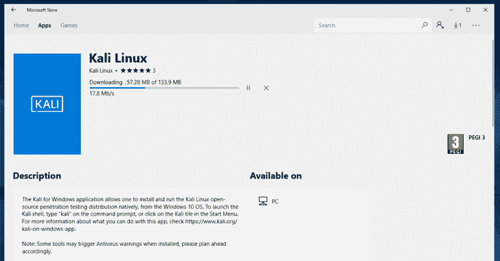

6.  Mac（双引导或单引导）– Kali Linux 可以作为辅助操作系统或主要操作系统安装在 Mac 上。 可以利用 Parallels 或 Mac 的启动功能来配置此设置。

## 使用 Virtual Box 安装 Kali Linux

最简单的方法（可能是使用最广泛的方法）是安装 Kali Linux，并从 Oracle 的 VirtualBox 中运行它。

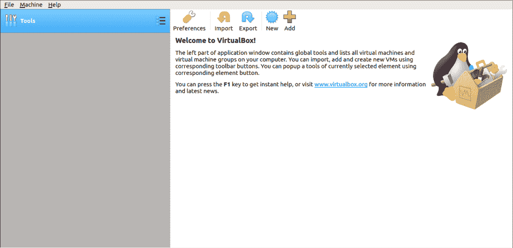

这种方法使您可以在完全隔离的环境中尝试使用功能丰富的 Kali Linux **时继续使用现有硬件。 最重要的是，一切都是免费的。 Kali Linux 和 Oracle VirtualBox 均可免费使用。 本教程假定您已经在系统上安装了 Oracle 的 VirtualBox，并已通过 Bios 启用了 64 位虚拟化。**

**步骤 1）**转到 [https://images.offensive-security.com/virtual-images/kali-linux-2019.2-vbox-amd64.ova](https://images.offensive-security.com/virtual-images/kali-linux-2019.2-vbox-amd64.ova)

这将下载 OVA 图像，可以将其导入 VirtualBox

**步骤 2）**打开 Oracle VirtualBox 应用程序，然后从文件菜单中选择导入设备

文件菜单->导入设备

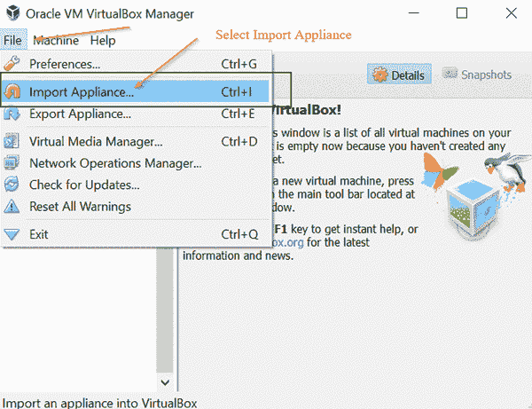

**步骤 3）**在下面的屏幕上**“导入设备”** 浏览到下载的 OVA 文件的位置，然后单击**打开**

[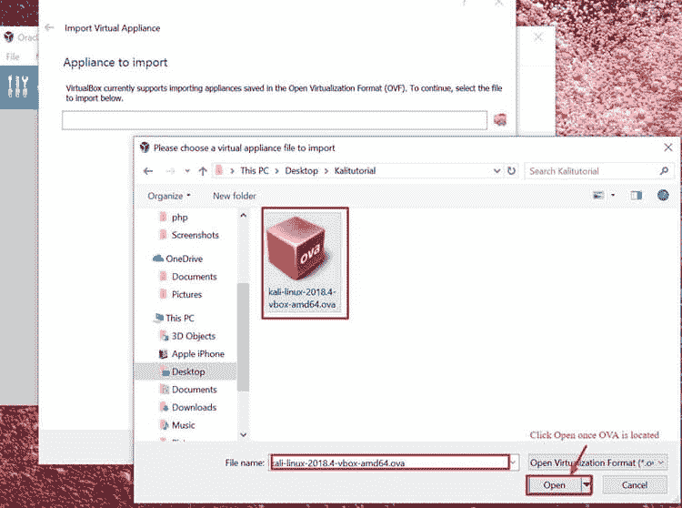 ](/images/1/011819_0813_KaliLinuxTu5.jpg) 

**步骤 4）**单击**打开**，您将返回到“ **设备要导入**”，只需单击**，然后单击**

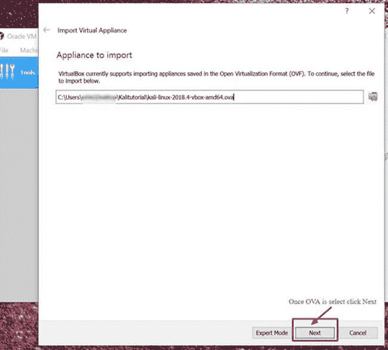

**步骤 5）**以下屏幕“ **Appliance Settings** ”显示系统设置的摘要，保留默认设置即可。 如下面的屏幕快照所示，记下虚拟机的位置，然后单击 **Import** 。

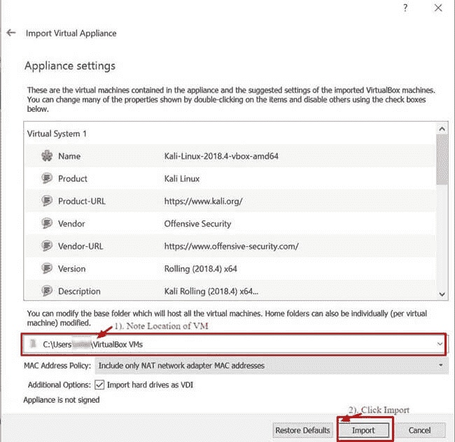

**步骤 6）** VirtualBox 现在将导入 Kali Linux OVA 设备。 此过程可能需要 5 到 10 分钟才能完成。

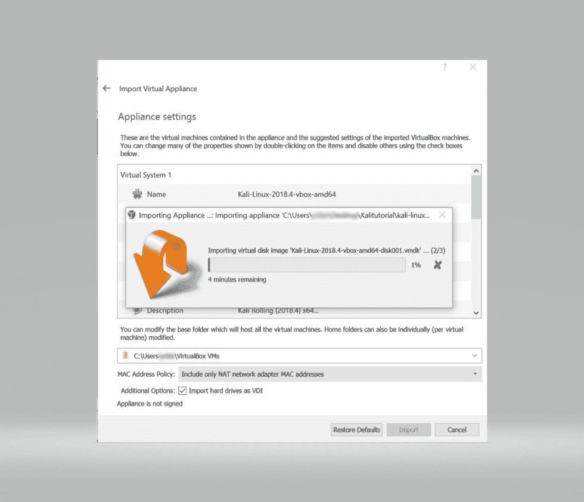

**步骤 7）**恭喜，Kali Linux 已成功安装在 VirtualBox 上。 现在，您应该在 VirtualBox 控制台中看到 Kali Linux VM。 接下来，我们将看一下 Kali Linux 及其执行的一些初始步骤。

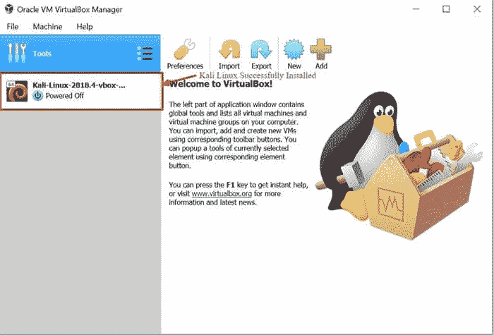

**步骤 8）**单击 VirtualBox 仪表板内的 Kali Linux VM，然后单击**，然后单击**，这将启动 Kali Linux 操作系统。

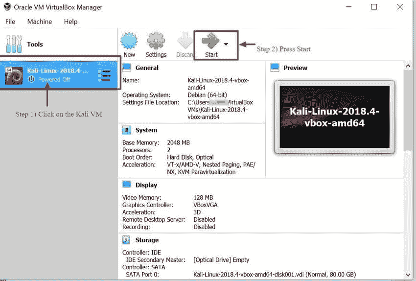

**步骤 9）**在登录屏幕上，输入“ **Root** ”作为用户名，然后单击 **Next** 。

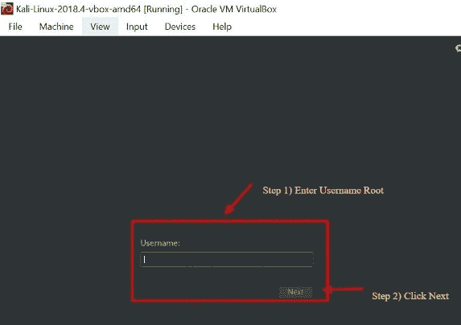

**步骤 10）**如前所述，输入“ **toor** ”作为密码，然后单击 **SignIn** 。

现在，您将看到 Kali Linux GUI 桌面。 恭喜，您已成功登录 Kali Linux。

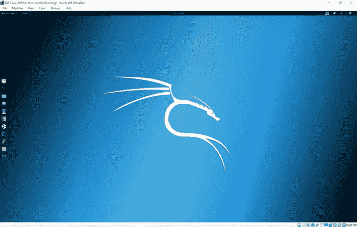

## **Kali Linux GUI** 入门

Kali 桌面上有一些选项卡，您应该首先记下它们并熟悉它们。 **应用程序选项卡，位置选项卡和 Kali Linux 扩展坞。**

[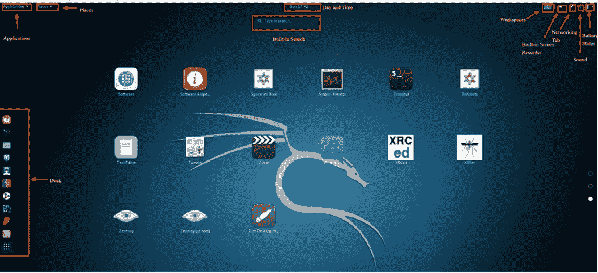 ](/images/1/011819_0813_KaliLinuxTu13.png) 

**应用程序选项卡** –提供预安装在 Kali Linux 上的所有应用程序和工具的图形下拉列表。 查看 **Applications 选项卡**是熟悉功能丰富的 Kali Linux 操作系统的好方法。 我们将在本教程中讨论的两个应用程序是 **Nmap** 和 **Metasploit** 。 将应用程序分为不同的类别，这使搜索应用程序变得更加容易。

**访问应用程序**

**步骤 1）**单击“应用程序”选项卡

**步骤 2）**浏览到您有兴趣探索的特定类别

**步骤 3）**单击您要启动的应用程序。

[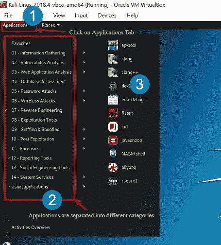 ](/images/1/011819_0813_KaliLinuxTu14.png) 

**位置选项卡** –与任何其他 GUI 操作系统（例如 Windows 或 Mac）类似，轻松访问文件夹，图片和我的文档是必不可少的组件。 **在 Kali Linux 上的位置**提供了对任何操作系统至关重要的可访问性。 默认情况下，**位置**菜单具有以下选项卡：**主页，桌面，文档，下载，音乐，图片，视频，计算机和浏览网络。**

**访问地方**

**步骤 1）**单击位置标签

**步骤 2）**选择您想要访问的位置。

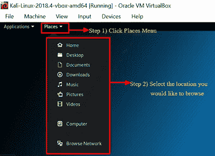

**Kali Linux 扩展坞** –与 Apple Mac 的 Dock 或 Microsoft Windows 任务栏相似， **Kali Linux 扩展坞**提供对常用/喜爱的应用程序的快速访问。 可以轻松添加或删除应用程序。

**从扩展坞中删除项目**

**步骤 1）**右键单击 Dock 项

**步骤 2）**选择从收藏夹中删除


**将项目添加到 Dock**

向 Dock 添加项目与从 Dock 中删除项目非常相似

步骤 1）单击 Dock 底部的“显示应用程序”按钮。

**步骤 2）右键单击应用程序**

**步骤 3）选择添加到收藏夹**

完成后，该项目将显示在 Dock 中

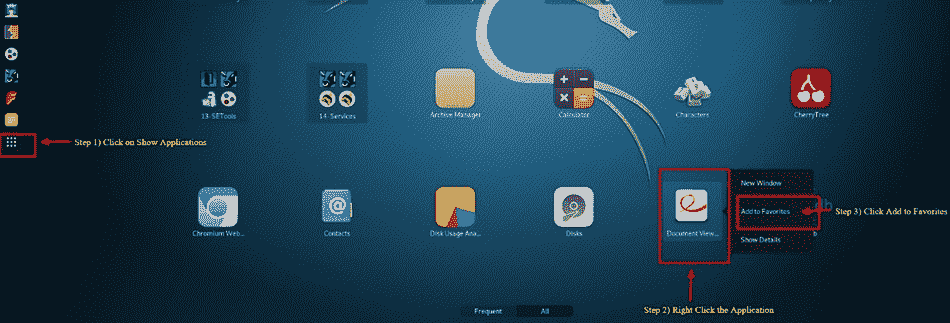

Kali Linux 还具有许多其他独特功能，这使该操作系统成为安全工程师和黑客之类的主要选择。 不幸的是，在本教程中不可能涵盖所有内容。 但是，您应该随意浏览桌面上显示的不同按钮。

## 什么是 Nmap？

Network Mapper（简称 Nmap）是一个免费的开源实用程序，用于网络发现和漏洞扫描。 安全专业人员使用 Nmap 查找在其环境中运行的设备。 Nmap 还可以揭示服务以及每个主机正在服务的端口，从而暴露出潜在的安全风险。 在最基本的级别上，考虑使用 Nmap，对类固醇进行 ping 操作。 您的技术技能越先进，您就会从 Nmap 中找到更多用处

Nmap 提供了监视单个主机或由数百个（如果不是数千个）设备和子网组成的广阔网络的灵活性。 Nmap 提供的灵活性已经发展了多年，但是从本质上讲，它是一个端口扫描工具，它通过将原始数据包发送到主机系统来收集信息。 然后，Nmap 侦听响应并确定端口是打开，关闭还是过滤。

您应该熟悉的第一次扫描是基本的 Nmap 扫描，它扫描前 1000 个 TCP 端口。 如果发现正在监听的端口，它将显示该端口为打开，关闭或已过滤。 已过滤表示防火墙很可能就位，可以修改该特定端口上的流量。 以下是可用于运行默认扫描的 Nmap 命令的列表。

### Nmap 目标选择

| 扫描一个 IP | Nmap 192.168.1.1 |
| 扫描主机 | nmap www.testnetwork.com |
| 扫描一系列 IP | Nmap 192.168.1.1-20 |
| 扫描子网 | nmap 192.168.1.0/24 |
| 从文本文件扫描目标 | nmap -iL-ipaddresses.txt 列表 |

## 如何在 Kali Linux 上执行基本的 Nmap 扫描

要在 Kali Linux 中运行基本的 Nmap 扫描，请执行以下步骤。 使用如上所述的 Nmap，您可以**扫描单个 IP，DNS 名称，IP 地址范围，子网，甚至从文本文件进行扫描。** 在此示例中，我们将扫描本地主机 IP 地址。

**步骤 1）**从 **Dock 菜单**中，单击第二个选项卡，即**终端**

**步骤 2）**应打开**终端**窗口，输入命令 **ifconfig，**该命令将返回您 Kali Linux 系统的本地 IP 地址。 在此示例中，本地 IP 地址是 10.0.2.15

**步骤 3）**记下本地 IP 地址

**步骤 4）**在同一终端窗口中，输入 **nmap 10.0.2.15** ，这将扫描本地主机上的前 1000 个端口。 考虑到这是基本安装，因此不应打开任何端口。

**步骤 5）**审核结果

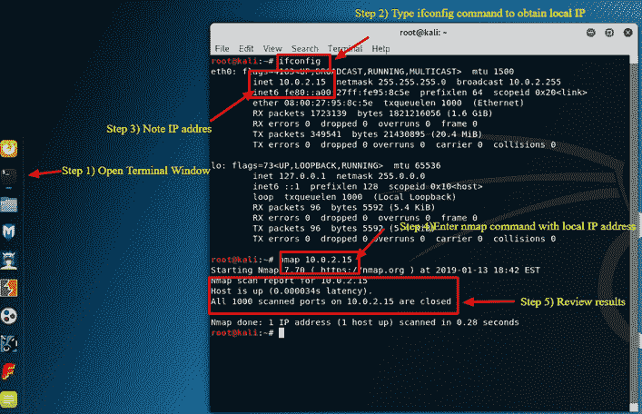

默认情况下，nmap 仅扫描前 1000 个端口。 如果您需要扫描完整的 65535 端口，则只需修改以上命令以包含 **-p-。**

```
Nmap 10.0.2.15 -p-

```

### Nmap OS 扫描

nmap 的另一个基本但有用的功能是能够检测主机系统的操作系统。 默认情况下，Kali Linux 是安全的，因此在此示例中，将以安装 Oracle 的 VirtualBox 的主机系统为例。 主机系统是 Windows 10 Surface。 主机系统的 IP 地址为 10.28.2.26。

在**终端**窗口中，输入以下 nmap 命令：

```
nmap 10.28.2.26 – A
```

审核结果

添加 **-A** 告诉 nmap 不仅执行端口扫描，而且尝试检测操作系统。


Nmap 是任何 Security Professional 工具箱中的重要工具。 使用命令 **nmap -h** 探索有关 Nmap 的更多选项和命令。

## 什么是 Metasploit？

Metasploit 框架是一个开源项目，为研究漏洞和开发代码提供了公共资源，从而使安全专业人员能够渗透到自己的网络中并识别安全风险和漏洞。 Metasploit 最近由 Rapid 7（https://www.metasploit.com）购买。 但是，Metasploit 的社区版仍可在 Kali Linux 上使用。 到目前为止，Metasploit 是世界上使用最广泛的渗透实用程序**。**

使用 Metasploit 时请务必小心，因为在某些情况下扫描不属于您的网络或环境可能被视为非法。 在本教程中，我们将向您展示如何启动 Metasploit 并在 Kali Linux 上运行基本扫描。 Metasploit 被认为是一种先进的实用程序，需要一定时间才能熟练使用，但一旦熟悉了该应用程序，它将成为宝贵的资源。

### Metasploit 和 Nmap

在 Metasploit 中，我们实际上可以利用 Nmap。 在这种情况下，您将学习如何使用我们刚刚了解的 Nmap 实用程序从 Metasploit 扫描本地 VirtualBox 子网。

**步骤 1）**在**的[应用程序]选项卡**上，向下滚动至 **08-Exploitation 工具**，然后选择 **Metasploit**

**步骤 2）**将打开一个接线盒，对话框中带有 **MSF** ，这是 **Metasploit**

**步骤 3）**输入以下命令

```
db_nmap -V -sV 10.0.2.15/24 
```

（确保将 10.0.2.15 替换为您的本地 IP 地址）

**此处：**

db_ 代表数据库

-V 代表详细模式

-sV 代表服务版本检测

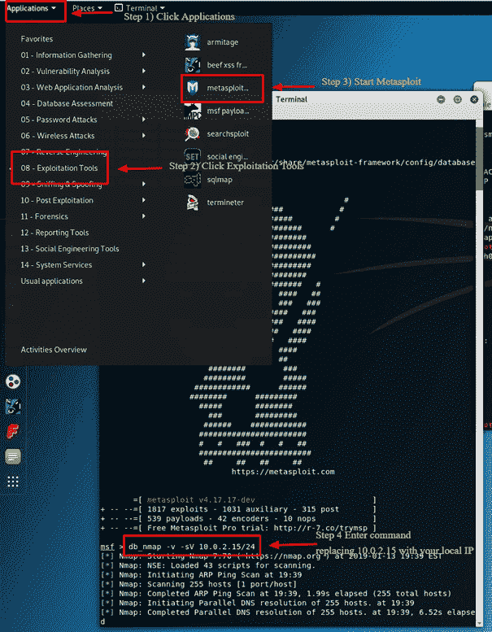

### Metasploit 漏洞利用实用程序

Metasploit 的功能和灵活性非常强大。 Metasploit 的一种常见用途是利用漏洞。 下面，我们将通过步骤回顾一些漏洞并尝试利用 Windows 7 计算机。

**步骤 1）**假设 Metasploit 仍处于打开状态，请在终端窗口中输入 **Hosts -R** 。 这会将最近发现的主机添加到 Metasploit 数据库。

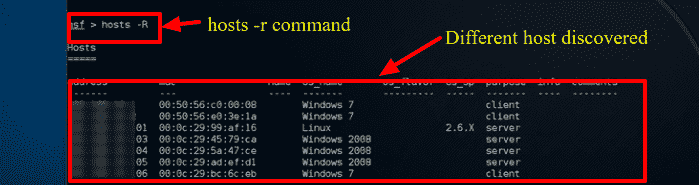

**步骤 2）**输入“ **show exploits** ”，此命令将全面介绍 Metasploit 可用的所有利用程序。

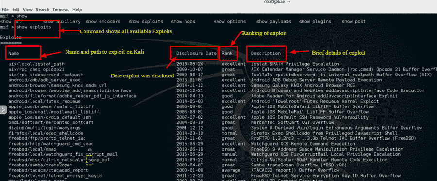

**步骤 3）**现在，尝试使用以下命令缩小列表的范围：**搜索名称：Windows 7** ，此命令针对此示例搜索专门包含 Windows 7 的漏洞利用程序 我们将尝试利用 Windows 7 计算机。 根据您的环境，您将不得不更改搜索参数以满足您的条件。 例如，如果您拥有 Mac 或另一台 Linux 计算机，则必须更改搜索参数以匹配该计算机类型。

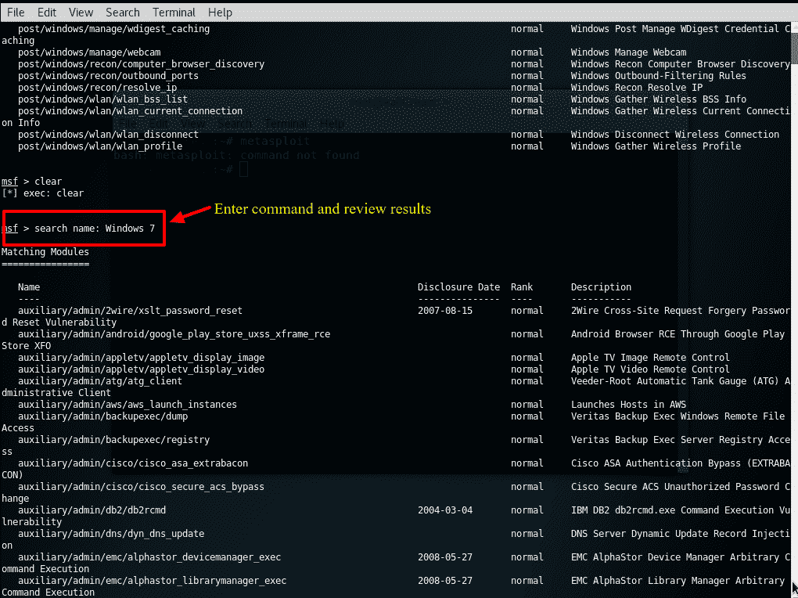

**步骤 4）**就本教程而言，我们将使用列表中发现的 **Apple Itunes 漏洞**。 要利用该漏洞利用程序，我们必须输入列表中显示的完整路径：**使用 exploit / windows / browse / apple_itunes_playlist**

[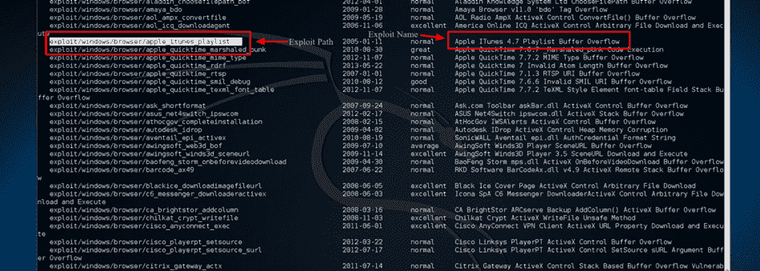 ](/images/1/011819_0813_KaliLinuxTu24.png) 

**步骤 5）**如果漏洞利用成功，则命令提示符将更改为显示漏洞利用名称，后跟 **>** ，如下面的屏幕快照所示。

**步骤 6）**输入**显示选项**以查看可利用该漏洞的选项。 当然，每种漏洞利用都有不同的选择。

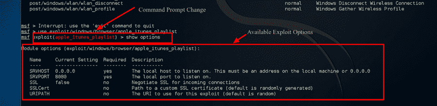

**摘要**

总而言之，Kali Linux 是一个了不起的操作系统，从安全管理员到黑帽黑客，各种专业人士广泛使用它。 鉴于其强大的实用性，稳定性和易用性，它是 IT 界和计算机发烧友都应该熟悉的操作系统。 仅使用本教程中讨论的两个应用程序将极大地帮助公司保护其信息技术基础架构。 Nmap 和 Metasploit 均可在其他平台上使用，但它们的易用性和在 Kali Linux 上的预安装配置使 Kali 成为评估和测试网络安全性时的首选操作系统。 如前所述，请小心使用 Kali Linux，因为它仅应在您控制或有权测试的网络环境中使用。 作为某些实用程序，实际上可能会导致数据损坏或丢失。