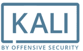
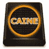

# 2020 年 13 种最佳黑客操作系统

> 原文： [https://www.guru99.com/best-os-hacking.html](https://www.guru99.com/best-os-hacking.html)

道德黑客正在发现计算机系统或网络中的弱点以利用其漏洞，以便日后予以修复。 黑客使用各种技术来识别威胁，从而提高设备的安全性。 这些人可以利用基于 Linux 的操作系统来入侵 PC 或网络。 它包含用于防止网络安全攻击的各种应用程序。

以下是其热门功能和下载链接的精选顶级黑客操作系统列表。

### 1）Linux Linux

Kali Linux 是 Linux 的安全发行版，专门用于数字取证和渗透测试。 它具有 600 多个预安装的渗透测试应用程序（针对计算机漏洞的网络攻击）。 该操作系统可以在 Windows 以及 Mac OS 上运行。

**功能**：

*   它可以用于渗透测试。
*   该平台提供 32 位和 64 位。
*   Kali Linux 可以更新，而无需下载新版本。
*   该操作系统可以加密整个磁盘。
*   您可以轻松地自动化和自定义网络上的 Kali Linux 安装。
*   支持 USB 实时安装。
*   它具有可用于取证工作的取证模式。

**链接**： [https://www.kali.org/](https://www.kali.org/)

* * *

### 2）鹦鹉 OS

Parrot OS 是用于黑客攻击的平台。 它具有易于使用的软件开发编辑器。 该平台使您可以安全私密地浏览网页。 黑客可以使用 Parrot OS 进行漏洞评估，渗透测试，计算机取证，等等。

**Features:**

*   它可以作为资源有限的轻量级软件提供。
*   您可以按自己的方式阅读和更改源代码。
*   提供专家支持，以帮助您提高网络安全性。
*   它具有带有专用 CDN（内容分发网络）的分布式基础结构。
*   您可以与其他人共享此操作系统。

**链接**： [https://parrotlinux.org/](https://parrotlinux.org/)

* * *

### 3）后箱

BackBox 是基于 Ubuntu 的开源操作系统，可提供渗透测试和安全评估工具。 该系统还提供了用于 IT 环境中安全性的网络分析工具包。 它包含道德黑客所需的工具包。

**Features:**

*   它可以帮助您进行计算机取证分析，漏洞评估等。
*   准确地设计以避免重复。
*   它消耗了系统的最少资源。
*   提供易于使用的桌面环境。
*   使您可以模拟对应用程序或网络的攻击。
*   它提供了稳定性和速度。

**链接**： [https://www.backbox.org/](https://www.backbox.org/)

* * *

### 4）黑弓

BlackArch 是一个基于 Linux 的免费平台，其中包含用于自动化，移动，联网等的各种工具。它是专门为安全研究人员和渗透测试人员创建的开源操作系统。 您可以单独或成组安装它。

**Features:**

*   它提供了具有多个窗口管理器的实时 ISO（国际标准化组织）。
*   可以使用有限的资源来运行此操作系统。
*   支持多个架构。
*   可以从源代码构建安装程序。

**链接**： [https://blackarch.org/](https://blackarch.org/)

* * *

### 5）Fedora 安全实验室

Fedora Security 环境使您可以进行安全审核，取证和黑客攻击。 它具有干净快速的桌面环境。 该操作系统包含基本的联网工具，例如 Wireshark，Medusa，Sqlninja，Yersinia 等。 Fedora Security 环境使笔测试和安全测试变得简单。

**Features:**

*   它具有一个自定义菜单，其中提供了遵循正确测试路径所需的所有说明。
*   此工具可以使 Live USB Creator（可以启动的完整操作系统）
*   您可以永久保存测试结果。
*   它会创建一个实时映像，以便在运行时安装软件。

**链接**： [https://labs.fedoraproject.org/en/security/](https://labs.fedoraproject.org/en/security/)

* * *

### 6）Dracos Linux

Dracos Linux 是提供渗透测试的开源操作系统。 它包含各种工具，例如取证，信息收集，恶意软件分析等。

**Features:**

*   每个人都可以使用该平台来学习，修改和重新分发。
*   Dracos Linux 是执行恶意软件分析的快速操作系统。
*   该操作系统不会收集您的敏感个人数据。
*   道德黑客可以轻松进行安全研究。

**链接**： [https://www.dracos-linux.org/](https://www.dracos-linux.org/)

* * *

### 7）Bugtraq

Bugtraq 是一个包含多种笔测试工具的操作系统，其中包括恶意软件测试工具，移动取证工具等。它易于使用的服务和产品。 这种环境提供了创新的友好服务。 Bugtraq 帮助黑客实时监控系统。

**Features:**

*   Bugtraq 系统提供最全面，最佳的解决方案。
*   它基于 3.2 和 3.4 内核
*   任何人都可以轻松使用此平台。
*   从 USB 驱动器或实时 DVD 安装此平台。
*   支持多种语言。
*   提供 32 位和 64 位两种版本。

**链接**： [http://www.bugtraq-apps.com/](http://www.bugtraq-apps.com/)

* * *

### 8）狗

CAINE 是基于 Ubuntu 的应用程序，可提供具有图形界面的完整取证环境。 该操作系统可以作为模块集成到现有软件工具中。 它会自动从 RAM 中提取时间线。

**Features:**

*   这是一个开源项目。
*   CAINE 以只读模式阻止所有设备。
*   您可以将此操作系统集成到现有软件中。
*   在数字调查期间，环境会为数字调查员提供支持。
*   您可以自定义 CAINE 的功能。
*   它提供了一个用户友好的操作系统。

**链接**： [https://www.caine-live.net/](https://www.caine-live.net/)

* * *

### 9）武士网络测试框架

Samurai Web 测试框架是 VMWare（云计算软件）VirtualBox（虚拟化产品）支持的虚拟机。 此实时 Linux 环境配置为执行 Web 笔测试。 它包含各种攻击网站的工具。

**Features:**

*   这是一个开源项目
*   武士网络测试框架专注于攻击网站。
*   它是针对 Web 笔测试环境预先配置的。
*   可用于重点攻击网站的功能。
*   它包含 WebScarab（网络安全应用程序测试工具）和 ratproxy（网络代理服务器）工具之类的工具。

**链接**： [http://www.samurai-wtf.org/](http://www.samurai-wtf.org/)

* * *

### 10）网络安全工具包（NST）

网络安全工具包（NST）是基于 Linux 的实时 USB / DVD 闪存驱动器。 它提供了可用于黑客攻击的免费开源网络和计算机安全工具。 黑客使用此分发来执行例行安全性和网络流量监视任务。

**Features:**

*   您可以轻松访问开源网络安全应用程序。
*   它具有易于使用的 WUI（Web 用户界面）。
*   Network Security Toolkit 可以用作网络安全分析验证。
*   它包含对具有虚拟机的虚拟服务器的监视。

**链接**： [https://www.networksecuritytoolkit.org/nst/index.html](https://www.networksecuritytoolkit.org/nst/index.html)

* * *

### 11）DEFT Linux

DEFT Linux 或数字证据&取证工具包 Linux 操作系统，专门用于黑客和计算机取证。 该平台可以在不损坏设备的实时系统上使用。 它包含事件响应和计算机取证的工具。 这些工具可由 IT 审核员，黑客，调查员等使用。

 

**Features:**

*   它具有硬件检测功能。
*   此环境具有用于调查的开源应用程序。
*   它提供了两种主要视图包和所有跟踪包的选择。

**链接**： [https://distrowatch.com/](https://distrowatch.com/)

* * *

### 12）DemonLinux

 

DemonLinux 是用于黑客攻击的 Linux 发行版。 它具有轻量级的桌面环境。 该平台带有深色主题和友好的用户界面。 DemonLinux 只需按一个键即可帮助您搜索或打开任何内容。

**Features:**

*   您可以通过按 Windows 键立即搜索所需的内容。
*   它具有简单的扩展坞设计（位于操作系统底部的栏）。
*   适用于 Firefox 和 Google Chrome。
*   使用快速访问菜单轻松记录桌面或拍摄屏幕截图，以节省时间。

**链接**： [https://demonlinux.com/about.php](https://demonlinux.com/about.php)

* * *

### 13）ArchStrike

ArchStrike 是可用于安全专业人员和研究人员的操作系统。 它遵循 Arch Linux OS 标准来正确维护软件包。 此环境可用于笔测试和安全层。 您可以轻松地安装或删除它，而不会出现任何问题。

**Features:**

*   它提供了两种主要视图包和所有跟踪包的选择。
*   该环境包括用于调查的开源应用程序。
*   它具有硬件检测功能。

**链接**： [https://archstrike.org/](https://archstrike.org/)