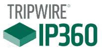

# 网站，网络的 13 种最佳漏洞评估扫描仪

> 原文： [https://www.guru99.com/vulnerability-scanning-tools-websites-network.html](https://www.guru99.com/vulnerability-scanning-tools-websites-network.html)

以下是热门漏洞扫描工具的精选列表，以及其受欢迎的功能和网站链接。 该列表同时包含开源（免费）和商业（付费）软件。

### 1）[表面](https://bit.ly/37I6yM1)

[Indusface](https://bit.ly/37I6yM1) WAS 提供了全面的动态应用程序安全测试工具（DAST）。 它结合了自动扫描以检测 OWASP 十大漏洞和恶意软件，以及由 Cert-In 认证的安全专家进行的手动笔测试。

**功能：**

*   专为单页应用程序构建的新时代扫描仪
*   验证扫描
*   恶意软件扫描&将黑名单检查
*   网络漏洞扫描
*   集成仪表板
*   通过概念验证来证明已报告的漏洞。
*   可选的 AppTrana WAF 集成可提供零误报的即时虚拟补丁
*   24×7 全天候讨论补救指南/ POC

* * *

### 2）Nessus 专业人士

Nessus Professional 是一个漏洞评估工具，用于检查合规性，搜索敏感数据，扫描 IP 和网站。 该工具旨在使漏洞评估变得简单，容易和直观。

**Features:**

*   它具有先进的检测技术，可提供更多保护。
*   该工具提供了完整的漏洞扫描功能，并且可以进行无限制的评估。
*   它提供了对计算机网络的准确可见性。
*   能够及时提供保护的插件将从新威胁中受益。
*   它使您可以安全地迁移到 Tenable 解决方案。
*   该工具检测 SQL 注入攻击。

**链接：** [https://www.tenable.com/products/nessus/nessus-professional](https://www.tenable.com/products/nessus/nessus-professional)

* * *

### 3）超越信任

Beyond Trust 是一个免费的在线漏洞扫描程序，可发现应用程序，设备，虚拟环境和操作系统之间的配置问题，网络漏洞和缺少的补丁程序。

**Features:**

*   该工具具有易于使用的界面，可简化漏洞评估，管理和内容。
*   它提供补丁管理。
*   改善风险管理和优先级。
*   该工具提供对 VMware 的支持，其中包括虚拟图像扫描。
*   它允许您与 vCenter 集成并扫描虚拟应用程序以确保安全。

**链接：** [https://www.beyondtrust.com/tools/vulnerability-scanner](https://www.beyondtrust.com/tools/vulnerability-scanner)

* * *

### 4）入侵者

入侵者是用于您的外部基础结构的基于云的网络漏洞扫描程序。 该工具可以发现计算机系统中的安全漏洞，以避免数据泄露。

**Features:**

*   您可以同步外部 IP 和 DNS 主机名。
*   它是开发人员友好的软件，可以与 Slack 或 Jira 集成在一起，以便团队可以了解安全问题。
*   该工具具有网络视图，可帮助您跟踪暴露的端口和服务。
*   扫描完成后，您可以接收电子邮件和 Slack 通知，并每月通过电子邮件发送摘要 PDF 报告。
*   Intruder.io 的每个漏洞扫描都有 10,000 多项安全检查。

**链接：** [https://www.intruder.io/](https://www.intruder.io/)

* * *

### 5）Tripwire IP360

Tripwire IP360 保护跨关键任务系统，虚拟，物理 DevOps 和云环境的完整性。 它提供了关键的安全控制措施，包括安全配置管理，漏洞管理，日志管理和资产发现。

**Features:**

*   可根据您的部署和需求扩展的模块化体系结构。
*   该工具具有优先级的风险评分功能。
*   通过与已经使用的各种工具集成，它可以帮助您最大化组织的生产力。
*   准确识别，搜索和配置网络上的所有资产。

**链接：** [https://www.tripwire.com/products/tripwire-ip360/](https://www.tripwire.com/products/tripwire-ip360/)

* * *

### 6）Wireshark

Wireshark 是一种工具，可以监视网络数据包并以人类可读的格式显示它们。 可以通过 GUI 或 TTY 模式下的 TShark Utility 查看通过此工具检索的信息。

**Features:**

*   实时捕获和离线分析
*   丰富的 VoIP 分析
*   压缩的 Gzip 文件可以即时解压缩
*   输出可以导出为纯文本，XML 或 CSV
*   多平台：可在 Windows，Linux，FreeBSD，NetBSD 和许多其他操作系统上运行
*   可以从 PPP / HDLC，互联网，ATM，蓝牙，令牌环，USB 等读取实时数据。
*   对许多协议的解密支持，包括 IPsec，ISAKMP，SSL / TLS，WEP 和 WPA / WPA2
*   为了快速，直观地进行分析，可以将着色规则应用于数据包
*   读取或写入许多不同的捕获文件格式，例如 Cisco Secure IDS iplog，Pcap NG 和 Microsoft Network Monitor 等。

**链接：** [https://www.wireshark.org/](https://www.wireshark.org/)

* * *

### 7）佩斯勒

Paessler 安全漏洞评估工具具有先进的基础架构管理功能。 该工具使用 SNMP，WMI，嗅探，REST APIS，SQL 等技术监视 IT 基础架构。

**Features:**

*   您可以监视 jFlow，sFlow，IP SLA，防火墙，IP，LAN，Wi-Fi，抖动和 IPFIX。
*   它通过电子邮件提供警报，播放警报音频文件或触发 HTTP 请求。
*   该工具提供了多个用户 Web 界面。
*   它具有自动故障转移处理。
*   您可以使用地图可视化网络。
*   Paessler 允许您监视不同位置的网络。
*   您可以获取要监视或配置的数据的数字，统计信息和图表。

**链接：** [https://www.paessler.com/network-security-monitoring](https://www.paessler.com/network-security-monitoring)

* * *

### 8）OpenVAS

OpenVAS 是一个漏洞扫描程序，可以帮助您执行经过身份验证的测试，未经身份验证的测试，漏洞测试，安全性测试，工业协议以及各种高级和低级 Internet 和工业协议。

**Features:**

*   您可以执行具有悠久历史和每日更新的漏洞测试。
*   包括 50,000 多个漏洞测试。
*   它提供性能调整和内部编程代码，以实现您要执行的任何类型的漏洞测试。

**链接：** [http://www.openvas.org/](http://www.openvas.org/)

* * *

### 9）爆裂

Aircrack 是检查漏洞并确保 Wi-Fi 网络安全所需的便捷工具之一。 该工具由 WEP WPA 和 WPA 2 加密密钥提供支持，可解决易受攻击的无线连接问题。

**Features:**

*   支持更多卡/驱动程序
*   为所有类型的操作系统和平台提供支持
*   新的 WEP 攻击：PTW
*   支持 WEP 词典攻击
*   保护您免受碎片攻击
*   改善追踪速度

**链接：** [https://www.aircrack-ng.org/](https://www.aircrack-ng.org/)

* * *

### 10）Comodo HackerProof

 

Comodo HackerProof 彻底改变了您测试网站和应用程序安全性的方式。 它包括 PCI 扫描和用于网站扫描的站点检查器。

**Features:**

*   该工具是使用最新技术构建的，该技术可以吸引更多的互动，从而为任何网站建立信任。
*   Comodo 允许用户在您的网站上提供凭据。
*   该软件产品在不更改网页布局的情况下提供了更多的网站信誉。
*   超过 100 人与 Comodo 品牌相关联。
*   不容易受到弹出窗口阻止程序的攻击
*   它使用翻转功能来告诉访问者该网站是受信任的。
*   该软件会打断您的网站访问者采取任何行动并窃取您的宝贵业务。

**链接：** [https://www.comodo.com/hackerproof/](https://www.comodo.com/hackerproof/)

* * *

### 11）Microsoft 基准安全分析器（MBSA）

 

Microsoft 基准安全分析器（MBSA）提供了简化的过程，可以查找常见的安全配置错误和缺少安全更新。

**Features:**

*   MBSA 扫描更新汇总，缺少的安全更新以及 Microsoft Update 可用的 Service Pack。
*   该下载适用于多种语言，例如英语，德语，日语和法语。
*   该工具包括命令行界面和图形用户界面，它们执行 Microsoft Windows 系统的本地或远程扫描。
*   扫描代理计算机系统并通知缺少的安全修补程序。
*   将所需的 MBSA 二进制文件放在所有 MOM 代理上。

**链接：** [https://www.microsoft.com/zh-cn/download/search.aspx?q=MBSA](https://www.microsoft.com/en-us/download/search.aspx?q=MBSA)

* * *

### 12）没人

Nikto 分析 Web 服务器中的 6700 多个潜在危险程序。 该工具检查服务器配置项，例如 HTTP 服务器选项，是否存在多个索引文件，并将尝试识别已安装的 Web 服务器和软件。

**Features:**

*   全面的 HTTP 代理支持
*   该工具会自动查找过时的服务器组件。
*   将报告保存为 HTML，纯文本，CSV，XML 或 NBE。
*   它具有一个模板引擎，可轻松自定义报告。
*   扫描多个服务器或服务器上的多个端口。
*   使用 Basic 和 NTLM 进行主机身份验证。
*   Authorization guessing handles any directory.

**链接：** [https://cirt.net/Nikto2](https://cirt.net/Nikto2)

* * *

### 13）Solarwinds 配置管理器

Solarwinds Configuration Manager 是用于通过策略管理，备份和自动化处理配置的软件。 该工具减少了跨复杂的多供应商网络管理关键变更和重复任务所需的时间。

**Features:**

*   您可以找到当前配置，并立即将其应用到备用备件上，或回滚已失效的配置。
*   保护您的 Cisco 设备免受恶意软件的侵害。
*   它为您的 Palo Alto Networks 防火墙提供有效的故障排除和网络管理。
*   该工具可以检测故障，识别并纠正一系列配置错误。
*   您可以了解连接到网络的设备，它们的硬件和软件配置。
*   控制谁可以查看设备详细信息并进行配置更改，以及确定何时可以进行网络更改。

**链接：** [https://www.solarwinds.com/network-configuration-manager](https://www.solarwinds.com/network-configuration-manager)

* * *

### 14）Nexpose 社区

Nexpose 是有用的漏洞管理软件。 使用此工具，您可以实时监控暴露情况，并通过新数据适应新的威胁。

**Features:**

*   实时了解风险。
*   它带来了创新且先进的解决方案，可以帮助用户完成工作。
*   知道在哪里集中。
*   为您的安全计划带来更多
*   向 IT 提供他们必须解决的所有必要细节。

**链接：** [https://www.rapid7.com/products/nexpose/](https://www.rapid7.com/products/nexpose/)

### 常问问题

⚡**什么是漏洞？**

漏洞是网络安全术语，它描述系统安全设计，过程，实施或任何内部控制中的弱点，这些弱点可能会导致违反系统的安全策略。 换句话说，入侵者（黑客）获得未经授权访问的机会。

🔐 **What is Vulnerability Assessment?**

漏洞评估是一种软件测试类型，用于评估软件系统中的安全风险以减少威胁的可能性。

✔️**漏洞评估在公司中的重要性是什么？**

*   漏洞评估和渗透测试（VAPT）可帮助您在攻击者发现安全漏洞之前检测出安全漏洞。
*   您可以创建网络设备清单，包括系统信息和用途。
*   它定义了网络上存在的风险级别。
*   建立收益曲线并优化安全投资。

⚡ **What is Vulnerability?**

A vulnerability is cyber security term which describes the weakness in the system security design, process, implementation, or any internal control that may result in the violation of the system's security policy. In other words, the chance for intruders (hackers) to get unauthorized access.

A vulnerability is cyber security term which describes the weakness in the system security design, process, implementation, or any internal control that may result in the violation of the system's security policy. In other words, the chance for intruders (hackers) to get unauthorized access.

A vulnerability is cyber security term which describes the weakness in the system security design, process, implementation, or any internal control that may result in the violation of the system's security policy. In other words, the chance for intruders (hackers) to get unauthorized access.

🔐 **What is Vulnerability Assessment?**

Vulnerability assessment is a software testing type performed to evaluate the security risks in the software system in order to reduce the probability of a threat.

Vulnerability assessment is a software testing type performed to evaluate the security risks in the software system in order to reduce the probability of a threat.

Vulnerability assessment is a software testing type performed to evaluate the security risks in the software system in order to reduce the probability of a threat.

✔️ **What is the importance of is vulnerability assessment in the company?**

*   漏洞评估和渗透测试（VAPT）可帮助您在攻击者发现安全漏洞之前检测出安全漏洞。
*   您可以创建网络设备清单，包括系统信息和用途。
*   它定义了网络上存在的风险级别。
*   建立收益曲线并优化安全投资。

*   漏洞评估和渗透测试（VAPT）可帮助您在攻击者发现安全漏洞之前检测出安全漏洞。
*   您可以创建网络设备清单，包括系统信息和用途。
*   它定义了网络上存在的风险级别。
*   建立收益曲线并优化安全投资。

*   漏洞评估和渗透测试（VAPT）可帮助您在攻击者发现安全漏洞之前检测出安全漏洞。
*   您可以创建网络设备清单，包括系统信息和用途。
*   它定义了网络上存在的风险级别。
*   建立收益曲线并优化安全投资。