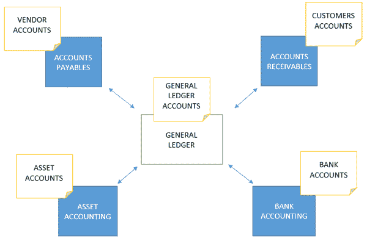

# SAP FICO 简介

> 原文： [https://www.guru99.com/introduction-sap-fico.html](https://www.guru99.com/introduction-sap-fico.html)

## 什么是 SAP FICO？

**SAP FICO** 是用于内部和外部财务报告的模块。 目的是记录一个实体过帐的所有财务交易，并在交易期末生成准确的财务报表。 **完整格式**或 SAP **FICO** 代表 FI（财务会计）和 CO（控制）。 本教程将说明 SAP FI 模块的主要功能。

SAP FI 由子模块组成。 经常使用的子模块是应收账款，应付账款，资产会计，总分类帐[会计](/accounting.html)和银行会计。

所有子模块都相互链接并实时集成。 可以一次提取试用平衡，因为所有子模块都已连接，所以它将始终平衡。 下图显示了 SAP FI 模块之间的集成。

### 总分类帐会计

用于报告的所有总分类帐帐户均通过总分类帐会计进行管理。 在 SAP 中，一个公司或一组公司使用的所有总分类帐帐户的集合称为会计科目表。 这些是将用于准备财务报表的帐户。 大部分交易记录在子模块中，并与总分类账实时对账。 可以直接在总帐[会计](/accounting.html)中进行的交易包括日记帐凭证，这些凭证已过帐以调整或更正交易。 冲销也可以通过总账会计进行。 可以显示总账帐户中的余额，并可以从系统中提取试用余额。

### 应收账款

应收帐款是一个子模块，可捕获与客户的所有交易并管理客户帐户。 将维护单独的客户帐户，并且在将交易记录发布到客户帐户中时，总账中的对帐帐户会实时更新数据。 应收账款中的交易包括发票过帐，贷项凭单过帐，预付款，发票付款，催款和执行客户报告。

### 应付账款

应付账款是一个子模块，捕获与卖方的所有交易并管理卖方帐户。 维护单独的供应商帐户，并且在客户帐户中过帐交易时，总账中的对帐帐户会实时更新数据。 应付帐款中的交易包括发票过帐，贷项通知单过帐，预付款，发票付款，自动付款程序和执行供应商报告。

### 资产会计

资产会计管理为实体重新分配到资产的所有交易。 在资产帐户中过帐交易后，总账中的对帐帐户会实时更新。 资产会计中的交易包括资产购置，资产报废，资产出售，资产转让，资产重估和资产折旧。

### 银行会计

银行会计捕获与银行的所有交易。 进行银行对账是为了对账在银行对账单上记录的所有交易，并将它们与系统中的交易进行比较。

所有 SAP FI 子模块都已集成，交易实时更新，这意味着可以随时从系统中提取准确的财务报表。