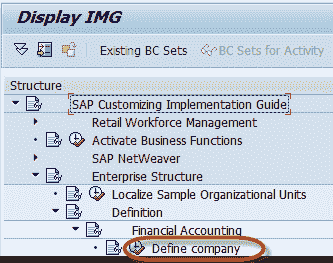
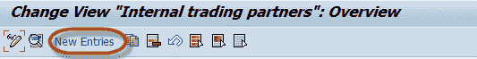
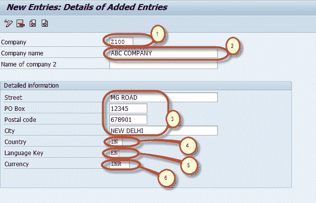
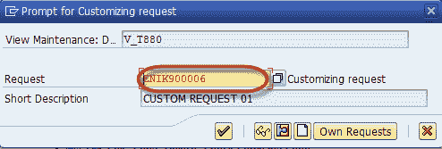

# 如何在 SAP 中创建公司

> 原文： [https://www.guru99.com/how-to-create-a-company.html](https://www.guru99.com/how-to-create-a-company.html)

## 定义公司

在本教程中，我们将学习如何创建公司

**步骤 1）**在命令字段中输入交易代码 SPRO

**步骤 2）**在下一个屏幕中，选择 SAP 参考 IMG

**步骤 3）**在下一个屏幕显示 IMG 中，遵循菜单路径

SAP 自定义实施指南->企业结构->定义->财务会计->定义 公司

**步骤 4）**在下一个屏幕中

1）按下 New Entries

**步骤 5）**在下一个屏幕中，输入公司详细信息：

1.  为您的公司组中的公司输入唯一的公司 ID
2.  输入公司名称
3.  在“详细信息”部分中，输入公司地址的详细信息，例如街道，邮政信箱，邮政编码，城市
4.  选择公司成立国家/地区的国家/地区代码
5.  选择公司的默认语言以用于打印表格和默认文本
6.  选择公司的当地货币

**步骤 6）**完成所有必需的信息后，按保存。  输入您的定制请求号

这样您的公司就创建了。