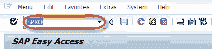
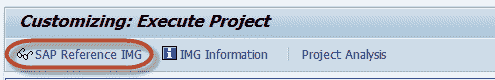
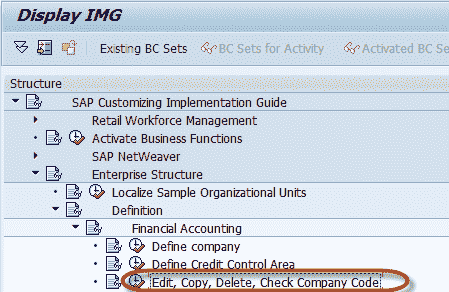
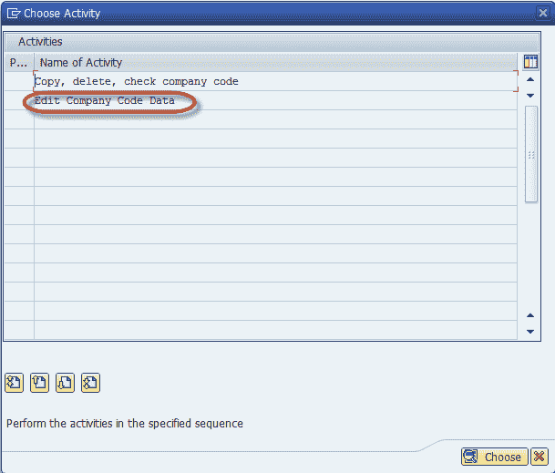
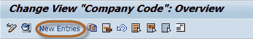
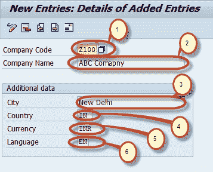
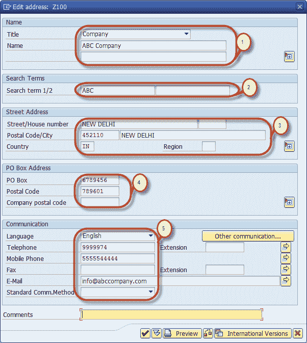
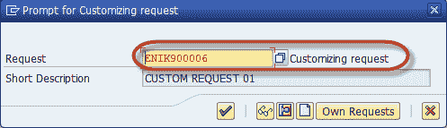
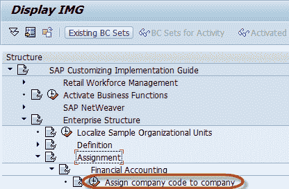
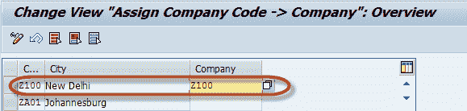

# 如何在 SAP &中创建公司分配公司代码

> 原文： [https://www.guru99.com/how-to-create-a-company-code-and-assign-to-a-company.html](https://www.guru99.com/how-to-create-a-company-code-and-assign-to-a-company.html)

创建公司代码是一个两步过程

1）创建公司代码

2）将公司代码分配给公司

## 定义公司代码

**步骤 1）**在命令字段中输入交易代码 SPRO

**步骤 2）**在下一个屏幕中，选择 SAP 参考 IMG

**步骤 3）**在下一屏幕中，显示 IMG 遵循菜单路径

SAP 自定义实施指南->企业结构->定义->财务会计->编辑 ，复制，删除，检查公司代码

**步骤 4）**在下一个屏幕中，选择活动-编辑公司代码数据

在更改视图公司代码屏幕中

**步骤 5）**选择新条目

**步骤 6）**在下一个屏幕中输入以下详细信息

1.  输入您的唯一公司代码号
2.  输入公司名称
3.  在附加数据部分中输入城市
4.  输入公司的国家
5.  输入当地货币
6.  输入默认语言

**步骤 7）**在同一屏幕上单击地址详细信息按钮

**步骤 8）**输入公司的地址详细信息，该信息将以打印形式显示

1.  在名称部分中输入标题和公司名称
2.  在搜索词部分中，输入搜索词 1 和 2
3.  在街道地址部分，输入街道，邮政编码，城市，国家
4.  在邮政信箱地址部分输入邮政信箱和邮政编码
5.  在通信部分中输入适当的详细信息

**步骤 9）**完成此信息后，按保存  并输入您的更改请求编号。

您已成功创建新的公司代码。

## 将公司代码分配给公司

**步骤 1）**在 SAP Reference IMG 中选择菜单路径

SAP 自定义实施指南->企业结构->分配->财务会计->分配 公司代码给公司

**步骤 2）**在下一屏幕中，根据您要分配给该公司的

的公司代码输入唯一的公司 ID。

**步骤 3）**按保存  并输入定制请求编号

您已将所需的公司代码分配给公司