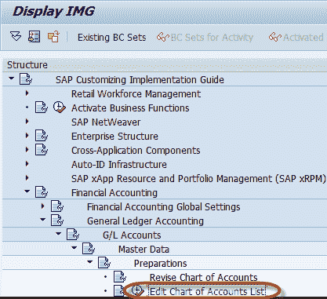
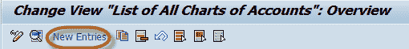
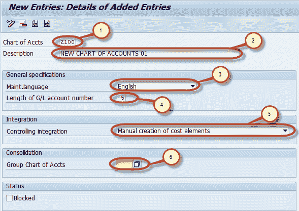
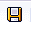
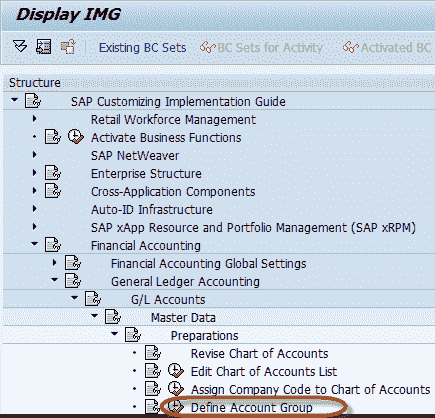
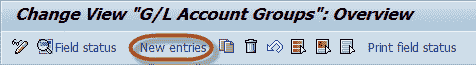
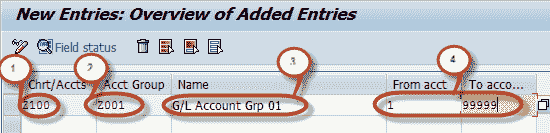
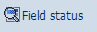
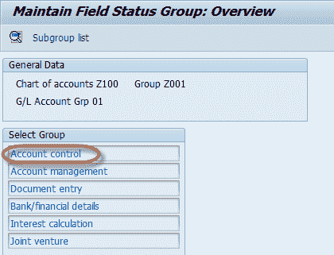
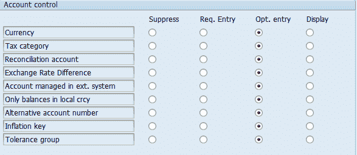

# 如何在 SAP 中创建会计科目表

> 原文： [https://www.guru99.com/how-to-create-chart-of-accounts.html](https://www.guru99.com/how-to-create-chart-of-accounts.html)

这是一个分步教程，可帮助您在 SAP FI 中创建会计科目表。 在我们开始讨论之前，请先讨论

**什么是会计科目表？**

在 SAP 中，会计科目表（COA）在客户级别定义，并分配给每个公司代码。 它是总帐帐户主数据的列表，这些数据属于公司代码的不同帐户组。 这种分组机制有助于制定更好的财务报告。

**会计科目表类型**

会计科目表共有三种类型，即

1.  会计科目表：用于过帐日常费用。 会计科目表中的科目可以是费用科目，也可以是收入科目，信息由财务和控制模块共享。
2.  组科目表：这些是整个公司组使用的科目。 他们帮助公司生成报告
3.  特定国家/地区的会计科目表：此会计科目表有助于满足特定国家/地区的法律要求

在本教程中，我们将学习

*   如何创建会计科目表
*   如何创建会计科目表（COA）帐户组

## 如何创建会计科目表

**步骤 1）**在命令字段中输入交易代码 SPRO

 

**步骤 2）**在下一个屏幕中选择 SAP 参考 IMG

 

**步骤 3）**在下一个屏幕“显示 IMG”中导航以下菜单路径：SAP 自定义实施指南->财务[会计](/accounting.html)->总帐会计-> 总帐科目->主数据->准备->编辑科目表的图表

 

**步骤 4）**在下一个屏幕中，选择“新建条目”

 

**步骤 5）**在下一个屏幕中，输入以下数据：

1.  输入唯一的会计科目表代码，最大长度为 4
2.  输入科目表的描述
3.  输入用于创建会计科目表的语言。所有帐户都有此语言的说明。主数据只能以该语言显示或维护
4.  输入总账科目编号的最大长度，如果编号短则最大长度为十位数，然后将其前缀为零以使其达到最大长度
5.  输入总账科目和成本要素之间的集成类型
6.  输入公司组中使用的会计科目表

 

**步骤 6）**完成输入此信息后，按保存  。 在下一个屏幕中，输入您的更改请求编号。

 

您已经成功创建了新的会计科目表。

## 如何创建会计科目表（COA）帐户组

**Step 1)** Enter Transaction code SPRO in the command field

 

**步骤 2）**在下一个屏幕中，选择 SAP 参考 IMG

 

**步骤 3）**在下一个屏幕“显示 IMG”中导航以下菜单路径

SAP 自定义实施指南->财务会计->总帐会计

->总账科目->主数据->准备->定义科目组

 

**Step 4)** In the next screen, select New Entries

 

**步骤 5）**在下一个屏幕中，输入以下信息

1.  输入要在其中创建帐户组的会计图表键
2.  输入唯一的帐户组密钥
3.  输入帐户组的描述
4.  输入要在帐户组中创建的总帐科目的编号范围

**步骤 6）**从应用程序菜单中选择字段状态

 

**步骤 7）**在下一个屏幕中，您可以更改 G / L COA 主数据不同部分的字段状态。 例如，选择“帐户控制”

 

**步骤 8）**现在，您可以在“抑制”（“隐藏”），“必需”，“可选”和“显示”模式之间维护属于“帐户控制”选项卡

的不同字段的状态。

 

**注意**：-字段的默认状态为可选。

**步骤 9）**保持字段状态后，按保存。  输入更改请求号

 

您已成功创建会计科目表帐户组。