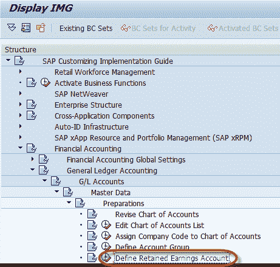
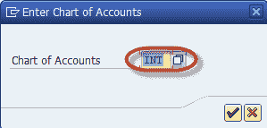
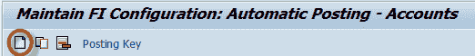
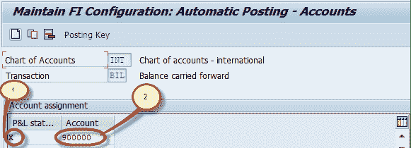
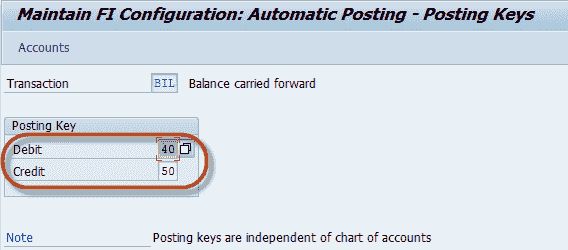

# 如何在 SAP 中定义保留收益帐户

> 原文： [https://www.guru99.com/how-to-create-retained-earnings-account.html](https://www.guru99.com/how-to-create-retained-earnings-account.html)

本教程演示了如何创建保留收益帐户

在命令字段中输入交易代码 SPRO

在下一个屏幕中，选择 SAP 参考 IMG。

在下一个屏幕-“ Display IMG”中，导航以下菜单路径：

SAP 自定义-实施指南-财务会计-总帐会计-总帐科目-主数据-准备-定义保留收益帐户

在下一个屏幕中，输入会计科目表以维护保留收益科目

在下一个屏幕中，从“应用程序”菜单中选择“新条目”

在下一个屏幕中，输入以下信息

1.  输入 P & L 报表帐户类型，以确定每个 P & L 帐户的保留收益帐户。如果要创建 P & L 帐户，则必须在此处输入。
2.  输入总账科目，该科目将被视为保留收益科目

您可以通过在“应用程序菜单”中选择发布密钥来维护该帐户的发布密钥。

之后，您可以为借方和贷方分配过帐密钥

保留所有必需信息后，按保存  并输入您的更改请求编号

您已经成功创建了保留收益帐户。