# SAP 教程中的总帐科目：创建，显示，冻结&删除 FS00

> 原文： [https://www.guru99.com/how-to-create-a-new-general-ledger-account.html](https://www.guru99.com/how-to-create-a-new-general-ledger-account.html)

在本教程中，我们将学习

*   如何创建一个新的总帐帐户
*   如何显示总账科目主记录中的更改
*   如何阻止或删除总账科目

## 如何创建一个新的总帐帐户

**步骤 1）**在 SAP 命令提示符下输入事务 **FS00** ，单击执行**。**

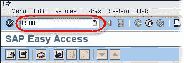 

在编辑总账科目屏幕中

1.  输入总帐科目编号。
2.  公司代码
3.  单击创建。

请注意，SAP 为您提供了一个参考另一个总帐帐户创建总帐帐户的选项。 本教程后面的内容将对此进行详细介绍。

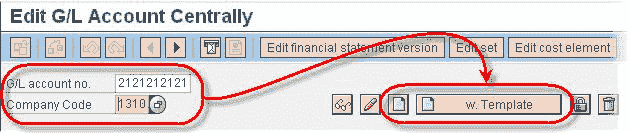 

**步骤 2）**在下一个屏幕中

1.  输入帐户组
2.  根据要创建的总账科目类型，选择 **P & L 对帐单帐户**或**资产负债表科目**单选按钮。
3.  在**短文本**字段中，输入新总帐帐户的简短描述。
4.  在**总帐科目长文本**字段中，输入新总帐科目的详细描述。

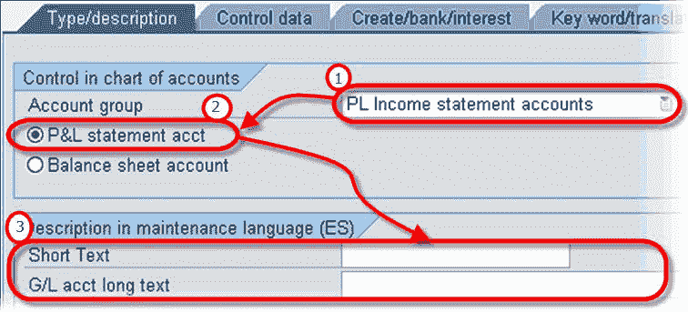 

**步骤 3）**单击**创建/存储/兴趣**选项卡。

**步骤 4）**在字段状态组中，选择一个 GL 字段状态组

**步骤 5）**单击保存。 创建一个新的总账科目。

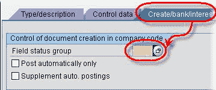 

**如果您选择参考模板**创建一个新的 SAP 总账科目

 

**步骤 1）**输入参考总账科目编号。 和公司

 

**步骤 2）**更改短文本和总帐科目长文本。

**步骤 3）**验证“类型/说明”和“创建/银行/兴趣”选项卡上的其他信息。

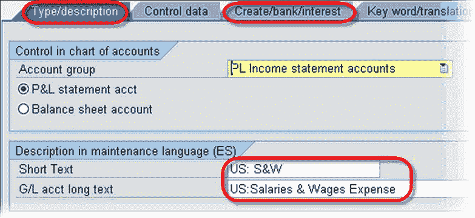 

**步骤 4）**单击保存创建总账科目。

## 如何显示总账科目主记录中的更改

**Step 1)** Enter the Transaction Code FS04 in the SAP Command Field

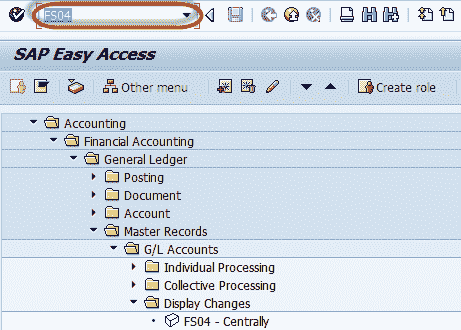

**步骤 2）**在下一个屏幕中，输入以下内容

1.  输入总账帐号
2.  输入公司代码

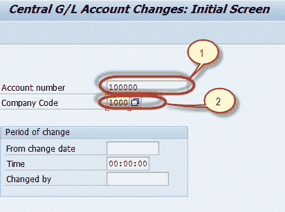

**步骤 3）**在下一个屏幕中，从已更改字段列表中选择字段

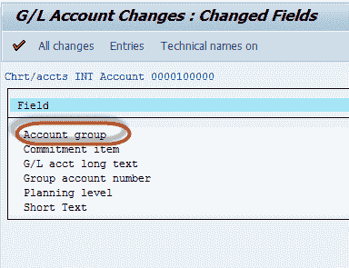

**步骤 4）**在下一个屏幕中，使用字段的新值和旧值生成列表

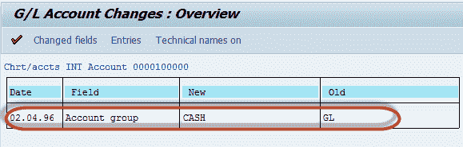

## 如何阻止或删除总账科目

**Step 1)** Enter Transaction Code FS00 in SAP Command Field

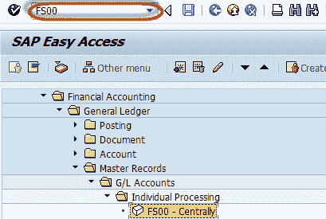

**步骤 2）**在下一个屏幕中

1.  输入您要阻止或删除的总账科目
2.  输入公司代码

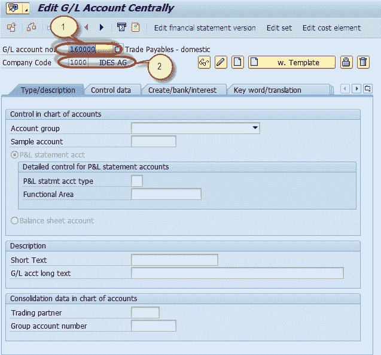

**用于阻止**

**步骤 3）**在下一步中，按“阻止”按钮

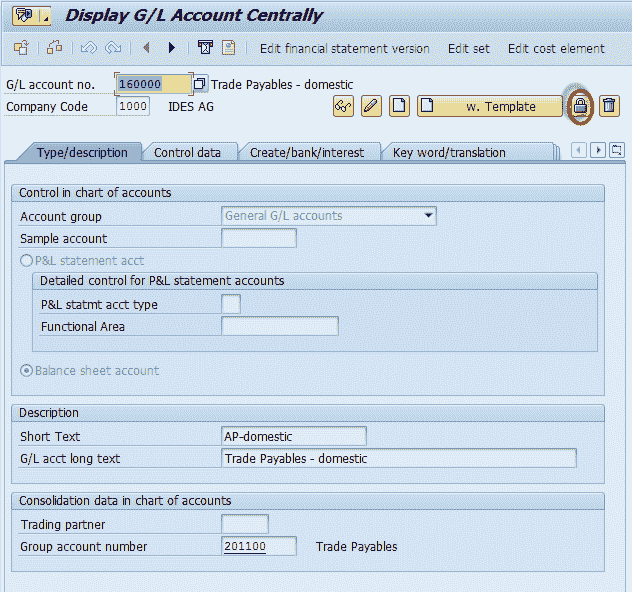

**步骤 4）**在下一个屏幕中，您有总账科目的冻结选项

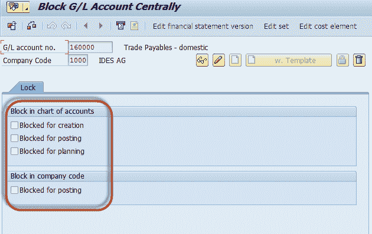

**用于删除**

**Step 5)** In the next step , Press the Mark for deletion button

**步骤 6）**在下一个屏幕中，您有总账科目的删除选项

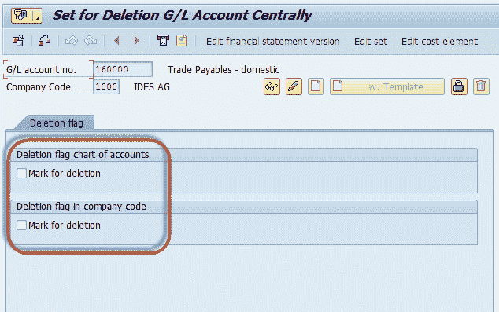