# SAP 登录：GUI &导航教程

> 原文： [https://www.guru99.com/sap-gui-tutorial.html](https://www.guru99.com/sap-gui-tutorial.html)

## 什么是 SAP 登录？

SAP 登录用于在所需的 SAP 服务器中启动用户会话。 相同的 SAP 登录板可用于登录不同的 SAP ERP 环境。 SAP Logon 是通常由顾问，开发人员和最终用户使用的客户端软件

跟随视频将带您浏览 SAP-图形用户界面（GUI）中观察到的各种屏幕元素

*   要访问 SAP，请双击 SAP 登录 PAD。

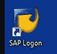

*   系统会显示一列您可以登录的服务器列表，现在只有一台服务器

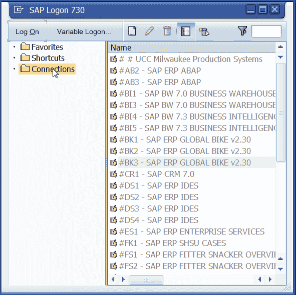

*   但是您会看到多台服务器，例如一台用于生产，一台用于[测试](/software-testing.html)一台用于开发。

*   选择服务器，然后单击“登录”按钮。 在下一个屏幕中，输入您的用户名和密码。 您将被带到 Sap 的便捷访问菜单

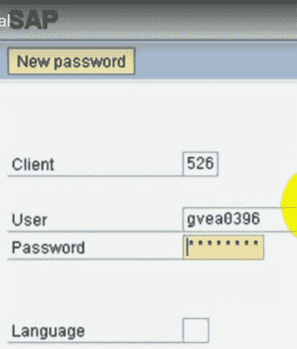

*   在顶部，您将看到菜单栏。 接下来，您将看到标准工具栏，在其中可以选择打印，保存查找，滚动等

*   要查看或维护 SAP 中的任何数据或访问不同的业务流程，您需要知道相应的事务。 每笔交易都有唯一的代码。

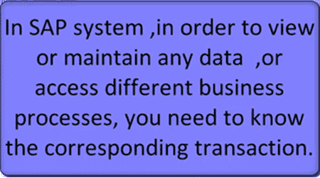

*   例如，维护 PA 数据的交易号为 PA30

*   要访问事务，请在命令提示符下输入 PA30，然后按 Enter。
*   如果您注意到标题栏随事务而变化，那么您当前正在使用。

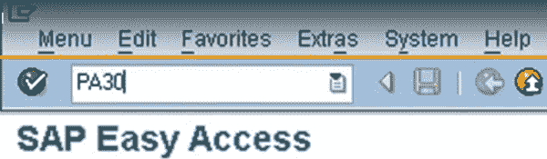

*   要返回初始屏幕，请单击“后退”按钮
*   另外，如果您不记得交易代码，则会为所有可用交易提供一棵树。
*   在树中导航。 双击相应的交易。 假设您不想导航太多以访问事务，请右键单击它并选择“添加到收藏夹”

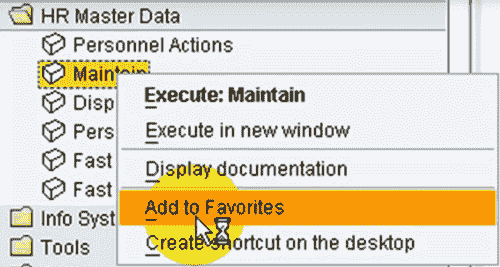

*   交易已添加到您的收藏夹。 在屏幕底部，您会注意到消息栏。 这个酒吧有三种颜色
*   **红色-错误**
*   **黄色-用于警告**
*   **绿色-成功**

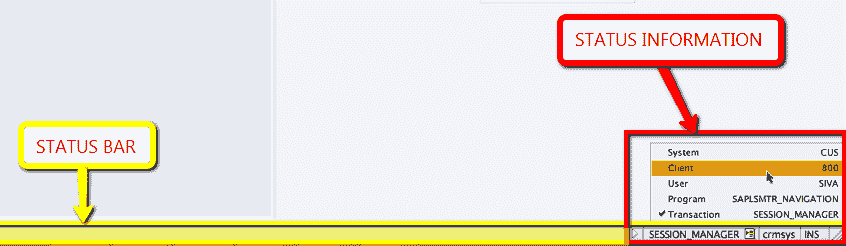

*   如果双击该栏，则会显示该消息的详细信息
*   在底部，您将看到各种与系统相关的信息，例如客户端或当前所在的程序。
*   要在 SAP 中获得帮助，请在相应的屏幕元素上进行选择，然后按 F1 键。
*   假设我想要命令提示符方面的帮助，请按 F1 键给我一个非常详细的帮助文档。
*   就到 SAP GUI

## SAP GUI 导航

登录 SAP 或打开新会话时-您将看到以下屏幕

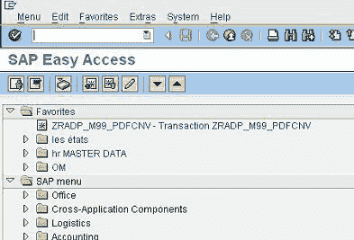 

让我们看一下各种屏幕元素-

## SAP 用户菜单

SAP 用户菜单是根据用户的特定需求量身定制的。 它包括与用户相关的所有交易，并在相关文件夹下分组

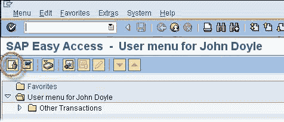

## SAP 轻松访问菜单

SAP 轻松访问菜单包括 SAP 提供的所有交易，并根据 SAP 模块（FI / CO，MM 等）分组在文件夹中。 它不是针对用户的特定需求量身定制的

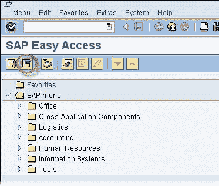

## SAP 菜单栏

SAP 菜单栏**从一个屏幕更改为另一个屏幕。 您沿**菜单路径**访问功能或事务。**

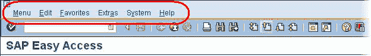

## SAP 标准工具栏

SAP Standard Toolbar 不会**从一个事务更改为另一个事务**。 您可以使用 SAP Standard Toolbar 执行各种功能。

*   可用按钮已启用
*   不可用的按钮被禁用
*   在“事务框”中，您可以通过输入事务代码直接访问事务，而无需使用 SAP 菜单

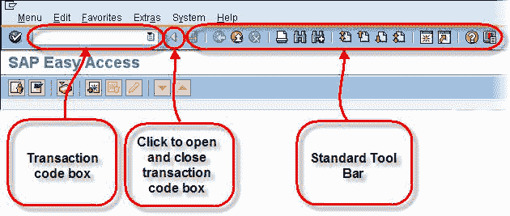

常规图标及其说明
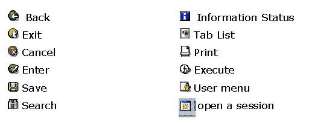 

> 提示：一次最多打开 6 个不同的 SAP 会话

## SAP 应用程序工具栏

SAP Application Toolbar **从一个屏幕更改为另一个屏幕。**

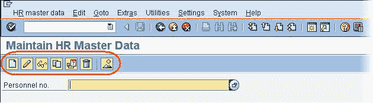

## SAP 状态栏

SAP 状态栏不会**不会**从一个屏幕更改为另一个屏幕。 它告诉您**在 SAP 中的**：

*   您正在使用哪个环境（生产，开发，质量）。
*   您所在的会话（您最多可以打开 6 个会话）。
*   您正在使用什么客户端。

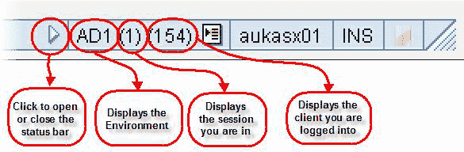

点击 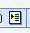 按钮可提供更多信息-

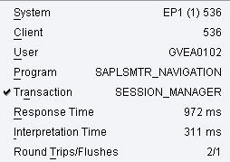

## SAP 功能键

功能键只是在 SAP 中导航的另一种方法。 功能键**的可用性从一个屏幕更改为另一个屏幕**在事务中，右键单击鼠标，您将看到可用功能键列表。

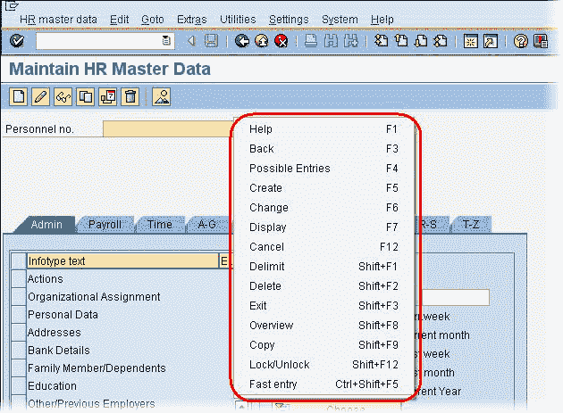

## 如何在 SAP 中获得帮助

使用 SAP 时，通常需要**帮助。** 您可以访问 **ANY SAP 屏幕**的 **ANY 屏幕元素**（如文本字段，按钮，标签等）的内置 SAP 帮助功能。 需要以下领域的帮助-

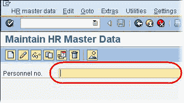

您可以通过三种不同的方式访问帮助

1.  点击“帮助”按钮。 
2.  右键单击鼠标，然后选择“帮助”。
3.  按键盘上的 F1 键。

将打开“性能协助”屏幕，

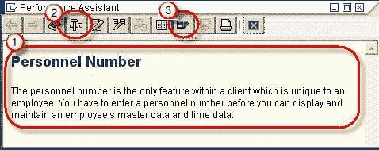

**1\.** 它为您提供有关如何填充屏幕上特定字段的信息

**2** 。 单击技术信息按钮可为您提供诸如程序名称，表名称和其他技术详细信息之类的信息，这些信息有时非常方便

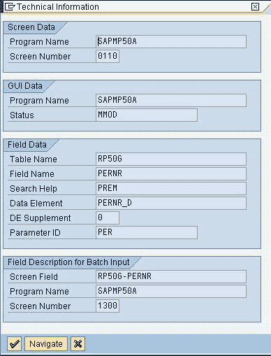

**3\.** 单击门户网站按钮，您可以通过互联网访问在线 SAP 库。

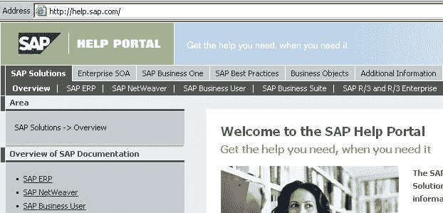